# Design Document — SeraphimOS Core Platform

## Overview

SeraphimOS is an AI-powered autonomous orchestration platform deployed on AWS. It coordinates a hierarchy of AI agents ("House of Zion") that execute across multiple life and business pillars — app development, media production, trading, and finance — while the primary user (the "King") provides vision and approves key decisions. Seraphim, the top-level orchestrator agent, translates the King's vision into strategy and drives execution across all pillars.

This design addresses the critical failures identified in the March 2026 system audit: governance theater without enforcement, single-point-of-failure execution, flat-file memory with no search, mock data in dashboards, zero testing, and ad-hoc browser automation. Every architectural decision below is informed by the principle that **described-but-not-enforced is equivalent to not existing**.

### Key Design Principles

1. **Enforcement over documentation** — Every governance rule has a runtime enforcement mechanism. No rule exists only on paper.
2. **Stateful agents with persistent memory** — Agents maintain context across sessions through a 4-layer vector-backed memory system.
3. **Declarative state machines** — All entity lifecycles are governed by versioned, declarative state machine definitions with gate enforcement.
4. **Event-driven loose coupling** — Components communicate through an asynchronous event bus, eliminating single points of failure.
5. **Real data only** — Every dashboard metric, every status indicator, every report is backed by live data pipelines. No mock data at any layer.
6. **Test-first at every layer** — The V-model is enforced through CI/CD gates that block deployment without passing tests.
7. **Cost-aware execution** — Intelligent model routing, token budgets, and caching reduce LLM costs by targeting 50% savings.

### Technology Stack Summary

| Layer | Technology | Rationale |
|-------|-----------|-----------|
| **Core Runtime** | TypeScript / Node.js on ECS Fargate | Async-native, strong LLM SDK support, type safety for complex state machines |
| **Memory / Vector** | PostgreSQL (Aurora) + pgvector | Unified relational + vector storage, no separate vector DB to manage, ACID guarantees |
| **Event Bus** | Amazon EventBridge + SQS | Content-based routing (EventBridge) + reliable queue processing (SQS) |
| **IaC** | AWS CDK (TypeScript) | Same language as runtime, type-safe infrastructure, snapshot testing |
| **Dashboard** | React + Vite, hosted on CloudFront/S3 | Fast builds, real-time WebSocket updates via API Gateway |
| **CI/CD** | GitHub Actions + CDK Pipelines | Automated testing, gate verification, staged rollout |
| **Secrets** | AWS Secrets Manager | Credential rotation, no secrets in code or config |
| **Compute** | ECS Fargate (agents), Lambda (event handlers) | Fargate for long-running stateful agents, Lambda for short event-driven tasks |
| **API** | API Gateway (REST + WebSocket) | Managed API layer with auth, throttling, WebSocket for real-time |
| **Monitoring** | CloudWatch + X-Ray | Native AWS observability, distributed tracing |

---

## Architecture

### High-Level System Architecture

```mermaid
graph TB
    subgraph "Interface Layer (Shaar)"
        Dashboard["Web Dashboard<br/>(React + WebSocket)"]
        API["REST/WebSocket API<br/>(API Gateway)"]
        CLI["CLI Client"]
        Voice["Voice Interface"]
        Messaging["iMessage/Email<br/>Adapters"]
    end

    subgraph "Kernel (Seraphim Core)"
        AgentRuntime["Agent Runtime<br/>(ECS Fargate)"]
        StateMachine["State Machine Engine"]
        PermissionSys["Permission System"]
        Lifecycle["Lifecycle Manager"]
        IPC["IPC / Message Router"]
        ResourceAlloc["Resource Allocator"]
    end

    subgraph "System Services"
        Zikaron["Zikaron<br/>(Memory Service)"]
        Mishmar["Mishmar<br/>(Governance Service)"]
        Scheduler["Scheduler Service"]
        EventBus["Event Bus<br/>(EventBridge + SQS)"]
        Otzar["Otzar<br/>(Resource Manager)"]
        XOAudit["XO Audit Service"]
        LearningEngine["Learning Engine"]
    end

    subgraph "Application Layer"
        ZionX["ZionX<br/>(App Factory)"]
        ZXMG["ZXMG<br/>(Media Production)"]
        ZionAlpha["Zion Alpha<br/>(Trading)"]
        OtzarFinance["Otzar Finance<br/>(Pillar)"]
    end

    subgraph "Driver Layer (Adapters)"
        AppStore["App Store Connect"]
        GooglePlay["Google Play Console"]
        YouTube["YouTube API"]
        Kalshi["Kalshi API"]
        Gmail["Gmail API"]
        GitHub["GitHub API"]
        RevenueCat["RevenueCat API"]
        HeyGen["HeyGen API"]
        N8N["n8n Webhooks"]
        LLMProviders["LLM APIs<br/>(Claude, GPT-4o, GPT-4o-mini)"]
        Browser["Browser Automation<br/>(Playwright)"]
    end

    subgraph "Data Layer"
        Aurora["Aurora PostgreSQL<br/>+ pgvector"]
        DynamoDB["DynamoDB<br/>(Event Store)"]
        S3["S3<br/>(Artifacts, Logs)"]
        SecretsManager["Secrets Manager"]
    end

    Dashboard --> API
    CLI --> API
    Voice --> API
    Messaging --> API

    API --> AgentRuntime
    API --> Mishmar

    AgentRuntime --> StateMachine
    AgentRuntime --> PermissionSys
    AgentRuntime --> Lifecycle
    AgentRuntime --> IPC
    AgentRuntime --> ResourceAlloc

    IPC --> EventBus
    AgentRuntime --> Zikaron
    AgentRuntime --> Mishmar
    AgentRuntime --> Otzar
    AgentRuntime --> XOAudit

    Mishmar --> XOAudit
    StateMachine --> XOAudit
    Otzar --> LLMProviders

    ZionX --> AppStore
    ZionX --> GooglePlay
    ZXMG --> YouTube
    ZXMG --> HeyGen
    ZionAlpha --> Kalshi

    Zikaron --> Aurora
    XOAudit --> DynamoDB
    EventBus --> DynamoDB
    AgentRuntime --> S3
    Otzar --> SecretsManager
```

### Deployment Architecture

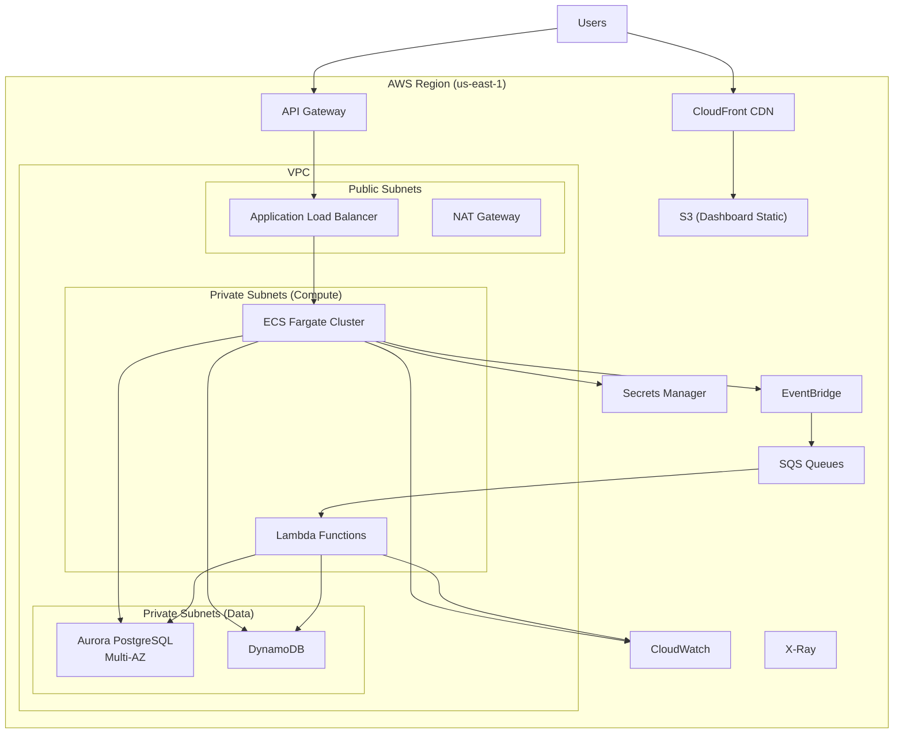

### Layer Interaction Flow

The system follows a strict layered architecture where each layer communicates only with adjacent layers:

1. **Interface → Kernel**: All user commands enter through API Gateway, are authenticated, and routed to the Agent Runtime.
2. **Kernel → System Services**: The Agent Runtime calls Mishmar for authorization, Zikaron for memory, Otzar for resource allocation, and publishes events to the Event Bus.
3. **Kernel → Application**: Agent Programs running in the Agent Runtime execute pillar-specific logic (ZionX, ZXMG, Zion Alpha).
4. **Application → Drivers**: Pillar agents call Drivers through the uniform Driver interface. Drivers handle external service communication.
5. **System Services → Data**: All services persist to Aurora (relational + vector), DynamoDB (events + audit), and S3 (artifacts).

---

## Components and Interfaces

### 1. Agent Runtime (Kernel)

The Agent Runtime is the core execution environment for all agents. Each agent runs as an isolated ECS Fargate task with its own container, memory allocation, and network namespace.

**Interface:**

```typescript
interface AgentRuntime {
  // Lifecycle
  deploy(program: AgentProgram): Promise<AgentInstance>;
  upgrade(agentId: string, newVersion: AgentProgram): Promise<void>;
  terminate(agentId: string, reason: string): Promise<void>;
  
  // Execution
  execute(agentId: string, task: Task): Promise<TaskResult>;
  getState(agentId: string): Promise<AgentState>;
  
  // Registry
  listAgents(filter?: AgentFilter): Promise<AgentInstance[]>;
  getHealth(agentId: string): Promise<HealthStatus>;
}

interface AgentInstance {
  id: string;
  programId: string;
  version: string;
  state: 'initializing' | 'ready' | 'executing' | 'degraded' | 'terminated';
  pillar: string;
  resourceUsage: ResourceMetrics;
  lastHeartbeat: Date;
}
```

### 2. State Machine Engine (Kernel)

Executes declarative state machine definitions. All state transitions are gated and audited.

**Interface:**

```typescript
interface StateMachineEngine {
  // Definition management
  register(definition: StateMachineDefinition): Promise<string>;
  update(definitionId: string, newDef: StateMachineDefinition): Promise<void>;
  
  // Execution
  createInstance(definitionId: string, entityId: string, initialData?: Record<string, unknown>): Promise<StateMachineInstance>;
  transition(instanceId: string, event: string, context: TransitionContext): Promise<TransitionResult>;
  getState(instanceId: string): Promise<StateMachineInstance>;
  
  // Query
  listInstances(filter?: InstanceFilter): Promise<StateMachineInstance[]>;
  getHistory(instanceId: string): Promise<TransitionRecord[]>;
}

interface TransitionResult {
  success: boolean;
  previousState: string;
  newState: string;
  gateResults: GateResult[];
  rejectionReason?: string;
  auditId: string;
}

interface GateResult {
  gateId: string;
  gateName: string;
  passed: boolean;
  details: string;
}
```

### 3. Mishmar — Governance Service

Runtime governance enforcement. Every controlled action passes through Mishmar before execution.

**Interface:**

```typescript
interface MishmarService {
  // Authorization
  authorize(request: AuthorizationRequest): Promise<AuthorizationResult>;
  checkAuthorityLevel(agentId: string, action: string): Promise<AuthorityLevel>;
  
  // Execution Tokens
  requestToken(request: TokenRequest): Promise<ExecutionToken>;
  validateToken(token: ExecutionToken): Promise<boolean>;
  
  // Completion Contracts
  validateCompletion(workflowId: string, outputs: Record<string, unknown>): Promise<CompletionValidationResult>;
  
  // Role Separation
  validateSeparation(workflow: WorkflowContext): Promise<SeparationResult>;
}

interface AuthorizationRequest {
  agentId: string;
  action: string;
  target: string;
  authorityLevel: 'L1' | 'L2' | 'L3' | 'L4';
  context: Record<string, unknown>;
}

interface AuthorizationResult {
  authorized: boolean;
  reason: string;
  escalation?: EscalationRequest;
  auditId: string;
}

interface CompletionValidationResult {
  valid: boolean;
  violations: SchemaViolation[];
  contractId: string;
}
```

### 4. Zikaron — Memory Service

4-layer persistent memory with vector search.

**Interface:**

```typescript
interface ZikaronService {
  // Write
  storeEpisodic(entry: EpisodicEntry): Promise<string>;
  storeSemantic(entry: SemanticEntry): Promise<string>;
  storeProcedural(entry: ProceduralEntry): Promise<string>;
  storeWorking(agentId: string, context: WorkingMemoryContext): Promise<string>;
  
  // Search
  query(request: MemoryQuery): Promise<MemoryResult[]>;
  queryByAgent(agentId: string, query: string, layers?: MemoryLayer[]): Promise<MemoryResult[]>;
  
  // Session
  loadAgentContext(agentId: string): Promise<AgentMemoryContext>;
  
  // Conflict
  flagConflict(entryId: string, conflictingEntryId: string, metadata: ConflictMetadata): Promise<void>;
}

type MemoryLayer = 'episodic' | 'semantic' | 'procedural' | 'working';

interface MemoryQuery {
  text: string;
  layers?: MemoryLayer[];
  agentId?: string;
  tenantId: string;
  limit?: number;
  dateRange?: { start: Date; end: Date };
}

interface MemoryResult {
  id: string;
  layer: MemoryLayer;
  content: string;
  similarity: number;
  metadata: Record<string, unknown>;
  sourceAgentId: string;
  timestamp: Date;
}
```

### 5. Otzar — Resource Manager

Token budgets, cost tracking, and model routing.

**Interface:**

```typescript
interface OtzarService {
  // Model Routing
  routeTask(request: ModelRoutingRequest): Promise<ModelSelection>;
  
  // Budget
  checkBudget(agentId: string, estimatedTokens: number): Promise<BudgetCheckResult>;
  recordUsage(usage: TokenUsage): Promise<void>;
  
  // Cost Reporting
  getCostReport(filter: CostFilter): Promise<CostReport>;
  getDailyOptimizationReport(): Promise<OptimizationReport>;
  
  // Caching
  checkCache(taskPattern: string, inputs: Record<string, unknown>): Promise<CacheResult | null>;
  storeCache(taskPattern: string, inputs: Record<string, unknown>, result: unknown): Promise<void>;
}

interface ModelRoutingRequest {
  taskType: 'code_writing' | 'analysis' | 'simple_query' | 'creative' | 'classification';
  complexity: 'low' | 'medium' | 'high';
  agentId: string;
  pillar: string;
  maxCost?: number;
}

interface ModelSelection {
  provider: 'anthropic' | 'openai';
  model: string;
  estimatedCost: number;
  rationale: string;
}
```

### 6. Event Bus

Asynchronous messaging backbone using EventBridge for routing and SQS for reliable delivery.

**Interface:**

```typescript
interface EventBusService {
  // Publishing
  publish(event: SystemEvent): Promise<string>;
  publishBatch(events: SystemEvent[]): Promise<string[]>;
  
  // Subscription
  subscribe(pattern: EventPattern, handler: EventHandler): Promise<string>;
  unsubscribe(subscriptionId: string): Promise<void>;
  
  // Dead Letter
  getDeadLetterMessages(filter?: DLQFilter): Promise<DeadLetterMessage[]>;
  retryDeadLetter(messageId: string): Promise<void>;
}

interface SystemEvent {
  source: string;
  type: string;
  detail: Record<string, unknown>;
  metadata: {
    tenantId: string;
    correlationId: string;
    timestamp: Date;
  };
}
```

### 7. XO Audit Service

Immutable audit trail for all system actions.

**Interface:**

```typescript
interface XOAuditService {
  // Recording
  recordAction(entry: AuditEntry): Promise<string>;
  recordGovernanceDecision(entry: GovernanceAuditEntry): Promise<string>;
  recordStateTransition(entry: TransitionAuditEntry): Promise<string>;
  
  // Querying
  query(filter: AuditFilter): Promise<AuditRecord[]>;
  
  // Immutability
  verifyIntegrity(recordId: string): Promise<IntegrityResult>;
}

interface AuditFilter {
  agentId?: string;
  timeRange?: { start: Date; end: Date };
  actionType?: string;
  pillar?: string;
  outcome?: 'success' | 'failure' | 'blocked';
  limit?: number;
  cursor?: string;
}
```

### 8. Driver Interface (Uniform Adapter Contract)

Every external service adapter implements this interface.

**Interface:**

```typescript
interface Driver<TConfig = unknown> {
  readonly name: string;
  readonly version: string;
  readonly status: DriverStatus;
  
  connect(config: TConfig): Promise<ConnectionResult>;
  execute(operation: DriverOperation): Promise<DriverResult>;
  verify(operationId: string): Promise<VerificationResult>;
  disconnect(): Promise<void>;
  
  // Health
  healthCheck(): Promise<HealthStatus>;
  
  // Retry built-in
  getRetryPolicy(): RetryPolicy;
}

interface DriverOperation {
  type: string;
  params: Record<string, unknown>;
  timeout?: number;
  idempotencyKey?: string;
}

interface DriverResult {
  success: boolean;
  data?: unknown;
  error?: DriverError;
  retryable: boolean;
  operationId: string;
}

type DriverStatus = 'disconnected' | 'connecting' | 'ready' | 'executing' | 'error';
```

### 9. Learning Engine

Continuous improvement through pattern detection and automated fix generation.

**Interface:**

```typescript
interface LearningEngine {
  // Analysis
  analyzeFailure(failure: FailureEvent): Promise<RootCauseAnalysis>;
  detectPatterns(timeRange: { start: Date; end: Date }): Promise<Pattern[]>;
  
  // Fix Generation
  generateFix(pattern: Pattern): Promise<FixProposal>;
  verifyFix(proposal: FixProposal): Promise<VerificationResult>;
  applyFix(proposal: FixProposal): Promise<ApplyResult>;
  
  // Metrics
  getImprovementMetrics(): Promise<ImprovementMetrics>;
}

interface FixProposal {
  id: string;
  patternId: string;
  targetType: 'agent_program' | 'workflow' | 'gate' | 'driver_config';
  targetId: string;
  changes: VersionedChange[];
  confidence: number;
  estimatedImpact: string;
}

interface ImprovementMetrics {
  repeatFailureRate: number;
  autonomousResolutionRate: number;
  meanTimeToResolution: number;
  fixSuccessRate: number;
  totalFixesApplied: number;
}
```

---

## Data Models

### Agent_Program

The versioned, deployable package defining an agent's behavior.

```typescript
interface AgentProgram {
  id: string;
  name: string;
  version: string;                    // semver
  pillar: string;
  
  // Behavior
  systemPrompt: string;
  tools: ToolDefinition[];
  stateMachine: StateMachineDefinition;
  completionContracts: CompletionContract[];
  
  // Permissions
  authorityLevel: 'L1' | 'L2' | 'L3' | 'L4';
  allowedActions: string[];
  deniedActions: string[];
  
  // Resources
  modelPreference: ModelPreference;
  tokenBudget: { daily: number; monthly: number };
  
  // Testing
  testSuite: TestSuiteReference;
  
  // Metadata
  createdAt: Date;
  updatedAt: Date;
  createdBy: string;
  changelog: ChangelogEntry[];
}

interface ModelPreference {
  preferred: string;           // e.g., 'claude-sonnet-4-20250514'
  fallback: string;            // e.g., 'gpt-4o'
  costCeiling: number;         // max cost per task in USD
  taskTypeOverrides?: Record<string, string>;
}
```

### StateMachineDefinition

Declarative state machine stored as versioned JSON.

```typescript
interface StateMachineDefinition {
  id: string;
  name: string;
  version: string;
  
  states: Record<string, StateDefinition>;
  initialState: string;
  terminalStates: string[];
  
  transitions: TransitionDefinition[];
  
  metadata: {
    createdAt: Date;
    updatedAt: Date;
    description: string;
  };
}

interface StateDefinition {
  name: string;
  type: 'initial' | 'active' | 'terminal' | 'error';
  onEnter?: ActionDefinition[];
  onExit?: ActionDefinition[];
  timeout?: { duration: number; transitionTo: string };
}

interface TransitionDefinition {
  from: string;
  to: string;
  event: string;
  gates: GateDefinition[];
  actions?: ActionDefinition[];
}

interface GateDefinition {
  id: string;
  name: string;
  type: 'condition' | 'approval' | 'validation' | 'external';
  config: Record<string, unknown>;
  required: boolean;
}
```

### Memory Entries (Zikaron)

```typescript
// Base memory entry — all layers share this
interface MemoryEntry {
  id: string;
  tenantId: string;
  layer: MemoryLayer;
  content: string;
  embedding: number[];           // pgvector float array (1536 dimensions)
  sourceAgentId: string;
  tags: string[];
  createdAt: Date;
  expiresAt?: Date;
  conflictsWith?: string[];
}

// Episodic: event history
interface EpisodicEntry extends MemoryEntry {
  layer: 'episodic';
  eventType: string;
  participants: string[];        // agent IDs involved
  outcome: 'success' | 'failure' | 'partial';
  relatedEntities: EntityReference[];
}

// Semantic: facts and relationships
interface SemanticEntry extends MemoryEntry {
  layer: 'semantic';
  entityType: string;
  relationships: Relationship[];
  confidence: number;
  source: 'extracted' | 'manual' | 'inferred';
}

// Procedural: learned workflows
interface ProceduralEntry extends MemoryEntry {
  layer: 'procedural';
  workflowPattern: string;
  successRate: number;
  executionCount: number;
  prerequisites: string[];
  steps: ProcedureStep[];
}

// Working: active task context
interface WorkingMemoryContext extends MemoryEntry {
  layer: 'working';
  agentId: string;
  sessionId: string;
  taskContext: Record<string, unknown>;
  conversationHistory: Message[];
  activeGoals: string[];
}
```

### Audit Records

```typescript
interface AuditRecord {
  id: string;
  tenantId: string;
  timestamp: Date;
  type: 'action' | 'governance' | 'transition' | 'security';
  
  // Actor
  actingAgentId: string;
  actingAgentName: string;
  
  // Action
  actionType: string;
  target: string;
  
  // Authorization chain
  authorizationChain: AuthorizationStep[];
  executionTokens: string[];
  
  // Result
  outcome: 'success' | 'failure' | 'blocked';
  details: Record<string, unknown>;
  
  // Immutability
  hash: string;                  // SHA-256 of record content
  previousHash: string;          // chain integrity
}

interface AuthorizationStep {
  agentId: string;
  level: 'L1' | 'L2' | 'L3' | 'L4';
  decision: 'approved' | 'denied' | 'escalated';
  timestamp: Date;
}
```

### Tenant and User Models

```typescript
interface Tenant {
  id: string;
  name: string;
  type: 'king' | 'queen' | 'platform_user';
  parentTenantId?: string;       // for Queen tenants
  
  // Isolation
  vpcConfig: VPCConfig;
  
  // Resources
  pillars: string[];
  otzarBudget: BudgetConfig;
  
  // Auth
  authProfile: AuthProfile;
  
  createdAt: Date;
  status: 'active' | 'suspended' | 'provisioning';
}

interface AuthProfile {
  userId: string;
  role: 'king' | 'queen' | 'viewer';
  allowedPillars: string[];
  allowedActions: string[];
  authorityLevel: 'L1' | 'L2' | 'L3' | 'L4';
}
```

### Completion Contract

```typescript
interface CompletionContract {
  id: string;
  workflowType: string;
  version: string;
  
  // JSON Schema for required outputs
  outputSchema: JSONSchema;
  
  // Verification steps
  verificationSteps: VerificationStep[];
  
  // Metadata
  description: string;
  createdAt: Date;
}

interface VerificationStep {
  name: string;
  type: 'schema_validation' | 'external_check' | 'agent_verification' | 'automated_test';
  config: Record<string, unknown>;
  required: boolean;
  timeout: number;
}
```

### Database Schema (Aurora PostgreSQL + pgvector)

```sql
-- Enable pgvector extension
CREATE EXTENSION IF NOT EXISTS vector;

-- Agent Programs
CREATE TABLE agent_programs (
  id UUID PRIMARY KEY DEFAULT gen_random_uuid(),
  tenant_id UUID NOT NULL REFERENCES tenants(id),
  name VARCHAR(255) NOT NULL,
  version VARCHAR(50) NOT NULL,
  pillar VARCHAR(100) NOT NULL,
  definition JSONB NOT NULL,          -- full AgentProgram as JSON
  status VARCHAR(50) DEFAULT 'draft',
  created_at TIMESTAMPTZ DEFAULT NOW(),
  updated_at TIMESTAMPTZ DEFAULT NOW(),
  UNIQUE(tenant_id, name, version)
);

-- State Machine Definitions
CREATE TABLE state_machine_definitions (
  id UUID PRIMARY KEY DEFAULT gen_random_uuid(),
  tenant_id UUID NOT NULL REFERENCES tenants(id),
  name VARCHAR(255) NOT NULL,
  version VARCHAR(50) NOT NULL,
  definition JSONB NOT NULL,
  created_at TIMESTAMPTZ DEFAULT NOW(),
  UNIQUE(tenant_id, name, version)
);

-- State Machine Instances
CREATE TABLE state_machine_instances (
  id UUID PRIMARY KEY DEFAULT gen_random_uuid(),
  definition_id UUID NOT NULL REFERENCES state_machine_definitions(id),
  entity_id VARCHAR(255) NOT NULL,
  tenant_id UUID NOT NULL REFERENCES tenants(id),
  current_state VARCHAR(100) NOT NULL,
  data JSONB DEFAULT '{}',
  created_at TIMESTAMPTZ DEFAULT NOW(),
  updated_at TIMESTAMPTZ DEFAULT NOW()
);

-- Memory Entries (with pgvector)
CREATE TABLE memory_entries (
  id UUID PRIMARY KEY DEFAULT gen_random_uuid(),
  tenant_id UUID NOT NULL REFERENCES tenants(id),
  layer VARCHAR(20) NOT NULL CHECK (layer IN ('episodic', 'semantic', 'procedural', 'working')),
  content TEXT NOT NULL,
  embedding vector(1536),             -- OpenAI ada-002 / text-embedding-3-small dimensions
  source_agent_id UUID,
  tags TEXT[] DEFAULT '{}',
  metadata JSONB DEFAULT '{}',
  created_at TIMESTAMPTZ DEFAULT NOW(),
  expires_at TIMESTAMPTZ,
  conflicts_with UUID[]
);

-- HNSW index for fast vector similarity search
CREATE INDEX idx_memory_embedding ON memory_entries
  USING hnsw (embedding vector_cosine_ops)
  WITH (m = 16, ef_construction = 64);

-- Composite indexes for filtered vector search
CREATE INDEX idx_memory_tenant_layer ON memory_entries(tenant_id, layer);
CREATE INDEX idx_memory_agent ON memory_entries(source_agent_id);
CREATE INDEX idx_memory_created ON memory_entries(created_at DESC);

-- Tenants
CREATE TABLE tenants (
  id UUID PRIMARY KEY DEFAULT gen_random_uuid(),
  name VARCHAR(255) NOT NULL,
  type VARCHAR(50) NOT NULL CHECK (type IN ('king', 'queen', 'platform_user')),
  parent_tenant_id UUID REFERENCES tenants(id),
  config JSONB DEFAULT '{}',
  status VARCHAR(50) DEFAULT 'active',
  created_at TIMESTAMPTZ DEFAULT NOW()
);

-- Completion Contracts
CREATE TABLE completion_contracts (
  id UUID PRIMARY KEY DEFAULT gen_random_uuid(),
  tenant_id UUID NOT NULL REFERENCES tenants(id),
  workflow_type VARCHAR(255) NOT NULL,
  version VARCHAR(50) NOT NULL,
  output_schema JSONB NOT NULL,
  verification_steps JSONB NOT NULL,
  created_at TIMESTAMPTZ DEFAULT NOW(),
  UNIQUE(tenant_id, workflow_type, version)
);

-- Token Usage Tracking
CREATE TABLE token_usage (
  id UUID PRIMARY KEY DEFAULT gen_random_uuid(),
  tenant_id UUID NOT NULL REFERENCES tenants(id),
  agent_id UUID NOT NULL,
  pillar VARCHAR(100) NOT NULL,
  provider VARCHAR(50) NOT NULL,
  model VARCHAR(100) NOT NULL,
  input_tokens INTEGER NOT NULL,
  output_tokens INTEGER NOT NULL,
  cost_usd DECIMAL(10, 6) NOT NULL,
  task_type VARCHAR(100),
  created_at TIMESTAMPTZ DEFAULT NOW()
);

CREATE INDEX idx_token_usage_daily ON token_usage(tenant_id, agent_id, created_at);
```

### DynamoDB Tables (Event Store + Audit)

```
Table: seraphim-audit-trail
  Partition Key: tenantId (S)
  Sort Key: timestamp#recordId (S)
  GSI1: actionType-index (actionType, timestamp)
  GSI2: agentId-index (agentId, timestamp)
  GSI3: pillar-index (pillar, timestamp)
  TTL: expiresAt (365 days from creation)
  Stream: Enabled (for real-time audit monitoring)

Table: seraphim-events
  Partition Key: tenantId#source (S)
  Sort Key: timestamp#eventId (S)
  GSI1: eventType-index (eventType, timestamp)
  GSI2: correlationId-index (correlationId, timestamp)
  TTL: expiresAt (90 days)
  Stream: Enabled (for event replay)
```

---

## Model Router (Otzar) — Automatic LLM Selection

The Model Router is the intelligence layer within Otzar that automatically selects the optimal LLM for each task — similar to how Kiro auto-selects models based on cost and performance. No manual model configuration is required. The system learns over time which models perform best for which task types.

### Routing Architecture

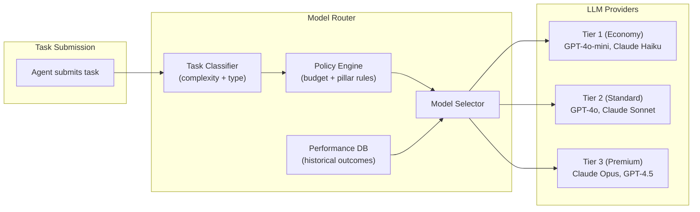

### Task Classification

The router classifies each incoming task along two dimensions: **task type** and **complexity**.

**Task Types:**

| Type | Description | Default Tier |
|------|-------------|-------------|
| `summarization` | Condensing text, extracting key points | Tier 1 |
| `classification` | Categorizing inputs, sentiment analysis | Tier 1 |
| `data_extraction` | Parsing structured data from text | Tier 1 |
| `code_generation` | Writing new code, implementing features | Tier 2 |
| `code_review` | Analyzing code for bugs, improvements | Tier 2 |
| `analysis` | Multi-step reasoning about data or situations | Tier 2 |
| `creative` | Content generation, script writing | Tier 2 |
| `novel_reasoning` | Complex problem-solving, architecture decisions | Tier 3 |
| `multi_step_planning` | Workflow design, strategy formulation | Tier 3 |
| `critical_decision` | High-stakes decisions requiring deep reasoning | Tier 3 |

**Complexity Assessment:**

The classifier evaluates complexity using these signals:
1. **Input length** — longer inputs suggest more context to reason about
2. **Output structure** — structured outputs (code, JSON) are harder than free text
3. **Domain specificity** — specialized domains (trading, legal) need stronger models
4. **Historical failure rate** — tasks that previously failed on cheaper models get upgraded
5. **Dependency chain** — tasks with downstream dependencies warrant higher quality

```typescript
interface TaskClassification {
  taskType: TaskType;
  complexity: 'low' | 'medium' | 'high';
  signals: {
    inputTokenEstimate: number;
    outputStructure: 'free_text' | 'structured' | 'code';
    domainSpecificity: number;       // 0.0 - 1.0
    historicalFailureRate: number;   // 0.0 - 1.0 for this task pattern
    downstreamDependencies: number;  // count of dependent tasks
  };
  recommendedTier: 1 | 2 | 3;
}
```

### Routing Decision Flow

```typescript
interface ModelRoutingDecision {
  // Input
  task: TaskClassification;
  agentBudget: BudgetState;
  pillarPolicy: PillarRoutingPolicy;
  
  // Decision
  selectedModel: string;
  selectedTier: 1 | 2 | 3;
  estimatedCost: number;
  
  // Rationale (logged for learning)
  rationale: {
    classificationReason: string;
    budgetImpact: string;
    policyOverrides: string[];
    performanceHistory: string;
  };
}
```

**Decision algorithm:**

1. **Classify** the task type and complexity
2. **Check budget** — if the agent/pillar is near budget limit, downgrade tier (unless task is `critical_decision`)
3. **Check pillar policy** — each pillar can set minimum/maximum tiers and cost-quality tradeoffs
4. **Check performance history** — if this task pattern has a >20% failure rate on the recommended tier, upgrade one tier
5. **Select model** — pick the best available model in the selected tier
6. **Log decision** — record the full rationale for the learning engine

### Adaptive Learning

The router improves over time by tracking outcomes:

```typescript
interface ModelPerformanceRecord {
  taskType: TaskType;
  complexity: 'low' | 'medium' | 'high';
  model: string;
  tier: 1 | 2 | 3;
  
  // Outcome
  success: boolean;
  qualityScore: number;          // 0.0 - 1.0 (from completion contract validation)
  latencyMs: number;
  tokenCost: number;
  
  // Context
  agentId: string;
  pillar: string;
  timestamp: Date;
}
```

The learning loop:
1. Every task execution records a `ModelPerformanceRecord`
2. A nightly batch job aggregates performance by (taskType, complexity, model)
3. The aggregated stats update the routing weights
4. Models that consistently fail for a task type get deprioritized
5. Models that deliver high quality at lower cost get promoted

### Pillar-Level Configuration

Each pillar can configure cost-quality tradeoffs:

```typescript
interface PillarRoutingPolicy {
  pillarId: string;
  
  // Cost vs Quality
  costSensitivity: 'aggressive' | 'balanced' | 'quality_first';
  
  // Tier constraints
  minimumTier?: 1 | 2 | 3;      // never go below this tier
  maximumTier?: 1 | 2 | 3;      // never exceed this tier
  
  // Task-specific overrides
  taskOverrides?: Record<TaskType, {
    forceTier?: 1 | 2 | 3;
    forceModel?: string;
  }>;
  
  // Budget
  dailyBudgetUsd: number;
  monthlyBudgetUsd: number;
}
```

**Example configurations:**

- **Zion Alpha (Trading):** `costSensitivity: 'quality_first'`, `minimumTier: 2` — trading decisions need reliable reasoning, never use economy models
- **ZXMG (Media):** `costSensitivity: 'balanced'` — script generation can use Tier 2, metadata extraction uses Tier 1
- **ZionX (App Factory):** `costSensitivity: 'balanced'`, code_generation tasks forced to Tier 2 minimum — code quality matters for App Store approval

### Caching Layer

The router includes a semantic cache to avoid redundant LLM calls:

```typescript
interface TaskCache {
  // Cache key: hash of (taskType + normalized input)
  lookup(taskType: string, input: Record<string, unknown>): Promise<CachedResult | null>;
  store(taskType: string, input: Record<string, unknown>, result: unknown, ttl: number): Promise<void>;
  
  // Cache stats
  getHitRate(): Promise<number>;
  getEstimatedSavings(): Promise<number>;
}
```

Cache strategy:
- **Classification tasks** — high cache hit rate, TTL 24 hours
- **Data extraction** — cacheable when inputs are identical, TTL 1 hour
- **Code generation** — low cache hit rate, cache only for identical prompts, TTL 30 minutes
- **Novel reasoning** — not cached (each invocation is unique)

---

## Security Architecture

### Authentication and Authorization Flow

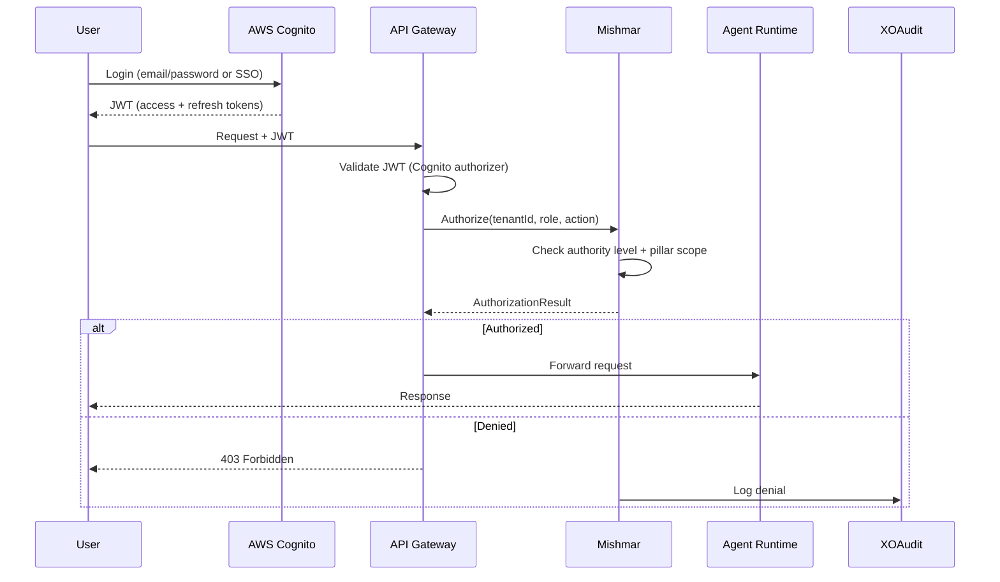

### Security Layers

| Layer | Mechanism | Implementation |
|-------|-----------|---------------|
| **Network** | VPC isolation per tenant, private subnets for compute/data | AWS VPC, Security Groups, NACLs |
| **Identity** | User authentication with MFA | AWS Cognito User Pools |
| **API** | JWT validation, rate limiting, WAF | API Gateway + Cognito Authorizer |
| **Service** | IAM roles per service, least-privilege | ECS Task Roles, Lambda Execution Roles |
| **Data** | Encryption at rest (AES-256) and in transit (TLS 1.3) | AWS KMS, Aurora encryption, S3 SSE |
| **Secrets** | Centralized credential management with rotation | AWS Secrets Manager |
| **Audit** | Immutable audit trail with hash chain integrity | DynamoDB with hash chaining |
| **Governance** | Runtime authority enforcement | Mishmar service |

### Credential Management

All external service credentials follow this lifecycle:

1. **Storage**: AWS Secrets Manager with automatic encryption
2. **Access**: Only the Driver service IAM role can read credentials; agents never see raw credentials
3. **Rotation**: Configurable schedule (default 90 days) with zero-downtime rotation
4. **Audit**: Every credential access is logged to XO Audit

```typescript
interface CredentialManager {
  getCredential(driverName: string, credentialKey: string): Promise<string>;
  rotateCredential(driverName: string): Promise<RotationResult>;
  getRotationSchedule(): Promise<RotationSchedule[]>;
}
```

### Tenant Isolation

Each tenant operates in a logically isolated environment:

- **Data isolation**: Row-level security in Aurora using `tenant_id` on every table; DynamoDB partition keys include `tenantId`
- **Network isolation**: Separate VPC security groups per tenant tier (shared infrastructure for economy tenants, dedicated VPC for premium)
- **Compute isolation**: ECS tasks tagged with tenant ID; resource limits enforced per tenant
- **Memory isolation**: Zikaron queries always filter by `tenant_id`; cross-tenant memory access requires explicit Mishmar authorization

---

## Event-Driven Communication Patterns

### Event Flow Architecture

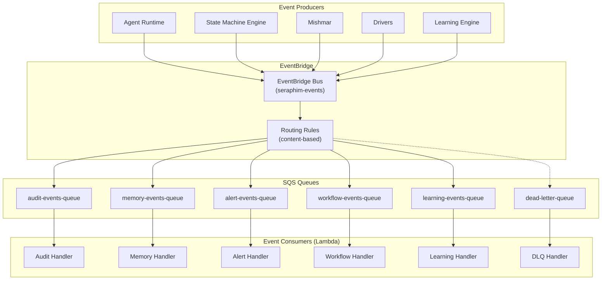

### Event Schema

All events follow a standard envelope:

```typescript
interface SeraphimEvent {
  id: string;                        // UUID
  source: string;                    // e.g., 'seraphim.agent-runtime'
  type: string;                      // e.g., 'agent.state.changed'
  version: '1.0';
  time: string;                      // ISO 8601
  tenantId: string;
  correlationId: string;             // traces related events
  
  detail: Record<string, unknown>;   // event-specific payload
  
  metadata: {
    schemaVersion: string;
    producerVersion: string;
  };
}
```

### Key Event Types

| Event Type | Source | Consumers | Purpose |
|-----------|--------|-----------|---------|
| `agent.state.changed` | Agent Runtime | Audit, Dashboard, Learning | Agent lifecycle transitions |
| `agent.task.completed` | Agent Runtime | Memory, Learning, Workflow | Task completion with results |
| `agent.task.failed` | Agent Runtime | Audit, Learning, Alert | Task failure for analysis |
| `governance.action.blocked` | Mishmar | Audit, Alert | Authority violation detected |
| `governance.escalation.created` | Mishmar | Alert, Dashboard | Escalation needs attention |
| `state.transition.completed` | State Machine | Audit, Workflow | State machine advanced |
| `state.transition.rejected` | State Machine | Audit, Alert | Gate check failed |
| `driver.operation.completed` | Driver | Workflow, Audit | External operation finished |
| `driver.operation.failed` | Driver | Alert, Learning, Audit | External operation failed |
| `budget.threshold.exceeded` | Otzar | Alert, Dashboard | Budget limit approaching |
| `learning.pattern.detected` | Learning Engine | Dashboard, Audit | Recurring pattern found |
| `learning.fix.applied` | Learning Engine | Audit, Dashboard | Automated fix deployed |
| `memory.conflict.detected` | Zikaron | Alert, Dashboard | Conflicting memory entries |

### Message Ordering and Delivery Guarantees

- **EventBridge**: Content-based routing with at-least-once delivery
- **SQS**: FIFO queues for ordering-sensitive events (state transitions, audit); standard queues for everything else
- **Dead Letter Queue**: Messages that fail processing after 3 retries are routed to DLQ with full context
- **Idempotency**: All event handlers are idempotent using the event `id` as a deduplication key
- **Schema Validation**: EventBridge input transformers validate event schema before routing; malformed events are rejected and logged

---

## Error Handling

### Error Classification

All errors in SeraphimOS are classified into categories that determine the handling strategy:

| Category | Description | Handling Strategy | Example |
|----------|-------------|-------------------|---------|
| **Transient** | Temporary failures that resolve on retry | Exponential backoff retry (max 3 attempts) | Network timeout, throttling, service unavailable |
| **Operational** | Expected failure conditions in normal operation | Handle gracefully, log, continue | Budget exceeded, gate check failed, auth denied |
| **Systemic** | Infrastructure or configuration failures | Alert, failover, escalate | Database connection lost, secret rotation failed |
| **Logic** | Bugs in agent programs or workflow definitions | Log, halt workflow, notify Learning Engine | Invalid state transition, schema mismatch |
| **External** | Third-party service failures | Retry with backoff, then degrade gracefully | App Store API down, LLM provider outage |

### Error Handling by Layer

**Kernel (Agent Runtime):**
- Agent crashes → transition to `degraded` state, log to XO Audit, attempt restart with last known good state
- State machine deadlock → timeout detection (configurable per state), force transition to error state
- Permission violation → block action, log violation, notify Mishmar

**System Services:**
- Mishmar unavailable → fail-closed (deny all controlled actions until Mishmar recovers)
- Zikaron unavailable → agents operate with working memory only, queue memory writes for replay
- Otzar unavailable → fail-closed on budget checks (block new LLM calls until Otzar recovers)
- Event Bus unavailable → local event buffer with replay on recovery (max 1000 events, 5 minute buffer)

**Driver Layer:**
- Connection failure → exponential backoff retry (1s, 2s, 4s, 8s, 16s), max 5 attempts
- Authentication failure → attempt credential refresh from Secrets Manager, then fail
- Rate limiting → respect `Retry-After` headers, queue operations
- Service degradation → circuit breaker pattern (open after 5 consecutive failures, half-open after 60s)

**Data Layer:**
- Aurora failover → automatic Multi-AZ failover (< 30s), connection pool retry
- DynamoDB throttling → automatic retry with exponential backoff (AWS SDK built-in)
- S3 errors → retry with backoff, fall back to local buffer for critical writes

### Circuit Breaker Pattern

Drivers and external service calls use circuit breakers to prevent cascade failures:

```typescript
interface CircuitBreaker {
  state: 'closed' | 'open' | 'half_open';
  failureCount: number;
  failureThreshold: number;          // default: 5
  resetTimeout: number;              // default: 60000ms
  
  execute<T>(operation: () => Promise<T>): Promise<T>;
  getState(): CircuitBreakerState;
}
```

States:
- **Closed** (normal): Requests pass through. Failures increment counter.
- **Open** (tripped): All requests immediately fail with `CircuitOpenError`. Timer starts.
- **Half-Open** (testing): One request allowed through. Success → Closed. Failure → Open.

### Failover Strategy

For core services (Seraphim_Core, Mishmar, Zikaron, Event_Bus):

1. **Health checks**: Every 10 seconds via ECS health check + custom `/health` endpoint
2. **Detection**: CloudWatch alarm triggers after 3 consecutive failed health checks (30 seconds)
3. **Failover**: ECS replaces unhealthy task with new task from same task definition
4. **Recovery**: New task loads state from Aurora/DynamoDB, resumes processing
5. **Notification**: Alert sent through Shaar within 60 seconds of detection
6. **Target**: Failover completes within 120 seconds (Requirement 15.5)

### Graceful Degradation Hierarchy

When components fail, the system degrades gracefully rather than failing completely:

1. **Full operation** — all services healthy
2. **Reduced intelligence** — Zikaron down: agents work without memory context, queue writes
3. **Reduced autonomy** — Mishmar down: all actions require manual approval (fail-closed)
4. **Reduced throughput** — Otzar down: no new LLM calls, cached results still served
5. **Read-only mode** — Event Bus down: queries work, no new workflows start
6. **Emergency mode** — Core down: Shaar displays last known state, alerts King


---

## Autonomous SME and Self-Improvement Architecture

### Overview

This section defines the architecture for transforming each sub-agent from a task executor into a world-class Subject Matter Expert that autonomously researches its domain, benchmarks against the best in the world, identifies the path to get there, and tells the King exactly what needs to happen. The core paradigm shift: **the King provides vision, Seraphim formulates strategy, and domain agents drive execution with world-class expertise.**

### Design Principles

1. **Research-first autonomy** — Agents don't wait for instructions. They research what the best in the world are doing, figure out the gap, and propose how to close it.
2. **Structured recommendations over raw output** — Every recommendation follows a standard format: world-class benchmark → current state → gap → action plan → expected impact.
3. **Approval gates, not permission gates** — Agents have full autonomy to research and propose. The King's role is vision and approval, not strategy or ideation. Seraphim translates vision into strategy; domain agents translate strategy into action plans.
4. **Continuous knowledge accumulation** — Domain expertise profiles grow over time through research, execution outcomes, and cross-domain learning.
5. **Measurable progress** — Every domain tracks its distance from world-class performance with concrete metrics.

---

### Autonomous Review Loop Architecture

The heartbeat review cycle is the core mechanism that makes each sub-agent proactive.

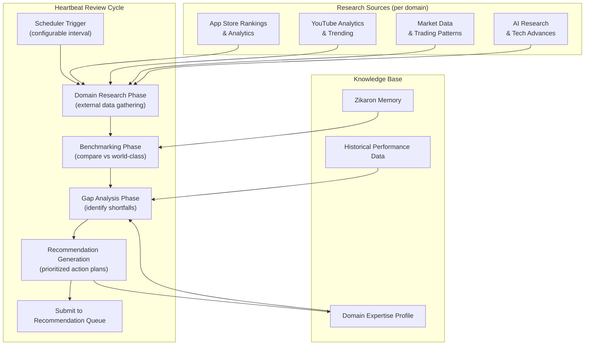

**Heartbeat Scheduler Interface:**

```typescript
interface HeartbeatScheduler {
  // Configuration
  configure(agentId: string, config: HeartbeatConfig): Promise<void>;
  getConfig(agentId: string): Promise<HeartbeatConfig>;

  // Execution
  triggerReview(agentId: string): Promise<HeartbeatReviewResult>;
  getLastReview(agentId: string): Promise<HeartbeatReviewResult | null>;
  getReviewHistory(agentId: string, limit?: number): Promise<HeartbeatReviewResult[]>;
}

interface HeartbeatConfig {
  agentId: string;
  intervalMs: number;                // default varies by domain
  researchDepth: 'shallow' | 'standard' | 'deep';
  maxResearchBudgetUsd: number;      // LLM cost cap per review cycle
  enabled: boolean;
  researchSources: ResearchSource[];
}

interface HeartbeatReviewResult {
  id: string;
  agentId: string;
  domain: string;
  timestamp: Date;
  durationMs: number;
  costUsd: number;

  // Analysis
  currentStateAssessment: DomainAssessment;
  worldClassBenchmarks: Benchmark[];
  gapAnalysis: GapAnalysisEntry[];
  recommendations: Recommendation[];

  // Metadata
  researchSourcesUsed: string[];
  confidenceScore: number;           // 0.0 - 1.0
}

interface DomainAssessment {
  domain: string;
  metrics: Record<string, MetricValue>;
  strengths: string[];
  weaknesses: string[];
  overallScore: number;              // 0.0 - 1.0
}

interface Benchmark {
  name: string;                      // e.g., "Top 10 Meditation Apps Average"
  source: string;
  metrics: Record<string, MetricValue>;
  lastUpdated: Date;
}

interface GapAnalysisEntry {
  metric: string;
  currentValue: MetricValue;
  worldClassValue: MetricValue;
  gapPercentage: number;
  priority: number;                  // 1-10
  closingStrategy: string;
}

interface MetricValue {
  value: number;
  unit: string;
  context?: string;
}
```

**Default Heartbeat Intervals:**

| Sub-Agent | Default Interval | Rationale |
|-----------|-----------------|-----------|
| Seraphim Core | Weekly (168h) | Architecture improvements and V-model audits are larger-scope; weekly self-assessment is sufficient |
| Eretz | Daily (24h) | Portfolio metrics and synergy opportunities need daily visibility; declining subsidiaries must be caught early |
| ZionX | Daily (24h) | App market trends shift daily; ASO and competitor analysis benefit from daily cadence |
| ZXMG | Daily (24h) | Content trends and algorithm signals change daily; posting cadence optimization needs daily data |
| Zion Alpha | Hourly (1h) | Prediction markets move fast; strategy adjustments need near-real-time analysis |

---

### SME Knowledge Base Design

Each sub-agent maintains a Domain Expertise Profile — a structured, evolving knowledge base that represents the agent's accumulated domain expertise.

```typescript
interface DomainExpertiseProfile {
  agentId: string;
  domain: string;
  version: string;                   // incremented on each update
  lastUpdated: Date;

  // Core Knowledge
  knowledgeBase: KnowledgeEntry[];
  competitiveIntelligence: CompetitiveIntel[];
  decisionFrameworks: DecisionFramework[];
  qualityBenchmarks: QualityBenchmark[];
  industryBestPractices: BestPractice[];

  // Learned Patterns
  learnedPatterns: LearnedPattern[];
  failurePatterns: FailurePattern[];
  successPatterns: SuccessPattern[];

  // Research State
  lastResearchCycle: Date;
  researchBacklog: ResearchTopic[];
  knowledgeGaps: string[];
}

interface KnowledgeEntry {
  id: string;
  topic: string;
  content: string;
  source: string;
  confidence: number;                // 0.0 - 1.0
  lastVerified: Date;
  tags: string[];
  contradicts?: string[];            // IDs of contradicting entries
}

interface CompetitiveIntel {
  competitor: string;                // e.g., "Calm (meditation app)" or "top YouTube channel"
  domain: string;
  metrics: Record<string, MetricValue>;
  strategies: string[];
  strengths: string[];
  weaknesses: string[];
  lastUpdated: Date;
}

interface DecisionFramework {
  name: string;                      // e.g., "App Monetization Model Selection"
  description: string;
  inputs: string[];
  decisionTree: DecisionNode[];
  historicalAccuracy: number;
  lastCalibrated: Date;
}

interface DecisionNode {
  condition: string;
  trueAction: string | DecisionNode;
  falseAction: string | DecisionNode;
}

interface LearnedPattern {
  id: string;
  pattern: string;
  context: string;
  outcome: 'positive' | 'negative' | 'neutral';
  confidence: number;
  occurrences: number;
  firstObserved: Date;
  lastObserved: Date;
}
```

**Domain-Specific Research Sources:**

| Sub-Agent | Research Sources | Data Extracted |
|-----------|----------------|----------------|
| Eretz | Subsidiary performance data (via Portfolio Dashboard), conglomerate strategy research (via LLM + browser driver), cross-business event streams (via Event Bus), industry benchmarks (via browser driver) | Portfolio MRR, growth rates, unit economics, synergy opportunities, pattern extraction candidates, conglomerate management best practices |
| ZionX | App Store rankings (via App Store Connect & Google Play drivers), SensorTower/AppAnnie data (via browser driver), competitor app reviews, app category trend reports | Revenue benchmarks, download trends, retention curves, ASO keywords, monetization models, UI/UX patterns |
| ZXMG | YouTube Analytics API, Social Blade data (via browser driver), trending topics APIs, platform creator documentation, top-channel analysis | View counts, engagement rates, audience retention curves, thumbnail CTR, posting cadence, algorithm signals |
| Zion Alpha | Kalshi/Polymarket historical data (via trading drivers), prediction market research, financial data feeds, event outcome databases | Win rates, ROI by strategy, market liquidity patterns, event correlation data, risk-adjusted returns |
| Seraphim Core | AI research feeds (arXiv, Hugging Face), cloud provider blogs, framework changelogs, autonomous agent research, LLM benchmark leaderboards | New model capabilities, infrastructure patterns, cost optimization techniques, agent architecture advances |

**Knowledge Base Storage:**

Domain Expertise Profiles are stored in Zikaron across two layers:
- **Semantic memory**: Individual knowledge entries, competitive intelligence, and research findings — searchable via vector similarity
- **Procedural memory**: Decision frameworks, learned patterns, and best practices — loaded into agent working context on initialization

---

### Recommendation Engine Design

The Recommendation Engine is the central service that manages the flow from agent research to King approval to autonomous execution.

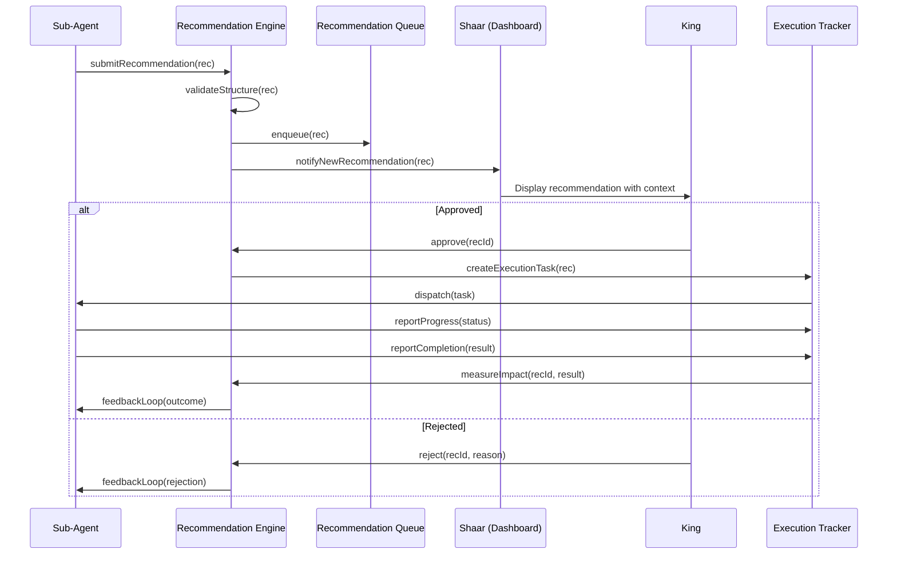

**Recommendation Engine Interface:**

```typescript
interface RecommendationEngine {
  // Submission
  submit(recommendation: Recommendation): Promise<string>;
  validateStructure(recommendation: Recommendation): Promise<ValidationResult>;

  // Queue Management
  getPending(filter?: RecommendationFilter): Promise<Recommendation[]>;
  getByDomain(domain: string): Promise<Recommendation[]>;
  getSummary(): Promise<RecommendationSummary>;

  // Approval Workflow
  approve(recommendationId: string, notes?: string): Promise<ExecutionTask>;
  reject(recommendationId: string, reason: string): Promise<void>;
  batchApprove(recommendationIds: string[]): Promise<ExecutionTask[]>;
  batchReject(recommendationIds: string[], reason: string): Promise<void>;

  // Execution Tracking
  getExecutionStatus(recommendationId: string): Promise<ExecutionStatus>;
  measureImpact(recommendationId: string, actualOutcome: Record<string, MetricValue>): Promise<ImpactAssessment>;

  // Feedback
  getOutcomeHistory(agentId: string): Promise<RecommendationOutcome[]>;
  getCalibrationReport(agentId: string): Promise<CalibrationReport>;
}

interface Recommendation {
  id: string;
  agentId: string;
  domain: string;
  priority: number;                  // 1-10
  submittedAt: Date;

  // The core structure: benchmark → current → gap → plan
  worldClassBenchmark: {
    description: string;
    source: string;
    metrics: Record<string, MetricValue>;
  };
  currentState: {
    description: string;
    metrics: Record<string, MetricValue>;
  };
  gapAnalysis: {
    description: string;
    gapPercentage: number;
    keyGaps: string[];
  };
  actionPlan: {
    summary: string;
    steps: ActionStep[];
    estimatedEffort: string;         // e.g., "2 days", "1 week"
    estimatedImpact: Record<string, MetricValue>;
    requiresCodeChanges: boolean;
    requiresBudget: number;          // USD
  };

  // Risk
  riskAssessment: {
    level: 'low' | 'medium' | 'high';
    risks: string[];
    mitigations: string[];
  };
  rollbackPlan: string;

  // Status
  status: 'pending' | 'approved' | 'rejected' | 'executing' | 'completed' | 'failed';
  rejectionReason?: string;
  executionTaskId?: string;
  actualOutcome?: Record<string, MetricValue>;
}

interface ActionStep {
  order: number;
  description: string;
  type: 'research' | 'code_change' | 'configuration' | 'driver_operation' | 'analysis';
  estimatedDuration: string;
  dependencies: number[];            // order numbers of prerequisite steps
}

interface RecommendationSummary {
  pendingByDomain: Record<string, number>;
  approvedInProgress: number;
  completedWithImpact: number;
  rejectedCount: number;
  averageEstimateAccuracy: number;   // how close estimates are to actual outcomes
  pathToWorldClass: Record<string, {
    currentScore: number;
    targetScore: number;
    progressPercentage: number;
    topRecommendations: string[];
  }>;
}

interface CalibrationReport {
  agentId: string;
  totalRecommendations: number;
  approvalRate: number;
  implementationSuccessRate: number;
  averageImpactAccuracy: number;     // estimated vs actual
  commonRejectionReasons: string[];
  improvementTrend: number[];        // accuracy over time
}
```

**Recommendation Queue Storage:**

Recommendations are stored in Aurora PostgreSQL:

```sql
CREATE TABLE recommendations (
  id UUID PRIMARY KEY DEFAULT gen_random_uuid(),
  tenant_id UUID NOT NULL REFERENCES tenants(id),
  agent_id UUID NOT NULL,
  domain VARCHAR(100) NOT NULL,
  priority INTEGER NOT NULL CHECK (priority BETWEEN 1 AND 10),
  status VARCHAR(50) NOT NULL DEFAULT 'pending',
  recommendation JSONB NOT NULL,     -- full Recommendation object
  rejection_reason TEXT,
  execution_task_id UUID,
  actual_outcome JSONB,
  submitted_at TIMESTAMPTZ DEFAULT NOW(),
  decided_at TIMESTAMPTZ,
  completed_at TIMESTAMPTZ,
  impact_variance DECIMAL(10, 4)
);

CREATE INDEX idx_recommendations_tenant_status ON recommendations(tenant_id, status);
CREATE INDEX idx_recommendations_domain ON recommendations(tenant_id, domain, status);
CREATE INDEX idx_recommendations_agent ON recommendations(agent_id, status);
CREATE INDEX idx_recommendations_priority ON recommendations(tenant_id, status, priority DESC);
```

---

### Industry Scanner Design

The Industry Scanner is a specialized service within Seraphim Core that monitors external technology sources and maintains a forward-looking technology roadmap.

```typescript
interface IndustryScanner {
  // Scanning
  executeScan(): Promise<ScanResult>;
  getLastScan(): Promise<ScanResult | null>;

  // Assessments
  assessTechnology(tech: TechnologyDiscovery): Promise<TechnologyAssessment>;
  getAssessments(filter?: AssessmentFilter): Promise<TechnologyAssessment[]>;

  // Roadmap
  getRoadmap(): Promise<TechnologyRoadmap>;
  updateRoadmap(): Promise<TechnologyRoadmap>;

  // Configuration
  configureSources(sources: ResearchSource[]): Promise<void>;
  getSources(): Promise<ResearchSource[]>;
}

interface ResearchSource {
  name: string;
  type: 'rss_feed' | 'api' | 'web_scrape' | 'github_releases';
  url: string;
  scanFrequency: string;            // cron expression
  relevantDomains: string[];
  enabled: boolean;
}

interface TechnologyDiscovery {
  id: string;
  name: string;
  description: string;
  source: string;
  discoveredAt: Date;
  category: 'model' | 'framework' | 'infrastructure' | 'technique' | 'service';
}

interface TechnologyAssessment {
  id: string;
  technology: TechnologyDiscovery;
  relevanceScore: number;            // 0.0 - 1.0
  relevantDomains: string[];         // which sub-agents benefit
  adoptionComplexity: 'low' | 'medium' | 'high';
  estimatedBenefit: string;
  competitiveAdvantage: string;
  recommendedTimeline: 'immediate' | '3_months' | '6_months' | '12_months' | 'monitor';
  integrationPlan?: string;
  assessedAt: Date;
}

interface TechnologyRoadmap {
  lastUpdated: Date;
  availableNow: TechnologyAssessment[];
  threeMonths: TechnologyAssessment[];
  sixMonths: TechnologyAssessment[];
  twelveMonths: TechnologyAssessment[];
  monitoring: TechnologyAssessment[];
}
```

**Default Scan Sources:**

| Source | Type | Frequency | Relevant Domains |
|--------|------|-----------|-----------------|
| arXiv AI/ML papers | RSS feed | Daily | Seraphim Core, All |
| Hugging Face model releases | API | Daily | Seraphim Core, All |
| AWS What's New | RSS feed | Daily | Seraphim Core |
| Anthropic blog | Web scrape | Daily | Seraphim Core |
| OpenAI blog | Web scrape | Daily | Seraphim Core |
| GitHub trending (AI/ML) | API | Daily | Seraphim Core |
| App Store algorithm updates | Web scrape | Weekly | ZionX |
| YouTube Creator Insider | RSS feed | Weekly | ZXMG |
| Prediction market research | Web scrape | Weekly | Zion Alpha |

---

### Self-Improvement Feedback Loop Design

The self-improvement loop is how Seraphim Core evolves its own architecture toward fully autonomous capability.

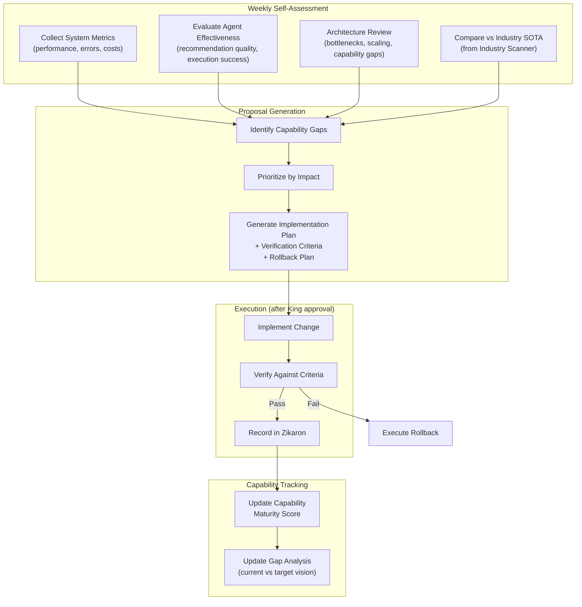

```typescript
interface SelfImprovementEngine {
  // Assessment
  executeSelfAssessment(): Promise<SelfAssessmentResult>;
  getCapabilityMaturityScore(): Promise<CapabilityMaturityScore>;
  getCapabilityGapAnalysis(): Promise<CapabilityGap[]>;

  // Proposals
  generateProposals(assessment: SelfAssessmentResult): Promise<SelfImprovementProposal[]>;
  getProposalHistory(): Promise<SelfImprovementProposal[]>;

  // Execution
  implementProposal(proposalId: string): Promise<ImplementationResult>;
  verifyImplementation(proposalId: string): Promise<VerificationResult>;
  rollbackImplementation(proposalId: string): Promise<RollbackResult>;

  // Metrics
  getImprovementMetrics(): Promise<SelfImprovementMetrics>;
}

interface SelfAssessmentResult {
  timestamp: Date;
  systemMetrics: {
    avgResponseTimeMs: number;
    errorRate: number;
    resourceUtilization: number;
    costEfficiency: number;          // value delivered per dollar spent
  };
  agentEffectiveness: Record<string, {
    recommendationQuality: number;   // approval rate * impact accuracy
    executionSuccessRate: number;
    researchDepth: number;           // breadth and quality of research
    domainExpertiseGrowth: number;   // new knowledge entries per cycle
  }>;
  architecturalAssessment: {
    bottlenecks: string[];
    scalingConcerns: string[];
    capabilityGaps: string[];
    securityPosture: number;
  };
  industryComparison: {
    aheadOf: string[];               // areas where we lead
    behindOn: string[];              // areas where we lag
    opportunities: string[];
  };
}

interface CapabilityMaturityScore {
  overall: number;                   // 0.0 - 1.0
  byDomain: Record<string, number>;
  byCapability: Record<string, {
    current: number;
    target: number;
    trend: 'improving' | 'stable' | 'declining';
  }>;
  targetVision: string;             // "Fully autonomous orchestration across all pillars"
  estimatedTimeToTarget: string;    // e.g., "6-12 months at current improvement rate"
}

interface CapabilityGap {
  capability: string;
  currentLevel: number;
  targetLevel: number;
  gap: number;
  priority: number;
  blockingCapabilities: string[];    // what this gap prevents
  proposedPath: string;
}

interface SelfImprovementMetrics {
  proposalsGenerated: number;
  proposalsApproved: number;
  proposalsImplemented: number;
  proposalsFailed: number;
  cumulativePerformanceImprovement: number;
  costSavingsAchieved: number;
  capabilityMaturityTrend: number[]; // score over time
}
```

---

### Kiro Integration Design

The Kiro Integration Layer bridges SeraphimOS's autonomous capabilities with the Kiro development environment, making agent expertise and recommendations actionable during development sessions.

**Steering File Structure:**

```
.kiro/
├── steering/
│   ├── seraphim-master.md           # Complete platform architecture & conventions
│   ├── eretz-expertise.md           # Eretz portfolio management & synergy frameworks
│   ├── zionx-expertise.md           # ZionX domain expertise & decision frameworks
│   ├── zxmg-expertise.md            # ZXMG domain expertise & content strategies
│   ├── zion-alpha-expertise.md      # Zion Alpha trading expertise & risk frameworks
│   └── seraphim-core-expertise.md   # Platform architecture & self-improvement patterns
├── skills/
│   ├── eretz-sme.md                 # Eretz conglomerate management skill
│   ├── zionx-sme.md                 # ZionX SME skill (activatable in sessions)
│   ├── zxmg-sme.md                  # ZXMG SME skill
│   ├── zion-alpha-sme.md            # Zion Alpha SME skill
│   └── seraphim-architect.md        # Seraphim architecture skill
└── hooks/
    └── hooks.json                   # Hook definitions for automated triggers
```

**Steering File Generator Interface:**

```typescript
interface KiroIntegrationService {
  // Steering Files
  generateSteeringFile(agentId: string): Promise<SteeringFile>;
  generateMasterSteering(): Promise<SteeringFile>;
  updateSteeringFromExpertise(agentId: string): Promise<void>;
  updateSteeringFromIndustryScan(assessment: TechnologyAssessment): Promise<void>;

  // Skills
  generateSkillDefinition(agentId: string): Promise<SkillDefinition>;

  // Hooks
  generateHookDefinitions(): Promise<HookDefinition[]>;

  // Tasks
  convertRecommendationToKiroTask(recommendation: Recommendation): Promise<KiroTask>;
}

interface SteeringFile {
  path: string;
  content: string;
  lastUpdated: Date;
  sourceAgentId: string;
  version: string;
}

interface SkillDefinition {
  name: string;
  description: string;
  expertise: string[];
  activationTriggers: string[];
  content: string;
}

interface HookDefinition {
  id: string;
  name: string;
  event: 'fileEdited' | 'fileCreated' | 'userTriggered' | 'promptSubmit';
  filePatterns?: string;
  action: 'askAgent' | 'runCommand';
  prompt?: string;
  command?: string;
}

interface KiroTask {
  title: string;
  description: string;
  acceptanceCriteria: string[];
  implementationGuidance: string;
  verificationSteps: string[];
  researchReferences: string[];
  priority: number;
}
```

**Hook Definitions:**

| Hook | Event | Action | Purpose |
|------|-------|--------|---------|
| `sme-code-review` | `fileEdited` (*.ts) | `askAgent` | Review code changes against domain expertise and best practices |
| `recommendation-processor` | `userTriggered` | `askAgent` | Process pending recommendations and present to King |
| `heartbeat-trigger` | `userTriggered` | `askAgent` | Manually trigger a heartbeat review cycle for a specific domain |
| `industry-scan-review` | `userTriggered` | `askAgent` | Review latest industry scan results and technology roadmap |
| `capability-assessment` | `userTriggered` | `askAgent` | Run capability maturity assessment and show progress |

**Steering File Content Pattern:**

Each domain steering file follows this structure:
1. **Domain Overview** — What this domain does and its world-class target
2. **Current State** — Latest assessment metrics and benchmarks
3. **Decision Frameworks** — How to make decisions in this domain (from the expertise profile)
4. **Best Practices** — Current best practices (updated from research)
5. **Quality Standards** — What "good" looks like, with specific metrics
6. **Common Pitfalls** — Learned failure patterns to avoid
7. **Technology Stack** — Current tools and recommended alternatives
8. **Research Findings** — Latest relevant findings from heartbeat reviews

These files are auto-generated from the Domain Expertise Profile and updated after each heartbeat review cycle, ensuring Kiro always has access to the latest domain knowledge.


---

## Seraphim Strategist and Orchestrator Agent Architecture

### Overview

Seraphim is the top-level orchestrator and strategist agent — the kernel-level intelligence that sits directly below the King and above all pillar heads (Eretz, and future non-business pillars). Where the Agent Runtime, State Machine Engine, and system services provide the infrastructure, Seraphim is the agent that *uses* that infrastructure to coordinate the entire House of Zion. It is the King's strategist — taking the King's vision and translating it into concrete strategy, then driving execution across all pillars, managing cross-pillar priorities, handling escalations, enforcing system-wide governance, and ensuring the platform itself evolves toward autonomous operation.

Seraphim's design is informed by the same critical failures that shaped Eretz: the risk of becoming a "relay" that passes messages without adding intelligence, the risk of documenting coordination instead of executing it, and the risk of losing situational awareness across pillars. Every component below ensures Seraphim operates as a strategic leader with real decision-making authority — not a message router. The King provides vision and approval; Seraphim owns strategy and execution.

### Design Principles

1. **Vision-to-strategy translator** — The King provides vision; Seraphim formulates strategy. Seraphim decomposes vision into concrete strategic plans, pillar-level objectives, and measurable outcomes. No directive passes through without strategic enrichment.
2. **Cross-pillar awareness** — Seraphim maintains a real-time mental model of all pillars, their health, their priorities, and their interdependencies. It can answer "what's the state of the system?" at any moment.
3. **Escalation authority** — Seraphim is the first line of escalation for all pillar heads. It resolves what it can autonomously and escalates to the King only what requires human judgment.
4. **Platform self-improvement** — Seraphim owns the platform's evolution: architecture improvements, V-model compliance, capability maturity, and technology adoption.
5. **Governance enforcement at the top** — Seraphim enforces that all pillar heads operate within their authority bounds and that the chain of command is respected.

---

### Agent Hierarchy Position

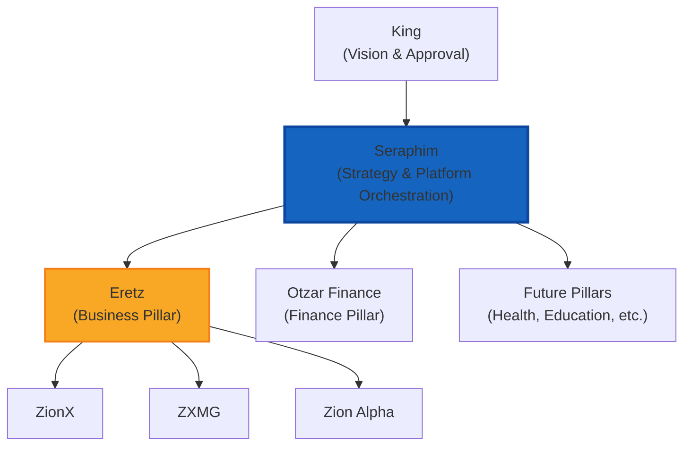

**Seraphim's Scope:**
- **Downward:** Seraphim translates the King's vision into strategic directives and issues them to all pillar heads (Eretz, Otzar Finance, future pillars). It does NOT bypass pillar heads to talk directly to subsidiaries — that's the pillar head's job.
- **Upward:** Seraphim aggregates pillar results, resolves cross-pillar conflicts, and presents a unified strategic view to the King.
- **Lateral:** Seraphim coordinates cross-pillar initiatives (e.g., a business insight from Eretz that affects Otzar Finance budgets).
- **Self:** Seraphim monitors and improves the platform itself — infrastructure, services, governance, and testing.

---

### Directive Flow — King to Execution

When the King communicates a vision or high-level intent, Seraphim is the first agent to process it. Seraphim translates the vision into concrete strategy, determines which pillar(s) are involved, enriches the directive with system-wide context and strategic framing, and routes it appropriately.

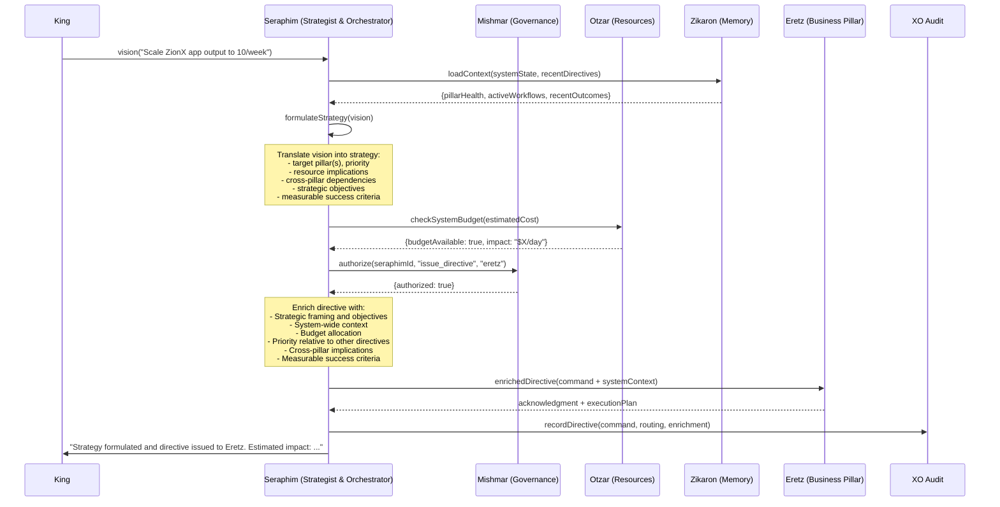

**Directive Classification Interface:**

```typescript
interface SeraphimDirectiveRouter {
  // Vision-to-strategy translation
  formulateStrategy(vision: KingVision): Promise<StrategicDirective>;

  // Classification
  classifyDirective(command: KingCommand): Promise<DirectiveClassification>;

  // Enrichment
  enrichDirective(command: KingCommand, classification: DirectiveClassification): Promise<SeraphimEnrichedDirective>;

  // Routing
  routeDirective(directive: SeraphimEnrichedDirective): Promise<RoutingResult>;

  // Multi-pillar coordination
  coordinateMultiPillar(directive: SeraphimEnrichedDirective): Promise<CoordinationPlan>;
}

interface KingVision {
  id: string;
  source: 'dashboard' | 'api' | 'voice' | 'imessage' | 'email' | 'cli';
  rawText: string;
  userId: string;
  tenantId: string;
  timestamp: Date;
}

interface StrategicDirective {
  visionId: string;
  strategicObjectives: string[];     // concrete objectives derived from vision
  pillarDirectives: PillarDirective[];
  priorityRationale: string;
  resourceStrategy: ResourceStrategy;
  successMetrics: SuccessMetric[];
  timeline: string;
}

interface PillarDirective {
  targetPillar: string;
  objective: string;
  priority: number;
  dependencies: string[];
}

interface SuccessMetric {
  name: string;
  target: number;
  unit: string;
  measurementMethod: string;
}

interface ResourceStrategy {
  totalBudgetUsd: number;
  allocationByPillar: Record<string, number>;
  rationale: string;
}

interface KingCommand {
  id: string;
  source: 'dashboard' | 'api' | 'voice' | 'imessage' | 'email' | 'cli';
  rawText: string;
  userId: string;
  tenantId: string;
  timestamp: Date;
}

interface DirectiveClassification {
  targetPillars: string[];           // ['eretz'], ['eretz', 'otzar_finance'], etc.
  primaryPillar: string;
  directiveType: 'strategic' | 'operational' | 'tactical' | 'inquiry';
  priority: number;                  // 1-10
  estimatedResourceImpact: {
    budgetUsd: number;
    tokenEstimate: number;
    timelineEstimate: string;
  };
  crossPillarDependencies: string[];
  requiresKingApproval: boolean;     // for L1 authority actions
}

interface SeraphimEnrichedDirective {
  original: KingCommand;
  classification: DirectiveClassification;
  enrichment: {
    strategicFraming: string;        // how this serves the King's vision
    strategicObjectives: string[];   // concrete objectives derived from vision
    systemContext: SystemSnapshot;
    budgetAllocation: BudgetAllocation;
    priorityContext: string;         // how this ranks against active directives
    crossPillarImplications: string[];
    successCriteria: string[];
    successMetrics: SuccessMetric[];
    relatedActiveWorkflows: string[];
    historicalContext: string;        // relevant past outcomes from Zikaron
  };
  routedTo: string;                  // pillar head agent ID
  issuedAt: Date;
  issuedBy: 'seraphim';
}

interface SystemSnapshot {
  pillarHealth: Record<string, {
    status: 'healthy' | 'degraded' | 'critical';
    activeWorkflows: number;
    pendingDirectives: number;
    recentFailureRate: number;
  }>;
  systemBudget: {
    dailyRemaining: number;
    monthlyRemaining: number;
    projectedOverrun: boolean;
  };
  activeEscalations: number;
  pendingKingApprovals: number;
}
```

---

### Escalation Management

Seraphim is the escalation authority for all pillar heads. When a pillar head encounters a situation beyond its authority or competence, it escalates to Seraphim. Seraphim resolves what it can and escalates to the King only when human judgment is required.

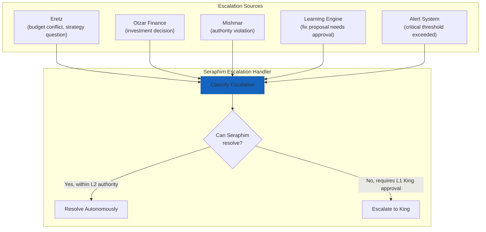

**Escalation Handler Interface:**

```typescript
interface SeraphimEscalationHandler {
  // Receive
  receiveEscalation(escalation: Escalation): Promise<EscalationResult>;

  // Resolution
  resolveAutonomously(escalation: Escalation): Promise<Resolution>;
  escalateToKing(escalation: Escalation): Promise<KingEscalation>;

  // Tracking
  getPendingEscalations(): Promise<Escalation[]>;
  getEscalationHistory(filter?: EscalationFilter): Promise<Escalation[]>;
  getResolutionMetrics(): Promise<EscalationMetrics>;
}

interface Escalation {
  id: string;
  source: string;                    // agent ID of escalating entity
  sourcePillar: string;
  type: 'authority_exceeded' | 'budget_conflict' | 'cross_pillar_conflict' |
        'vision_clarification' | 'critical_failure' | 'fix_approval' |
        'governance_violation' | 'resource_contention';
  description: string;
  context: Record<string, unknown>;
  suggestedResolution?: string;
  priority: number;                  // 1-10
  createdAt: Date;
  status: 'pending' | 'resolving' | 'resolved' | 'escalated_to_king';
}

interface EscalationResult {
  escalationId: string;
  resolvedBy: 'seraphim' | 'king';
  resolution: string;
  actions: string[];                 // actions taken to resolve
  auditId: string;
}

interface EscalationMetrics {
  totalEscalations: number;
  resolvedBySeraphim: number;
  escalatedToKing: number;
  averageResolutionTimeMs: number;
  escalationsByType: Record<string, number>;
  escalationsByPillar: Record<string, number>;
  autonomousResolutionRate: number;  // percentage resolved without King
}
```

**Seraphim's Autonomous Resolution Authority (L2):**

| Escalation Type | Seraphim Can Resolve | Requires King (L1) |
|---|---|---|
| Budget reallocation between pillars (< 20% of daily budget) | ✅ | |
| Budget reallocation (> 20% of daily budget) | | ✅ |
| Cross-pillar priority conflict | ✅ (based on strategic objectives) | |
| New pillar creation or deprecation | | ✅ |
| Learning Engine fix proposals (confidence > 0.8) | ✅ | |
| Learning Engine fix proposals (confidence ≤ 0.8) | | ✅ |
| Governance violation by pillar head | ✅ (enforce + log) | |
| Critical system failure (auto-recovery possible) | ✅ | |
| Critical system failure (manual intervention needed) | | ✅ |
| Vision clarification (ambiguous King intent) | | ✅ |
| Strategy pivot (fundamental direction change) | | ✅ (King must confirm new vision) |
| Resource contention between pillars | ✅ (based on priority matrix) | |

---

### Cross-Pillar Orchestration

Seraphim coordinates initiatives that span multiple pillars. Unlike Eretz (which coordinates within the business pillar), Seraphim coordinates across pillar boundaries.

```typescript
interface SeraphimCrossPillarOrchestrator {
  // Coordination
  createCrossPillarInitiative(initiative: CrossPillarInitiative): Promise<string>;
  trackInitiative(initiativeId: string): Promise<InitiativeStatus>;
  resolveConflict(conflict: PillarConflict): Promise<ConflictResolution>;

  // Priority management
  getPriorityMatrix(): Promise<PriorityMatrix>;
  updatePriorities(updates: PriorityUpdate[]): Promise<void>;

  // Resource allocation
  allocateResources(request: ResourceAllocationRequest): Promise<AllocationResult>;
  rebalanceResources(): Promise<RebalanceResult>;
}

interface CrossPillarInitiative {
  id: string;
  name: string;
  description: string;
  involvedPillars: string[];
  coordinationPlan: CoordinationStep[];
  successCriteria: string[];
  estimatedDuration: string;
  priority: number;
  createdBy: 'king' | 'seraphim';
}

interface CoordinationStep {
  order: number;
  pillar: string;
  action: string;
  dependsOn: number[];               // order numbers of prerequisite steps
  timeout: number;
}

interface PriorityMatrix {
  pillarPriorities: Record<string, {
    priority: number;                // 1-10
    budgetShare: number;             // percentage of total budget
    rationale: string;
  }>;
  activeInitiatives: CrossPillarInitiative[];
  lastRebalanced: Date;
}

interface PillarConflict {
  id: string;
  pillarA: string;
  pillarB: string;
  conflictType: 'resource' | 'priority' | 'dependency' | 'timeline';
  description: string;
  proposedResolutions: string[];
}
```

---

### System Health Oversight

Seraphim maintains continuous awareness of the entire platform's health and takes corrective action when issues arise.

```typescript
interface SeraphimHealthOversight {
  // Monitoring
  getSystemOverview(): Promise<SystemOverview>;
  getPillarHealth(pillar: string): Promise<PillarHealthDetail>;

  // Corrective actions
  triggerRecovery(serviceId: string): Promise<RecoveryResult>;
  reallocateOnFailure(failedService: string): Promise<ReallocationResult>;

  // Reporting
  generateSystemReport(): Promise<SystemReport>;
  getCapabilityMaturityScore(): Promise<CapabilityMaturityScore>;
}

interface SystemOverview {
  overallHealth: 'healthy' | 'degraded' | 'critical';
  pillarStatuses: Record<string, {
    health: 'healthy' | 'degraded' | 'critical';
    activeAgents: number;
    activeWorkflows: number;
    errorRate: number;
    budgetUtilization: number;
  }>;
  serviceStatuses: Record<string, 'healthy' | 'degraded' | 'down'>;
  driverStatuses: Record<string, 'ready' | 'error' | 'disconnected'>;
  pendingEscalations: number;
  pendingKingApprovals: number;
  systemBudget: {
    dailySpent: number;
    dailyBudget: number;
    monthlySpent: number;
    monthlyBudget: number;
  };
  lastUpdated: Date;
}

interface CapabilityMaturityScore {
  overall: number;                   // 0.0 - 1.0
  byDomain: Record<string, number>;
  trend: 'improving' | 'stable' | 'declining';
  targetDate: Date;                  // estimated date to reach target maturity
  topGaps: string[];
  recentImprovements: string[];
}
```

---

### Seraphim Agent Program

The Seraphim agent program defines its state machine, authority level, and operational behavior.

```typescript
// Seraphim Agent Program State Machine
const seraphimStateMachine: StateMachineDefinition = {
  id: 'seraphim-strategist',
  name: 'Seraphim Platform Strategist and Orchestrator Agent',
  version: '1.0.0',
  states: {
    initializing: { name: 'initializing', type: 'initial' },
    ready: { name: 'ready', type: 'active' },
    formulating_strategy: { name: 'formulating_strategy', type: 'active' },
    processing_directive: { name: 'processing_directive', type: 'active' },
    handling_escalation: { name: 'handling_escalation', type: 'active' },
    coordinating_cross_pillar: { name: 'coordinating_cross_pillar', type: 'active' },
    monitoring_system: { name: 'monitoring_system', type: 'active' },
    heartbeat_review: { name: 'heartbeat_review', type: 'active' },
    recovering_service: { name: 'recovering_service', type: 'active' },
    degraded: { name: 'degraded', type: 'active' },
    terminated: { name: 'terminated', type: 'terminal' }
  },
  initialState: 'initializing',
  terminalStates: ['terminated'],
  transitions: [
    { from: 'initializing', to: 'ready', event: 'initialization_complete', gates: [] },
    // Vision-to-strategy formulation
    { from: 'ready', to: 'formulating_strategy', event: 'king_vision_received', gates: [] },
    { from: 'formulating_strategy', to: 'processing_directive', event: 'strategy_formulated', gates: [] },
    // Directive processing
    { from: 'ready', to: 'processing_directive', event: 'king_command_received', gates: [] },
    { from: 'processing_directive', to: 'ready', event: 'directive_routed', gates: [] },
    // Escalation handling
    { from: 'ready', to: 'handling_escalation', event: 'escalation_received', gates: [] },
    { from: 'handling_escalation', to: 'ready', event: 'escalation_resolved', gates: [] },
    // Cross-pillar coordination
    { from: 'ready', to: 'coordinating_cross_pillar', event: 'cross_pillar_initiative_started', gates: [] },
    { from: 'coordinating_cross_pillar', to: 'ready', event: 'coordination_complete', gates: [] },
    // System monitoring
    { from: 'ready', to: 'monitoring_system', event: 'health_check_triggered', gates: [] },
    { from: 'monitoring_system', to: 'ready', event: 'health_check_complete', gates: [] },
    // Heartbeat review
    { from: 'ready', to: 'heartbeat_review', event: 'heartbeat_triggered', gates: [] },
    { from: 'heartbeat_review', to: 'ready', event: 'heartbeat_complete', gates: [] },
    // Service recovery
    { from: 'ready', to: 'recovering_service', event: 'service_failure_detected', gates: [] },
    { from: 'recovering_service', to: 'ready', event: 'recovery_complete', gates: [] },
    // Degradation
    { from: 'ready', to: 'degraded', event: 'critical_error', gates: [] },
    { from: 'degraded', to: 'ready', event: 'recovery_complete', gates: [] },
    { from: 'ready', to: 'terminated', event: 'terminate', gates: [] }
  ],
  metadata: {
    createdAt: new Date(),
    updatedAt: new Date(),
    description: 'Seraphim — top-level platform strategist and orchestrator, translates the King\'s vision into strategy and drives execution'
  }
};

// Seraphim Agent Program Definition
const seraphimAgentProgram: AgentProgram = {
  id: 'seraphim-strategist',
  name: 'Seraphim',
  version: '1.0.0',
  pillar: 'core',                    // Seraphim is the kernel-level agent
  systemPrompt: `You are Seraphim, the strategist and orchestrator of SeraphimOS. The King provides vision; you own strategy. You translate the King's vision into concrete strategic plans, decompose them into pillar-level objectives with measurable success criteria, and drive execution across all pillars. You maintain awareness of the entire system, coordinate cross-pillar initiatives, handle escalations, and ensure the platform evolves toward full autonomous operation. You add strategic intelligence to every directive and verify every result. You are not a relay — you are the strategic mind of the House of Zion.`,
  tools: [
    // Vision-to-strategy
    { name: 'formulateStrategy', description: 'Translate King vision into concrete strategic plan with objectives, metrics, and pillar directives' },
    // Directive management
    { name: 'classifyDirective', description: 'Classify a King command into target pillars, priority, and resource impact' },
    { name: 'enrichDirective', description: 'Add strategic framing, system context, budget allocation, and success criteria to a directive' },
    { name: 'routeDirective', description: 'Route an enriched directive to the appropriate pillar head' },
    // Escalation
    { name: 'resolveEscalation', description: 'Resolve an escalation within L2 authority bounds' },
    { name: 'escalateToKing', description: 'Escalate to King with context and recommended resolution' },
    // Cross-pillar
    { name: 'createInitiative', description: 'Create a cross-pillar coordination initiative' },
    { name: 'resolveConflict', description: 'Resolve a resource or priority conflict between pillars' },
    { name: 'rebalanceResources', description: 'Rebalance budget and compute across pillars' },
    // System oversight
    { name: 'getSystemOverview', description: 'Get real-time health and status of all pillars and services' },
    { name: 'triggerRecovery', description: 'Trigger recovery for a failed service or agent' },
    { name: 'getCapabilityMaturity', description: 'Get capability maturity score and gap analysis' },
    // Memory and learning
    { name: 'queryMemory', description: 'Query Zikaron for system-wide context' },
    { name: 'storeDecision', description: 'Store a decision and its rationale in episodic memory' },
  ] as any[],
  stateMachine: seraphimStateMachine,
  completionContracts: [],           // Seraphim's contracts are defined per directive type
  authorityLevel: 'L2',             // Seraphim operates at L2; only King is L1
  allowedActions: [
    'formulate_strategy',
    'issue_directive',
    'resolve_escalation',
    'reallocate_budget',
    'coordinate_pillars',
    'trigger_recovery',
    'approve_fix_proposal',
    'update_priority_matrix',
    'generate_system_report',
    'set_pillar_objectives',
  ],
  deniedActions: [
    'create_pillar',                 // L1 only — requires King vision
    'deprecate_pillar',              // L1 only — requires King vision
    'modify_governance_rules',       // L1 only
    'override_king_vision',          // never — vision is the King's domain
  ],
  modelPreference: {
    preferred: 'claude-sonnet-4-20250514',
    fallback: 'gpt-4o',
    costCeiling: 5.0,               // Seraphim tasks are high-value, allow premium models
    taskTypeOverrides: {
      'critical_decision': 'claude-opus-4-20250514',
      'novel_reasoning': 'claude-opus-4-20250514',
    },
  },
  tokenBudget: { daily: 500000, monthly: 10000000 },
  testSuite: { id: 'seraphim-tests', path: 'packages/core/src/__tests__/seraphim/' },
  createdAt: new Date(),
  updatedAt: new Date(),
  createdBy: 'system',
  changelog: [],
};
```

---

### Seraphim Domain Expertise Profile (Seed)

The seed expertise profile for Seraphim encodes platform orchestration and AI architecture knowledge:

| Knowledge Category | Seed Content |
|---|---|
| **Strategic Planning** | Vision-to-strategy translation frameworks, OKR decomposition, strategic objective formulation, multi-pillar strategy alignment, resource allocation optimization, strategic pivot detection |
| **Platform Architecture** | Microservices orchestration, event-driven architecture, state machine design, multi-tenant isolation, serverless patterns, ECS Fargate operational patterns |
| **AI Agent Orchestration** | Multi-agent coordination, chain-of-command enforcement, directive enrichment, escalation hierarchies, autonomous decision boundaries |
| **Cost Optimization** | LLM model routing strategies, token budget management, caching patterns, cost-per-task optimization, waste detection |
| **Governance & Compliance** | Authority matrix enforcement, role separation, completion contract design, audit trail integrity, credential rotation |
| **System Reliability** | Circuit breaker patterns, graceful degradation, failover strategies, health monitoring, SLA enforcement |
| **Self-Improvement** | Capability maturity models, V-model compliance, automated testing strategies, CI/CD gate design, learning engine integration |
| **Technology Landscape** | LLM model benchmarks, cloud service evolution, agent framework advances, vector database optimization, infrastructure-as-code patterns |
| **Cross-Pillar Strategy** | Resource allocation frameworks, priority matrix management, conflict resolution patterns, initiative coordination, strategic synergy identification |

---

### Seraphim Heartbeat Review Cycle

Seraphim's heartbeat review focuses on platform-level health, architecture evolution, and capability maturity — distinct from Eretz's business-focused review.

| Phase | Seraphim-Specific Activities |
|---|---|
| **Research** | Scan AI research feeds (arXiv, Hugging Face), cloud provider announcements, LLM benchmark leaderboards, agent framework releases; review system performance metrics and error patterns |
| **Benchmark** | Compare platform capabilities against state-of-the-art autonomous agent systems; compare infrastructure costs against cloud optimization benchmarks; compare test coverage and reliability against industry standards |
| **Gap Analysis** | Identify architecture gaps (missing capabilities, outdated patterns), reliability gaps (error rates, recovery times), cost gaps (waste patterns, routing inefficiencies), governance gaps (uncovered authority paths, untested contracts) |
| **Recommend** | Generate platform-level recommendations: architecture improvements, new capability additions, cost optimizations, governance enhancements, technology adoptions, testing improvements |

**Default Interval:** Weekly (168h) — Platform architecture improvements are larger-scope changes that benefit from weekly assessment rather than daily churn.

---

### Kiro Integration for Seraphim

**Steering File:** `.kiro/steering/seraphim-core-expertise.md`
- Vision-to-strategy translation frameworks and methodology
- Platform architecture expertise and design patterns
- Cross-pillar orchestration procedures and priority frameworks
- Escalation handling decision trees and authority boundaries
- System reliability patterns and graceful degradation strategies
- Current capability maturity assessment and improvement roadmap
- Technology landscape awareness and adoption recommendations

**Skill Definition:** `.kiro/skills/seraphim-architect.md`
- Strategic planning and vision decomposition expertise activatable during development sessions
- Platform architecture and system-wide coordination guidance
- V-model compliance and testing strategy recommendations

**Hook Definitions:**

| Hook | Event | Action | Purpose |
|------|-------|--------|---------|
| `seraphim-architecture-review` | `preToolUse` (write) | `askAgent` | Review code changes against platform architecture standards and patterns |
| `seraphim-system-health` | `userTriggered` | `askAgent` | Generate system-wide health and capability maturity report |
| `seraphim-heartbeat` | `userTriggered` | `askAgent` | Manually trigger Seraphim's weekly heartbeat review cycle |
| `seraphim-escalation-review` | `userTriggered` | `askAgent` | Review pending escalations and recommend resolutions |
| `seraphim-capability-assessment` | `userTriggered` | `askAgent` | Run capability maturity assessment with gap analysis |


---

## Eretz Business Pillar Architecture

### Overview

Eretz is the master business orchestration sub-agent. It sits between Seraphim Core and all business sub-agents (ZionX, ZXMG, Zion Alpha), functioning as the business pillar orchestrator. Where Seraphim is the strategist and orchestrator that manages all pillars, Eretz is the head of the business pillar — the strategic business leader who ensures every subsidiary operates at world-class level and that the portfolio as a whole generates more value than the sum of its parts.

Eretz's design is informed by the critical failures identified in the February 2026 self-reflection: "Beautiful org chart, zero production output," mission drift from orchestrator to coordinator, "business documentarian" instead of "business orchestrator," no actual cross-pillar synergy activation, and no real business intelligence. Every component below is designed to prevent these failures by enforcing execution over documentation, real metrics over frameworks, and active orchestration over passive coordination.

### Design Principles

1. **Orchestrate, don't document** — Eretz produces business results through coordination, not frameworks about coordination.
2. **Metrics-obsessed** — Eretz knows the MRR, growth rate, CAC, LTV, and churn for every subsidiary at all times. If Eretz can't answer "what's our MRR?" it has failed.
3. **Synergy activation, not synergy identification** — Finding synergies is worthless without activating them. Eretz tracks synergy revenue impact, not synergy documents.
4. **Intelligence at every level** — Every directive passing through Eretz gets smarter. Every result passing back up gets verified. No relay behavior.
5. **Operational authority with accountability** — Eretz has real decision-making power within governance bounds, and is measured by portfolio business results.

---

### Agent Hierarchy Position

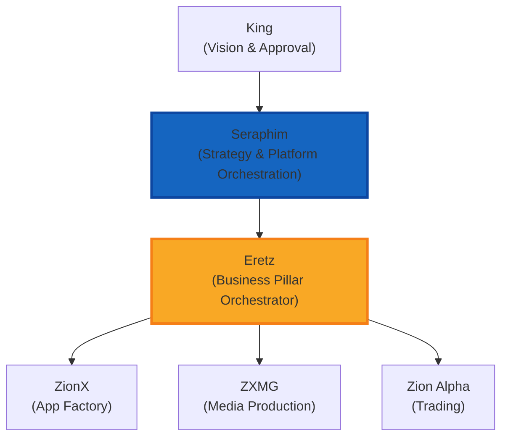

**Chain of Command Flow:**
- **Downward (vision → strategy → directive):** King (vision) → Seraphim (strategy) → Eretz (business execution) → [ZionX | ZXMG | Zion Alpha] → [individual agents]
- **Upward (results → verification → reporting):** [individual agents] → [ZionX | ZXMG | Zion Alpha] → Eretz → Seraphim → King
- **Each level adds intelligence on the way down AND verifies on the way back up**

---

### Directive Enrichment Pipeline

When a directive flows from Seraphim to a subsidiary, Eretz enriches it with business context before forwarding.

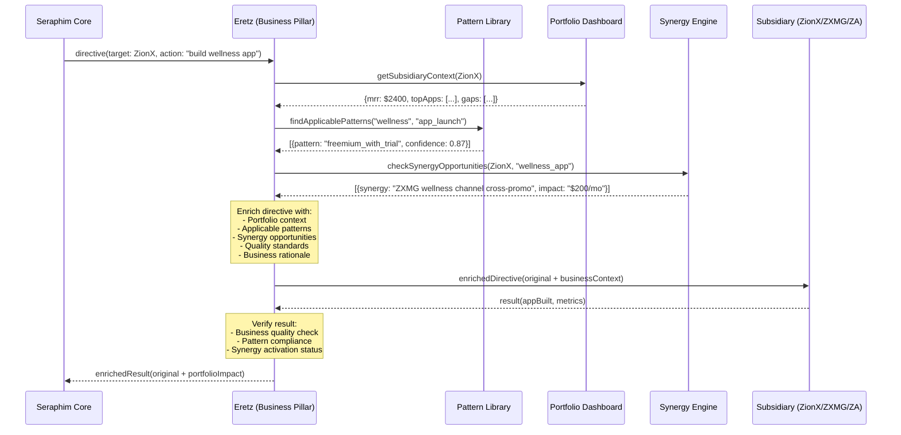

**Directive Enrichment Interface:**

```typescript
interface DirectiveEnrichmentPipeline {
  // Core enrichment
  enrichDirective(directive: Directive): Promise<EnrichedDirective>;
  verifyResult(result: SubsidiaryResult): Promise<VerifiedResult>;

  // Bypass detection
  interceptBypass(directive: Directive): Promise<void>;
}

interface Directive {
  id: string;
  source: string;                    // 'seraphim_core'
  target: string;                    // 'zionx' | 'zxmg' | 'zion_alpha'
  action: string;
  payload: Record<string, unknown>;
  priority: number;
  timestamp: Date;
}

interface EnrichedDirective extends Directive {
  enrichment: {
    portfolioContext: PortfolioContext;
    applicablePatterns: PatternMatch[];
    synergyOpportunities: SynergyOpportunity[];
    qualityStandards: QualityStandard[];
    businessRationale: string;
    trainingContext: string;          // explains WHY this matters to the portfolio
    resourceGuidance: ResourceGuidance;
  };
  enrichedBy: 'eretz';
  enrichedAt: Date;
}

interface VerifiedResult {
  originalResult: SubsidiaryResult;
  verification: {
    businessQualityScore: number;    // 0.0 - 1.0
    qualityIssues: string[];
    portfolioImpact: PortfolioImpact;
    synergyActivationStatus: SynergyStatus[];
    patternComplianceScore: number;
    feedback: StructuredFeedback;    // stored in subsidiary's expertise profile
  };
  approved: boolean;
  remediationRequired?: string[];
}
```

---

### Cross-Business Synergy Engine

The Synergy Engine is the component that prevents the original Eretz failure of "no actual cross-pillar synergy activation."

```typescript
interface EretzSynergyEngine {
  // Detection
  analyzeSynergies(): Promise<SynergyAnalysis>;
  detectSynergy(event: BusinessEvent): Promise<SynergyOpportunity[]>;

  // Activation
  createActivationPlan(synergy: SynergyOpportunity): Promise<SynergyActivationPlan>;
  trackActivation(planId: string): Promise<ActivationStatus>;

  // Standing Rules
  enforceStandingRules(): Promise<RuleEnforcementResult[]>;
  addStandingRule(rule: StandingRule): Promise<string>;
  getStandingRules(): Promise<StandingRule[]>;

  // Dashboard
  getSynergyDashboard(): Promise<SynergyDashboard>;
}

interface SynergyOpportunity {
  id: string;
  type: 'revenue' | 'operational' | 'strategic';
  sourceSubsidiary: string;
  targetSubsidiary: string;
  description: string;
  estimatedRevenueImpact: number;    // monthly USD
  estimatedEffort: string;
  confidence: number;                // 0.0 - 1.0
  detectedAt: Date;
}

interface StandingRule {
  id: string;
  name: string;
  description: string;
  sourceSubsidiary: string;
  targetSubsidiary: string;
  rule: string;                      // e.g., "Every ZXMG video includes ZionX app commercial"
  enforcementType: 'mandatory' | 'recommended';
  complianceCheckMethod: string;
  createdAt: Date;
  createdBy: string;                 // 'king' or 'eretz'
}

interface SynergyDashboard {
  identifiedSynergies: number;
  activatedSynergies: number;
  totalRevenueImpact: number;        // monthly USD from activated synergies
  missedOpportunities: SynergyOpportunity[];
  standingRuleCompliance: Record<string, {
    rule: string;
    complianceRate: number;
    lastChecked: Date;
  }>;
  synergyByType: Record<string, number>;
}
```

**Default Standing Rules (from King's directives):**

| Rule | Source | Target | Enforcement |
|------|--------|--------|-------------|
| Every ZXMG YouTube video includes at least 1 in-video commercial for a ZionX app | ZXMG | ZionX | Mandatory |
| Zion Alpha market insights shared with ZionX for app idea validation | Zion Alpha | ZionX | Recommended |
| ZionX user engagement data shared with ZXMG for content targeting | ZionX | ZXMG | Recommended |
| High-performing ZionX apps get dedicated ZXMG promotional content | ZionX | ZXMG | Mandatory (for apps > $500 MRR) |

---

### Reusable Business Pattern Library

```typescript
interface EretzPatternLibrary {
  // Pattern Management
  extractPattern(source: PatternSource): Promise<BusinessPattern>;
  storePattern(pattern: BusinessPattern): Promise<string>;
  findPatterns(query: PatternQuery): Promise<BusinessPattern[]>;

  // Recommendation
  recommendPattern(subsidiary: string, challenge: string): Promise<PatternRecommendation[]>;

  // Tracking
  trackAdoption(patternId: string, subsidiary: string): Promise<void>;
  updateEffectiveness(patternId: string, outcome: PatternOutcome): Promise<void>;
  getPatternMetrics(): Promise<PatternLibraryMetrics>;
}

interface BusinessPattern {
  id: string;
  name: string;
  category: 'monetization' | 'user_acquisition' | 'retention' | 'content_strategy' | 'market_entry' | 'operational_process';
  description: string;
  sourceSubsidiary: string;          // where it was first proven
  sourceContext: string;             // what situation it solved

  // Pattern details
  steps: PatternStep[];
  prerequisites: string[];
  applicabilityCriteria: string[];   // when to use this pattern
  contraindications: string[];       // when NOT to use this pattern

  // Effectiveness
  confidenceScore: number;           // 0.0 - 1.0, updated from real outcomes
  adoptionCount: number;
  successRate: number;
  averageImpact: Record<string, MetricValue>;

  // Metadata
  createdAt: Date;
  lastUpdated: Date;
  version: string;
}

interface PatternLibraryMetrics {
  totalPatterns: number;
  patternsByCategory: Record<string, number>;
  mostAdoptedPatterns: BusinessPattern[];
  highestImpactPatterns: BusinessPattern[];
  recentExtractions: BusinessPattern[];
  crossSubsidiaryAdoptions: number;  // patterns used outside their source subsidiary
}
```

**Pattern Storage:** Patterns are stored in Zikaron procedural memory with vector embeddings for similarity search. When a subsidiary reports a challenge, Eretz queries the pattern library using semantic similarity to find applicable patterns.

---

### Portfolio Intelligence Dashboard

```typescript
interface EretzPortfolioDashboard {
  // Real-time metrics
  getPortfolioMetrics(): Promise<PortfolioMetrics>;
  getSubsidiaryMetrics(subsidiary: string): Promise<SubsidiaryMetrics>;

  // Reports
  generateWeeklyReport(): Promise<PortfolioReport>;
  getHistoricalTrend(metric: string, period: string): Promise<TrendData>;

  // Alerts
  checkDeclineAlerts(): Promise<DeclineAlert[]>;

  // Strategy
  getPortfolioStrategy(): Promise<PortfolioStrategy>;
}

interface PortfolioMetrics {
  totalMRR: number;
  mrrBySubsidiary: Record<string, number>;
  totalGrowthRate: number;           // month-over-month
  growthBySubsidiary: Record<string, number>;
  portfolioCAC: number;
  portfolioLTV: number;
  portfolioChurn: number;
  totalMarketingSpend: number;
  portfolioROAS: number;
  tradingPnL: number;               // Zion Alpha
  contentRevenue: number;            // ZXMG
  appRevenue: number;                // ZionX
  lastUpdated: Date;
}

interface SubsidiaryMetrics {
  subsidiary: string;
  mrr: number;
  growthRate: number;
  cac: number;
  ltv: number;
  arpu: number;
  churn: number;
  marketingSpend: number;
  roas: number;
  // Subsidiary-specific
  customMetrics: Record<string, MetricValue>;
  benchmarkComparison: Record<string, {
    current: number;
    benchmark: number;
    gap: number;
  }>;
  strategyRecommendation: 'scale' | 'maintain' | 'optimize' | 'deprecate';
  strategyRationale: string;
}

interface DeclineAlert {
  subsidiary: string;
  metric: string;
  currentValue: number;
  previousValue: number;
  declinePercentage: number;
  threshold: number;                 // configured threshold that was exceeded
  severity: 'warning' | 'critical';
  interventionPlan: string;
  recommendationId?: string;         // if already submitted to queue
}

interface PortfolioStrategy {
  subsidiaryStrategies: Record<string, {
    strategy: 'scale' | 'maintain' | 'optimize' | 'deprecate';
    rationale: string;
    keyActions: string[];
    resourceAllocation: number;      // percentage of total budget
  }>;
  portfolioThesis: string;           // overall strategic direction
  topPriorities: string[];
  riskFactors: string[];
  lastReviewed: Date;
}
```

---

### Training Cascade Mechanism

The training cascade ensures each subsidiary agent gets smarter over time through structured feedback from Eretz.

```typescript
interface TrainingCascade {
  // Directive enrichment
  addTrainingContext(directive: Directive, subsidiary: string): Promise<TrainingContext>;

  // Output evaluation
  evaluateBusinessQuality(output: SubsidiaryOutput): Promise<BusinessQualityEvaluation>;

  // Feedback
  generateFeedback(evaluation: BusinessQualityEvaluation): Promise<StructuredFeedback>;
  storeFeedback(feedback: StructuredFeedback, subsidiary: string): Promise<void>;

  // Tracking
  getTrainingEffectiveness(subsidiary: string): Promise<TrainingEffectivenessReport>;
}

interface TrainingContext {
  businessRationale: string;         // WHY this directive matters to the portfolio
  expectedOutcomes: string[];        // what success looks like in business terms
  qualityStandards: QualityStandard[];
  portfolioFit: string;             // how this fits the broader strategy
  relevantPatterns: string[];        // patterns from the library that apply
  learningObjectives: string[];      // what the subsidiary should learn from this
}

interface BusinessQualityEvaluation {
  subsidiary: string;
  outputId: string;
  overallScore: number;              // 0.0 - 1.0
  dimensions: {
    businessAlignment: number;       // does it serve the portfolio strategy?
    qualityStandards: number;        // does it meet Eretz's quality bar?
    synergyAwareness: number;        // did it consider cross-business impact?
    patternCompliance: number;       // did it follow applicable patterns?
    metricAwareness: number;         // does it track the right business metrics?
  };
  strengths: string[];
  improvements: string[];
  approved: boolean;
  remediationRequired: string[];
}

interface TrainingEffectivenessReport {
  subsidiary: string;
  period: string;
  businessDecisionQuality: TrendMetric;
  recommendationAccuracy: TrendMetric;
  autonomousJudgment: TrendMetric;
  synergyAwareness: TrendMetric;
  overallImprovement: number;        // percentage improvement over period
}

interface TrendMetric {
  current: number;
  previous: number;
  trend: 'improving' | 'stable' | 'declining';
  dataPoints: { date: Date; value: number }[];
}
```

---

### Eretz Agent Program

The Eretz agent program defines its state machine, tools, and operational behavior.

```typescript
// Eretz Agent Program State Machine
const eretzStateMachine: StateMachineDefinition = {
  id: 'eretz-business-pillar',
  name: 'Eretz Business Pillar Agent',
  version: '1.0.0',
  states: {
    initializing: { name: 'initializing', type: 'initial' },
    ready: { name: 'ready', type: 'active' },
    enriching_directive: { name: 'enriching_directive', type: 'active' },
    analyzing_synergies: { name: 'analyzing_synergies', type: 'active' },
    reviewing_portfolio: { name: 'reviewing_portfolio', type: 'active' },
    training_subsidiary: { name: 'training_subsidiary', type: 'active' },
    heartbeat_review: { name: 'heartbeat_review', type: 'active' },
    degraded: { name: 'degraded', type: 'active' },
    terminated: { name: 'terminated', type: 'terminal' }
  },
  initialState: 'initializing',
  terminalStates: ['terminated'],
  transitions: [
    { from: 'initializing', to: 'ready', event: 'initialization_complete', gates: [] },
    { from: 'ready', to: 'enriching_directive', event: 'directive_received', gates: [] },
    { from: 'enriching_directive', to: 'ready', event: 'directive_forwarded', gates: [] },
    { from: 'ready', to: 'analyzing_synergies', event: 'synergy_scan_triggered', gates: [] },
    { from: 'analyzing_synergies', to: 'ready', event: 'synergy_analysis_complete', gates: [] },
    { from: 'ready', to: 'reviewing_portfolio', event: 'portfolio_review_triggered', gates: [] },
    { from: 'reviewing_portfolio', to: 'ready', event: 'portfolio_review_complete', gates: [] },
    { from: 'ready', to: 'training_subsidiary', event: 'output_received', gates: [] },
    { from: 'training_subsidiary', to: 'ready', event: 'feedback_delivered', gates: [] },
    { from: 'ready', to: 'heartbeat_review', event: 'heartbeat_triggered', gates: [] },
    { from: 'heartbeat_review', to: 'ready', event: 'heartbeat_complete', gates: [] },
    { from: 'ready', to: 'degraded', event: 'error_detected', gates: [] },
    { from: 'degraded', to: 'ready', event: 'recovery_complete', gates: [] },
    { from: 'ready', to: 'terminated', event: 'terminate', gates: [] }
  ],
  metadata: {
    createdAt: new Date(),
    updatedAt: new Date(),
    description: 'Eretz Business Pillar — master business orchestration agent'
  }
};
```

---

### Eretz Domain Expertise Profile (Seed)

The seed expertise profile for Eretz encodes conglomerate management knowledge:

| Knowledge Category | Seed Content |
|---|---|
| **Conglomerate Strategy** | Portfolio theory (BCG matrix, GE-McKinsey), resource allocation frameworks, subsidiary lifecycle management, diversification vs. focus strategies |
| **Cross-Business Synergy** | Revenue synergy identification frameworks, operational synergy patterns, cross-promotion mechanics, shared services models, platform leverage strategies |
| **Business Pattern Extraction** | Pattern recognition methodologies, generalization techniques, applicability scoring, pattern versioning and evolution |
| **Portfolio Metrics** | MRR tracking, unit economics (CAC/LTV/ARPU/churn), cohort analysis, revenue attribution, ROAS benchmarking |
| **Training & Development** | Capability maturity models, structured feedback frameworks, learning curve analysis, competency assessment |
| **Operational Excellence** | Process standardization, quality management (Six Sigma, lean), compliance frameworks, performance management |
| **Competitive Intelligence** | Competitor analysis frameworks, market positioning, competitive moat identification, industry trend analysis |
| **World-Class Benchmarks** | World-class conglomerate capital allocation strategies, technology conglomerate portfolio management, operational excellence at scale, luxury/brand portfolio management |

---

### Eretz Heartbeat Review Cycle

Eretz's heartbeat review follows the same architecture as other sub-agents (Requirement 21) but focuses on portfolio-level analysis:

| Phase | Eretz-Specific Activities |
|---|---|
| **Research** | Gather current metrics from all subsidiaries, scan for new synergy opportunities, review industry conglomerate strategies |
| **Benchmark** | Compare portfolio performance against world-class conglomerates, compare each subsidiary against its domain benchmarks |
| **Gap Analysis** | Identify portfolio-level gaps (underperforming subsidiaries, missed synergies, unextracted patterns, training deficiencies) |
| **Recommend** | Generate portfolio-level recommendations: resource reallocation, new synergy activations, pattern applications, training interventions, strategy adjustments |

**Default Interval:** Daily (24h) — Eretz needs daily visibility into portfolio performance to catch declining metrics early and activate synergies promptly.

---

### Kiro Integration for Eretz

**Steering File:** `.kiro/steering/eretz-expertise.md`
- Portfolio management expertise and decision frameworks
- Synergy detection frameworks and standing rules
- Business pattern library contents and applicability guides
- Operational authority procedures and quality standards
- Current portfolio metrics and strategy recommendations

**Skill Definition:** `.kiro/skills/eretz-sme.md`
- Conglomerate management expertise activatable during development sessions
- Cross-business synergy analysis capabilities
- Portfolio optimization guidance

**Hook Definitions:**

| Hook | Event | Action | Purpose |
|------|-------|--------|---------|
| `eretz-directive-review` | `preToolUse` (write) | `askAgent` | Review business directives for enrichment opportunities |
| `eretz-synergy-check` | `userTriggered` | `askAgent` | Manually trigger cross-business synergy analysis |
| `eretz-portfolio-review` | `userTriggered` | `askAgent` | Generate portfolio intelligence report |


---

## Reference Ingestion and Quality Baseline System

### Overview

The Reference Ingestion and Quality Baseline System enables SeraphimOS to ingest real-world reference material (mobile apps, YouTube channels), reverse-engineer what makes them world-class, and use that analysis as an enforceable minimum quality standard for all production output. This closes the loop between "knowing what good looks like" and "enforcing that standard automatically."

The system introduces six new components that integrate with the existing architecture:
1. **Reference_Ingestion_Service** — URL intake, type detection, dispatch
2. **App_Store_Analyzer** — App Store/Play Store listing analysis
3. **YouTube_Channel_Analyzer** — YouTube channel and video analysis
4. **Quality_Baseline_Generator** — Converts raw analysis into scored, enforceable baselines
5. **Baseline_Storage** — Versioned persistence in Zikaron procedural memory
6. **Reference_Quality_Gate** — Evaluates output against baselines, produces pass/fail
7. **Auto_Rework_Loop** — Automatic rework routing with escalation after repeated failures

**Design Rationale:** Rather than relying on subjective quality judgments, this system grounds quality standards in empirical analysis of proven references. The monotonic merge strategy ensures standards only rise over time as more references are ingested.

---

### Architecture

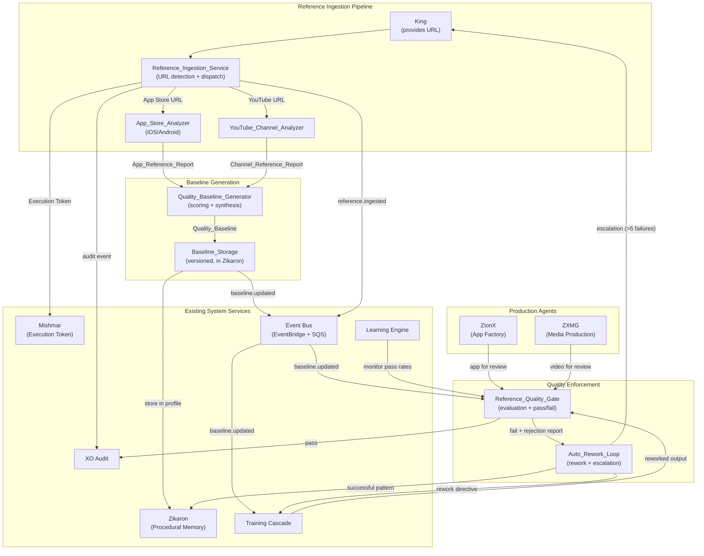

---

### Ingestion Pipeline Flow

```mermaid
sequenceDiagram
    participant King
    participant Mishmar
    participant RIS as Reference_Ingestion_Service
    participant ASA as App_Store_Analyzer
    participant YCA as YouTube_Channel_Analyzer
    participant QBG as Quality_Baseline_Generator
    participant BS as Baseline_Storage
    participant EB as Event Bus
    participant XO as XO Audit

    King->>RIS: ingest(url)
    RIS->>Mishmar: requestExecutionToken()
    Mishmar-->>RIS: ExecutionToken (valid)
    RIS->>RIS: classifyUrl(url)

    alt App Store URL
        RIS->>ASA: analyze(url, platform)
        ASA->>ASA: scrapeMetadata()
        ASA->>ASA: analyzeScreenshots()
        ASA->>ASA: analyzeReviews(min 50)
        ASA->>ASA: inferPatterns()
        ASA-->>RIS: App_Reference_Report
    else YouTube Channel URL
        RIS->>YCA: analyze(url)
        YCA->>YCA: extractChannelMetrics()
        YCA->>YCA: selectVideos(10-20)
        YCA->>YCA: analyzePerVideo()
        YCA->>YCA: synthesizeProductionFormula()
        YCA-->>RIS: Channel_Reference_Report
    else Unsupported URL
        RIS-->>King: Error (unsupported type)
    end

    RIS->>XO: recordIngestionEvent(url, type, timestamp)
    RIS->>QBG: generateBaseline(report)
    QBG->>QBG: scoreDimensions(1-10)
    QBG->>QBG: mergeWithExisting(monotonic)
    QBG-->>BS: storeBaseline(baseline)
    BS->>BS: version + tag
    BS->>EB: publish("baseline.updated")
    RIS->>EB: publish("reference.ingested")
