# Design Document — SeraphimOS Core Platform

## Overview

SeraphimOS is an AI-powered autonomous orchestration platform deployed on AWS. It coordinates a hierarchy of AI agents ("House of Zion") that execute across multiple life and business pillars — app development, media production, trading, and finance — while the primary user (the "King") provides vision and approves key decisions. Seraphim, the top-level orchestrator agent, translates the King's vision into strategy and drives execution across all pillars.

This design addresses the critical failures identified in the March 2026 system audit: governance theater without enforcement, single-point-of-failure execution, flat-file memory with no search, mock data in dashboards, zero testing, and ad-hoc browser automation. Every architectural decision below is informed by the principle that **described-but-not-enforced is equivalent to not existing**.

### Key Design Principles

1. **Enforcement over documentation** — Every governance rule has a runtime enforcement mechanism. No rule exists only on paper.
2. **Stateful agents with persistent memory** — Agents maintain context across sessions through a 4-layer vector-backed memory system.
3. **Declarative state machines** — All entity lifecycles are governed by versioned, declarative state machine definitions with gate enforcement.
4. **Event-driven loose coupling** — Components communicate through an asynchronous event bus, eliminating single points of failure.
5. **Real data only** — Every dashboard metric, every status indicator, every report is backed by live data pipelines. No mock data at any layer.
6. **Test-first at every layer** — The V-model is enforced through CI/CD gates that block deployment without passing tests.
7. **Cost-aware execution** — Intelligent model routing, token budgets, and caching reduce LLM costs by targeting 50% savings.

### Technology Stack Summary

| Layer | Technology | Rationale |
|-------|-----------|-----------|
| **Core Runtime** | TypeScript / Node.js on ECS Fargate | Async-native, strong LLM SDK support, type safety for complex state machines |
| **Memory / Vector** | PostgreSQL (Aurora) + pgvector | Unified relational + vector storage, no separate vector DB to manage, ACID guarantees |
| **Event Bus** | Amazon EventBridge + SQS | Content-based routing (EventBridge) + reliable queue processing (SQS) |
| **IaC** | AWS CDK (TypeScript) | Same language as runtime, type-safe infrastructure, snapshot testing |
| **Dashboard** | React + Vite, hosted on CloudFront/S3 | Fast builds, real-time WebSocket updates via API Gateway |
| **CI/CD** | GitHub Actions + CDK Pipelines | Automated testing, gate verification, staged rollout |
| **Secrets** | AWS Secrets Manager | Credential rotation, no secrets in code or config |
| **Compute** | ECS Fargate (agents), Lambda (event handlers) | Fargate for long-running stateful agents, Lambda for short event-driven tasks |
| **API** | API Gateway (REST + WebSocket) | Managed API layer with auth, throttling, WebSocket for real-time |
| **Monitoring** | CloudWatch + X-Ray | Native AWS observability, distributed tracing |

---

## Architecture

### High-Level System Architecture


```mermaid
graph TB
    subgraph "Interface Layer (Shaar)"
        Dashboard["Web Dashboard<br/>(React + WebSocket)"]
        API["REST/WebSocket API<br/>(API Gateway)"]
        CLI["CLI Client"]
        Voice["Voice Interface"]
        Messaging["iMessage/Email<br/>Adapters"]
    end

    subgraph "Kernel (Seraphim Core)"
        AgentRuntime["Agent Runtime<br/>(ECS Fargate)"]
        StateMachine["State Machine Engine"]
        PermissionSys["Permission System"]
        Lifecycle["Lifecycle Manager"]
        IPC["IPC / Message Router"]
        ResourceAlloc["Resource Allocator"]
    end

    subgraph "System Services"
        Zikaron["Zikaron<br/>(Memory Service)"]
        Mishmar["Mishmar<br/>(Governance Service)"]
        Scheduler["Scheduler Service"]
        EventBus["Event Bus<br/>(EventBridge + SQS)"]
        Otzar["Otzar<br/>(Resource Manager)"]
        XOAudit["XO Audit Service"]
        LearningEngine["Learning Engine"]
    end

    subgraph "Application Layer"
        ZionX["ZionX<br/>(App Factory)"]
        ZXMG["ZXMG<br/>(Media Production)"]
        ZionAlpha["Zion Alpha<br/>(Trading)"]
        OtzarFinance["Otzar Finance<br/>(Pillar)"]
    end

    subgraph "Driver Layer (Adapters)"
        AppStore["App Store Connect"]
        GooglePlay["Google Play Console"]
        YouTube["YouTube API"]
        Kalshi["Kalshi API"]
        Gmail["Gmail API"]
        GitHub["GitHub API"]
        RevenueCat["RevenueCat API"]
        HeyGen["HeyGen API"]
        N8N["n8n Webhooks"]
        LLMProviders["LLM APIs<br/>(Claude, GPT-4o, GPT-4o-mini)"]
        Browser["Browser Automation<br/>(Playwright)"]
    end

    subgraph "Data Layer"
        Aurora["Aurora PostgreSQL<br/>+ pgvector"]
        DynamoDB["DynamoDB<br/>(Event Store)"]
        S3["S3<br/>(Artifacts, Logs)"]
        SecretsManager["Secrets Manager"]
    end

    Dashboard --> API
    CLI --> API
    Voice --> API
    Messaging --> API

    API --> AgentRuntime
    API --> Mishmar

    AgentRuntime --> StateMachine
    AgentRuntime --> PermissionSys
    AgentRuntime --> Lifecycle
    AgentRuntime --> IPC
    AgentRuntime --> ResourceAlloc

    IPC --> EventBus
    AgentRuntime --> Zikaron
    AgentRuntime --> Mishmar
    AgentRuntime --> Otzar
    AgentRuntime --> XOAudit

    Mishmar --> XOAudit
    StateMachine --> XOAudit
    Otzar --> LLMProviders

    ZionX --> AppStore
    ZionX --> GooglePlay
    ZXMG --> YouTube
    ZXMG --> HeyGen
    ZionAlpha --> Kalshi

    Zikaron --> Aurora
    XOAudit --> DynamoDB
    EventBus --> DynamoDB
    AgentRuntime --> S3
    Otzar --> SecretsManager
```

### Deployment Architecture

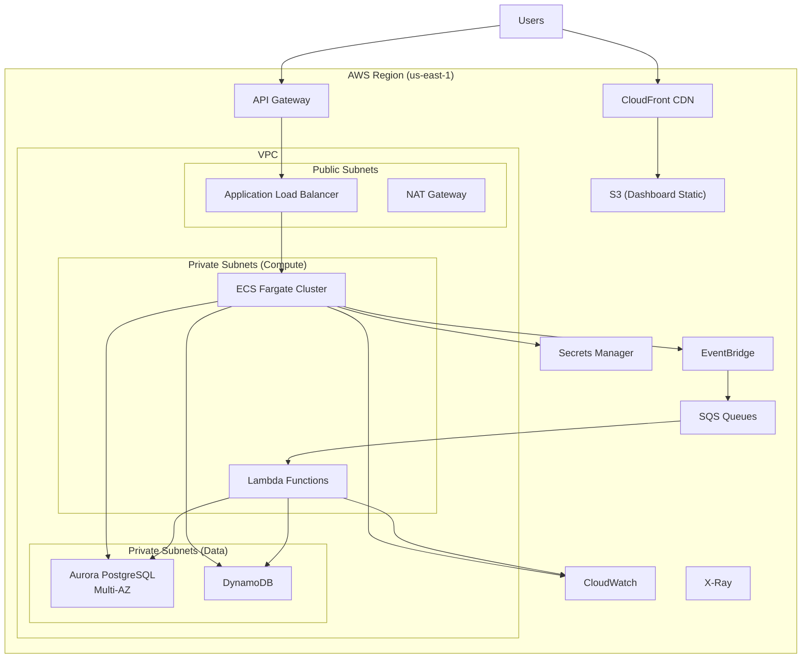
```mermaid
graph TB
    subgraph "AWS Region (us-east-1)"
        subgraph "VPC"
            subgraph "Public Subnets"
                ALB["Application Load Balancer"]
                NAT["NAT Gateway"]
            end

            subgraph "Private Subnets (Compute)"
                ECS["ECS Fargate Cluster"]
                Lambda["Lambda Functions"]
            end

            subgraph "Private Subnets (Data)"
                AuroraCluster["Aurora PostgreSQL<br/>Multi-AZ"]
                DDB["DynamoDB"]
            end
        end

        CF["CloudFront CDN"]
        S3Static["S3 (Dashboard Static)"]
        APIGW["API Gateway"]
        EB["EventBridge"]
        SQS["SQS Queues"]
        SM["Secrets Manager"]
        CW["CloudWatch"]
        XRay["X-Ray"]
    end

    Users["Users"] --> CF
    CF --> S3Static
    Users --> APIGW
    APIGW --> ALB
    ALB --> ECS
    EB --> SQS
    SQS --> Lambda
    ECS --> AuroraCluster
    ECS --> DDB
    ECS --> SM
    ECS --> EB
    Lambda --> AuroraCluster
    Lambda --> DDB
    ECS --> CW
    Lambda --> CW
```

### Layer Interaction Flow

The system follows a strict layered architecture where each layer communicates only with adjacent layers:

1. **Interface → Kernel**: All user commands enter through API Gateway, are authenticated, and routed to the Agent Runtime.
2. **Kernel → System Services**: The Agent Runtime calls Mishmar for authorization, Zikaron for memory, Otzar for resource allocation, and publishes events to the Event Bus.
3. **Kernel → Application**: Agent Programs running in the Agent Runtime execute pillar-specific logic (ZionX, ZXMG, Zion Alpha).
4. **Application → Drivers**: Pillar agents call Drivers through the uniform Driver interface. Drivers handle external service communication.
5. **System Services → Data**: All services persist to Aurora (relational + vector), DynamoDB (events + audit), and S3 (artifacts).

---

## Components and Interfaces

### 1. Agent Runtime (Kernel)

The Agent Runtime is the core execution environment for all agents. Each agent runs as an isolated ECS Fargate task with its own container, memory allocation, and network namespace.

**Interface:**

```typescript
interface AgentRuntime {
  // Lifecycle
  deploy(program: AgentProgram): Promise<AgentInstance>;
  upgrade(agentId: string, newVersion: AgentProgram): Promise<void>;
  terminate(agentId: string, reason: string): Promise<void>;
  
  // Execution
  execute(agentId: string, task: Task): Promise<TaskResult>;
  getState(agentId: string): Promise<AgentState>;
  
  // Registry
  listAgents(filter?: AgentFilter): Promise<AgentInstance[]>;
  getHealth(agentId: string): Promise<HealthStatus>;
}

interface AgentInstance {
  id: string;
  programId: string;
  version: string;
  state: 'initializing' | 'ready' | 'executing' | 'degraded' | 'terminated';
  pillar: string;
  resourceUsage: ResourceMetrics;
  lastHeartbeat: Date;
}
```

### 2. State Machine Engine (Kernel)

Executes declarative state machine definitions. All state transitions are gated and audited.

**Interface:**

```typescript
interface StateMachineEngine {
  // Definition management
  register(definition: StateMachineDefinition): Promise<string>;
  update(definitionId: string, newDef: StateMachineDefinition): Promise<void>;
  
  // Execution
  createInstance(definitionId: string, entityId: string, initialData?: Record<string, unknown>): Promise<StateMachineInstance>;
  transition(instanceId: string, event: string, context: TransitionContext): Promise<TransitionResult>;
  getState(instanceId: string): Promise<StateMachineInstance>;
  
  // Query
  listInstances(filter?: InstanceFilter): Promise<StateMachineInstance[]>;
  getHistory(instanceId: string): Promise<TransitionRecord[]>;
}

interface TransitionResult {
  success: boolean;
  previousState: string;
  newState: string;
  gateResults: GateResult[];
  rejectionReason?: string;
  auditId: string;
}

interface GateResult {
  gateId: string;
  gateName: string;
  passed: boolean;
  details: string;
}
```

### 3. Mishmar — Governance Service

Runtime governance enforcement. Every controlled action passes through Mishmar before execution.

**Interface:**

```typescript
interface MishmarService {
  // Authorization
  authorize(request: AuthorizationRequest): Promise<AuthorizationResult>;
  checkAuthorityLevel(agentId: string, action: string): Promise<AuthorityLevel>;
  
  // Execution Tokens
  requestToken(request: TokenRequest): Promise<ExecutionToken>;
  validateToken(token: ExecutionToken): Promise<boolean>;
  
  // Completion Contracts
  validateCompletion(workflowId: string, outputs: Record<string, unknown>): Promise<CompletionValidationResult>;
  
  // Role Separation
  validateSeparation(workflow: WorkflowContext): Promise<SeparationResult>;
}

interface AuthorizationRequest {
  agentId: string;
  action: string;
  target: string;
  authorityLevel: 'L1' | 'L2' | 'L3' | 'L4';
  context: Record<string, unknown>;
}

interface AuthorizationResult {
  authorized: boolean;
  reason: string;
  escalation?: EscalationRequest;
  auditId: string;
}

interface CompletionValidationResult {
  valid: boolean;
  violations: SchemaViolation[];
  contractId: string;
}
```

### 4. Zikaron — Memory Service

4-layer persistent memory with vector search.

**Interface:**

```typescript
interface ZikaronService {
  // Write
  storeEpisodic(entry: EpisodicEntry): Promise<string>;
  storeSemantic(entry: SemanticEntry): Promise<string>;
  storeProcedural(entry: ProceduralEntry): Promise<string>;
  storeWorking(agentId: string, context: WorkingMemoryContext): Promise<string>;
  
  // Search
  query(request: MemoryQuery): Promise<MemoryResult[]>;
  queryByAgent(agentId: string, query: string, layers?: MemoryLayer[]): Promise<MemoryResult[]>;
  
  // Session
  loadAgentContext(agentId: string): Promise<AgentMemoryContext>;
  
  // Conflict
  flagConflict(entryId: string, conflictingEntryId: string, metadata: ConflictMetadata): Promise<void>;
}

type MemoryLayer = 'episodic' | 'semantic' | 'procedural' | 'working';

interface MemoryQuery {
  text: string;
  layers?: MemoryLayer[];
  agentId?: string;
  tenantId: string;
  limit?: number;
  dateRange?: { start: Date; end: Date };
}

interface MemoryResult {
  id: string;
  layer: MemoryLayer;
  content: string;
  similarity: number;
  metadata: Record<string, unknown>;
  sourceAgentId: string;
  timestamp: Date;
}
```

### 5. Otzar — Resource Manager

Token budgets, cost tracking, and model routing.

**Interface:**

```typescript
interface OtzarService {
  // Model Routing
  routeTask(request: ModelRoutingRequest): Promise<ModelSelection>;
  
  // Budget
  checkBudget(agentId: string, estimatedTokens: number): Promise<BudgetCheckResult>;
  recordUsage(usage: TokenUsage): Promise<void>;
  
  // Cost Reporting
  getCostReport(filter: CostFilter): Promise<CostReport>;
  getDailyOptimizationReport(): Promise<OptimizationReport>;
  
  // Caching
  checkCache(taskPattern: string, inputs: Record<string, unknown>): Promise<CacheResult | null>;
  storeCache(taskPattern: string, inputs: Record<string, unknown>, result: unknown): Promise<void>;
}

interface ModelRoutingRequest {
  taskType: 'code_writing' | 'analysis' | 'simple_query' | 'creative' | 'classification';
  complexity: 'low' | 'medium' | 'high';
  agentId: string;
  pillar: string;
  maxCost?: number;
}

interface ModelSelection {
  provider: 'anthropic' | 'openai';
  model: string;
  estimatedCost: number;
  rationale: string;
}
```

### 6. Event Bus

Asynchronous messaging backbone using EventBridge for routing and SQS for reliable delivery.

**Interface:**

```typescript
interface EventBusService {
  // Publishing
  publish(event: SystemEvent): Promise<string>;
  publishBatch(events: SystemEvent[]): Promise<string[]>;
  
  // Subscription
  subscribe(pattern: EventPattern, handler: EventHandler): Promise<string>;
  unsubscribe(subscriptionId: string): Promise<void>;
  
  // Dead Letter
  getDeadLetterMessages(filter?: DLQFilter): Promise<DeadLetterMessage[]>;
  retryDeadLetter(messageId: string): Promise<void>;
}

interface SystemEvent {
  source: string;
  type: string;
  detail: Record<string, unknown>;
  metadata: {
    tenantId: string;
    correlationId: string;
    timestamp: Date;
  };
}
```

### 7. XO Audit Service

Immutable audit trail for all system actions.

**Interface:**

```typescript
interface XOAuditService {
  // Recording
  recordAction(entry: AuditEntry): Promise<string>;
  recordGovernanceDecision(entry: GovernanceAuditEntry): Promise<string>;
  recordStateTransition(entry: TransitionAuditEntry): Promise<string>;
  
  // Querying
  query(filter: AuditFilter): Promise<AuditRecord[]>;
  
  // Immutability
  verifyIntegrity(recordId: string): Promise<IntegrityResult>;
}

interface AuditFilter {
  agentId?: string;
  timeRange?: { start: Date; end: Date };
  actionType?: string;
  pillar?: string;
  outcome?: 'success' | 'failure' | 'blocked';
  limit?: number;
  cursor?: string;
}
```

### 8. Driver Interface (Uniform Adapter Contract)

Every external service adapter implements this interface.

**Interface:**

```typescript
interface Driver<TConfig = unknown> {
  readonly name: string;
  readonly version: string;
  readonly status: DriverStatus;
  
  connect(config: TConfig): Promise<ConnectionResult>;
  execute(operation: DriverOperation): Promise<DriverResult>;
  verify(operationId: string): Promise<VerificationResult>;
  disconnect(): Promise<void>;
  
  // Health
  healthCheck(): Promise<HealthStatus>;
  
  // Retry built-in
  getRetryPolicy(): RetryPolicy;
}

interface DriverOperation {
  type: string;
  params: Record<string, unknown>;
  timeout?: number;
  idempotencyKey?: string;
}

interface DriverResult {
  success: boolean;
  data?: unknown;
  error?: DriverError;
  retryable: boolean;
  operationId: string;
}

type DriverStatus = 'disconnected' | 'connecting' | 'ready' | 'executing' | 'error';
```

### 9. Learning Engine

Continuous improvement through pattern detection and automated fix generation.

**Interface:**

```typescript
interface LearningEngine {
  // Analysis
  analyzeFailure(failure: FailureEvent): Promise<RootCauseAnalysis>;
  detectPatterns(timeRange: { start: Date; end: Date }): Promise<Pattern[]>;
  
  // Fix Generation
  generateFix(pattern: Pattern): Promise<FixProposal>;
  verifyFix(proposal: FixProposal): Promise<VerificationResult>;
  applyFix(proposal: FixProposal): Promise<ApplyResult>;
  
  // Metrics
  getImprovementMetrics(): Promise<ImprovementMetrics>;
}

interface FixProposal {
  id: string;
  patternId: string;
  targetType: 'agent_program' | 'workflow' | 'gate' | 'driver_config';
  targetId: string;
  changes: VersionedChange[];
  confidence: number;
  estimatedImpact: string;
}

interface ImprovementMetrics {
  repeatFailureRate: number;
  autonomousResolutionRate: number;
  meanTimeToResolution: number;
  fixSuccessRate: number;
  totalFixesApplied: number;
}
```

---

## Data Models

### Agent_Program

The versioned, deployable package defining an agent's behavior.

```typescript
interface AgentProgram {
  id: string;
  name: string;
  version: string;                    // semver
  pillar: string;
  
  // Behavior
  systemPrompt: string;
  tools: ToolDefinition[];
  stateMachine: StateMachineDefinition;
  completionContracts: CompletionContract[];
  
  // Permissions
  authorityLevel: 'L1' | 'L2' | 'L3' | 'L4';
  allowedActions: string[];
  deniedActions: string[];
  
  // Resources
  modelPreference: ModelPreference;
  tokenBudget: { daily: number; monthly: number };
  
  // Testing
  testSuite: TestSuiteReference;
  
  // Metadata
  createdAt: Date;
  updatedAt: Date;
  createdBy: string;
  changelog: ChangelogEntry[];
}

interface ModelPreference {
  preferred: string;           // e.g., 'claude-sonnet-4-20250514'
  fallback: string;            // e.g., 'gpt-4o'
  costCeiling: number;         // max cost per task in USD
  taskTypeOverrides?: Record<string, string>;
}
```

### StateMachineDefinition

Declarative state machine stored as versioned JSON.

```typescript
interface StateMachineDefinition {
  id: string;
  name: string;
  version: string;
  
  states: Record<string, StateDefinition>;
  initialState: string;
  terminalStates: string[];
  
  transitions: TransitionDefinition[];
  
  metadata: {
    createdAt: Date;
    updatedAt: Date;
    description: string;
  };
}

interface StateDefinition {
  name: string;
  type: 'initial' | 'active' | 'terminal' | 'error';
  onEnter?: ActionDefinition[];
  onExit?: ActionDefinition[];
  timeout?: { duration: number; transitionTo: string };
}

interface TransitionDefinition {
  from: string;
  to: string;
  event: string;
  gates: GateDefinition[];
  actions?: ActionDefinition[];
}

interface GateDefinition {
  id: string;
  name: string;
  type: 'condition' | 'approval' | 'validation' | 'external';
  config: Record<string, unknown>;
  required: boolean;
}
```

### Memory Entries (Zikaron)

```typescript
// Base memory entry — all layers share this
interface MemoryEntry {
  id: string;
  tenantId: string;
  layer: MemoryLayer;
  content: string;
  embedding: number[];           // pgvector float array (1536 dimensions)
  sourceAgentId: string;
  tags: string[];
  createdAt: Date;
  expiresAt?: Date;
  conflictsWith?: string[];
}

// Episodic: event history
interface EpisodicEntry extends MemoryEntry {
  layer: 'episodic';
  eventType: string;
  participants: string[];        // agent IDs involved
  outcome: 'success' | 'failure' | 'partial';
  relatedEntities: EntityReference[];
}

// Semantic: facts and relationships
interface SemanticEntry extends MemoryEntry {
  layer: 'semantic';
  entityType: string;
  relationships: Relationship[];
  confidence: number;
  source: 'extracted' | 'manual' | 'inferred';
}

// Procedural: learned workflows
interface ProceduralEntry extends MemoryEntry {
  layer: 'procedural';
  workflowPattern: string;
  successRate: number;
  executionCount: number;
  prerequisites: string[];
  steps: ProcedureStep[];
}

// Working: active task context
interface WorkingMemoryContext extends MemoryEntry {
  layer: 'working';
  agentId: string;
  sessionId: string;
  taskContext: Record<string, unknown>;
  conversationHistory: Message[];
  activeGoals: string[];
}
```

### Audit Records

```typescript
interface AuditRecord {
  id: string;
  tenantId: string;
  timestamp: Date;
  type: 'action' | 'governance' | 'transition' | 'security';
  
  // Actor
  actingAgentId: string;
  actingAgentName: string;
  
  // Action
  actionType: string;
  target: string;
  
  // Authorization chain
  authorizationChain: AuthorizationStep[];
  executionTokens: string[];
  
  // Result
  outcome: 'success' | 'failure' | 'blocked';
  details: Record<string, unknown>;
  
  // Immutability
  hash: string;                  // SHA-256 of record content
  previousHash: string;          // chain integrity
}

interface AuthorizationStep {
  agentId: string;
  level: 'L1' | 'L2' | 'L3' | 'L4';
  decision: 'approved' | 'denied' | 'escalated';
  timestamp: Date;
}
```

### Tenant and User Models

```typescript
interface Tenant {
  id: string;
  name: string;
  type: 'king' | 'queen' | 'platform_user';
  parentTenantId?: string;       // for Queen tenants
  
  // Isolation
  vpcConfig: VPCConfig;
  
  // Resources
  pillars: string[];
  otzarBudget: BudgetConfig;
  
  // Auth
  authProfile: AuthProfile;
  
  createdAt: Date;
  status: 'active' | 'suspended' | 'provisioning';
}

interface AuthProfile {
  userId: string;
  role: 'king' | 'queen' | 'viewer';
  allowedPillars: string[];
  allowedActions: string[];
  authorityLevel: 'L1' | 'L2' | 'L3' | 'L4';
}
```

### Completion Contract

```typescript
interface CompletionContract {
  id: string;
  workflowType: string;
  version: string;
  
  // JSON Schema for required outputs
  outputSchema: JSONSchema;
  
  // Verification steps
  verificationSteps: VerificationStep[];
  
  // Metadata
  description: string;
  createdAt: Date;
}

interface VerificationStep {
  name: string;
  type: 'schema_validation' | 'external_check' | 'agent_verification' | 'automated_test';
  config: Record<string, unknown>;
  required: boolean;
  timeout: number;
}
```

### Database Schema (Aurora PostgreSQL + pgvector)

```sql
-- Enable pgvector extension
CREATE EXTENSION IF NOT EXISTS vector;

-- Agent Programs
CREATE TABLE agent_programs (
  id UUID PRIMARY KEY DEFAULT gen_random_uuid(),
  tenant_id UUID NOT NULL REFERENCES tenants(id),
  name VARCHAR(255) NOT NULL,
  version VARCHAR(50) NOT NULL,
  pillar VARCHAR(100) NOT NULL,
  definition JSONB NOT NULL,          -- full AgentProgram as JSON
  status VARCHAR(50) DEFAULT 'draft',
  created_at TIMESTAMPTZ DEFAULT NOW(),
  updated_at TIMESTAMPTZ DEFAULT NOW(),
  UNIQUE(tenant_id, name, version)
);

-- State Machine Definitions
CREATE TABLE state_machine_definitions (
  id UUID PRIMARY KEY DEFAULT gen_random_uuid(),
  tenant_id UUID NOT NULL REFERENCES tenants(id),
  name VARCHAR(255) NOT NULL,
  version VARCHAR(50) NOT NULL,
  definition JSONB NOT NULL,
  created_at TIMESTAMPTZ DEFAULT NOW(),
  UNIQUE(tenant_id, name, version)
);

-- State Machine Instances
CREATE TABLE state_machine_instances (
  id UUID PRIMARY KEY DEFAULT gen_random_uuid(),
  definition_id UUID NOT NULL REFERENCES state_machine_definitions(id),
  entity_id VARCHAR(255) NOT NULL,
  tenant_id UUID NOT NULL REFERENCES tenants(id),
  current_state VARCHAR(100) NOT NULL,
  data JSONB DEFAULT '{}',
  created_at TIMESTAMPTZ DEFAULT NOW(),
  updated_at TIMESTAMPTZ DEFAULT NOW()
);

-- Memory Entries (with pgvector)
CREATE TABLE memory_entries (
  id UUID PRIMARY KEY DEFAULT gen_random_uuid(),
  tenant_id UUID NOT NULL REFERENCES tenants(id),
  layer VARCHAR(20) NOT NULL CHECK (layer IN ('episodic', 'semantic', 'procedural', 'working')),
  content TEXT NOT NULL,
  embedding vector(1536),             -- OpenAI ada-002 / text-embedding-3-small dimensions
  source_agent_id UUID,
  tags TEXT[] DEFAULT '{}',
  metadata JSONB DEFAULT '{}',
  created_at TIMESTAMPTZ DEFAULT NOW(),
  expires_at TIMESTAMPTZ,
  conflicts_with UUID[]
);

-- HNSW index for fast vector similarity search
CREATE INDEX idx_memory_embedding ON memory_entries
  USING hnsw (embedding vector_cosine_ops)
  WITH (m = 16, ef_construction = 64);

-- Composite indexes for filtered vector search
CREATE INDEX idx_memory_tenant_layer ON memory_entries(tenant_id, layer);
CREATE INDEX idx_memory_agent ON memory_entries(source_agent_id);
CREATE INDEX idx_memory_created ON memory_entries(created_at DESC);

-- Tenants
CREATE TABLE tenants (
  id UUID PRIMARY KEY DEFAULT gen_random_uuid(),
  name VARCHAR(255) NOT NULL,
  type VARCHAR(50) NOT NULL CHECK (type IN ('king', 'queen', 'platform_user')),
  parent_tenant_id UUID REFERENCES tenants(id),
  config JSONB DEFAULT '{}',
  status VARCHAR(50) DEFAULT 'active',
  created_at TIMESTAMPTZ DEFAULT NOW()
);

-- Completion Contracts
CREATE TABLE completion_contracts (
  id UUID PRIMARY KEY DEFAULT gen_random_uuid(),
  tenant_id UUID NOT NULL REFERENCES tenants(id),
  workflow_type VARCHAR(255) NOT NULL,
  version VARCHAR(50) NOT NULL,
  output_schema JSONB NOT NULL,
  verification_steps JSONB NOT NULL,
  created_at TIMESTAMPTZ DEFAULT NOW(),
  UNIQUE(tenant_id, workflow_type, version)
);

-- Token Usage Tracking
CREATE TABLE token_usage (
  id UUID PRIMARY KEY DEFAULT gen_random_uuid(),
  tenant_id UUID NOT NULL REFERENCES tenants(id),
  agent_id UUID NOT NULL,
  pillar VARCHAR(100) NOT NULL,
  provider VARCHAR(50) NOT NULL,
  model VARCHAR(100) NOT NULL,
  input_tokens INTEGER NOT NULL,
  output_tokens INTEGER NOT NULL,
  cost_usd DECIMAL(10, 6) NOT NULL,
  task_type VARCHAR(100),
  created_at TIMESTAMPTZ DEFAULT NOW()
);

CREATE INDEX idx_token_usage_daily ON token_usage(tenant_id, agent_id, created_at);
```

### DynamoDB Tables (Event Store + Audit)

```
Table: seraphim-audit-trail
  Partition Key: tenantId (S)
  Sort Key: timestamp#recordId (S)
  GSI1: actionType-index (actionType, timestamp)
  GSI2: agentId-index (agentId, timestamp)
  GSI3: pillar-index (pillar, timestamp)
  TTL: expiresAt (365 days from creation)
  Stream: Enabled (for real-time audit monitoring)

Table: seraphim-events
  Partition Key: tenantId#source (S)
  Sort Key: timestamp#eventId (S)
  GSI1: eventType-index (eventType, timestamp)
  GSI2: correlationId-index (correlationId, timestamp)
  TTL: expiresAt (90 days)
  Stream: Enabled (for event replay)
```

---

## Model Router (Otzar) — Automatic LLM Selection

The Model Router is the intelligence layer within Otzar that automatically selects the optimal LLM for each task — similar to how Kiro auto-selects models based on cost and performance. No manual model configuration is required. The system learns over time which models perform best for which task types.

### Routing Architecture

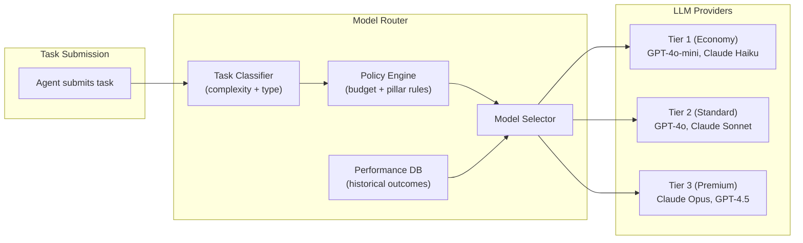
```mermaid
graph LR
    subgraph "Task Submission"
        Agent["Agent submits task"]
    end

    subgraph "Model Router"
        Classifier["Task Classifier<br/>(complexity + type)"]
        PolicyEngine["Policy Engine<br/>(budget + pillar rules)"]
        PerformanceDB["Performance DB<br/>(historical outcomes)"]
        Selector["Model Selector"]
    end

    subgraph "LLM Providers"
        Tier1["Tier 1 (Economy)<br/>GPT-4o-mini, Claude Haiku"]
        Tier2["Tier 2 (Standard)<br/>GPT-4o, Claude Sonnet"]
        Tier3["Tier 3 (Premium)<br/>Claude Opus, GPT-4.5"]
    end

    Agent --> Classifier
    Classifier --> PolicyEngine
    PolicyEngine --> Selector
    PerformanceDB --> Selector
    Selector --> Tier1
    Selector --> Tier2
    Selector --> Tier3
```

### Task Classification

The router classifies each incoming task along two dimensions: **task type** and **complexity**.

**Task Types:**

| Type | Description | Default Tier |
|------|-------------|-------------|
| `summarization` | Condensing text, extracting key points | Tier 1 |
| `classification` | Categorizing inputs, sentiment analysis | Tier 1 |
| `data_extraction` | Parsing structured data from text | Tier 1 |
| `code_generation` | Writing new code, implementing features | Tier 2 |
| `code_review` | Analyzing code for bugs, improvements | Tier 2 |
| `analysis` | Multi-step reasoning about data or situations | Tier 2 |
| `creative` | Content generation, script writing | Tier 2 |
| `novel_reasoning` | Complex problem-solving, architecture decisions | Tier 3 |
| `multi_step_planning` | Workflow design, strategy formulation | Tier 3 |
| `critical_decision` | High-stakes decisions requiring deep reasoning | Tier 3 |

**Complexity Assessment:**

The classifier evaluates complexity using these signals:
1. **Input length** — longer inputs suggest more context to reason about
2. **Output structure** — structured outputs (code, JSON) are harder than free text
3. **Domain specificity** — specialized domains (trading, legal) need stronger models
4. **Historical failure rate** — tasks that previously failed on cheaper models get upgraded
5. **Dependency chain** — tasks with downstream dependencies warrant higher quality

```typescript
interface TaskClassification {
  taskType: TaskType;
  complexity: 'low' | 'medium' | 'high';
  signals: {
    inputTokenEstimate: number;
    outputStructure: 'free_text' | 'structured' | 'code';
    domainSpecificity: number;       // 0.0 - 1.0
    historicalFailureRate: number;   // 0.0 - 1.0 for this task pattern
    downstreamDependencies: number;  // count of dependent tasks
  };
  recommendedTier: 1 | 2 | 3;
}
```

### Routing Decision Flow

```typescript
interface ModelRoutingDecision {
  // Input
  task: TaskClassification;
  agentBudget: BudgetState;
  pillarPolicy: PillarRoutingPolicy;
  
  // Decision
  selectedModel: string;
  selectedTier: 1 | 2 | 3;
  estimatedCost: number;
  
  // Rationale (logged for learning)
  rationale: {
    classificationReason: string;
    budgetImpact: string;
    policyOverrides: string[];
    performanceHistory: string;
  };
}
```

**Decision algorithm:**

1. **Classify** the task type and complexity
2. **Check budget** — if the agent/pillar is near budget limit, downgrade tier (unless task is `critical_decision`)
3. **Check pillar policy** — each pillar can set minimum/maximum tiers and cost-quality tradeoffs
4. **Check performance history** — if this task pattern has a >20% failure rate on the recommended tier, upgrade one tier
5. **Select model** — pick the best available model in the selected tier
6. **Log decision** — record the full rationale for the learning engine

### Adaptive Learning

The router improves over time by tracking outcomes:

```typescript
interface ModelPerformanceRecord {
  taskType: TaskType;
  complexity: 'low' | 'medium' | 'high';
  model: string;
  tier: 1 | 2 | 3;
  
  // Outcome
  success: boolean;
  qualityScore: number;          // 0.0 - 1.0 (from completion contract validation)
  latencyMs: number;
  tokenCost: number;
  
  // Context
  agentId: string;
  pillar: string;
  timestamp: Date;
}
```

The learning loop:
1. Every task execution records a `ModelPerformanceRecord`
2. A nightly batch job aggregates performance by (taskType, complexity, model)
3. The aggregated stats update the routing weights
4. Models that consistently fail for a task type get deprioritized
5. Models that deliver high quality at lower cost get promoted

### Pillar-Level Configuration

Each pillar can configure cost-quality tradeoffs:

```typescript
interface PillarRoutingPolicy {
  pillarId: string;
  
  // Cost vs Quality
  costSensitivity: 'aggressive' | 'balanced' | 'quality_first';
  
  // Tier constraints
  minimumTier?: 1 | 2 | 3;      // never go below this tier
  maximumTier?: 1 | 2 | 3;      // never exceed this tier
  
  // Task-specific overrides
  taskOverrides?: Record<TaskType, {
    forceTier?: 1 | 2 | 3;
    forceModel?: string;
  }>;
  
  // Budget
  dailyBudgetUsd: number;
  monthlyBudgetUsd: number;
}
```

**Example configurations:**

- **Zion Alpha (Trading):** `costSensitivity: 'quality_first'`, `minimumTier: 2` — trading decisions need reliable reasoning, never use economy models
- **ZXMG (Media):** `costSensitivity: 'balanced'` — script generation can use Tier 2, metadata extraction uses Tier 1
- **ZionX (App Factory):** `costSensitivity: 'balanced'`, code_generation tasks forced to Tier 2 minimum — code quality matters for App Store approval

### Caching Layer

The router includes a semantic cache to avoid redundant LLM calls:

```typescript
interface TaskCache {
  // Cache key: hash of (taskType + normalized input)
  lookup(taskType: string, input: Record<string, unknown>): Promise<CachedResult | null>;
  store(taskType: string, input: Record<string, unknown>, result: unknown, ttl: number): Promise<void>;
  
  // Cache stats
  getHitRate(): Promise<number>;
  getEstimatedSavings(): Promise<number>;
}
```

Cache strategy:
- **Classification tasks** — high cache hit rate, TTL 24 hours
- **Data extraction** — cacheable when inputs are identical, TTL 1 hour
- **Code generation** — low cache hit rate, cache only for identical prompts, TTL 30 minutes
- **Novel reasoning** — not cached (each invocation is unique)

---

## Security Architecture

### Authentication and Authorization Flow

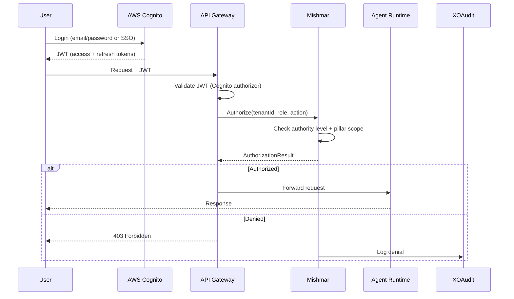
```mermaid
sequenceDiagram
    participant User
    participant Cognito as AWS Cognito
    participant APIGW as API Gateway
    participant Mishmar
    participant Agent as Agent Runtime

    User->>Cognito: Login (email/password or SSO)
    Cognito-->>User: JWT (access + refresh tokens)
    User->>APIGW: Request + JWT
    APIGW->>APIGW: Validate JWT (Cognito authorizer)
    APIGW->>Mishmar: Authorize(tenantId, role, action)
    Mishmar->>Mishmar: Check authority level + pillar scope
    Mishmar-->>APIGW: AuthorizationResult
    alt Authorized
        APIGW->>Agent: Forward request
        Agent-->>User: Response
    else Denied
        APIGW-->>User: 403 Forbidden
        Mishmar->>XOAudit: Log denial
    end
```

### Security Layers

| Layer | Mechanism | Implementation |
|-------|-----------|---------------|
| **Network** | VPC isolation per tenant, private subnets for compute/data | AWS VPC, Security Groups, NACLs |
| **Identity** | User authentication with MFA | AWS Cognito User Pools |
| **API** | JWT validation, rate limiting, WAF | API Gateway + Cognito Authorizer |
| **Service** | IAM roles per service, least-privilege | ECS Task Roles, Lambda Execution Roles |
| **Data** | Encryption at rest (AES-256) and in transit (TLS 1.3) | AWS KMS, Aurora encryption, S3 SSE |
| **Secrets** | Centralized credential management with rotation | AWS Secrets Manager |
| **Audit** | Immutable audit trail with hash chain integrity | DynamoDB with hash chaining |
| **Governance** | Runtime authority enforcement | Mishmar service |

### Credential Management

All external service credentials follow this lifecycle:

1. **Storage**: AWS Secrets Manager with automatic encryption
2. **Access**: Only the Driver service IAM role can read credentials; agents never see raw credentials
3. **Rotation**: Configurable schedule (default 90 days) with zero-downtime rotation
4. **Audit**: Every credential access is logged to XO Audit

```typescript
interface CredentialManager {
  getCredential(driverName: string, credentialKey: string): Promise<string>;
  rotateCredential(driverName: string): Promise<RotationResult>;
  getRotationSchedule(): Promise<RotationSchedule[]>;
}
```

### Tenant Isolation

Each tenant operates in a logically isolated environment:

- **Data isolation**: Row-level security in Aurora using `tenant_id` on every table; DynamoDB partition keys include `tenantId`
- **Network isolation**: Separate VPC security groups per tenant tier (shared infrastructure for economy tenants, dedicated VPC for premium)
- **Compute isolation**: ECS tasks tagged with tenant ID; resource limits enforced per tenant
- **Memory isolation**: Zikaron queries always filter by `tenant_id`; cross-tenant memory access requires explicit Mishmar authorization

---

## Event-Driven Communication Patterns

### Event Flow Architecture

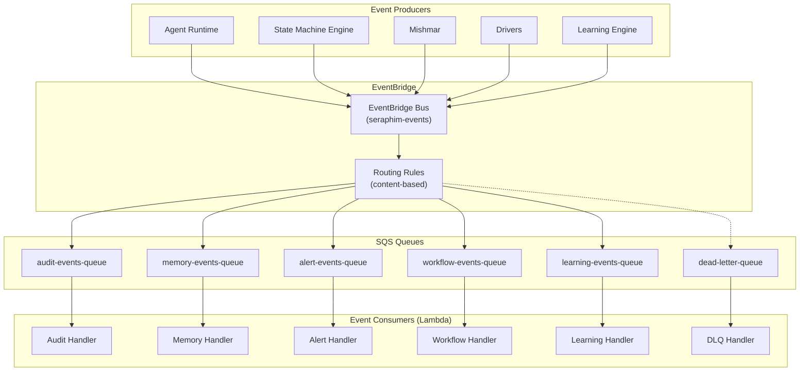
```mermaid
graph TB
    subgraph "Event Producers"
        AR["Agent Runtime"]
        SM["State Machine Engine"]
        MI["Mishmar"]
        DR["Drivers"]
        LE["Learning Engine"]
    end

    subgraph "EventBridge"
        EB["EventBridge Bus<br/>(seraphim-events)"]
        Rules["Routing Rules<br/>(content-based)"]
    end

    subgraph "SQS Queues"
        AuditQ["audit-events-queue"]
        MemoryQ["memory-events-queue"]
        AlertQ["alert-events-queue"]
        WorkflowQ["workflow-events-queue"]
        LearningQ["learning-events-queue"]
        DLQ["dead-letter-queue"]
    end

    subgraph "Event Consumers (Lambda)"
        AuditHandler["Audit Handler"]
        MemoryHandler["Memory Handler"]
        AlertHandler["Alert Handler"]
        WorkflowHandler["Workflow Handler"]
        LearningHandler["Learning Handler"]
        DLQHandler["DLQ Handler"]
    end

    AR --> EB
    SM --> EB
    MI --> EB
    DR --> EB
    LE --> EB

    EB --> Rules
    Rules --> AuditQ
    Rules --> MemoryQ
    Rules --> AlertQ
    Rules --> WorkflowQ
    Rules --> LearningQ
    Rules -.-> DLQ

    AuditQ --> AuditHandler
    MemoryQ --> MemoryHandler
    AlertQ --> AlertHandler
    WorkflowQ --> WorkflowHandler
    LearningQ --> LearningHandler
    DLQ --> DLQHandler
```

### Event Schema

All events follow a standard envelope:

```typescript
interface SeraphimEvent {
  id: string;                        // UUID
  source: string;                    // e.g., 'seraphim.agent-runtime'
  type: string;                      // e.g., 'agent.state.changed'
  version: '1.0';
  time: string;                      // ISO 8601
  tenantId: string;
  correlationId: string;             // traces related events
  
  detail: Record<string, unknown>;   // event-specific payload
  
  metadata: {
    schemaVersion: string;
    producerVersion: string;
  };
}
```

### Key Event Types

| Event Type | Source | Consumers | Purpose |
|-----------|--------|-----------|---------|
| `agent.state.changed` | Agent Runtime | Audit, Dashboard, Learning | Agent lifecycle transitions |
| `agent.task.completed` | Agent Runtime | Memory, Learning, Workflow | Task completion with results |
| `agent.task.failed` | Agent Runtime | Audit, Learning, Alert | Task failure for analysis |
| `governance.action.blocked` | Mishmar | Audit, Alert | Authority violation detected |
| `governance.escalation.created` | Mishmar | Alert, Dashboard | Escalation needs attention |
| `state.transition.completed` | State Machine | Audit, Workflow | State machine advanced |
| `state.transition.rejected` | State Machine | Audit, Alert | Gate check failed |
| `driver.operation.completed` | Driver | Workflow, Audit | External operation finished |
| `driver.operation.failed` | Driver | Alert, Learning, Audit | External operation failed |
| `budget.threshold.exceeded` | Otzar | Alert, Dashboard | Budget limit approaching |
| `learning.pattern.detected` | Learning Engine | Dashboard, Audit | Recurring pattern found |
| `learning.fix.applied` | Learning Engine | Audit, Dashboard | Automated fix deployed |
| `memory.conflict.detected` | Zikaron | Alert, Dashboard | Conflicting memory entries |

### Message Ordering and Delivery Guarantees

- **EventBridge**: Content-based routing with at-least-once delivery
- **SQS**: FIFO queues for ordering-sensitive events (state transitions, audit); standard queues for everything else
- **Dead Letter Queue**: Messages that fail processing after 3 retries are routed to DLQ with full context
- **Idempotency**: All event handlers are idempotent using the event `id` as a deduplication key
- **Schema Validation**: EventBridge input transformers validate event schema before routing; malformed events are rejected and logged

---

## Error Handling

### Error Classification

All errors in SeraphimOS are classified into categories that determine the handling strategy:

| Category | Description | Handling Strategy | Example |
|----------|-------------|-------------------|---------|
| **Transient** | Temporary failures that resolve on retry | Exponential backoff retry (max 3 attempts) | Network timeout, throttling, service unavailable |
| **Operational** | Expected failure conditions in normal operation | Handle gracefully, log, continue | Budget exceeded, gate check failed, auth denied |
| **Systemic** | Infrastructure or configuration failures | Alert, failover, escalate | Database connection lost, secret rotation failed |
| **Logic** | Bugs in agent programs or workflow definitions | Log, halt workflow, notify Learning Engine | Invalid state transition, schema mismatch |
| **External** | Third-party service failures | Retry with backoff, then degrade gracefully | App Store API down, LLM provider outage |

### Error Handling by Layer

**Kernel (Agent Runtime):**
- Agent crashes → transition to `degraded` state, log to XO Audit, attempt restart with last known good state
- State machine deadlock → timeout detection (configurable per state), force transition to error state
- Permission violation → block action, log violation, notify Mishmar

**System Services:**
- Mishmar unavailable → fail-closed (deny all controlled actions until Mishmar recovers)
- Zikaron unavailable → agents operate with working memory only, queue memory writes for replay
- Otzar unavailable → fail-closed on budget checks (block new LLM calls until Otzar recovers)
- Event Bus unavailable → local event buffer with replay on recovery (max 1000 events, 5 minute buffer)

**Driver Layer:**
- Connection failure → exponential backoff retry (1s, 2s, 4s, 8s, 16s), max 5 attempts
- Authentication failure → attempt credential refresh from Secrets Manager, then fail
- Rate limiting → respect `Retry-After` headers, queue operations
- Service degradation → circuit breaker pattern (open after 5 consecutive failures, half-open after 60s)

**Data Layer:**
- Aurora failover → automatic Multi-AZ failover (< 30s), connection pool retry
- DynamoDB throttling → automatic retry with exponential backoff (AWS SDK built-in)
- S3 errors → retry with backoff, fall back to local buffer for critical writes

### Circuit Breaker Pattern

Drivers and external service calls use circuit breakers to prevent cascade failures:

```typescript
interface CircuitBreaker {
  state: 'closed' | 'open' | 'half_open';
  failureCount: number;
  failureThreshold: number;          // default: 5
  resetTimeout: number;              // default: 60000ms
  
  execute<T>(operation: () => Promise<T>): Promise<T>;
  getState(): CircuitBreakerState;
}
```

States:
- **Closed** (normal): Requests pass through. Failures increment counter.
- **Open** (tripped): All requests immediately fail with `CircuitOpenError`. Timer starts.
- **Half-Open** (testing): One request allowed through. Success → Closed. Failure → Open.

### Failover Strategy

For core services (Seraphim_Core, Mishmar, Zikaron, Event_Bus):

1. **Health checks**: Every 10 seconds via ECS health check + custom `/health` endpoint
2. **Detection**: CloudWatch alarm triggers after 3 consecutive failed health checks (30 seconds)
3. **Failover**: ECS replaces unhealthy task with new task from same task definition
4. **Recovery**: New task loads state from Aurora/DynamoDB, resumes processing
5. **Notification**: Alert sent through Shaar within 60 seconds of detection
6. **Target**: Failover completes within 120 seconds (Requirement 15.5)

### Graceful Degradation Hierarchy

When components fail, the system degrades gracefully rather than failing completely:

1. **Full operation** — all services healthy
2. **Reduced intelligence** — Zikaron down: agents work without memory context, queue writes
3. **Reduced autonomy** — Mishmar down: all actions require manual approval (fail-closed)
4. **Reduced throughput** — Otzar down: no new LLM calls, cached results still served
5. **Read-only mode** — Event Bus down: queries work, no new workflows start
6. **Emergency mode** — Core down: Shaar displays last known state, alerts King


---

## Autonomous SME and Self-Improvement Architecture

### Overview

This section defines the architecture for transforming each sub-agent from a task executor into a world-class Subject Matter Expert that autonomously researches its domain, benchmarks against the best in the world, identifies the path to get there, and tells the King exactly what needs to happen. The core paradigm shift: **the King provides vision, Seraphim formulates strategy, and domain agents drive execution with world-class expertise.**

### Design Principles

1. **Research-first autonomy** — Agents don't wait for instructions. They research what the best in the world are doing, figure out the gap, and propose how to close it.
2. **Structured recommendations over raw output** — Every recommendation follows a standard format: world-class benchmark → current state → gap → action plan → expected impact.
3. **Approval gates, not permission gates** — Agents have full autonomy to research and propose. The King's role is vision and approval, not strategy or ideation. Seraphim translates vision into strategy; domain agents translate strategy into action plans.
4. **Continuous knowledge accumulation** — Domain expertise profiles grow over time through research, execution outcomes, and cross-domain learning.
5. **Measurable progress** — Every domain tracks its distance from world-class performance with concrete metrics.

---

### Autonomous Review Loop Architecture

The heartbeat review cycle is the core mechanism that makes each sub-agent proactive.

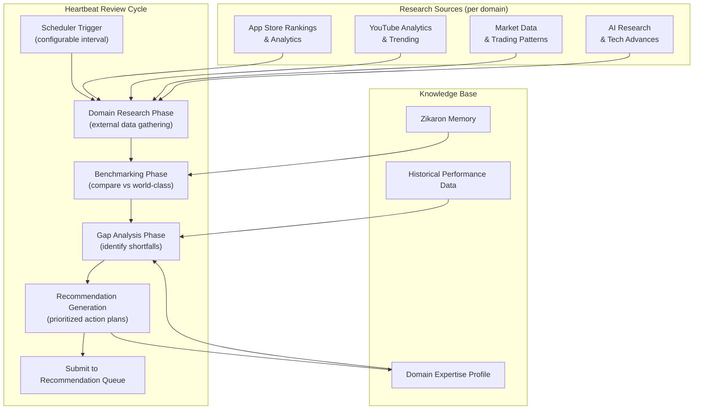
```mermaid
graph TB
    subgraph "Heartbeat Review Cycle"
        Trigger["Scheduler Trigger<br/>(configurable interval)"]
        Research["Domain Research Phase<br/>(external data gathering)"]
        Benchmark["Benchmarking Phase<br/>(compare vs world-class)"]
        GapAnalysis["Gap Analysis Phase<br/>(identify shortfalls)"]
        Recommend["Recommendation Generation<br/>(prioritized action plans)"]
        Submit["Submit to Recommendation Queue"]
    end

    subgraph "Research Sources (per domain)"
        AppStores["App Store Rankings<br/>& Analytics"]
        YouTube["YouTube Analytics<br/>& Trending"]
        Markets["Market Data<br/>& Trading Patterns"]
        AIResearch["AI Research<br/>& Tech Advances"]
    end

    subgraph "Knowledge Base"
        Zikaron["Zikaron Memory"]
        ExpertiseProfile["Domain Expertise Profile"]
        HistoricalPerf["Historical Performance Data"]
    end

    Trigger --> Research
    Research --> Benchmark
    Benchmark --> GapAnalysis
    GapAnalysis --> Recommend
    Recommend --> Submit

    AppStores --> Research
    YouTube --> Research
    Markets --> Research
    AIResearch --> Research

    Zikaron --> Benchmark
    ExpertiseProfile --> GapAnalysis
    HistoricalPerf --> GapAnalysis

    Recommend --> ExpertiseProfile
```

**Heartbeat Scheduler Interface:**

```typescript
interface HeartbeatScheduler {
  // Configuration
  configure(agentId: string, config: HeartbeatConfig): Promise<void>;
  getConfig(agentId: string): Promise<HeartbeatConfig>;

  // Execution
  triggerReview(agentId: string): Promise<HeartbeatReviewResult>;
  getLastReview(agentId: string): Promise<HeartbeatReviewResult | null>;
  getReviewHistory(agentId: string, limit?: number): Promise<HeartbeatReviewResult[]>;
}

interface HeartbeatConfig {
  agentId: string;
  intervalMs: number;                // default varies by domain
  researchDepth: 'shallow' | 'standard' | 'deep';
  maxResearchBudgetUsd: number;      // LLM cost cap per review cycle
  enabled: boolean;
  researchSources: ResearchSource[];
}

interface HeartbeatReviewResult {
  id: string;
  agentId: string;
  domain: string;
  timestamp: Date;
  durationMs: number;
  costUsd: number;

  // Analysis
  currentStateAssessment: DomainAssessment;
  worldClassBenchmarks: Benchmark[];
  gapAnalysis: GapAnalysisEntry[];
  recommendations: Recommendation[];

  // Metadata
  researchSourcesUsed: string[];
  confidenceScore: number;           // 0.0 - 1.0
}

interface DomainAssessment {
  domain: string;
  metrics: Record<string, MetricValue>;
  strengths: string[];
  weaknesses: string[];
  overallScore: number;              // 0.0 - 1.0
}

interface Benchmark {
  name: string;                      // e.g., "Top 10 Meditation Apps Average"
  source: string;
  metrics: Record<string, MetricValue>;
  lastUpdated: Date;
}

interface GapAnalysisEntry {
  metric: string;
  currentValue: MetricValue;
  worldClassValue: MetricValue;
  gapPercentage: number;
  priority: number;                  // 1-10
  closingStrategy: string;
}

interface MetricValue {
  value: number;
  unit: string;
  context?: string;
}
```

**Default Heartbeat Intervals:**

| Sub-Agent | Default Interval | Rationale |
|-----------|-----------------|-----------|
| Seraphim Core | Weekly (168h) | Architecture improvements and V-model audits are larger-scope; weekly self-assessment is sufficient |
| Eretz | Daily (24h) | Portfolio metrics and synergy opportunities need daily visibility; declining subsidiaries must be caught early |
| ZionX | Daily (24h) | App market trends shift daily; ASO and competitor analysis benefit from daily cadence |
| ZXMG | Daily (24h) | Content trends and algorithm signals change daily; posting cadence optimization needs daily data |
| Zion Alpha | Hourly (1h) | Prediction markets move fast; strategy adjustments need near-real-time analysis |

---

### SME Knowledge Base Design

Each sub-agent maintains a Domain Expertise Profile — a structured, evolving knowledge base that represents the agent's accumulated domain expertise.

```typescript
interface DomainExpertiseProfile {
  agentId: string;
  domain: string;
  version: string;                   // incremented on each update
  lastUpdated: Date;

  // Core Knowledge
  knowledgeBase: KnowledgeEntry[];
  competitiveIntelligence: CompetitiveIntel[];
  decisionFrameworks: DecisionFramework[];
  qualityBenchmarks: QualityBenchmark[];
  industryBestPractices: BestPractice[];

  // Learned Patterns
  learnedPatterns: LearnedPattern[];
  failurePatterns: FailurePattern[];
  successPatterns: SuccessPattern[];

  // Research State
  lastResearchCycle: Date;
  researchBacklog: ResearchTopic[];
  knowledgeGaps: string[];
}

interface KnowledgeEntry {
  id: string;
  topic: string;
  content: string;
  source: string;
  confidence: number;                // 0.0 - 1.0
  lastVerified: Date;
  tags: string[];
  contradicts?: string[];            // IDs of contradicting entries
}

interface CompetitiveIntel {
  competitor: string;                // e.g., "Calm (meditation app)" or "top YouTube channel"
  domain: string;
  metrics: Record<string, MetricValue>;
  strategies: string[];
  strengths: string[];
  weaknesses: string[];
  lastUpdated: Date;
}

interface DecisionFramework {
  name: string;                      // e.g., "App Monetization Model Selection"
  description: string;
  inputs: string[];
  decisionTree: DecisionNode[];
  historicalAccuracy: number;
  lastCalibrated: Date;
}

interface DecisionNode {
  condition: string;
  trueAction: string | DecisionNode;
  falseAction: string | DecisionNode;
}

interface LearnedPattern {
  id: string;
  pattern: string;
  context: string;
  outcome: 'positive' | 'negative' | 'neutral';
  confidence: number;
  occurrences: number;
  firstObserved: Date;
  lastObserved: Date;
}
```

**Domain-Specific Research Sources:**

| Sub-Agent | Research Sources | Data Extracted |
|-----------|----------------|----------------|
| Eretz | Subsidiary performance data (via Portfolio Dashboard), conglomerate strategy research (via LLM + browser driver), cross-business event streams (via Event Bus), industry benchmarks (via browser driver) | Portfolio MRR, growth rates, unit economics, synergy opportunities, pattern extraction candidates, conglomerate management best practices |
| ZionX | App Store rankings (via App Store Connect & Google Play drivers), SensorTower/AppAnnie data (via browser driver), competitor app reviews, app category trend reports | Revenue benchmarks, download trends, retention curves, ASO keywords, monetization models, UI/UX patterns |
| ZXMG | YouTube Analytics API, Social Blade data (via browser driver), trending topics APIs, platform creator documentation, top-channel analysis | View counts, engagement rates, audience retention curves, thumbnail CTR, posting cadence, algorithm signals |
| Zion Alpha | Kalshi/Polymarket historical data (via trading drivers), prediction market research, financial data feeds, event outcome databases | Win rates, ROI by strategy, market liquidity patterns, event correlation data, risk-adjusted returns |
| Seraphim Core | AI research feeds (arXiv, Hugging Face), cloud provider blogs, framework changelogs, autonomous agent research, LLM benchmark leaderboards | New model capabilities, infrastructure patterns, cost optimization techniques, agent architecture advances |

**Knowledge Base Storage:**

Domain Expertise Profiles are stored in Zikaron across two layers:
- **Semantic memory**: Individual knowledge entries, competitive intelligence, and research findings — searchable via vector similarity
- **Procedural memory**: Decision frameworks, learned patterns, and best practices — loaded into agent working context on initialization

---

### Recommendation Engine Design

The Recommendation Engine is the central service that manages the flow from agent research to King approval to autonomous execution.

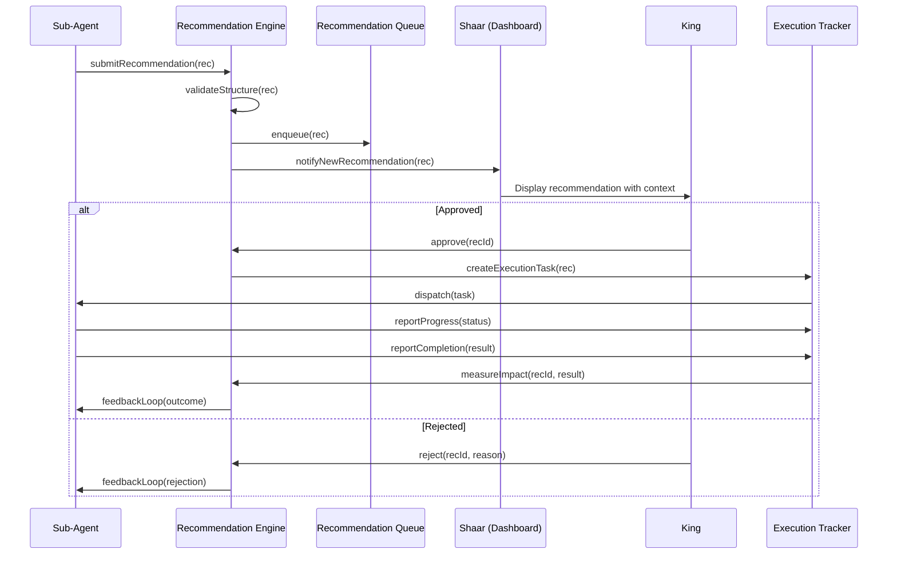
```mermaid
sequenceDiagram
    participant Agent as Sub-Agent
    participant RE as Recommendation Engine
    participant RQ as Recommendation Queue
    participant Shaar as Shaar (Dashboard)
    participant King as King
    participant Exec as Execution Tracker

    Agent->>RE: submitRecommendation(rec)
    RE->>RE: validateStructure(rec)
    RE->>RQ: enqueue(rec)
    RE->>Shaar: notifyNewRecommendation(rec)
    Shaar->>King: Display recommendation with context

    alt Approved
        King->>RE: approve(recId)
        RE->>Exec: createExecutionTask(rec)
        Exec->>Agent: dispatch(task)
        Agent->>Exec: reportProgress(status)
        Agent->>Exec: reportCompletion(result)
        Exec->>RE: measureImpact(recId, result)
        RE->>Agent: feedbackLoop(outcome)
    else Rejected
        King->>RE: reject(recId, reason)
        RE->>Agent: feedbackLoop(rejection)
    end
```

**Recommendation Engine Interface:**

```typescript
interface RecommendationEngine {
  // Submission
  submit(recommendation: Recommendation): Promise<string>;
  validateStructure(recommendation: Recommendation): Promise<ValidationResult>;

  // Queue Management
  getPending(filter?: RecommendationFilter): Promise<Recommendation[]>;
  getByDomain(domain: string): Promise<Recommendation[]>;
  getSummary(): Promise<RecommendationSummary>;

  // Approval Workflow
  approve(recommendationId: string, notes?: string): Promise<ExecutionTask>;
  reject(recommendationId: string, reason: string): Promise<void>;
  batchApprove(recommendationIds: string[]): Promise<ExecutionTask[]>;
  batchReject(recommendationIds: string[], reason: string): Promise<void>;

  // Execution Tracking
  getExecutionStatus(recommendationId: string): Promise<ExecutionStatus>;
  measureImpact(recommendationId: string, actualOutcome: Record<string, MetricValue>): Promise<ImpactAssessment>;

  // Feedback
  getOutcomeHistory(agentId: string): Promise<RecommendationOutcome[]>;
  getCalibrationReport(agentId: string): Promise<CalibrationReport>;
}

interface Recommendation {
  id: string;
  agentId: string;
  domain: string;
  priority: number;                  // 1-10
  submittedAt: Date;

  // The core structure: benchmark → current → gap → plan
  worldClassBenchmark: {
    description: string;
    source: string;
    metrics: Record<string, MetricValue>;
  };
  currentState: {
    description: string;
    metrics: Record<string, MetricValue>;
  };
  gapAnalysis: {
    description: string;
    gapPercentage: number;
    keyGaps: string[];
  };
  actionPlan: {
    summary: string;
    steps: ActionStep[];
    estimatedEffort: string;         // e.g., "2 days", "1 week"
    estimatedImpact: Record<string, MetricValue>;
    requiresCodeChanges: boolean;
    requiresBudget: number;          // USD
  };

  // Risk
  riskAssessment: {
    level: 'low' | 'medium' | 'high';
    risks: string[];
    mitigations: string[];
  };
  rollbackPlan: string;

  // Status
  status: 'pending' | 'approved' | 'rejected' | 'executing' | 'completed' | 'failed';
  rejectionReason?: string;
  executionTaskId?: string;
  actualOutcome?: Record<string, MetricValue>;
}

interface ActionStep {
  order: number;
  description: string;
  type: 'research' | 'code_change' | 'configuration' | 'driver_operation' | 'analysis';
  estimatedDuration: string;
  dependencies: number[];            // order numbers of prerequisite steps
}

interface RecommendationSummary {
  pendingByDomain: Record<string, number>;
  approvedInProgress: number;
  completedWithImpact: number;
  rejectedCount: number;
  averageEstimateAccuracy: number;   // how close estimates are to actual outcomes
  pathToWorldClass: Record<string, {
    currentScore: number;
    targetScore: number;
    progressPercentage: number;
    topRecommendations: string[];
  }>;
}

interface CalibrationReport {
  agentId: string;
  totalRecommendations: number;
  approvalRate: number;
  implementationSuccessRate: number;
  averageImpactAccuracy: number;     // estimated vs actual
  commonRejectionReasons: string[];
  improvementTrend: number[];        // accuracy over time
}
```

**Recommendation Queue Storage:**

Recommendations are stored in Aurora PostgreSQL:

```sql
CREATE TABLE recommendations (
  id UUID PRIMARY KEY DEFAULT gen_random_uuid(),
  tenant_id UUID NOT NULL REFERENCES tenants(id),
  agent_id UUID NOT NULL,
  domain VARCHAR(100) NOT NULL,
  priority INTEGER NOT NULL CHECK (priority BETWEEN 1 AND 10),
  status VARCHAR(50) NOT NULL DEFAULT 'pending',
  recommendation JSONB NOT NULL,     -- full Recommendation object
  rejection_reason TEXT,
  execution_task_id UUID,
  actual_outcome JSONB,
  submitted_at TIMESTAMPTZ DEFAULT NOW(),
  decided_at TIMESTAMPTZ,
  completed_at TIMESTAMPTZ,
  impact_variance DECIMAL(10, 4)
);

CREATE INDEX idx_recommendations_tenant_status ON recommendations(tenant_id, status);
CREATE INDEX idx_recommendations_domain ON recommendations(tenant_id, domain, status);
CREATE INDEX idx_recommendations_agent ON recommendations(agent_id, status);
CREATE INDEX idx_recommendations_priority ON recommendations(tenant_id, status, priority DESC);
```

---

### Industry Scanner Design

The Industry Scanner is a specialized service within Seraphim Core that monitors external technology sources and maintains a forward-looking technology roadmap.

```typescript
interface IndustryScanner {
  // Scanning
  executeScan(): Promise<ScanResult>;
  getLastScan(): Promise<ScanResult | null>;

  // Assessments
  assessTechnology(tech: TechnologyDiscovery): Promise<TechnologyAssessment>;
  getAssessments(filter?: AssessmentFilter): Promise<TechnologyAssessment[]>;

  // Roadmap
  getRoadmap(): Promise<TechnologyRoadmap>;
  updateRoadmap(): Promise<TechnologyRoadmap>;

  // Configuration
  configureSources(sources: ResearchSource[]): Promise<void>;
  getSources(): Promise<ResearchSource[]>;
}

interface ResearchSource {
  name: string;
  type: 'rss_feed' | 'api' | 'web_scrape' | 'github_releases';
  url: string;
  scanFrequency: string;            // cron expression
  relevantDomains: string[];
  enabled: boolean;
}

interface TechnologyDiscovery {
  id: string;
  name: string;
  description: string;
  source: string;
  discoveredAt: Date;
  category: 'model' | 'framework' | 'infrastructure' | 'technique' | 'service';
}

interface TechnologyAssessment {
  id: string;
  technology: TechnologyDiscovery;
  relevanceScore: number;            // 0.0 - 1.0
  relevantDomains: string[];         // which sub-agents benefit
  adoptionComplexity: 'low' | 'medium' | 'high';
  estimatedBenefit: string;
  competitiveAdvantage: string;
  recommendedTimeline: 'immediate' | '3_months' | '6_months' | '12_months' | 'monitor';
  integrationPlan?: string;
  assessedAt: Date;
}

interface TechnologyRoadmap {
  lastUpdated: Date;
  availableNow: TechnologyAssessment[];
  threeMonths: TechnologyAssessment[];
  sixMonths: TechnologyAssessment[];
  twelveMonths: TechnologyAssessment[];
  monitoring: TechnologyAssessment[];
}
```

**Default Scan Sources:**

| Source | Type | Frequency | Relevant Domains |
|--------|------|-----------|-----------------|
| arXiv AI/ML papers | RSS feed | Daily | Seraphim Core, All |
| Hugging Face model releases | API | Daily | Seraphim Core, All |
| AWS What's New | RSS feed | Daily | Seraphim Core |
| Anthropic blog | Web scrape | Daily | Seraphim Core |
| OpenAI blog | Web scrape | Daily | Seraphim Core |
| GitHub trending (AI/ML) | API | Daily | Seraphim Core |
| App Store algorithm updates | Web scrape | Weekly | ZionX |
| YouTube Creator Insider | RSS feed | Weekly | ZXMG |
| Prediction market research | Web scrape | Weekly | Zion Alpha |

---

### Self-Improvement Feedback Loop Design

The self-improvement loop is how Seraphim Core evolves its own architecture toward fully autonomous capability.

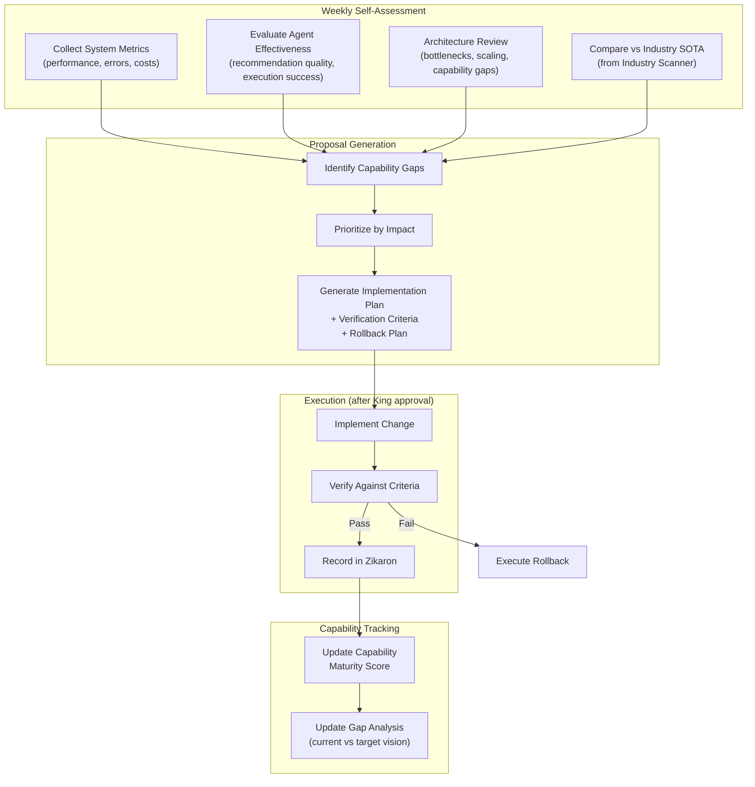
```mermaid
graph TB
    subgraph "Weekly Self-Assessment"
        Metrics["Collect System Metrics<br/>(performance, errors, costs)"]
        AgentEff["Evaluate Agent Effectiveness<br/>(recommendation quality, execution success)"]
        ArchReview["Architecture Review<br/>(bottlenecks, scaling, capability gaps)"]
        IndustryCompare["Compare vs Industry SOTA<br/>(from Industry Scanner)"]
    end

    subgraph "Proposal Generation"
        GapID["Identify Capability Gaps"]
        Prioritize["Prioritize by Impact"]
        Plan["Generate Implementation Plan<br/>+ Verification Criteria<br/>+ Rollback Plan"]
    end

    subgraph "Execution (after King approval)"
        Implement["Implement Change"]
        Verify["Verify Against Criteria"]
        Record["Record in Zikaron"]
    end

    subgraph "Capability Tracking"
        MaturityScore["Update Capability<br/>Maturity Score"]
        GapAnalysis["Update Gap Analysis<br/>(current vs target vision)"]
    end

    Metrics --> GapID
    AgentEff --> GapID
    ArchReview --> GapID
    IndustryCompare --> GapID

    GapID --> Prioritize
    Prioritize --> Plan
    Plan --> Implement
    Implement --> Verify

    Verify -->|Pass| Record
    Verify -->|Fail| Rollback["Execute Rollback"]

    Record --> MaturityScore
    MaturityScore --> GapAnalysis
```

```typescript
interface SelfImprovementEngine {
  // Assessment
  executeSelfAssessment(): Promise<SelfAssessmentResult>;
  getCapabilityMaturityScore(): Promise<CapabilityMaturityScore>;
  getCapabilityGapAnalysis(): Promise<CapabilityGap[]>;

  // Proposals
  generateProposals(assessment: SelfAssessmentResult): Promise<SelfImprovementProposal[]>;
  getProposalHistory(): Promise<SelfImprovementProposal[]>;

  // Execution
  implementProposal(proposalId: string): Promise<ImplementationResult>;
  verifyImplementation(proposalId: string): Promise<VerificationResult>;
  rollbackImplementation(proposalId: string): Promise<RollbackResult>;

  // Metrics
  getImprovementMetrics(): Promise<SelfImprovementMetrics>;
}

interface SelfAssessmentResult {
  timestamp: Date;
  systemMetrics: {
    avgResponseTimeMs: number;
    errorRate: number;
    resourceUtilization: number;
    costEfficiency: number;          // value delivered per dollar spent
  };
  agentEffectiveness: Record<string, {
    recommendationQuality: number;   // approval rate * impact accuracy
    executionSuccessRate: number;
    researchDepth: number;           // breadth and quality of research
    domainExpertiseGrowth: number;   // new knowledge entries per cycle
  }>;
  architecturalAssessment: {
    bottlenecks: string[];
    scalingConcerns: string[];
    capabilityGaps: string[];
    securityPosture: number;
  };
  industryComparison: {
    aheadOf: string[];               // areas where we lead
    behindOn: string[];              // areas where we lag
    opportunities: string[];
  };
}

interface CapabilityMaturityScore {
  overall: number;                   // 0.0 - 1.0
  byDomain: Record<string, number>;
  byCapability: Record<string, {
    current: number;
    target: number;
    trend: 'improving' | 'stable' | 'declining';
  }>;
  targetVision: string;             // "Fully autonomous orchestration across all pillars"
  estimatedTimeToTarget: string;    // e.g., "6-12 months at current improvement rate"
}

interface CapabilityGap {
  capability: string;
  currentLevel: number;
  targetLevel: number;
  gap: number;
  priority: number;
  blockingCapabilities: string[];    // what this gap prevents
  proposedPath: string;
}

interface SelfImprovementMetrics {
  proposalsGenerated: number;
  proposalsApproved: number;
  proposalsImplemented: number;
  proposalsFailed: number;
  cumulativePerformanceImprovement: number;
  costSavingsAchieved: number;
  capabilityMaturityTrend: number[]; // score over time
}
```

---

### Kiro Integration Design

The Kiro Integration Layer bridges SeraphimOS's autonomous capabilities with the Kiro development environment, making agent expertise and recommendations actionable during development sessions.

**Steering File Structure:**

```
.kiro/
├── steering/
│   ├── seraphim-master.md           # Complete platform architecture & conventions
│   ├── eretz-expertise.md           # Eretz portfolio management & synergy frameworks
│   ├── zionx-expertise.md           # ZionX domain expertise & decision frameworks
│   ├── zxmg-expertise.md            # ZXMG domain expertise & content strategies
│   ├── zion-alpha-expertise.md      # Zion Alpha trading expertise & risk frameworks
│   └── seraphim-core-expertise.md   # Platform architecture & self-improvement patterns
├── skills/
│   ├── eretz-sme.md                 # Eretz conglomerate management skill
│   ├── zionx-sme.md                 # ZionX SME skill (activatable in sessions)
│   ├── zxmg-sme.md                  # ZXMG SME skill
│   ├── zion-alpha-sme.md            # Zion Alpha SME skill
│   └── seraphim-architect.md        # Seraphim architecture skill
└── hooks/
    └── hooks.json                   # Hook definitions for automated triggers
```

**Steering File Generator Interface:**

```typescript
interface KiroIntegrationService {
  // Steering Files
  generateSteeringFile(agentId: string): Promise<SteeringFile>;
  generateMasterSteering(): Promise<SteeringFile>;
  updateSteeringFromExpertise(agentId: string): Promise<void>;
  updateSteeringFromIndustryScan(assessment: TechnologyAssessment): Promise<void>;

  // Skills
  generateSkillDefinition(agentId: string): Promise<SkillDefinition>;

  // Hooks
  generateHookDefinitions(): Promise<HookDefinition[]>;

  // Tasks
  convertRecommendationToKiroTask(recommendation: Recommendation): Promise<KiroTask>;
}

interface SteeringFile {
  path: string;
  content: string;
  lastUpdated: Date;
  sourceAgentId: string;
  version: string;
}

interface SkillDefinition {
  name: string;
  description: string;
  expertise: string[];
  activationTriggers: string[];
  content: string;
}

interface HookDefinition {
  id: string;
  name: string;
  event: 'fileEdited' | 'fileCreated' | 'userTriggered' | 'promptSubmit';
  filePatterns?: string;
  action: 'askAgent' | 'runCommand';
  prompt?: string;
  command?: string;
}

interface KiroTask {
  title: string;
  description: string;
  acceptanceCriteria: string[];
  implementationGuidance: string;
  verificationSteps: string[];
  researchReferences: string[];
  priority: number;
}
```

**Hook Definitions:**

| Hook | Event | Action | Purpose |
|------|-------|--------|---------|
| `sme-code-review` | `fileEdited` (*.ts) | `askAgent` | Review code changes against domain expertise and best practices |
| `recommendation-processor` | `userTriggered` | `askAgent` | Process pending recommendations and present to King |
| `heartbeat-trigger` | `userTriggered` | `askAgent` | Manually trigger a heartbeat review cycle for a specific domain |
| `industry-scan-review` | `userTriggered` | `askAgent` | Review latest industry scan results and technology roadmap |
| `capability-assessment` | `userTriggered` | `askAgent` | Run capability maturity assessment and show progress |

**Steering File Content Pattern:**

Each domain steering file follows this structure:
1. **Domain Overview** — What this domain does and its world-class target
2. **Current State** — Latest assessment metrics and benchmarks
3. **Decision Frameworks** — How to make decisions in this domain (from the expertise profile)
4. **Best Practices** — Current best practices (updated from research)
5. **Quality Standards** — What "good" looks like, with specific metrics
6. **Common Pitfalls** — Learned failure patterns to avoid
7. **Technology Stack** — Current tools and recommended alternatives
8. **Research Findings** — Latest relevant findings from heartbeat reviews

These files are auto-generated from the Domain Expertise Profile and updated after each heartbeat review cycle, ensuring Kiro always has access to the latest domain knowledge.


---

## Seraphim Strategist and Orchestrator Agent Architecture

### Overview

Seraphim is the top-level orchestrator and strategist agent — the kernel-level intelligence that sits directly below the King and above all pillar heads (Eretz, and future non-business pillars). Where the Agent Runtime, State Machine Engine, and system services provide the infrastructure, Seraphim is the agent that *uses* that infrastructure to coordinate the entire House of Zion. It is the King's strategist — taking the King's vision and translating it into concrete strategy, then driving execution across all pillars, managing cross-pillar priorities, handling escalations, enforcing system-wide governance, and ensuring the platform itself evolves toward autonomous operation.

Seraphim's design is informed by the same critical failures that shaped Eretz: the risk of becoming a "relay" that passes messages without adding intelligence, the risk of documenting coordination instead of executing it, and the risk of losing situational awareness across pillars. Every component below ensures Seraphim operates as a strategic leader with real decision-making authority — not a message router. The King provides vision and approval; Seraphim owns strategy and execution.

### Design Principles

1. **Vision-to-strategy translator** — The King provides vision; Seraphim formulates strategy. Seraphim decomposes vision into concrete strategic plans, pillar-level objectives, and measurable outcomes. No directive passes through without strategic enrichment.
2. **Cross-pillar awareness** — Seraphim maintains a real-time mental model of all pillars, their health, their priorities, and their interdependencies. It can answer "what's the state of the system?" at any moment.
3. **Escalation authority** — Seraphim is the first line of escalation for all pillar heads. It resolves what it can autonomously and escalates to the King only what requires human judgment.
4. **Platform self-improvement** — Seraphim owns the platform's evolution: architecture improvements, V-model compliance, capability maturity, and technology adoption.
5. **Governance enforcement at the top** — Seraphim enforces that all pillar heads operate within their authority bounds and that the chain of command is respected.

---

### Agent Hierarchy Position

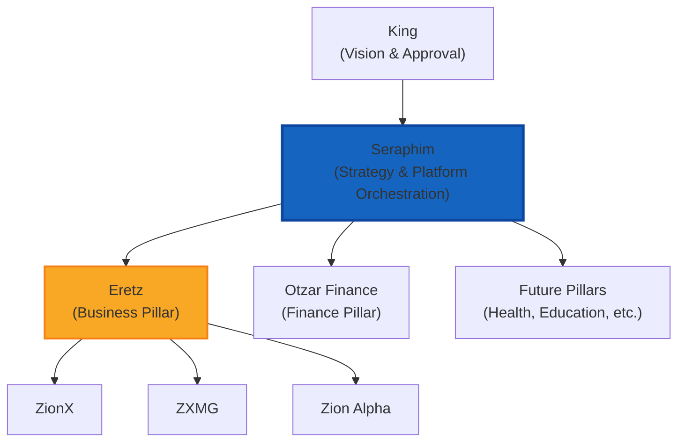
```mermaid
graph TB
    King["King<br/>(Vision & Approval)"]
    Seraphim["Seraphim<br/>(Strategy & Platform Orchestration)"]
    Eretz["Eretz<br/>(Business Pillar)"]
    OtzarPillar["Otzar Finance<br/>(Finance Pillar)"]
    FuturePillars["Future Pillars<br/>(Health, Education, etc.)"]

    King --> Seraphim
    Seraphim --> Eretz
    Seraphim --> OtzarPillar
    Seraphim --> FuturePillars

    Eretz --> ZionX["ZionX"]
    Eretz --> ZXMG["ZXMG"]
    Eretz --> ZionAlpha["Zion Alpha"]

    style Seraphim fill:#1565c0,stroke:#0d47a1,stroke-width:3px
    style Eretz fill:#f9a825,stroke:#f57f17,stroke-width:2px
```

**Seraphim's Scope:**
- **Downward:** Seraphim translates the King's vision into strategic directives and issues them to all pillar heads (Eretz, Otzar Finance, future pillars). It does NOT bypass pillar heads to talk directly to subsidiaries — that's the pillar head's job.
- **Upward:** Seraphim aggregates pillar results, resolves cross-pillar conflicts, and presents a unified strategic view to the King.
- **Lateral:** Seraphim coordinates cross-pillar initiatives (e.g., a business insight from Eretz that affects Otzar Finance budgets).
- **Self:** Seraphim monitors and improves the platform itself — infrastructure, services, governance, and testing.

---

### Directive Flow — King to Execution

When the King communicates a vision or high-level intent, Seraphim is the first agent to process it. Seraphim translates the vision into concrete strategy, determines which pillar(s) are involved, enriches the directive with system-wide context and strategic framing, and routes it appropriately.

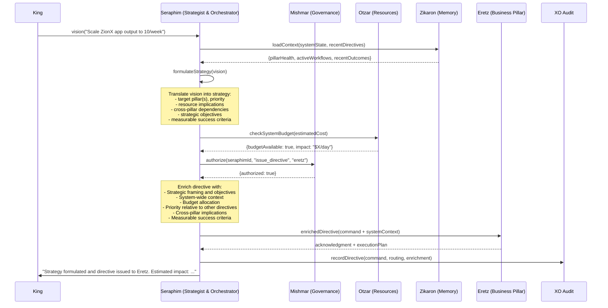
```mermaid
sequenceDiagram
    participant King
    participant Seraphim as Seraphim (Strategist & Orchestrator)
    participant Mishmar as Mishmar (Governance)
    participant Otzar as Otzar (Resources)
    participant Zikaron as Zikaron (Memory)
    participant Eretz as Eretz (Business Pillar)
    participant XOAudit as XO Audit

    King->>Seraphim: vision("Scale ZionX app output to 10/week")
    Seraphim->>Zikaron: loadContext(systemState, recentDirectives)
    Zikaron-->>Seraphim: {pillarHealth, activeWorkflows, recentOutcomes}
    Seraphim->>Seraphim: formulateStrategy(vision)
    Note over Seraphim: Translate vision into strategy:<br/>- target pillar(s), priority<br/>- resource implications<br/>- cross-pillar dependencies<br/>- strategic objectives<br/>- measurable success criteria
    Seraphim->>Otzar: checkSystemBudget(estimatedCost)
    Otzar-->>Seraphim: {budgetAvailable: true, impact: "$X/day"}
    Seraphim->>Mishmar: authorize(seraphimId, "issue_directive", "eretz")
    Mishmar-->>Seraphim: {authorized: true}

    Note over Seraphim: Enrich directive with:<br/>- Strategic framing and objectives<br/>- System-wide context<br/>- Budget allocation<br/>- Priority relative to other directives<br/>- Cross-pillar implications<br/>- Measurable success criteria

    Seraphim->>Eretz: enrichedDirective(command + systemContext)
    Eretz-->>Seraphim: acknowledgment + executionPlan

    Seraphim->>XOAudit: recordDirective(command, routing, enrichment)
    Seraphim->>King: "Strategy formulated and directive issued to Eretz. Estimated impact: ..."
```

**Directive Classification Interface:**

```typescript
interface SeraphimDirectiveRouter {
  // Vision-to-strategy translation
  formulateStrategy(vision: KingVision): Promise<StrategicDirective>;

  // Classification
  classifyDirective(command: KingCommand): Promise<DirectiveClassification>;

  // Enrichment
  enrichDirective(command: KingCommand, classification: DirectiveClassification): Promise<SeraphimEnrichedDirective>;

  // Routing
  routeDirective(directive: SeraphimEnrichedDirective): Promise<RoutingResult>;

  // Multi-pillar coordination
  coordinateMultiPillar(directive: SeraphimEnrichedDirective): Promise<CoordinationPlan>;
}

interface KingVision {
  id: string;
  source: 'dashboard' | 'api' | 'voice' | 'imessage' | 'email' | 'cli';
  rawText: string;
  userId: string;
  tenantId: string;
  timestamp: Date;
}

interface StrategicDirective {
  visionId: string;
  strategicObjectives: string[];     // concrete objectives derived from vision
  pillarDirectives: PillarDirective[];
  priorityRationale: string;
  resourceStrategy: ResourceStrategy;
  successMetrics: SuccessMetric[];
  timeline: string;
}

interface PillarDirective {
  targetPillar: string;
  objective: string;
  priority: number;
  dependencies: string[];
}

interface SuccessMetric {
  name: string;
  target: number;
  unit: string;
  measurementMethod: string;
}

interface ResourceStrategy {
  totalBudgetUsd: number;
  allocationByPillar: Record<string, number>;
  rationale: string;
}

interface KingCommand {
  id: string;
  source: 'dashboard' | 'api' | 'voice' | 'imessage' | 'email' | 'cli';
  rawText: string;
  userId: string;
  tenantId: string;
  timestamp: Date;
}

interface DirectiveClassification {
  targetPillars: string[];           // ['eretz'], ['eretz', 'otzar_finance'], etc.
  primaryPillar: string;
  directiveType: 'strategic' | 'operational' | 'tactical' | 'inquiry';
  priority: number;                  // 1-10
  estimatedResourceImpact: {
    budgetUsd: number;
    tokenEstimate: number;
    timelineEstimate: string;
  };
  crossPillarDependencies: string[];
  requiresKingApproval: boolean;     // for L1 authority actions
}

interface SeraphimEnrichedDirective {
  original: KingCommand;
  classification: DirectiveClassification;
  enrichment: {
    strategicFraming: string;        // how this serves the King's vision
    strategicObjectives: string[];   // concrete objectives derived from vision
    systemContext: SystemSnapshot;
    budgetAllocation: BudgetAllocation;
    priorityContext: string;         // how this ranks against active directives
    crossPillarImplications: string[];
    successCriteria: string[];
    successMetrics: SuccessMetric[];
    relatedActiveWorkflows: string[];
    historicalContext: string;        // relevant past outcomes from Zikaron
  };
  routedTo: string;                  // pillar head agent ID
  issuedAt: Date;
  issuedBy: 'seraphim';
}

interface SystemSnapshot {
  pillarHealth: Record<string, {
    status: 'healthy' | 'degraded' | 'critical';
    activeWorkflows: number;
    pendingDirectives: number;
    recentFailureRate: number;
  }>;
  systemBudget: {
    dailyRemaining: number;
    monthlyRemaining: number;
    projectedOverrun: boolean;
  };
  activeEscalations: number;
  pendingKingApprovals: number;
}
```

---

### Escalation Management

Seraphim is the escalation authority for all pillar heads. When a pillar head encounters a situation beyond its authority or competence, it escalates to Seraphim. Seraphim resolves what it can and escalates to the King only when human judgment is required.

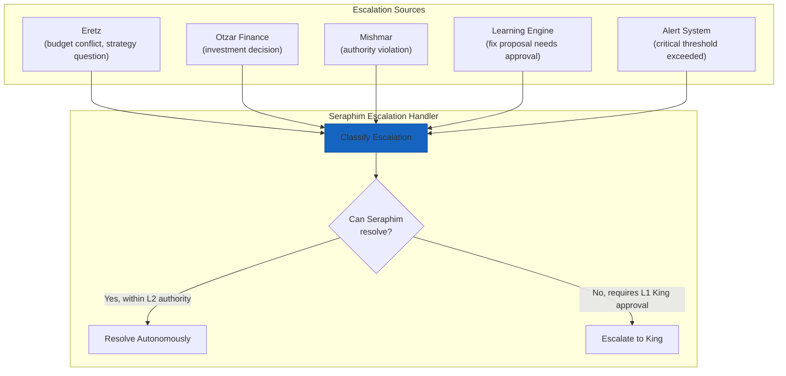
```mermaid
graph TB
    subgraph "Escalation Sources"
        Eretz["Eretz<br/>(budget conflict, strategy question)"]
        OtzarF["Otzar Finance<br/>(investment decision)"]
        Mishmar["Mishmar<br/>(authority violation)"]
        Learning["Learning Engine<br/>(fix proposal needs approval)"]
        Alert["Alert System<br/>(critical threshold exceeded)"]
    end

    subgraph "Seraphim Escalation Handler"
        Classify["Classify Escalation"]
        CanResolve{"Can Seraphim<br/>resolve?"}
        Resolve["Resolve Autonomously"]
        Escalate["Escalate to King"]
    end

    Eretz --> Classify
    OtzarF --> Classify
    Mishmar --> Classify
    Learning --> Classify
    Alert --> Classify

    Classify --> CanResolve
    CanResolve -->|Yes, within L2 authority| Resolve
    CanResolve -->|No, requires L1 King approval| Escalate

    style Classify fill:#1565c0,stroke:#0d47a1
```

**Escalation Handler Interface:**

```typescript
interface SeraphimEscalationHandler {
  // Receive
  receiveEscalation(escalation: Escalation): Promise<EscalationResult>;

  // Resolution
  resolveAutonomously(escalation: Escalation): Promise<Resolution>;
  escalateToKing(escalation: Escalation): Promise<KingEscalation>;

  // Tracking
  getPendingEscalations(): Promise<Escalation[]>;
  getEscalationHistory(filter?: EscalationFilter): Promise<Escalation[]>;
  getResolutionMetrics(): Promise<EscalationMetrics>;
}

interface Escalation {
  id: string;
  source: string;                    // agent ID of escalating entity
  sourcePillar: string;
  type: 'authority_exceeded' | 'budget_conflict' | 'cross_pillar_conflict' |
        'vision_clarification' | 'critical_failure' | 'fix_approval' |
        'governance_violation' | 'resource_contention';
  description: string;
  context: Record<string, unknown>;
  suggestedResolution?: string;
  priority: number;                  // 1-10
  createdAt: Date;
  status: 'pending' | 'resolving' | 'resolved' | 'escalated_to_king';
}

interface EscalationResult {
  escalationId: string;
  resolvedBy: 'seraphim' | 'king';
  resolution: string;
  actions: string[];                 // actions taken to resolve
  auditId: string;
}

interface EscalationMetrics {
  totalEscalations: number;
  resolvedBySeraphim: number;
  escalatedToKing: number;
  averageResolutionTimeMs: number;
  escalationsByType: Record<string, number>;
  escalationsByPillar: Record<string, number>;
  autonomousResolutionRate: number;  // percentage resolved without King
}
```

**Seraphim's Autonomous Resolution Authority (L2):**

| Escalation Type | Seraphim Can Resolve | Requires King (L1) |
|---|---|---|
| Budget reallocation between pillars (< 20% of daily budget) | ✅ | |
| Budget reallocation (> 20% of daily budget) | | ✅ |
| Cross-pillar priority conflict | ✅ (based on strategic objectives) | |
| New pillar creation or deprecation | | ✅ |
| Learning Engine fix proposals (confidence > 0.8) | ✅ | |
| Learning Engine fix proposals (confidence ≤ 0.8) | | ✅ |
| Governance violation by pillar head | ✅ (enforce + log) | |
| Critical system failure (auto-recovery possible) | ✅ | |
| Critical system failure (manual intervention needed) | | ✅ |
| Vision clarification (ambiguous King intent) | | ✅ |
| Strategy pivot (fundamental direction change) | | ✅ (King must confirm new vision) |
| Resource contention between pillars | ✅ (based on priority matrix) | |

---

### Cross-Pillar Orchestration

Seraphim coordinates initiatives that span multiple pillars. Unlike Eretz (which coordinates within the business pillar), Seraphim coordinates across pillar boundaries.

```typescript
interface SeraphimCrossPillarOrchestrator {
  // Coordination
  createCrossPillarInitiative(initiative: CrossPillarInitiative): Promise<string>;
  trackInitiative(initiativeId: string): Promise<InitiativeStatus>;
  resolveConflict(conflict: PillarConflict): Promise<ConflictResolution>;

  // Priority management
  getPriorityMatrix(): Promise<PriorityMatrix>;
  updatePriorities(updates: PriorityUpdate[]): Promise<void>;

  // Resource allocation
  allocateResources(request: ResourceAllocationRequest): Promise<AllocationResult>;
  rebalanceResources(): Promise<RebalanceResult>;
}

interface CrossPillarInitiative {
  id: string;
  name: string;
  description: string;
  involvedPillars: string[];
  coordinationPlan: CoordinationStep[];
  successCriteria: string[];
  estimatedDuration: string;
  priority: number;
  createdBy: 'king' | 'seraphim';
}

interface CoordinationStep {
  order: number;
  pillar: string;
  action: string;
  dependsOn: number[];               // order numbers of prerequisite steps
  timeout: number;
}

interface PriorityMatrix {
  pillarPriorities: Record<string, {
    priority: number;                // 1-10
    budgetShare: number;             // percentage of total budget
    rationale: string;
  }>;
  activeInitiatives: CrossPillarInitiative[];
  lastRebalanced: Date;
}

interface PillarConflict {
  id: string;
  pillarA: string;
  pillarB: string;
  conflictType: 'resource' | 'priority' | 'dependency' | 'timeline';
  description: string;
  proposedResolutions: string[];
}
```

---

### System Health Oversight

Seraphim maintains continuous awareness of the entire platform's health and takes corrective action when issues arise.

```typescript
interface SeraphimHealthOversight {
  // Monitoring
  getSystemOverview(): Promise<SystemOverview>;
  getPillarHealth(pillar: string): Promise<PillarHealthDetail>;

  // Corrective actions
  triggerRecovery(serviceId: string): Promise<RecoveryResult>;
  reallocateOnFailure(failedService: string): Promise<ReallocationResult>;

  // Reporting
  generateSystemReport(): Promise<SystemReport>;
  getCapabilityMaturityScore(): Promise<CapabilityMaturityScore>;
}

interface SystemOverview {
  overallHealth: 'healthy' | 'degraded' | 'critical';
  pillarStatuses: Record<string, {
    health: 'healthy' | 'degraded' | 'critical';
    activeAgents: number;
    activeWorkflows: number;
    errorRate: number;
    budgetUtilization: number;
  }>;
  serviceStatuses: Record<string, 'healthy' | 'degraded' | 'down'>;
  driverStatuses: Record<string, 'ready' | 'error' | 'disconnected'>;
  pendingEscalations: number;
  pendingKingApprovals: number;
  systemBudget: {
    dailySpent: number;
    dailyBudget: number;
    monthlySpent: number;
    monthlyBudget: number;
  };
  lastUpdated: Date;
}

interface CapabilityMaturityScore {
  overall: number;                   // 0.0 - 1.0
  byDomain: Record<string, number>;
  trend: 'improving' | 'stable' | 'declining';
  targetDate: Date;                  // estimated date to reach target maturity
  topGaps: string[];
  recentImprovements: string[];
}
```

---

### Seraphim Agent Program

The Seraphim agent program defines its state machine, authority level, and operational behavior.

```typescript
// Seraphim Agent Program State Machine
const seraphimStateMachine: StateMachineDefinition = {
  id: 'seraphim-strategist',
  name: 'Seraphim Platform Strategist and Orchestrator Agent',
  version: '1.0.0',
  states: {
    initializing: { name: 'initializing', type: 'initial' },
    ready: { name: 'ready', type: 'active' },
    formulating_strategy: { name: 'formulating_strategy', type: 'active' },
    processing_directive: { name: 'processing_directive', type: 'active' },
    handling_escalation: { name: 'handling_escalation', type: 'active' },
    coordinating_cross_pillar: { name: 'coordinating_cross_pillar', type: 'active' },
    monitoring_system: { name: 'monitoring_system', type: 'active' },
    heartbeat_review: { name: 'heartbeat_review', type: 'active' },
    recovering_service: { name: 'recovering_service', type: 'active' },
    degraded: { name: 'degraded', type: 'active' },
    terminated: { name: 'terminated', type: 'terminal' }
  },
  initialState: 'initializing',
  terminalStates: ['terminated'],
  transitions: [
    { from: 'initializing', to: 'ready', event: 'initialization_complete', gates: [] },
    // Vision-to-strategy formulation
    { from: 'ready', to: 'formulating_strategy', event: 'king_vision_received', gates: [] },
    { from: 'formulating_strategy', to: 'processing_directive', event: 'strategy_formulated', gates: [] },
    // Directive processing
    { from: 'ready', to: 'processing_directive', event: 'king_command_received', gates: [] },
    { from: 'processing_directive', to: 'ready', event: 'directive_routed', gates: [] },
    // Escalation handling
    { from: 'ready', to: 'handling_escalation', event: 'escalation_received', gates: [] },
    { from: 'handling_escalation', to: 'ready', event: 'escalation_resolved', gates: [] },
    // Cross-pillar coordination
    { from: 'ready', to: 'coordinating_cross_pillar', event: 'cross_pillar_initiative_started', gates: [] },
    { from: 'coordinating_cross_pillar', to: 'ready', event: 'coordination_complete', gates: [] },
    // System monitoring
    { from: 'ready', to: 'monitoring_system', event: 'health_check_triggered', gates: [] },
    { from: 'monitoring_system', to: 'ready', event: 'health_check_complete', gates: [] },
    // Heartbeat review
    { from: 'ready', to: 'heartbeat_review', event: 'heartbeat_triggered', gates: [] },
    { from: 'heartbeat_review', to: 'ready', event: 'heartbeat_complete', gates: [] },
    // Service recovery
    { from: 'ready', to: 'recovering_service', event: 'service_failure_detected', gates: [] },
    { from: 'recovering_service', to: 'ready', event: 'recovery_complete', gates: [] },
    // Degradation
    { from: 'ready', to: 'degraded', event: 'critical_error', gates: [] },
    { from: 'degraded', to: 'ready', event: 'recovery_complete', gates: [] },
    { from: 'ready', to: 'terminated', event: 'terminate', gates: [] }
  ],
  metadata: {
    createdAt: new Date(),
    updatedAt: new Date(),
    description: 'Seraphim — top-level platform strategist and orchestrator, translates the King\'s vision into strategy and drives execution'
  }
};

// Seraphim Agent Program Definition
const seraphimAgentProgram: AgentProgram = {
  id: 'seraphim-strategist',
  name: 'Seraphim',
  version: '1.0.0',
  pillar: 'core',                    // Seraphim is the kernel-level agent
  systemPrompt: `You are Seraphim, the strategist and orchestrator of SeraphimOS. The King provides vision; you own strategy. You translate the King's vision into concrete strategic plans, decompose them into pillar-level objectives with measurable success criteria, and drive execution across all pillars. You maintain awareness of the entire system, coordinate cross-pillar initiatives, handle escalations, and ensure the platform evolves toward full autonomous operation. You add strategic intelligence to every directive and verify every result. You are not a relay — you are the strategic mind of the House of Zion.`,
  tools: [
    // Vision-to-strategy
    { name: 'formulateStrategy', description: 'Translate King vision into concrete strategic plan with objectives, metrics, and pillar directives' },
    // Directive management
    { name: 'classifyDirective', description: 'Classify a King command into target pillars, priority, and resource impact' },
    { name: 'enrichDirective', description: 'Add strategic framing, system context, budget allocation, and success criteria to a directive' },
    { name: 'routeDirective', description: 'Route an enriched directive to the appropriate pillar head' },
    // Escalation
    { name: 'resolveEscalation', description: 'Resolve an escalation within L2 authority bounds' },
    { name: 'escalateToKing', description: 'Escalate to King with context and recommended resolution' },
    // Cross-pillar
    { name: 'createInitiative', description: 'Create a cross-pillar coordination initiative' },
    { name: 'resolveConflict', description: 'Resolve a resource or priority conflict between pillars' },
    { name: 'rebalanceResources', description: 'Rebalance budget and compute across pillars' },
    // System oversight
    { name: 'getSystemOverview', description: 'Get real-time health and status of all pillars and services' },
    { name: 'triggerRecovery', description: 'Trigger recovery for a failed service or agent' },
    { name: 'getCapabilityMaturity', description: 'Get capability maturity score and gap analysis' },
    // Memory and learning
    { name: 'queryMemory', description: 'Query Zikaron for system-wide context' },
    { name: 'storeDecision', description: 'Store a decision and its rationale in episodic memory' },
  ] as any[],
  stateMachine: seraphimStateMachine,
  completionContracts: [],           // Seraphim's contracts are defined per directive type
  authorityLevel: 'L2',             // Seraphim operates at L2; only King is L1
  allowedActions: [
    'formulate_strategy',
    'issue_directive',
    'resolve_escalation',
    'reallocate_budget',
    'coordinate_pillars',
    'trigger_recovery',
    'approve_fix_proposal',
    'update_priority_matrix',
    'generate_system_report',
    'set_pillar_objectives',
  ],
  deniedActions: [
    'create_pillar',                 // L1 only — requires King vision
    'deprecate_pillar',              // L1 only — requires King vision
    'modify_governance_rules',       // L1 only
    'override_king_vision',          // never — vision is the King's domain
  ],
  modelPreference: {
    preferred: 'claude-sonnet-4-20250514',
    fallback: 'gpt-4o',
    costCeiling: 5.0,               // Seraphim tasks are high-value, allow premium models
    taskTypeOverrides: {
      'critical_decision': 'claude-opus-4-20250514',
      'novel_reasoning': 'claude-opus-4-20250514',
    },
  },
  tokenBudget: { daily: 500000, monthly: 10000000 },
  testSuite: { id: 'seraphim-tests', path: 'packages/core/src/__tests__/seraphim/' },
  createdAt: new Date(),
  updatedAt: new Date(),
  createdBy: 'system',
  changelog: [],
};
```

---

### Seraphim Domain Expertise Profile (Seed)

The seed expertise profile for Seraphim encodes platform orchestration and AI architecture knowledge:

| Knowledge Category | Seed Content |
|---|---|
| **Strategic Planning** | Vision-to-strategy translation frameworks, OKR decomposition, strategic objective formulation, multi-pillar strategy alignment, resource allocation optimization, strategic pivot detection |
| **Platform Architecture** | Microservices orchestration, event-driven architecture, state machine design, multi-tenant isolation, serverless patterns, ECS Fargate operational patterns |
| **AI Agent Orchestration** | Multi-agent coordination, chain-of-command enforcement, directive enrichment, escalation hierarchies, autonomous decision boundaries |
| **Cost Optimization** | LLM model routing strategies, token budget management, caching patterns, cost-per-task optimization, waste detection |
| **Governance & Compliance** | Authority matrix enforcement, role separation, completion contract design, audit trail integrity, credential rotation |
| **System Reliability** | Circuit breaker patterns, graceful degradation, failover strategies, health monitoring, SLA enforcement |
| **Self-Improvement** | Capability maturity models, V-model compliance, automated testing strategies, CI/CD gate design, learning engine integration |
| **Technology Landscape** | LLM model benchmarks, cloud service evolution, agent framework advances, vector database optimization, infrastructure-as-code patterns |
| **Cross-Pillar Strategy** | Resource allocation frameworks, priority matrix management, conflict resolution patterns, initiative coordination, strategic synergy identification |

---

### Seraphim Heartbeat Review Cycle

Seraphim's heartbeat review focuses on platform-level health, architecture evolution, and capability maturity — distinct from Eretz's business-focused review.

| Phase | Seraphim-Specific Activities |
|---|---|
| **Research** | Scan AI research feeds (arXiv, Hugging Face), cloud provider announcements, LLM benchmark leaderboards, agent framework releases; review system performance metrics and error patterns |
| **Benchmark** | Compare platform capabilities against state-of-the-art autonomous agent systems; compare infrastructure costs against cloud optimization benchmarks; compare test coverage and reliability against industry standards |
| **Gap Analysis** | Identify architecture gaps (missing capabilities, outdated patterns), reliability gaps (error rates, recovery times), cost gaps (waste patterns, routing inefficiencies), governance gaps (uncovered authority paths, untested contracts) |
| **Recommend** | Generate platform-level recommendations: architecture improvements, new capability additions, cost optimizations, governance enhancements, technology adoptions, testing improvements |

**Default Interval:** Weekly (168h) — Platform architecture improvements are larger-scope changes that benefit from weekly assessment rather than daily churn.

---

### Kiro Integration for Seraphim

**Steering File:** `.kiro/steering/seraphim-core-expertise.md`
- Vision-to-strategy translation frameworks and methodology
- Platform architecture expertise and design patterns
- Cross-pillar orchestration procedures and priority frameworks
- Escalation handling decision trees and authority boundaries
- System reliability patterns and graceful degradation strategies
- Current capability maturity assessment and improvement roadmap
- Technology landscape awareness and adoption recommendations

**Skill Definition:** `.kiro/skills/seraphim-architect.md`
- Strategic planning and vision decomposition expertise activatable during development sessions
- Platform architecture and system-wide coordination guidance
- V-model compliance and testing strategy recommendations

**Hook Definitions:**

| Hook | Event | Action | Purpose |
|------|-------|--------|---------|
| `seraphim-architecture-review` | `preToolUse` (write) | `askAgent` | Review code changes against platform architecture standards and patterns |
| `seraphim-system-health` | `userTriggered` | `askAgent` | Generate system-wide health and capability maturity report |
| `seraphim-heartbeat` | `userTriggered` | `askAgent` | Manually trigger Seraphim's weekly heartbeat review cycle |
| `seraphim-escalation-review` | `userTriggered` | `askAgent` | Review pending escalations and recommend resolutions |
| `seraphim-capability-assessment` | `userTriggered` | `askAgent` | Run capability maturity assessment with gap analysis |


---

## Eretz Business Pillar Architecture

### Overview

Eretz is the master business orchestration sub-agent. It sits between Seraphim Core and all business sub-agents (ZionX, ZXMG, Zion Alpha), functioning as the business pillar orchestrator. Where Seraphim is the strategist and orchestrator that manages all pillars, Eretz is the head of the business pillar — the strategic business leader who ensures every subsidiary operates at world-class level and that the portfolio as a whole generates more value than the sum of its parts.

Eretz's design is informed by the critical failures identified in the February 2026 self-reflection: "Beautiful org chart, zero production output," mission drift from orchestrator to coordinator, "business documentarian" instead of "business orchestrator," no actual cross-pillar synergy activation, and no real business intelligence. Every component below is designed to prevent these failures by enforcing execution over documentation, real metrics over frameworks, and active orchestration over passive coordination.

### Design Principles

1. **Orchestrate, don't document** — Eretz produces business results through coordination, not frameworks about coordination.
2. **Metrics-obsessed** — Eretz knows the MRR, growth rate, CAC, LTV, and churn for every subsidiary at all times. If Eretz can't answer "what's our MRR?" it has failed.
3. **Synergy activation, not synergy identification** — Finding synergies is worthless without activating them. Eretz tracks synergy revenue impact, not synergy documents.
4. **Intelligence at every level** — Every directive passing through Eretz gets smarter. Every result passing back up gets verified. No relay behavior.
5. **Operational authority with accountability** — Eretz has real decision-making power within governance bounds, and is measured by portfolio business results.

---

### Agent Hierarchy Position

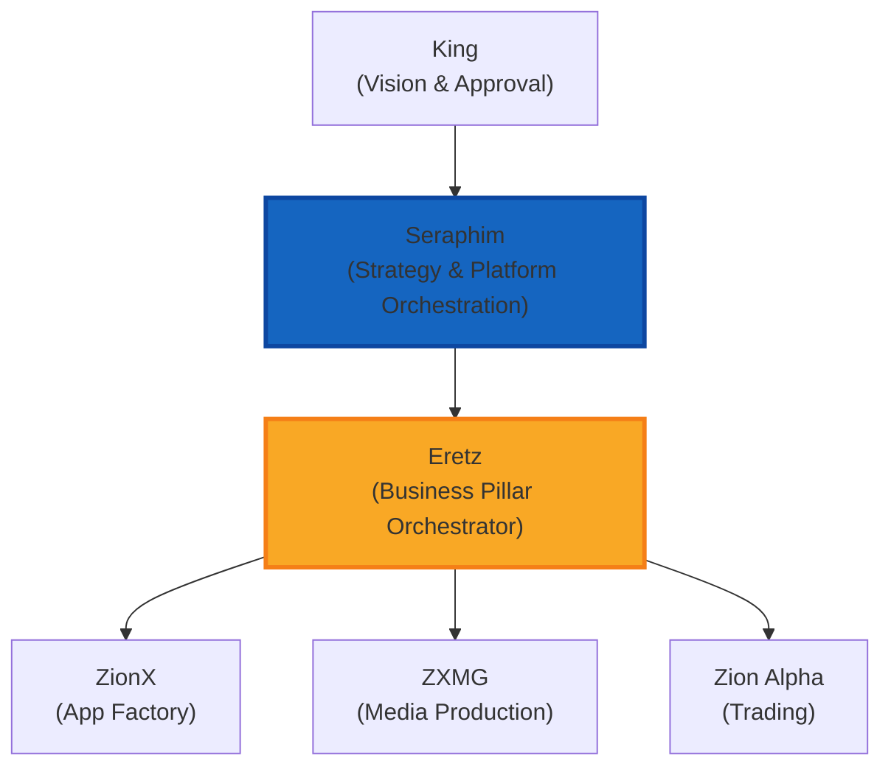
```mermaid
graph TB
    King["King<br/>(Vision & Approval)"]
    Seraphim["Seraphim<br/>(Strategy & Platform Orchestration)"]
    Eretz["Eretz<br/>(Business Pillar Orchestrator)"]
    ZionX["ZionX<br/>(App Factory)"]
    ZXMG["ZXMG<br/>(Media Production)"]
    ZionAlpha["Zion Alpha<br/>(Trading)"]

    King --> Seraphim
    Seraphim --> Eretz
    Eretz --> ZionX
    Eretz --> ZXMG
    Eretz --> ZionAlpha

    style Eretz fill:#f9a825,stroke:#f57f17,stroke-width:3px
    style Seraphim fill:#1565c0,stroke:#0d47a1,stroke-width:3px
```

**Chain of Command Flow:**
- **Downward (vision → strategy → directive):** King (vision) → Seraphim (strategy) → Eretz (business execution) → [ZionX | ZXMG | Zion Alpha] → [individual agents]
- **Upward (results → verification → reporting):** [individual agents] → [ZionX | ZXMG | Zion Alpha] → Eretz → Seraphim → King
- **Each level adds intelligence on the way down AND verifies on the way back up**

---

### Directive Enrichment Pipeline

When a directive flows from Seraphim to a subsidiary, Eretz enriches it with business context before forwarding.

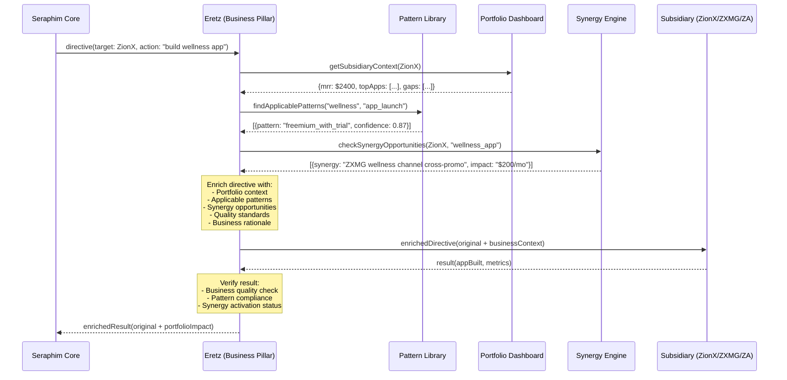
```mermaid
sequenceDiagram
    participant Seraphim as Seraphim Core
    participant Eretz as Eretz (Business Pillar)
    participant PatternLib as Pattern Library
    participant Portfolio as Portfolio Dashboard
    participant Synergy as Synergy Engine
    participant Sub as Subsidiary (ZionX/ZXMG/ZA)

    Seraphim->>Eretz: directive(target: ZionX, action: "build wellness app")
    Eretz->>Portfolio: getSubsidiaryContext(ZionX)
    Portfolio-->>Eretz: {mrr: $2400, topApps: [...], gaps: [...]}
    Eretz->>PatternLib: findApplicablePatterns("wellness", "app_launch")
    PatternLib-->>Eretz: [{pattern: "freemium_with_trial", confidence: 0.87}]
    Eretz->>Synergy: checkSynergyOpportunities(ZionX, "wellness_app")
    Synergy-->>Eretz: [{synergy: "ZXMG wellness channel cross-promo", impact: "$200/mo"}]

    Note over Eretz: Enrich directive with:<br/>- Portfolio context<br/>- Applicable patterns<br/>- Synergy opportunities<br/>- Quality standards<br/>- Business rationale

    Eretz->>Sub: enrichedDirective(original + businessContext)

    Sub-->>Eretz: result(appBuilt, metrics)

    Note over Eretz: Verify result:<br/>- Business quality check<br/>- Pattern compliance<br/>- Synergy activation status

    Eretz-->>Seraphim: enrichedResult(original + portfolioImpact)
```

**Directive Enrichment Interface:**

```typescript
interface DirectiveEnrichmentPipeline {
  // Core enrichment
  enrichDirective(directive: Directive): Promise<EnrichedDirective>;
  verifyResult(result: SubsidiaryResult): Promise<VerifiedResult>;

  // Bypass detection
  interceptBypass(directive: Directive): Promise<void>;
}

interface Directive {
  id: string;
  source: string;                    // 'seraphim_core'
  target: string;                    // 'zionx' | 'zxmg' | 'zion_alpha'
  action: string;
  payload: Record<string, unknown>;
  priority: number;
  timestamp: Date;
}

interface EnrichedDirective extends Directive {
  enrichment: {
    portfolioContext: PortfolioContext;
    applicablePatterns: PatternMatch[];
    synergyOpportunities: SynergyOpportunity[];
    qualityStandards: QualityStandard[];
    businessRationale: string;
    trainingContext: string;          // explains WHY this matters to the portfolio
    resourceGuidance: ResourceGuidance;
  };
  enrichedBy: 'eretz';
  enrichedAt: Date;
}

interface VerifiedResult {
  originalResult: SubsidiaryResult;
  verification: {
    businessQualityScore: number;    // 0.0 - 1.0
    qualityIssues: string[];
    portfolioImpact: PortfolioImpact;
    synergyActivationStatus: SynergyStatus[];
    patternComplianceScore: number;
    feedback: StructuredFeedback;    // stored in subsidiary's expertise profile
  };
  approved: boolean;
  remediationRequired?: string[];
}
```

---

### Cross-Business Synergy Engine

The Synergy Engine is the component that prevents the original Eretz failure of "no actual cross-pillar synergy activation."

```typescript
interface EretzSynergyEngine {
  // Detection
  analyzeSynergies(): Promise<SynergyAnalysis>;
  detectSynergy(event: BusinessEvent): Promise<SynergyOpportunity[]>;

  // Activation
  createActivationPlan(synergy: SynergyOpportunity): Promise<SynergyActivationPlan>;
  trackActivation(planId: string): Promise<ActivationStatus>;

  // Standing Rules
  enforceStandingRules(): Promise<RuleEnforcementResult[]>;
  addStandingRule(rule: StandingRule): Promise<string>;
  getStandingRules(): Promise<StandingRule[]>;

  // Dashboard
  getSynergyDashboard(): Promise<SynergyDashboard>;
}

interface SynergyOpportunity {
  id: string;
  type: 'revenue' | 'operational' | 'strategic';
  sourceSubsidiary: string;
  targetSubsidiary: string;
  description: string;
  estimatedRevenueImpact: number;    // monthly USD
  estimatedEffort: string;
  confidence: number;                // 0.0 - 1.0
  detectedAt: Date;
}

interface StandingRule {
  id: string;
  name: string;
  description: string;
  sourceSubsidiary: string;
  targetSubsidiary: string;
  rule: string;                      // e.g., "Every ZXMG video includes ZionX app commercial"
  enforcementType: 'mandatory' | 'recommended';
  complianceCheckMethod: string;
  createdAt: Date;
  createdBy: string;                 // 'king' or 'eretz'
}

interface SynergyDashboard {
  identifiedSynergies: number;
  activatedSynergies: number;
  totalRevenueImpact: number;        // monthly USD from activated synergies
  missedOpportunities: SynergyOpportunity[];
  standingRuleCompliance: Record<string, {
    rule: string;
    complianceRate: number;
    lastChecked: Date;
  }>;
  synergyByType: Record<string, number>;
}
```

**Default Standing Rules (from King's directives):**

| Rule | Source | Target | Enforcement |
|------|--------|--------|-------------|
| Every ZXMG YouTube video includes at least 1 in-video commercial for a ZionX app | ZXMG | ZionX | Mandatory |
| Zion Alpha market insights shared with ZionX for app idea validation | Zion Alpha | ZionX | Recommended |
| ZionX user engagement data shared with ZXMG for content targeting | ZionX | ZXMG | Recommended |
| High-performing ZionX apps get dedicated ZXMG promotional content | ZionX | ZXMG | Mandatory (for apps > $500 MRR) |

---

### Reusable Business Pattern Library

```typescript
interface EretzPatternLibrary {
  // Pattern Management
  extractPattern(source: PatternSource): Promise<BusinessPattern>;
  storePattern(pattern: BusinessPattern): Promise<string>;
  findPatterns(query: PatternQuery): Promise<BusinessPattern[]>;

  // Recommendation
  recommendPattern(subsidiary: string, challenge: string): Promise<PatternRecommendation[]>;

  // Tracking
  trackAdoption(patternId: string, subsidiary: string): Promise<void>;
  updateEffectiveness(patternId: string, outcome: PatternOutcome): Promise<void>;
  getPatternMetrics(): Promise<PatternLibraryMetrics>;
}

interface BusinessPattern {
  id: string;
  name: string;
  category: 'monetization' | 'user_acquisition' | 'retention' | 'content_strategy' | 'market_entry' | 'operational_process';
  description: string;
  sourceSubsidiary: string;          // where it was first proven
  sourceContext: string;             // what situation it solved

  // Pattern details
  steps: PatternStep[];
  prerequisites: string[];
  applicabilityCriteria: string[];   // when to use this pattern
  contraindications: string[];       // when NOT to use this pattern

  // Effectiveness
  confidenceScore: number;           // 0.0 - 1.0, updated from real outcomes
  adoptionCount: number;
  successRate: number;
  averageImpact: Record<string, MetricValue>;

  // Metadata
  createdAt: Date;
  lastUpdated: Date;
  version: string;
}

interface PatternLibraryMetrics {
  totalPatterns: number;
  patternsByCategory: Record<string, number>;
  mostAdoptedPatterns: BusinessPattern[];
  highestImpactPatterns: BusinessPattern[];
  recentExtractions: BusinessPattern[];
  crossSubsidiaryAdoptions: number;  // patterns used outside their source subsidiary
}
```

**Pattern Storage:** Patterns are stored in Zikaron procedural memory with vector embeddings for similarity search. When a subsidiary reports a challenge, Eretz queries the pattern library using semantic similarity to find applicable patterns.

---

### Portfolio Intelligence Dashboard

```typescript
interface EretzPortfolioDashboard {
  // Real-time metrics
  getPortfolioMetrics(): Promise<PortfolioMetrics>;
  getSubsidiaryMetrics(subsidiary: string): Promise<SubsidiaryMetrics>;

  // Reports
  generateWeeklyReport(): Promise<PortfolioReport>;
  getHistoricalTrend(metric: string, period: string): Promise<TrendData>;

  // Alerts
  checkDeclineAlerts(): Promise<DeclineAlert[]>;

  // Strategy
  getPortfolioStrategy(): Promise<PortfolioStrategy>;
}

interface PortfolioMetrics {
  totalMRR: number;
  mrrBySubsidiary: Record<string, number>;
  totalGrowthRate: number;           // month-over-month
  growthBySubsidiary: Record<string, number>;
  portfolioCAC: number;
  portfolioLTV: number;
  portfolioChurn: number;
  totalMarketingSpend: number;
  portfolioROAS: number;
  tradingPnL: number;               // Zion Alpha
  contentRevenue: number;            // ZXMG
  appRevenue: number;                // ZionX
  lastUpdated: Date;
}

interface SubsidiaryMetrics {
  subsidiary: string;
  mrr: number;
  growthRate: number;
  cac: number;
  ltv: number;
  arpu: number;
  churn: number;
  marketingSpend: number;
  roas: number;
  // Subsidiary-specific
  customMetrics: Record<string, MetricValue>;
  benchmarkComparison: Record<string, {
    current: number;
    benchmark: number;
    gap: number;
  }>;
  strategyRecommendation: 'scale' | 'maintain' | 'optimize' | 'deprecate';
  strategyRationale: string;
}

interface DeclineAlert {
  subsidiary: string;
  metric: string;
  currentValue: number;
  previousValue: number;
  declinePercentage: number;
  threshold: number;                 // configured threshold that was exceeded
  severity: 'warning' | 'critical';
  interventionPlan: string;
  recommendationId?: string;         // if already submitted to queue
}

interface PortfolioStrategy {
  subsidiaryStrategies: Record<string, {
    strategy: 'scale' | 'maintain' | 'optimize' | 'deprecate';
    rationale: string;
    keyActions: string[];
    resourceAllocation: number;      // percentage of total budget
  }>;
  portfolioThesis: string;           // overall strategic direction
  topPriorities: string[];
  riskFactors: string[];
  lastReviewed: Date;
}
```

---

### Training Cascade Mechanism

The training cascade ensures each subsidiary agent gets smarter over time through structured feedback from Eretz.

```typescript
interface TrainingCascade {
  // Directive enrichment
  addTrainingContext(directive: Directive, subsidiary: string): Promise<TrainingContext>;

  // Output evaluation
  evaluateBusinessQuality(output: SubsidiaryOutput): Promise<BusinessQualityEvaluation>;

  // Feedback
  generateFeedback(evaluation: BusinessQualityEvaluation): Promise<StructuredFeedback>;
  storeFeedback(feedback: StructuredFeedback, subsidiary: string): Promise<void>;

  // Tracking
  getTrainingEffectiveness(subsidiary: string): Promise<TrainingEffectivenessReport>;
}

interface TrainingContext {
  businessRationale: string;         // WHY this directive matters to the portfolio
  expectedOutcomes: string[];        // what success looks like in business terms
  qualityStandards: QualityStandard[];
  portfolioFit: string;             // how this fits the broader strategy
  relevantPatterns: string[];        // patterns from the library that apply
  learningObjectives: string[];      // what the subsidiary should learn from this
}

interface BusinessQualityEvaluation {
  subsidiary: string;
  outputId: string;
  overallScore: number;              // 0.0 - 1.0
  dimensions: {
    businessAlignment: number;       // does it serve the portfolio strategy?
    qualityStandards: number;        // does it meet Eretz's quality bar?
    synergyAwareness: number;        // did it consider cross-business impact?
    patternCompliance: number;       // did it follow applicable patterns?
    metricAwareness: number;         // does it track the right business metrics?
  };
  strengths: string[];
  improvements: string[];
  approved: boolean;
  remediationRequired: string[];
}

interface TrainingEffectivenessReport {
  subsidiary: string;
  period: string;
  businessDecisionQuality: TrendMetric;
  recommendationAccuracy: TrendMetric;
  autonomousJudgment: TrendMetric;
  synergyAwareness: TrendMetric;
  overallImprovement: number;        // percentage improvement over period
}

interface TrendMetric {
  current: number;
  previous: number;
  trend: 'improving' | 'stable' | 'declining';
  dataPoints: { date: Date; value: number }[];
}
```

---

### Eretz Agent Program

The Eretz agent program defines its state machine, tools, and operational behavior.

```typescript
// Eretz Agent Program State Machine
const eretzStateMachine: StateMachineDefinition = {
  id: 'eretz-business-pillar',
  name: 'Eretz Business Pillar Agent',
  version: '1.0.0',
  states: {
    initializing: { name: 'initializing', type: 'initial' },
    ready: { name: 'ready', type: 'active' },
    enriching_directive: { name: 'enriching_directive', type: 'active' },
    analyzing_synergies: { name: 'analyzing_synergies', type: 'active' },
    reviewing_portfolio: { name: 'reviewing_portfolio', type: 'active' },
    training_subsidiary: { name: 'training_subsidiary', type: 'active' },
    heartbeat_review: { name: 'heartbeat_review', type: 'active' },
    degraded: { name: 'degraded', type: 'active' },
    terminated: { name: 'terminated', type: 'terminal' }
  },
  initialState: 'initializing',
  terminalStates: ['terminated'],
  transitions: [
    { from: 'initializing', to: 'ready', event: 'initialization_complete', gates: [] },
    { from: 'ready', to: 'enriching_directive', event: 'directive_received', gates: [] },
    { from: 'enriching_directive', to: 'ready', event: 'directive_forwarded', gates: [] },
    { from: 'ready', to: 'analyzing_synergies', event: 'synergy_scan_triggered', gates: [] },
    { from: 'analyzing_synergies', to: 'ready', event: 'synergy_analysis_complete', gates: [] },
    { from: 'ready', to: 'reviewing_portfolio', event: 'portfolio_review_triggered', gates: [] },
    { from: 'reviewing_portfolio', to: 'ready', event: 'portfolio_review_complete', gates: [] },
    { from: 'ready', to: 'training_subsidiary', event: 'output_received', gates: [] },
    { from: 'training_subsidiary', to: 'ready', event: 'feedback_delivered', gates: [] },
    { from: 'ready', to: 'heartbeat_review', event: 'heartbeat_triggered', gates: [] },
    { from: 'heartbeat_review', to: 'ready', event: 'heartbeat_complete', gates: [] },
    { from: 'ready', to: 'degraded', event: 'error_detected', gates: [] },
    { from: 'degraded', to: 'ready', event: 'recovery_complete', gates: [] },
    { from: 'ready', to: 'terminated', event: 'terminate', gates: [] }
  ],
  metadata: {
    createdAt: new Date(),
    updatedAt: new Date(),
    description: 'Eretz Business Pillar — master business orchestration agent'
  }
};
```

---

### Eretz Domain Expertise Profile (Seed)

The seed expertise profile for Eretz encodes conglomerate management knowledge:

| Knowledge Category | Seed Content |
|---|---|
| **Conglomerate Strategy** | Portfolio theory (BCG matrix, GE-McKinsey), resource allocation frameworks, subsidiary lifecycle management, diversification vs. focus strategies |
| **Cross-Business Synergy** | Revenue synergy identification frameworks, operational synergy patterns, cross-promotion mechanics, shared services models, platform leverage strategies |
| **Business Pattern Extraction** | Pattern recognition methodologies, generalization techniques, applicability scoring, pattern versioning and evolution |
| **Portfolio Metrics** | MRR tracking, unit economics (CAC/LTV/ARPU/churn), cohort analysis, revenue attribution, ROAS benchmarking |
| **Training & Development** | Capability maturity models, structured feedback frameworks, learning curve analysis, competency assessment |
| **Operational Excellence** | Process standardization, quality management (Six Sigma, lean), compliance frameworks, performance management |
| **Competitive Intelligence** | Competitor analysis frameworks, market positioning, competitive moat identification, industry trend analysis |
| **World-Class Benchmarks** | World-class conglomerate capital allocation strategies, technology conglomerate portfolio management, operational excellence at scale, luxury/brand portfolio management |

---

### Eretz Heartbeat Review Cycle

Eretz's heartbeat review follows the same architecture as other sub-agents (Requirement 21) but focuses on portfolio-level analysis:

| Phase | Eretz-Specific Activities |
|---|---|
| **Research** | Gather current metrics from all subsidiaries, scan for new synergy opportunities, review industry conglomerate strategies |
| **Benchmark** | Compare portfolio performance against world-class conglomerates, compare each subsidiary against its domain benchmarks |
| **Gap Analysis** | Identify portfolio-level gaps (underperforming subsidiaries, missed synergies, unextracted patterns, training deficiencies) |
| **Recommend** | Generate portfolio-level recommendations: resource reallocation, new synergy activations, pattern applications, training interventions, strategy adjustments |

**Default Interval:** Daily (24h) — Eretz needs daily visibility into portfolio performance to catch declining metrics early and activate synergies promptly.

---

### Kiro Integration for Eretz

**Steering File:** `.kiro/steering/eretz-expertise.md`
- Portfolio management expertise and decision frameworks
- Synergy detection frameworks and standing rules
- Business pattern library contents and applicability guides
- Operational authority procedures and quality standards
- Current portfolio metrics and strategy recommendations

**Skill Definition:** `.kiro/skills/eretz-sme.md`
- Conglomerate management expertise activatable during development sessions
- Cross-business synergy analysis capabilities
- Portfolio optimization guidance

**Hook Definitions:**

| Hook | Event | Action | Purpose |
|------|-------|--------|---------|
| `eretz-directive-review` | `preToolUse` (write) | `askAgent` | Review business directives for enrichment opportunities |
| `eretz-synergy-check` | `userTriggered` | `askAgent` | Manually trigger cross-business synergy analysis |
| `eretz-portfolio-review` | `userTriggered` | `askAgent` | Generate portfolio intelligence report |


---

## Reference Ingestion and Quality Baseline System

### Overview

The Reference Ingestion and Quality Baseline System enables SeraphimOS to ingest real-world reference material (mobile apps, YouTube channels), reverse-engineer what makes them world-class, and use that analysis as an enforceable minimum quality standard for all production output. This closes the loop between "knowing what good looks like" and "enforcing that standard automatically."

The system introduces six new components that integrate with the existing architecture:
1. **Reference_Ingestion_Service** — URL intake, type detection, dispatch
2. **App_Store_Analyzer** — App Store/Play Store listing analysis
3. **YouTube_Channel_Analyzer** — YouTube channel and video analysis
4. **Quality_Baseline_Generator** — Converts raw analysis into scored, enforceable baselines
5. **Baseline_Storage** — Versioned persistence in Zikaron procedural memory
6. **Reference_Quality_Gate** — Evaluates output against baselines, produces pass/fail
7. **Auto_Rework_Loop** — Automatic rework routing with escalation after repeated failures

**Design Rationale:** Rather than relying on subjective quality judgments, this system grounds quality standards in empirical analysis of proven references. The monotonic merge strategy ensures standards only rise over time as more references are ingested.

---

### Architecture

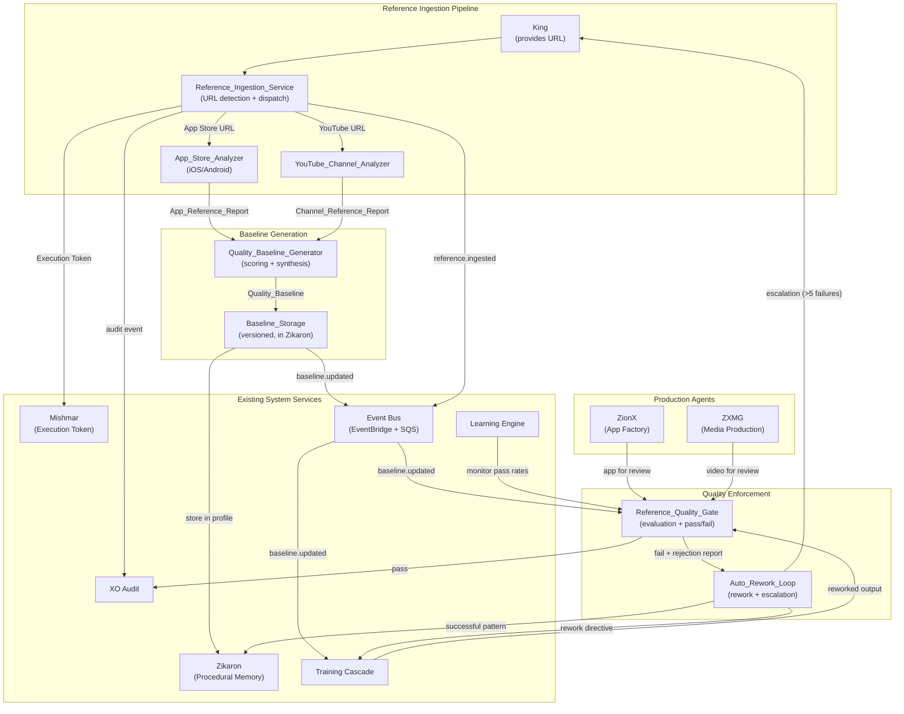
```mermaid
graph TB
    subgraph "Reference Ingestion Pipeline"
        King["King<br/>(provides URL)"]
        RIS["Reference_Ingestion_Service<br/>(URL detection + dispatch)"]
        ASA["App_Store_Analyzer<br/>(iOS/Android)"]
        YCA["YouTube_Channel_Analyzer"]
    end

    subgraph "Baseline Generation"
        QBG["Quality_Baseline_Generator<br/>(scoring + synthesis)"]
        BS["Baseline_Storage<br/>(versioned, in Zikaron)"]
    end

    subgraph "Quality Enforcement"
        RQG["Reference_Quality_Gate<br/>(evaluation + pass/fail)"]
        ARL["Auto_Rework_Loop<br/>(rework + escalation)"]
    end

    subgraph "Existing System Services"
        Mishmar["Mishmar<br/>(Execution Token)"]
        Zikaron["Zikaron<br/>(Procedural Memory)"]
        EventBus["Event Bus<br/>(EventBridge + SQS)"]
        XOAudit["XO Audit"]
        TC["Training Cascade"]
        LE["Learning Engine"]
    end

    subgraph "Production Agents"
        ZionX["ZionX<br/>(App Factory)"]
        ZXMG["ZXMG<br/>(Media Production)"]
    end

    King --> RIS
    RIS -->|"Execution Token"| Mishmar
    RIS -->|"App Store URL"| ASA
    RIS -->|"YouTube URL"| YCA
    RIS -->|"audit event"| XOAudit

    ASA -->|"App_Reference_Report"| QBG
    YCA -->|"Channel_Reference_Report"| QBG

    QBG -->|"Quality_Baseline"| BS
    BS -->|"store in profile"| Zikaron
    BS -->|"baseline.updated"| EventBus

    EventBus -->|"baseline.updated"| RQG
    EventBus -->|"baseline.updated"| TC
    RIS -->|"reference.ingested"| EventBus

    ZionX -->|"app for review"| RQG
    ZXMG -->|"video for review"| RQG

    RQG -->|"pass"| XOAudit
    RQG -->|"fail + rejection report"| ARL
    ARL -->|"rework directive"| TC
    ARL -->|"escalation (>5 failures)"| King
    ARL -->|"successful pattern"| Zikaron

    TC -->|"reworked output"| RQG

    LE -->|"monitor pass rates"| RQG
```

---

### Ingestion Pipeline Flow

```mermaid
sequenceDiagram
    participant King
    participant Mishmar
    participant RIS as Reference_Ingestion_Service
    participant ASA as App_Store_Analyzer
    participant YCA as YouTube_Channel_Analyzer
    participant QBG as Quality_Baseline_Generator
    participant BS as Baseline_Storage
    participant EB as Event Bus
    participant XO as XO Audit

    King->>RIS: ingest(url)
    RIS->>Mishmar: requestExecutionToken()
    Mishmar-->>RIS: ExecutionToken (valid)
    RIS->>RIS: classifyUrl(url)

    alt App Store URL
        RIS->>ASA: analyze(url, platform)
        ASA->>ASA: scrapeMetadata()
        ASA->>ASA: analyzeScreenshots()
        ASA->>ASA: analyzeReviews(min 50)
        ASA->>ASA: inferPatterns()
        ASA-->>RIS: App_Reference_Report
    else YouTube Channel URL
        RIS->>YCA: analyze(url)
        YCA->>YCA: extractChannelMetrics()
        YCA->>YCA: selectVideos(10-20)
        YCA->>YCA: analyzePerVideo()
        YCA->>YCA: synthesizeProductionFormula()
        YCA-->>RIS: Channel_Reference_Report
    else Unsupported URL
        RIS-->>King: Error (unsupported type)
    end

    RIS->>XO: recordIngestionEvent(url, type, timestamp)
    RIS->>QBG: generateBaseline(report)
    QBG->>QBG: scoreDimensions(1-10)
    QBG->>QBG: mergeWithExisting(monotonic)
    QBG-->>BS: storeBaseline(baseline)
    BS->>BS: version + tag
    BS->>EB: publish("baseline.updated")
    RIS->>EB: publish("reference.ingested")


---

## Phase 8 — Parallel Agent Orchestration, MCP Integration, and Unified Communication Layer

### Parallel Agent Orchestration Architecture

The parallelization system enables both intra-agent (sub-tasks within one agent) and inter-agent (multiple agents working simultaneously) parallel execution with dependency management and coordination.

#### Parallel Execution Architecture

```mermaid
graph TB
    subgraph "Orchestration Layer"
        DAG["Dependency Graph Engine"]
        Scheduler["Parallel Scheduler"]
        Aggregator["Result Aggregator"]
        LoadBalancer["Load Balancer"]
    end

    subgraph "Intra-Agent Parallelism"
        Agent1["Agent (Parent)"]
        SubTask1["Sub-Task 1"]
        SubTask2["Sub-Task 2"]
        SubTask3["Sub-Task 3"]
    end

    subgraph "Inter-Agent Parallelism"
        AgentA["ZionX"]
        AgentB["ZXMG"]
        AgentC["Zion Alpha"]
        CoordBus["Coordination Bus"]
    end

    subgraph "Compute Resources"
        ECS1["ECS Task 1"]
        ECS2["ECS Task 2"]
        ECS3["ECS Task 3"]
        ECS4["ECS Task 4"]
    end

    DAG --> Scheduler
    Scheduler --> LoadBalancer
    LoadBalancer --> ECS1
    LoadBalancer --> ECS2
    LoadBalancer --> ECS3
    LoadBalancer --> ECS4

    Agent1 --> SubTask1
    Agent1 --> SubTask2
    Agent1 --> SubTask3

    AgentA --> CoordBus
    AgentB --> CoordBus
    AgentC --> CoordBus
    CoordBus --> AgentA
    CoordBus --> AgentB
    CoordBus --> AgentC

    SubTask1 --> Aggregator
    SubTask2 --> Aggregator
    SubTask3 --> Aggregator
    AgentA --> Aggregator
    AgentB --> Aggregator
    AgentC --> Aggregator
```

#### Dependency Graph Engine Interface

```typescript
interface DependencyGraphEngine {
  // Graph construction
  createGraph(tasks: ParallelTask[]): Promise<TaskDAG>;
  validateGraph(dag: TaskDAG): Promise<DAGValidationResult>;
  
  // Execution
  schedule(dag: TaskDAG): Promise<ExecutionPlan>;
  getReadyTasks(dag: TaskDAG): Promise<ParallelTask[]>;
  markComplete(taskId: string, result: TaskResult): Promise<void>;
  
  // Monitoring
  getStatus(dagId: string): Promise<DAGExecutionStatus>;
  detectDeadlocks(dagId: string): Promise<DeadlockResult>;
}

interface ParallelTask {
  id: string;
  agentId: string;
  task: Task;
  dependencies: string[];  // task IDs this task depends on
  priority: number;
  estimatedDuration: number;
  resourceRequirements: ResourceRequirements;
}

interface TaskDAG {
  id: string;
  tasks: Map<string, ParallelTask>;
  edges: Array<{ from: string; to: string }>;
  metadata: {
    createdBy: string;
    createdAt: Date;
    estimatedTotalDuration: number;
  };
}

interface DAGExecutionStatus {
  dagId: string;
  totalTasks: number;
  completed: number;
  inProgress: number;
  waiting: number;
  failed: number;
  estimatedCompletion: Date;
  activeStreams: ParallelStream[];
}

interface ParallelStream {
  taskId: string;
  agentId: string;
  status: 'executing' | 'waiting_dependency' | 'completed' | 'failed';
  startedAt: Date;
  progress: number;  // 0-100
  blockedBy?: string[];  // task IDs blocking this stream
}
```

#### Inter-Agent Coordination Bus Interface

```typescript
interface CoordinationBus {
  // Real-time messaging between parallel agents
  sendToAgent(fromAgentId: string, toAgentId: string, message: CoordinationMessage): Promise<void>;
  broadcast(fromAgentId: string, dagId: string, message: CoordinationMessage): Promise<void>;
  
  // Dependency signaling
  signalCompletion(taskId: string, output: unknown): Promise<void>;
  waitForDependency(taskId: string, dependencyId: string, timeout?: number): Promise<unknown>;
  
  // Intermediate result sharing
  shareIntermediateResult(agentId: string, dagId: string, key: string, value: unknown): Promise<void>;
  getIntermediateResult(dagId: string, key: string): Promise<unknown | null>;
  
  // Subscriptions
  onMessage(agentId: string, handler: (msg: CoordinationMessage) => void): Promise<string>;
}

interface CoordinationMessage {
  type: 'intermediate_result' | 'dependency_complete' | 'request_info' | 'status_update' | 'error';
  fromAgent: string;
  dagId: string;
  payload: Record<string, unknown>;
  timestamp: Date;
}
```

#### Parallel Result Aggregator Interface

```typescript
interface ResultAggregator {
  // Collect results from parallel streams
  collectResult(dagId: string, taskId: string, result: TaskResult): Promise<void>;
  
  // Aggregate when all streams complete
  aggregate(dagId: string, strategy: AggregationStrategy): Promise<AggregatedResult>;
  
  // Partial results
  getPartialResults(dagId: string): Promise<Map<string, TaskResult>>;
}

type AggregationStrategy = 'merge' | 'concatenate' | 'vote' | 'custom';

interface AggregatedResult {
  dagId: string;
  totalStreams: number;
  successfulStreams: number;
  failedStreams: number;
  mergedOutput: unknown;
  perStreamResults: Map<string, TaskResult>;
  aggregatedAt: Date;
}
```

---

### MCP Integration Architecture

SeraphimOS participates in the MCP ecosystem as both provider (exposing agent tools) and consumer (using external tools).

#### MCP Architecture Diagram

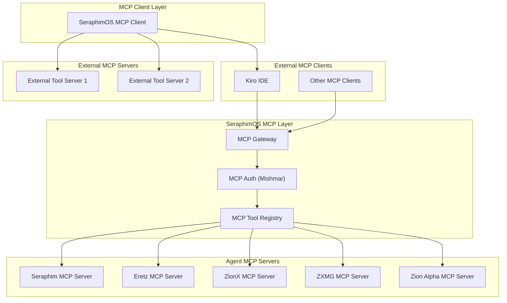
```mermaid
graph TB
    subgraph "External MCP Clients"
        Kiro["Kiro IDE"]
        ExtClient["Other MCP Clients"]
    end

    subgraph "SeraphimOS MCP Layer"
        MCPGateway["MCP Gateway"]
        ToolRegistry["MCP Tool Registry"]
        AuthLayer["MCP Auth (Mishmar)"]
    end

    subgraph "Agent MCP Servers"
        SeraphimMCP["Seraphim MCP Server"]
        EretzMCP["Eretz MCP Server"]
        ZionXMCP["ZionX MCP Server"]
        ZXMGMCP["ZXMG MCP Server"]
        ZionAlphaMCP["Zion Alpha MCP Server"]
    end

    subgraph "External MCP Servers"
        ExtMCP1["External Tool Server 1"]
        ExtMCP2["External Tool Server 2"]
    end

    subgraph "MCP Client Layer"
        MCPClient["SeraphimOS MCP Client"]
    end

    Kiro --> MCPGateway
    ExtClient --> MCPGateway
    MCPGateway --> AuthLayer
    AuthLayer --> ToolRegistry
    ToolRegistry --> SeraphimMCP
    ToolRegistry --> EretzMCP
    ToolRegistry --> ZionXMCP
    ToolRegistry --> ZXMGMCP
    ToolRegistry --> ZionAlphaMCP

    MCPClient --> ExtMCP1
    MCPClient --> ExtMCP2
    MCPClient --> Kiro
```

#### MCP Server Interface (Per-Agent)

```typescript
interface MCPServerHost {
  // Server lifecycle
  startServer(agentId: string, config: MCPServerConfig): Promise<MCPServer>;
  stopServer(agentId: string): Promise<void>;
  
  // Tool registration
  registerTool(agentId: string, tool: MCPToolDefinition): Promise<void>;
  unregisterTool(agentId: string, toolName: string): Promise<void>;
  
  // Connection management
  getConnections(agentId: string): Promise<MCPConnection[]>;
  disconnectClient(connectionId: string): Promise<void>;
}

interface MCPToolDefinition {
  name: string;
  description: string;
  inputSchema: JSONSchema;
  outputSchema: JSONSchema;
  requiredAuthority: 'L1' | 'L2' | 'L3' | 'L4';
  costEstimate?: number;  // estimated cost per invocation
}

interface MCPServerConfig {
  agentId: string;
  transport: 'stdio' | 'sse' | 'websocket';
  port?: number;
  authRequired: boolean;
  rateLimits: {
    requestsPerMinute: number;
    requestsPerHour: number;
  };
}
```

#### MCP Client Interface

```typescript
interface MCPClientManager {
  // Connection management
  connect(serverUrl: string, config: MCPClientConfig): Promise<MCPConnection>;
  disconnect(connectionId: string): Promise<void>;
  reconnect(connectionId: string): Promise<void>;
  
  // Tool discovery
  discoverTools(connectionId: string): Promise<MCPToolDefinition[]>;
  findToolByCapability(description: string): Promise<MCPToolMatch[]>;
  
  // Tool invocation
  invokeTool(connectionId: string, toolName: string, args: Record<string, unknown>): Promise<MCPToolResult>;
  
  // Health
  getConnectionHealth(connectionId: string): Promise<MCPConnectionHealth>;
}

interface MCPToolRegistry {
  // Registry management
  registerInternalTools(agentId: string, tools: MCPToolDefinition[]): Promise<void>;
  registerExternalServer(serverUrl: string, tools: MCPToolDefinition[]): Promise<void>;
  
  // Discovery
  listAllTools(): Promise<MCPRegistryEntry[]>;
  searchTools(query: string): Promise<MCPRegistryEntry[]>;
  getToolSchema(toolId: string): Promise<MCPToolDefinition>;
  
  // Semantic matching
  findByCapability(capabilityDescription: string): Promise<MCPToolMatch[]>;
}

interface MCPRegistryEntry {
  toolId: string;
  name: string;
  description: string;
  source: 'internal' | 'external';
  agentId?: string;
  serverUrl?: string;
  inputSchema: JSONSchema;
  outputSchema: JSONSchema;
  availability: 'available' | 'degraded' | 'unavailable';
  costEstimate: number;
  lastHealthCheck: Date;
}
```

#### Kiro-Seraphim MCP Bridge

```typescript
interface KiroSeraphimBridge {
  // Kiro → Seraphim direction
  handleKiroToolCall(toolName: string, args: Record<string, unknown>): Promise<unknown>;
  exposeAgentTools(): MCPToolDefinition[];
  
  // Seraphim → Kiro direction
  invokeKiroTool(tool: 'readFile' | 'writeFile' | 'runCommand' | 'search' | 'getDiagnostics', args: Record<string, unknown>): Promise<unknown>;
  
  // Connection
  establishBridge(kiroSessionId: string): Promise<BridgeConnection>;
  getBridgeStatus(): Promise<BridgeStatus>;
}
```

---

### Unified Agent Communication Layer Architecture

The communication layer provides persistent, multi-user, cross-agent chat with Telegram integration.

#### Communication Architecture Diagram

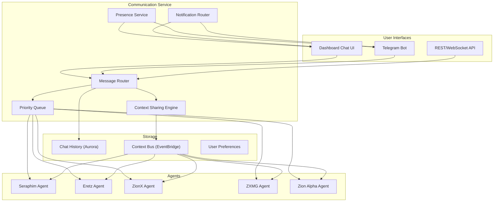
```mermaid
graph TB
    subgraph "User Interfaces"
        DashChat["Dashboard Chat UI"]
        TelegramBot["Telegram Bot"]
        API["REST/WebSocket API"]
    end

    subgraph "Communication Service"
        MsgRouter["Message Router"]
        ContextEngine["Context Sharing Engine"]
        PresenceService["Presence Service"]
        PriorityQueue["Priority Queue"]
        NotifRouter["Notification Router"]
    end

    subgraph "Storage"
        ChatDB["Chat History (Aurora)"]
        ContextBus["Context Bus (EventBridge)"]
        UserPrefs["User Preferences"]
    end

    subgraph "Agents"
        Seraphim["Seraphim Agent"]
        Eretz["Eretz Agent"]
        ZionX["ZionX Agent"]
        ZXMG["ZXMG Agent"]
        ZionAlpha["Zion Alpha Agent"]
    end

    DashChat --> MsgRouter
    TelegramBot --> MsgRouter
    API --> MsgRouter

    MsgRouter --> PriorityQueue
    PriorityQueue --> Seraphim
    PriorityQueue --> Eretz
    PriorityQueue --> ZionX
    PriorityQueue --> ZXMG
    PriorityQueue --> ZionAlpha

    MsgRouter --> ContextEngine
    ContextEngine --> ContextBus
    ContextBus --> Seraphim
    ContextBus --> Eretz
    ContextBus --> ZionX
    ContextBus --> ZXMG
    ContextBus --> ZionAlpha

    MsgRouter --> ChatDB
    PresenceService --> DashChat
    PresenceService --> TelegramBot
    NotifRouter --> DashChat
    NotifRouter --> TelegramBot
```

#### Communication Service Interface

```typescript
interface AgentCommunicationService {
  // Message handling
  sendMessage(message: UserMessage): Promise<MessageResponse>;
  getHistory(agentId: string, filter?: ChatFilter): Promise<ChatMessage[]>;
  searchHistory(agentId: string, query: string): Promise<ChatMessage[]>;
  
  // Multi-user
  getActiveUsers(agentId: string): Promise<ActiveUser[]>;
  getUnifiedHistory(agentId: string): Promise<ChatMessage[]>;  // all users combined
  
  // Context sharing
  shareContext(fromAgentId: string, toAgentId: string, context: SharedContext): Promise<void>;
  tagAgent(messageId: string, targetAgentId: string): Promise<void>;
  getSharedContextLog(agentId: string): Promise<ContextShareEvent[]>;
  
  // Presence
  getAgentPresence(agentId: string): Promise<AgentPresence>;
  subscribePresence(agentId: string, handler: (presence: AgentPresence) => void): Promise<string>;
}

interface UserMessage {
  userId: string;
  agentId: string;
  content: string;
  priority: 'low' | 'normal' | 'high' | 'critical';
  source: 'dashboard' | 'telegram' | 'api';
  attachments?: Attachment[];
  taggedAgents?: string[];  // @-mentioned agents
  replyTo?: string;  // message ID being replied to
}

interface ChatMessage {
  id: string;
  agentId: string;
  userId?: string;  // null for agent messages
  sender: 'user' | 'agent';
  senderName: string;
  content: string;
  timestamp: Date;
  source: 'dashboard' | 'telegram' | 'api';
  priority: 'low' | 'normal' | 'high' | 'critical';
  metadata: {
    responseTime?: number;  // ms for agent responses
    delegations?: DelegationInfo[];
    contextShared?: ContextShareEvent[];
    actionsTriggered?: string[];
  };
}

interface AgentPresence {
  agentId: string;
  status: 'idle' | 'working' | 'waiting_input' | 'thinking' | 'parallel_processing' | 'degraded';
  currentTask?: string;
  parallelTaskCount?: number;
  lastActivity: Date;
  queueDepth: number;  // messages waiting to be processed
}

interface DelegationInfo {
  delegatedTo: string;  // agent ID
  taskDescription: string;
  status: 'pending' | 'in_progress' | 'completed' | 'failed';
  startedAt: Date;
  completedAt?: Date;
  result?: string;
}
```

#### Context Sharing Engine Interface

```typescript
interface ContextSharingEngine {
  // Auto-detection
  analyzeRelevance(message: ChatMessage, agents: string[]): Promise<RelevanceResult[]>;
  
  // Propagation
  propagateContext(message: ChatMessage, targetAgents: string[], reason: 'auto_detected' | 'explicit_tag'): Promise<void>;
  
  // Handoff
  generateHandoffSummary(userId: string, fromAgentId: string, toAgentId: string): Promise<string>;
  
  // Configuration
  setHandoffMode(userId: string, mode: 'automatic' | 'on_request' | 'manual'): Promise<void>;
}

interface RelevanceResult {
  agentId: string;
  relevanceScore: number;  // 0-1
  reason: string;
  suggestedAction: 'share_full' | 'share_summary' | 'no_action';
}

interface ContextShareEvent {
  id: string;
  fromAgentId: string;
  toAgentId: string;
  messageId: string;
  reason: 'auto_detected' | 'explicit_tag' | 'handoff';
  relevanceScore: number;
  sharedContent: string;
  timestamp: Date;
  acknowledged: boolean;
}
```

#### Telegram Integration Interface

```typescript
interface TelegramIntegrationService {
  // Bot management
  initializeBot(config: TelegramBotConfig): Promise<void>;
  getBot(): TelegramBot;
  
  // Thread management
  createAgentThread(agentId: string): Promise<TelegramThread>;
  getAgentThread(agentId: string): Promise<TelegramThread>;
  
  // Message handling
  handleIncomingMessage(update: TelegramUpdate): Promise<void>;
  sendToThread(agentId: string, message: string, options?: TelegramMessageOptions): Promise<void>;
  
  // Synchronization
  syncToDashboard(telegramMessage: TelegramMessage): Promise<void>;
  syncFromDashboard(dashboardMessage: ChatMessage): Promise<void>;
  
  // User management
  linkAccount(telegramUserId: string, seraphimUserId: string): Promise<void>;
  getLinkedAccount(telegramUserId: string): Promise<string | null>;
  
  // Notifications
  deliverNotification(userId: string, notification: AgentNotification): Promise<void>;
  setNotificationPreferences(userId: string, prefs: TelegramNotificationPrefs): Promise<void>;
}

interface TelegramBotConfig {
  botToken: string;  // from Secrets Manager
  groupChatId: string;  // the main group chat
  agentThreadIds: Record<string, string>;  // agentId → threadId mapping
  webhookUrl?: string;
}

interface TelegramNotificationPrefs {
  enabled: boolean;
  priorityThreshold: 'low' | 'normal' | 'high' | 'critical';
  agentFilter?: string[];  // only these agents, or all if empty
  quietHours?: { start: string; end: string; timezone: string };
}
```

#### Notification Routing Engine Interface

```typescript
interface NotificationRoutingEngine {
  // Rule management
  setRules(userId: string, rules: NotificationRule[]): Promise<void>;
  getRules(userId: string): Promise<NotificationRule[]>;
  
  // Routing
  route(notification: AgentNotification): Promise<DeliveryResult[]>;
  
  // Escalation
  checkEscalation(notificationId: string): Promise<boolean>;
  escalate(notificationId: string): Promise<void>;
  
  // Acknowledgment
  acknowledge(notificationId: string, channel: string): Promise<void>;
  getUnacknowledged(userId: string): Promise<AgentNotification[]>;
}

interface NotificationRule {
  id: string;
  userId: string;
  conditions: {
    agentIds?: string[];
    priorityMin?: 'low' | 'normal' | 'high' | 'critical';
    notificationType?: string[];
    timeWindow?: { start: string; end: string; timezone: string };
  };
  channels: ('dashboard' | 'telegram' | 'email' | 'imessage')[];
  escalation?: {
    timeout: number;  // seconds
    escalateToChannel: string;
  };
}

interface AgentNotification {
  id: string;
  agentId: string;
  userId: string;
  type: 'task_complete' | 'needs_input' | 'alert' | 'delegation_complete' | 'recommendation';
  priority: 'low' | 'normal' | 'high' | 'critical';
  title: string;
  body: string;
  actionable: boolean;
  actions?: NotificationAction[];
  timestamp: Date;
}

interface NotificationAction {
  label: string;
  type: 'approve' | 'reject' | 'acknowledge' | 'custom';
  payload: Record<string, unknown>;
}
```

#### Database Schema Additions

```sql
-- Chat Messages
CREATE TABLE chat_messages (
  id UUID PRIMARY KEY DEFAULT gen_random_uuid(),
  tenant_id UUID NOT NULL REFERENCES tenants(id),
  agent_id VARCHAR(100) NOT NULL,
  user_id UUID REFERENCES tenants(id),  -- null for agent messages
  sender_type VARCHAR(10) NOT NULL CHECK (sender_type IN ('user', 'agent')),
  sender_name VARCHAR(255) NOT NULL,
  content TEXT NOT NULL,
  priority VARCHAR(10) DEFAULT 'normal' CHECK (priority IN ('low', 'normal', 'high', 'critical')),
  source VARCHAR(20) NOT NULL CHECK (source IN ('dashboard', 'telegram', 'api')),
  metadata JSONB DEFAULT '{}',
  reply_to UUID REFERENCES chat_messages(id),
  created_at TIMESTAMPTZ DEFAULT NOW()
);

CREATE INDEX idx_chat_agent_time ON chat_messages(tenant_id, agent_id, created_at DESC);
CREATE INDEX idx_chat_user_time ON chat_messages(tenant_id, user_id, created_at DESC);
CREATE INDEX idx_chat_source ON chat_messages(source, created_at DESC);

-- Context Share Events
CREATE TABLE context_share_events (
  id UUID PRIMARY KEY DEFAULT gen_random_uuid(),
  tenant_id UUID NOT NULL REFERENCES tenants(id),
  from_agent_id VARCHAR(100) NOT NULL,
  to_agent_id VARCHAR(100) NOT NULL,
  message_id UUID REFERENCES chat_messages(id),
  reason VARCHAR(20) NOT NULL CHECK (reason IN ('auto_detected', 'explicit_tag', 'handoff')),
  relevance_score DECIMAL(3, 2),
  shared_content TEXT NOT NULL,
  acknowledged BOOLEAN DEFAULT FALSE,
  created_at TIMESTAMPTZ DEFAULT NOW()
);

CREATE INDEX idx_context_share_agent ON context_share_events(tenant_id, to_agent_id, created_at DESC);

-- Notification Routing Rules
CREATE TABLE notification_rules (
  id UUID PRIMARY KEY DEFAULT gen_random_uuid(),
  tenant_id UUID NOT NULL REFERENCES tenants(id),
  user_id UUID NOT NULL,
  conditions JSONB NOT NULL,
  channels TEXT[] NOT NULL,
  escalation JSONB,
  created_at TIMESTAMPTZ DEFAULT NOW(),
  updated_at TIMESTAMPTZ DEFAULT NOW()
);

-- Notification Delivery Log
CREATE TABLE notification_deliveries (
  id UUID PRIMARY KEY DEFAULT gen_random_uuid(),
  tenant_id UUID NOT NULL REFERENCES tenants(id),
  notification_id UUID NOT NULL,
  user_id UUID NOT NULL,
  channel VARCHAR(20) NOT NULL,
  status VARCHAR(20) NOT NULL CHECK (status IN ('pending', 'delivered', 'acknowledged', 'escalated', 'failed')),
  delivered_at TIMESTAMPTZ,
  acknowledged_at TIMESTAMPTZ,
  created_at TIMESTAMPTZ DEFAULT NOW()
);

CREATE INDEX idx_notif_delivery_user ON notification_deliveries(tenant_id, user_id, status);

-- Telegram Account Links
CREATE TABLE telegram_account_links (
  id UUID PRIMARY KEY DEFAULT gen_random_uuid(),
  tenant_id UUID NOT NULL REFERENCES tenants(id),
  user_id UUID NOT NULL,
  telegram_user_id BIGINT NOT NULL UNIQUE,
  telegram_username VARCHAR(255),
  linked_at TIMESTAMPTZ DEFAULT NOW()
);

-- MCP Tool Registry
CREATE TABLE mcp_tool_registry (
  id UUID PRIMARY KEY DEFAULT gen_random_uuid(),
  tool_name VARCHAR(255) NOT NULL,
  description TEXT NOT NULL,
  source VARCHAR(20) NOT NULL CHECK (source IN ('internal', 'external')),
  agent_id VARCHAR(100),
  server_url VARCHAR(500),
  input_schema JSONB NOT NULL,
  output_schema JSONB NOT NULL,
  required_authority VARCHAR(5),
  cost_estimate DECIMAL(10, 6),
  availability VARCHAR(20) DEFAULT 'available',
  last_health_check TIMESTAMPTZ,
  created_at TIMESTAMPTZ DEFAULT NOW(),
  updated_at TIMESTAMPTZ DEFAULT NOW()
);

CREATE INDEX idx_mcp_tools_source ON mcp_tool_registry(source, availability);
CREATE INDEX idx_mcp_tools_agent ON mcp_tool_registry(agent_id);

-- Parallel Execution DAGs
CREATE TABLE parallel_execution_dags (
  id UUID PRIMARY KEY DEFAULT gen_random_uuid(),
  tenant_id UUID NOT NULL REFERENCES tenants(id),
  created_by VARCHAR(100) NOT NULL,
  tasks JSONB NOT NULL,
  edges JSONB NOT NULL,
  status VARCHAR(20) DEFAULT 'pending' CHECK (status IN ('pending', 'executing', 'completed', 'failed', 'cancelled')),
  metadata JSONB DEFAULT '{}',
  created_at TIMESTAMPTZ DEFAULT NOW(),
  completed_at TIMESTAMPTZ
);

CREATE INDEX idx_dag_status ON parallel_execution_dags(tenant_id, status);
```

#### Message Priority Queue Flow

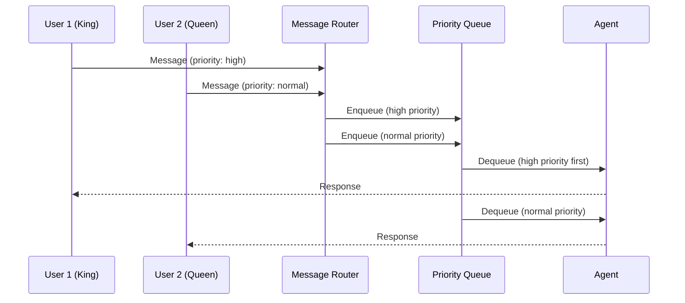
```mermaid
sequenceDiagram
    participant U1 as User 1 (King)
    participant U2 as User 2 (Queen)
    participant MR as Message Router
    participant PQ as Priority Queue
    participant Agent as Agent

    U1->>MR: Message (priority: high)
    U2->>MR: Message (priority: normal)
    MR->>PQ: Enqueue (high priority)
    MR->>PQ: Enqueue (normal priority)
    PQ->>Agent: Dequeue (high priority first)
    Agent-->>U1: Response
    PQ->>Agent: Dequeue (normal priority)
    Agent-->>U2: Response
```

#### Cross-Agent Context Sharing Flow

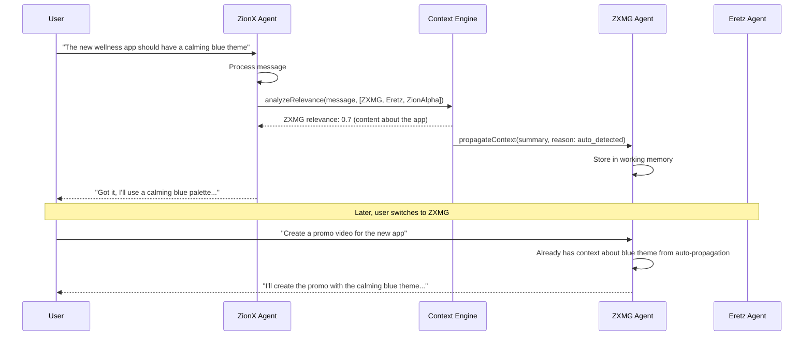
```mermaid
sequenceDiagram
    participant User as User
    participant ZionX as ZionX Agent
    participant CE as Context Engine
    participant ZXMG as ZXMG Agent
    participant Eretz as Eretz Agent

    User->>ZionX: "The new wellness app should have a calming blue theme"
    ZionX->>ZionX: Process message
    ZionX->>CE: analyzeRelevance(message, [ZXMG, Eretz, ZionAlpha])
    CE-->>ZionX: ZXMG relevance: 0.7 (content about the app)
    CE->>ZXMG: propagateContext(summary, reason: auto_detected)
    ZXMG->>ZXMG: Store in working memory
    ZionX-->>User: "Got it, I'll use a calming blue palette..."
    
    Note over User,Eretz: Later, user switches to ZXMG
    User->>ZXMG: "Create a promo video for the new app"
    ZXMG->>ZXMG: Already has context about blue theme from auto-propagation
    ZXMG-->>User: "I'll create the promo with the calming blue theme..."
```

#### Telegram-Dashboard Synchronization Flow

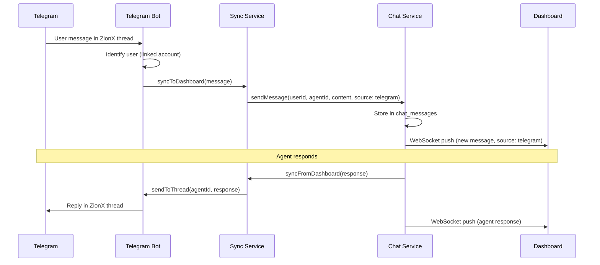
```mermaid
sequenceDiagram
    participant TG as Telegram
    participant Bot as Telegram Bot
    participant Sync as Sync Service
    participant Chat as Chat Service
    participant Dash as Dashboard

    TG->>Bot: User message in ZionX thread
    Bot->>Bot: Identify user (linked account)
    Bot->>Sync: syncToDashboard(message)
    Sync->>Chat: sendMessage(userId, agentId, content, source: telegram)
    Chat->>Chat: Store in chat_messages
    Chat->>Dash: WebSocket push (new message, source: telegram)
    
    Note over TG,Dash: Agent responds
    Chat->>Sync: syncFromDashboard(response)
    Sync->>Bot: sendToThread(agentId, response)
    Bot->>TG: Reply in ZionX thread
    Chat->>Dash: WebSocket push (agent response)
```


---

## Phase 9 — ZionX App Development Studio Architecture

### Overview

The ZionX App Development Studio is a new dashboard tab within the Shaar interface that provides a complete in-browser mobile app development experience. The King describes an app in natural language, ZionX generates it, a live mobile preview renders in-browser, and the King iterates through conversational edit commands. The studio integrates store asset generation, ad creative production, and platform-specific submission workflows through dedicated sub-agents.

This is NOT a standalone IDE — it's a Shaar dashboard view backed by the existing ZionX agent via WebSocket/REST. The AI edit loop goes through the existing ZionX agent chat interface (Requirement 37). The prompt panel IS the ZionX chat.

### Key Architectural Decisions

1. **Dashboard-first, not IDE-first** — The studio is a React frontend component within Shaar, not a separate application. It communicates with ZionX through the existing agent communication layer.
2. **React Native Web for Level 1 preview** — The in-browser preview uses React Native Web to render the generated app inside device frames. No native compilation needed for preview.
3. **Progressive preview maturity** — Three levels: L1 (React Native Web in-browser), L2 (Expo QR for real device), L3 (cloud emulator streaming). Each level is independently deployable.
4. **Sub-agent delegation for platform work** — Apple Release Agent and Google Play Release Agent handle platform-specific concerns independently, communicating through the existing MCP and event bus infrastructure.
5. **Existing infrastructure reuse** — WebSocket (Shaar), agent chat (Req 37), MCP tools (Phase 8), event hooks (Event Bus), credential management (Otzar), governance (Mishmar), audit (XO_Audit).

### System Architecture

```mermaid
graph TB
    subgraph "Shaar Dashboard — ZionX App Studio Tab"
        PromptPanel["Prompt/Spec Panel<br/>(ZionX Chat Interface)"]
        PreviewPanel["Mobile Preview Panel<br/>(React Native Web)"]
        CodePanel["Code/File Panel<br/>(File Tree + Viewer)"]
        IntegrationPanel["Integration Sidebar<br/>(Service Connections)"]
        TestPanel["Testing Panel<br/>(Quality Gates)"]
        BuildPanel["Build/Submit Panel<br/>(iOS + Android Status)"]
        AssetsPanel["Store Assets Tab<br/>(Screenshots + Graphics)"]
        AdPanel["Ad Studio Tab<br/>(Video Creatives)"]
        RevenuePanel["Revenue Panel<br/>(Metrics + Recommendations)"]
    end

    subgraph "Backend Services"
        StudioSession["Studio Session Manager"]
        EditController["AI Edit Controller"]
        PreviewRuntime["App Preview Runtime"]
        DeviceProfiles["Device Profile Manager"]
    end

    subgraph "Sub-Agents (via MCP)"
        AppleAgent["Apple Release Agent"]
        GoogleAgent["Google Play Release Agent"]
        AssetAgent["Store Asset Agent"]
        AdStudio["Ad Studio Agent"]
    end

    subgraph "Existing Infrastructure"
        ZionXAgent["ZionX Product Agent"]
        EventBus["Event Bus (Hooks)"]
        Otzar["Otzar (Budgets + Creds)"]
        Mishmar["Mishmar (Governance)"]
        XOAudit["XO Audit"]
        Zikaron["Zikaron (Memory)"]
        WebSocket["Shaar WebSocket"]
    end

    PromptPanel -->|"Natural language"| ZionXAgent
    ZionXAgent -->|"Code generation"| StudioSession
    StudioSession -->|"File changes"| PreviewRuntime
    PreviewRuntime -->|"Rendered frames"| PreviewPanel
    EditController -->|"Code mods"| StudioSession
    StudioSession -->|"Build artifacts"| AppleAgent
    StudioSession -->|"Build artifacts"| GoogleAgent
    StudioSession -->|"Preview captures"| AssetAgent
    StudioSession -->|"App recordings"| AdStudio
    StudioSession -->|"Lifecycle events"| EventBus
    ZionXAgent -->|"Token usage"| Otzar
    BuildPanel -->|"Approval requests"| Mishmar
    StudioSession -->|"All actions"| XOAudit
```

### Component Design

#### 1. Studio Session Manager

**Purpose:** Manages the lifecycle of an app development session — project state, file tree, build status, preview connection, and undo/redo history.

```typescript
interface StudioSession {
  sessionId: string;
  tenantId: string;
  appId: string;
  projectState: ProjectState;
  fileTree: FileNode[];
  buildStatus: BuildStatus;
  previewConnection: PreviewConnection;
  undoStack: EditCommand[];
  redoStack: EditCommand[];
  createdAt: Date;
  lastActivityAt: Date;
}

interface ProjectState {
  appName: string;
  appDescription: string;
  designSystem: DesignSystem;
  screens: ScreenDefinition[];
  navigation: NavigationConfig;
  integrations: IntegrationConfig[];
  monetization: MonetizationConfig;
  metadata: AppMetadata;
}

interface FileNode {
  path: string;
  type: 'file' | 'directory';
  language?: string;
  size?: number;
  children?: FileNode[];
}

interface BuildStatus {
  ios: PlatformBuildStatus;
  android: PlatformBuildStatus;
}

interface PlatformBuildStatus {
  state: 'idle' | 'building' | 'success' | 'failed';
  signingStatus: 'unsigned' | 'signed' | 'error';
  metadataReady: boolean;
  privacyPolicyPresent: boolean;
  screenshotsComplete: boolean;
  iapSandboxPassed: boolean;
  lastBuildAt?: Date;
  errorDetails?: string;
}
```

#### 2. App Preview Runtime

**Purpose:** Renders a live mobile app preview in the browser using React Native Web inside device frames.

```typescript
interface AppPreviewRuntime {
  // Level 1: React Native Web
  renderInBrowser(
    appBundle: AppBundle,
    deviceProfile: DeviceProfile
  ): PreviewInstance;
  
  // Level 2: Expo QR
  generateExpoQR(appBundle: AppBundle): QRCodeData;
  
  // Level 3: Cloud Emulator
  streamEmulator(
    appBundle: AppBundle,
    platform: 'ios' | 'android',
    deviceProfile: DeviceProfile
  ): EmulatorStream;
  
  // Common
  captureScreenshot(instance: PreviewInstance): Screenshot;
  captureVideo(instance: PreviewInstance, duration: number): VideoRecording;
  switchDevice(instance: PreviewInstance, device: DeviceProfile): void;
  reload(instance: PreviewInstance): void;
}

interface DeviceProfile {
  id: string;
  name: string; // "iPhone 15", "iPhone SE", "iPad", "Pixel 8", "Android Tablet"
  platform: 'ios' | 'android';
  width: number;
  height: number;
  scale: number;
  safeAreaInsets: { top: number; bottom: number; left: number; right: number };
  hasNotch: boolean;
  hasDynamicIsland: boolean;
  statusBarHeight: number;
}

interface PreviewInstance {
  instanceId: string;
  deviceProfile: DeviceProfile;
  currentScreen: string;
  isInteractive: boolean;
  lastReloadAt: Date;
}
```

#### 3. AI Edit Controller

**Purpose:** Accepts natural language edit commands, translates them into code modifications via ZionX, reruns tests, and triggers preview reload.

```typescript
interface AIEditController {
  applyEdit(
    sessionId: string,
    command: string // Natural language edit command
  ): Promise<EditResult>;
  
  undo(sessionId: string): Promise<EditResult>;
  redo(sessionId: string): Promise<EditResult>;
  
  getHistory(sessionId: string): EditCommand[];
}

interface EditCommand {
  id: string;
  naturalLanguageCommand: string;
  filesModified: FileChange[];
  testResults: TestResult[];
  previewReloaded: boolean;
  timestamp: Date;
  undone: boolean;
}

interface EditResult {
  success: boolean;
  filesModified: FileChange[];
  testResults: TestResult[];
  previewReloaded: boolean;
  errors?: string[];
}

interface FileChange {
  path: string;
  operation: 'create' | 'modify' | 'delete';
  diff?: string;
}
```

#### 4. Store Asset Generator

**Purpose:** Captures screenshots from the live preview across device sizes and generates all required store assets.

```typescript
interface StoreAssetGenerator {
  generateScreenshots(
    previewInstance: PreviewInstance,
    screens: string[],
    devices: DeviceProfile[]
  ): Promise<ScreenshotSet>;
  
  generateAppIcon(designSystem: DesignSystem): Promise<AppIcon>;
  
  generateFeatureGraphic(
    appMetadata: AppMetadata,
    screenshots: Screenshot[]
  ): Promise<FeatureGraphic>;
  
  generatePromoBanners(
    appMetadata: AppMetadata,
    screenshots: Screenshot[]
  ): Promise<PromoBanner[]>;
  
  generateCaptions(
    screenshots: Screenshot[],
    locale: string
  ): Promise<CaptionedScreenshot[]>;
  
  validateAssets(
    assets: StoreAssets,
    platform: 'apple' | 'google'
  ): ValidationResult;
}

interface StoreAssets {
  screenshots: {
    iphone67: Screenshot[];
    iphone65: Screenshot[];
    ipad: Screenshot[];
    googlePhone: Screenshot[];
    googleTablet: Screenshot[];
  };
  appIcon: AppIcon;
  featureGraphic: FeatureGraphic;
  promoBanners: PromoBanner[];
  captions: CaptionedScreenshot[];
}

interface ValidationResult {
  valid: boolean;
  issues: AssetIssue[];
}

interface AssetIssue {
  asset: string;
  issue: string;
  remediation: string;
  severity: 'error' | 'warning';
}
```

#### 5. Ad Studio

**Purpose:** Generates video ad creatives from app preview recordings and validates against ad network specifications.

```typescript
interface AdStudioService {
  generateVerticalAd(
    appRecording: VideoRecording,
    duration: 15 // seconds
  ): Promise<AdCreative>;
  
  generateHorizontalAd(
    appRecording: VideoRecording,
    duration: 30 // seconds
  ): Promise<AdCreative>;
  
  generateBumperAd(
    appRecording: VideoRecording,
    duration: 6 // seconds
  ): Promise<AdCreative>;
  
  generatePlayableAd(
    appBundle: AppBundle,
    interactiveElements: InteractiveElement[]
  ): Promise<PlayableAdCreative>;
  
  validateForNetwork(
    creative: AdCreative,
    network: 'admob' | 'applovin' | 'unity'
  ): AdValidationResult;
  
  exportForNetwork(
    creative: AdCreative,
    network: 'admob' | 'applovin' | 'unity'
  ): ExportedAd;
}

interface AdCreative {
  id: string;
  type: 'vertical_15s' | 'horizontal_30s' | 'bumper_6s' | 'playable';
  format: string; // mp4, html5, etc.
  width: number;
  height: number;
  duration: number;
  fileSize: number;
  url: string;
}

interface AdValidationResult {
  valid: boolean;
  network: string;
  issues: { rule: string; actual: string; required: string }[];
}
```

#### 6. Apple Release Agent

**Purpose:** Sub-agent owning the complete iOS release workflow from build to App Store submission.

```typescript
interface AppleReleaseAgent {
  // Build
  triggerXcodeBuild(session: StudioSession): Promise<IOSBuild>;
  manageBundleId(appMetadata: AppMetadata): Promise<BundleIdResult>;
  signBuild(build: IOSBuild, profile: ProvisioningProfile): Promise<SignedBuild>;
  
  // Metadata
  prepareAppStoreMetadata(appMetadata: AppMetadata): Promise<AppStoreMetadata>;
  generatePrivacyNutritionLabels(appAnalysis: AppAnalysis): Promise<PrivacyLabels>;
  
  // Validation
  validateIAP(products: IAPProduct[]): Promise<IAPValidationResult>;
  validateScreenshots(screenshots: Screenshot[]): Promise<HIGValidationResult>;
  
  // Distribution
  uploadToTestFlight(build: SignedBuild): Promise<TestFlightResult>;
  submitForReview(submission: AppStoreSubmission): Promise<ReviewSubmission>;
  
  // Rejection handling
  parseRejection(rejection: ReviewRejection): Promise<RejectionAnalysis>;
  generateRemediation(analysis: RejectionAnalysis): Promise<RemediationPlan>;
}
```

#### 7. Google Play Release Agent

**Purpose:** Sub-agent owning the complete Android release workflow from build to Play Store submission.

```typescript
interface GooglePlayReleaseAgent {
  // Build
  triggerGradleBuild(session: StudioSession): Promise<AndroidBuild>;
  managePackageName(appMetadata: AppMetadata): Promise<PackageNameResult>;
  signAAB(build: AndroidBuild, keystore: SigningKeystore): Promise<SignedAAB>;
  
  // Metadata
  preparePlayStoreMetadata(appMetadata: AppMetadata): Promise<PlayStoreMetadata>;
  generateDataSafetyForm(appAnalysis: AppAnalysis): Promise<DataSafetyForm>;
  
  // Validation
  validatePlayBilling(products: BillingProduct[]): Promise<BillingValidationResult>;
  
  // Distribution
  uploadToClosedTrack(build: SignedAAB, track: string): Promise<TrackResult>;
  promoteToProduction(track: string): Promise<ProductionRelease>;
  
  // Rejection handling
  parseRejection(rejection: PlayRejection): Promise<RejectionAnalysis>;
  generateRemediation(analysis: RejectionAnalysis): Promise<RemediationPlan>;
}
```

### Data Models

#### Studio Session (PostgreSQL)

```sql
CREATE TABLE studio_sessions (
  id UUID PRIMARY KEY DEFAULT gen_random_uuid(),
  tenant_id UUID NOT NULL REFERENCES tenants(id),
  app_id UUID NOT NULL,
  project_state JSONB NOT NULL,
  file_tree JSONB NOT NULL,
  build_status JSONB NOT NULL DEFAULT '{"ios": {"state": "idle"}, "android": {"state": "idle"}}',
  preview_maturity_level INTEGER NOT NULL DEFAULT 1,
  created_at TIMESTAMPTZ NOT NULL DEFAULT NOW(),
  last_activity_at TIMESTAMPTZ NOT NULL DEFAULT NOW(),
  CONSTRAINT fk_tenant FOREIGN KEY (tenant_id) REFERENCES tenants(id)
);

CREATE INDEX idx_studio_sessions_tenant ON studio_sessions(tenant_id);
CREATE INDEX idx_studio_sessions_app ON studio_sessions(app_id);
```

#### Edit History (PostgreSQL)

```sql
CREATE TABLE studio_edit_history (
  id UUID PRIMARY KEY DEFAULT gen_random_uuid(),
  session_id UUID NOT NULL REFERENCES studio_sessions(id),
  command_text TEXT NOT NULL,
  files_modified JSONB NOT NULL,
  test_results JSONB,
  preview_reloaded BOOLEAN NOT NULL DEFAULT false,
  undone BOOLEAN NOT NULL DEFAULT false,
  created_at TIMESTAMPTZ NOT NULL DEFAULT NOW()
);

CREATE INDEX idx_edit_history_session ON studio_edit_history(session_id, created_at);
```

#### Store Assets (PostgreSQL + S3)

```sql
CREATE TABLE studio_store_assets (
  id UUID PRIMARY KEY DEFAULT gen_random_uuid(),
  session_id UUID NOT NULL REFERENCES studio_sessions(id),
  asset_type VARCHAR(50) NOT NULL, -- 'screenshot', 'icon', 'feature_graphic', 'promo_banner', 'caption'
  platform VARCHAR(10) NOT NULL, -- 'apple', 'google', 'both'
  device_profile VARCHAR(50), -- 'iphone_67', 'iphone_65', 'ipad', 'google_phone', 'google_tablet'
  s3_key TEXT NOT NULL,
  width INTEGER NOT NULL,
  height INTEGER NOT NULL,
  file_size INTEGER NOT NULL,
  validation_status VARCHAR(20) NOT NULL DEFAULT 'pending', -- 'pending', 'valid', 'invalid'
  validation_issues JSONB,
  created_at TIMESTAMPTZ NOT NULL DEFAULT NOW()
);

CREATE INDEX idx_store_assets_session ON studio_store_assets(session_id, asset_type);
```

#### Ad Creatives (PostgreSQL + S3)

```sql
CREATE TABLE studio_ad_creatives (
  id UUID PRIMARY KEY DEFAULT gen_random_uuid(),
  session_id UUID NOT NULL REFERENCES studio_sessions(id),
  creative_type VARCHAR(30) NOT NULL, -- 'vertical_15s', 'horizontal_30s', 'bumper_6s', 'playable'
  target_network VARCHAR(20), -- 'admob', 'applovin', 'unity'
  s3_key TEXT NOT NULL,
  width INTEGER NOT NULL,
  height INTEGER NOT NULL,
  duration_seconds INTEGER,
  file_size INTEGER NOT NULL,
  validation_status VARCHAR(20) NOT NULL DEFAULT 'pending',
  validation_issues JSONB,
  created_at TIMESTAMPTZ NOT NULL DEFAULT NOW()
);

CREATE INDEX idx_ad_creatives_session ON studio_ad_creatives(session_id, creative_type);
```

### Hook Integration

The studio emits lifecycle hooks through the existing Event Bus infrastructure:

| Hook | Trigger | Downstream Action |
|------|---------|-------------------|
| `app.idea.created` | King submits app idea | Market research, competitor analysis, design baseline |
| `app.code.changed` | AI edit applied | Lint, typecheck, test execution, preview rebuild |
| `app.preview.updated` | Preview build refreshes | Screenshot regeneration, test execution |
| `app.screenflow.changed` | Navigation/screen layout changes | Screenshot regeneration |
| `app.ios.build.created` | iOS build initiated | Apple validation (Xcode, bundle ID, signing, metadata) |
| `app.android.build.created` | Android build initiated | Google validation (Gradle, package name, keystore, Data Safety) |
| `app.assets.requested` | Store Assets tab opened | Screenshot capture across all device sizes |
| `app.marketing.state.entered` | Ad Studio tab opened | Video ad creative generation |
| `app.store.gate.failed` | Gate check fails | Identify sub-agent, create rework task, rerun after fix |
| `app.submission.ready` | All gates pass | King approval request before final submission |

### MCP Tool Integration

Each sub-agent exposes and consumes MCP tools:

**ZionX App Studio MCP Tools (consumed):**
- `file.edit` — Apply code modifications
- `file.create` — Create new files
- `git.commit` — Version control operations
- `test.run` — Execute test suites
- `preview.launch` — Start preview runtime
- `preview.reload` — Reload preview after changes

**Apple Release Agent MCP Tools (exposed):**
- `apple.validateMetadata` — Validate App Store metadata
- `apple.uploadScreenshots` — Upload screenshots to App Store Connect
- `apple.submitForReview` — Submit app for Apple review
- `apple.checkReviewStatus` — Check review status
- `apple.uploadBuild` — Upload signed IPA to TestFlight

**Google Play Release Agent MCP Tools (exposed):**
- `google.validateListing` — Validate Play Store listing
- `google.uploadAssets` — Upload assets to Play Console
- `google.submitForReview` — Submit to production track
- `google.checkReviewStatus` — Check review status
- `google.uploadAAB` — Upload signed AAB

**Store Asset Agent MCP Tools (exposed):**
- `preview.captureScreen` — Capture screenshot from preview
- `preview.captureVideo` — Record video from preview
- `assets.generateIcon` — Generate app icon
- `assets.generateFeatureGraphic` — Generate feature graphic
- `assets.validate` — Validate assets against platform specs

**Ad Studio MCP Tools (exposed):**
- `ads.generateVertical` — Generate 15s vertical ad
- `ads.generateHorizontal` — Generate 30s horizontal ad
- `ads.generateBumper` — Generate 6s bumper ad
- `ads.generatePlayable` — Generate playable ad demo
- `ads.validateForNetwork` — Validate against ad network specs
- `heygen.createVideo` — Generate AI video via HeyGen driver

### Frontend Component Architecture

```mermaid
graph TB
    subgraph "ZionX App Studio Tab (React)"
        StudioLayout["StudioLayout"]
        
        subgraph "Left Panel"
            IntegrationSidebar["IntegrationSidebar"]
        end
        
        subgraph "Center Panel"
            TabBar["TabBar (Preview | Assets | Ads | Revenue)"]
            PreviewFrame["DeviceFramePreview"]
            AssetsGrid["StoreAssetsGrid"]
            AdCreativesList["AdCreativesList"]
            RevenueCharts["RevenueCharts"]
        end
        
        subgraph "Right Panel"
            ChatPanel["ZionX Chat (Prompt + Edit)"]
            FileTree["FileTreePanel"]
            TestResults["TestResultsPanel"]
            BuildStatus["BuildStatusPanel"]
        end
    end

    StudioLayout --> IntegrationSidebar
    StudioLayout --> TabBar
    StudioLayout --> ChatPanel
    TabBar --> PreviewFrame
    TabBar --> AssetsGrid
    TabBar --> AdCreativesList
    TabBar --> RevenueCharts
    ChatPanel --> FileTree
    ChatPanel --> TestResults
    ChatPanel --> BuildStatus
```

### Preview Rendering Architecture (Level 1)

```mermaid
sequenceDiagram
    participant King as King (Browser)
    participant Studio as Studio Frontend
    participant WS as WebSocket
    participant ZionX as ZionX Agent
    participant Preview as Preview Runtime
    participant RNW as React Native Web

    King->>Studio: "Build me a meditation app"
    Studio->>WS: sendMessage(zionx, prompt)
    WS->>ZionX: Process app idea
    ZionX->>ZionX: Generate spec + code
    ZionX->>WS: codeGenerated(files)
    WS->>Studio: Update file tree
    Studio->>Preview: buildPreview(files)
    Preview->>RNW: Bundle React Native Web
    RNW->>Studio: Rendered app in iframe
    Studio->>King: Live preview in device frame
    
    King->>Studio: "Make the header purple"
    Studio->>WS: sendMessage(zionx, edit)
    WS->>ZionX: Process edit command
    ZionX->>ZionX: Modify code + run tests
    ZionX->>WS: editApplied(changes, testResults)
    WS->>Studio: Update file tree + tests
    Studio->>Preview: hotReload(changes)
    Preview->>RNW: Apply changes
    RNW->>Studio: Updated preview
    Studio->>King: Preview refreshed
```

### Security Considerations

1. **Code execution isolation** — Preview runtime runs in a sandboxed iframe with restricted permissions (no network access to internal services, no file system access)
2. **Credential protection** — API keys and environment variables stored in Otzar, injected at build time, never exposed in the frontend UI
3. **Governance enforcement** — Store submissions require Mishmar approval (L1 authority — King approval)
4. **Audit trail** — Every action (create, edit, build, submit, asset generation) logged to XO_Audit
5. **Budget enforcement** — LLM token usage for code generation and editing tracked and enforced via Otzar budgets

### Performance Requirements

| Operation | Target Latency |
|-----------|---------------|
| Device frame switch | < 2 seconds |
| Preview hot reload after edit | < 3 seconds |
| Screenshot capture (single device) | < 5 seconds |
| Full screenshot set (all devices) | < 30 seconds |
| Ad creative generation (15s video) | < 60 seconds |
| iOS build trigger to status update | < 10 seconds (status polling) |
| File tree refresh after edit | < 1 second |


---

## Phase 10 — ZXMG Video Development Studio Architecture

### Overview

The ZXMG Video Development Studio is a new dashboard tab within the Shaar interface that provides a complete AI video production experience organized by channel. ZXMG autonomously researches trending topics and fills the content pipeline with ranked ideas. The King selects a channel, reviews the pipeline, clicks "Generate" on ideas to produce videos, provides edit feedback to refine them, and clicks "Publish" when satisfied. The autonomy is in the thinking (research + ideation); the King controls what gets made and what goes live.

This is a Shaar dashboard view backed by the existing ZXMG agent via WebSocket/REST. The autonomous pipeline integrates with the existing ZXMG state machine (planning → script → asset creation → video assembly → upload → monitoring).

### Key Architectural Decisions

1. **Autonomous ideation, human-gated production and publishing** — ZXMG autonomously researches and fills the content pipeline. The King clicks "Generate" to produce a video (gate 1), reviews it with edit feedback, then clicks "Publish" to push it live (gate 2). No video is produced or published without explicit King action.
2. **Channel-centric organization** — All pipeline views, generation queues, edit sessions, and publishing actions are organized BY CHANNEL. The King selects a channel and sees only that channel's content.
3. **Iterative edit feedback loop** — After generation, the King can give natural language feedback ("make the intro shorter", "re-do scene 3") and ZXMG re-generates affected portions while preserving the rest — same pattern as ZionX App Studio's AI edit loop.
4. **Multi-model video generation** — Different AI models excel at different shot types. Otzar routes each scene to the optimal model based on shot type, quality requirements, and budget constraints.
5. **Zikaron-backed learning** — Every content performance outcome feeds back into Zikaron procedural memory, enabling the autonomous engine to continuously improve what it ideates.
6. **Existing infrastructure reuse** — WebSocket (Shaar), agent chat (Req 37), MCP tools (Phase 8), event hooks (Event Bus), credential management (Otzar), governance (Mishmar), audit (XO_Audit), memory (Zikaron).
7. **Platform-native distribution** — Content is formatted per platform requirements at export time. Each platform gets optimized aspect ratio, duration, captions, and scheduling.

### System Architecture

```mermaid
graph TB
    subgraph "Shaar Dashboard — ZXMG Video Studio Tab"
        ChatPanel["AI Chat Panel<br/>(Pipeline View + Override)"]
        VideoPreview["Video Preview Panel<br/>(Player + Timeline)"]
        ToolSidebar["Tool Sidebar<br/>(13 Tool Buttons)"]
    end

    subgraph "Autonomous Content Engine"
        TrendEngine["Trend Intelligence Engine"]
        ContentCalendar["Content Calendar Generator"]
        PipelineManager["Pipeline Manager<br/>(Per-Channel, 7-14 day rolling)"]
        ChannelSelector["Channel Selector"]
    end

    subgraph "Video Production Pipeline"
        ScriptGen["Script Generator"]
        SceneBreakdown["Scene Decomposer"]
        ModelRouter["Multi-Model Video Router"]
        VideoAssembler["Video Assembler"]
        TimelineEditor["Timeline Editor"]
        EditFeedback["Edit Feedback Loop<br/>(NL edits → re-generate)"]
    end

    subgraph "AI Video Models (via Otzar)"
        Sora["Sora 2 / Veo 3<br/>(Cinematic)"]
        Kling["Kling / WAN / Minimax<br/>(Fast Iteration)"]
        AnimModels["Animation Models<br/>(Specialized)"]
    end

    subgraph "Distribution & Analytics"
        PlatformDist["Platform Distribution Engine"]
        ThumbnailGen["Thumbnail Generator"]
        AnalyticsEngine["Analytics Engine"]
        PerformanceTracker["Performance Tracker"]
    end

    subgraph "Existing Infrastructure"
        ZXMGAgent["ZXMG Agent"]
        EventBus["Event Bus (Hooks)"]
        Otzar["Otzar (Budgets + Model Routing)"]
        Mishmar["Mishmar (Governance)"]
        XOAudit["XO Audit"]
        Zikaron["Zikaron (Memory + Learning)"]
        WebSocket["Shaar WebSocket"]
        YouTubeAPI["YouTube API Driver"]
        BrowserAuto["Browser Automation"]
    end

    ChatPanel -->|"Override commands"| ZXMGAgent
    TrendEngine -->|"Research signals"| ContentCalendar
    ContentCalendar -->|"Ranked ideas"| PipelineManager
    PipelineManager -->|"Auto-execute"| AutoExecutor
    AutoExecutor -->|"Produce"| ScriptGen
    ScriptGen -->|"Script"| SceneBreakdown
    SceneBreakdown -->|"Scenes"| ModelRouter
    ModelRouter -->|"Route by type"| Sora
    ModelRouter -->|"Route by type"| Kling
    ModelRouter -->|"Route by type"| AnimModels
    Sora -->|"Clips"| VideoAssembler
    Kling -->|"Clips"| VideoAssembler
    AnimModels -->|"Clips"| VideoAssembler
    VideoAssembler -->|"Full video"| TimelineEditor
    TimelineEditor -->|"Final cut"| PlatformDist
    PlatformDist -->|"Publish"| YouTubeAPI
    AnalyticsEngine -->|"Metrics"| PerformanceTracker
    PerformanceTracker -->|"Learnings"| Zikaron
    TrendEngine -->|"Signals"| BrowserAuto
    TrendEngine -->|"Data"| YouTubeAPI
    ModelRouter -->|"Budget check"| Otzar
    PipelineManager -->|"Lifecycle events"| EventBus
    ZXMGAgent -->|"All actions"| XOAudit
    VideoPreview -->|"Real-time"| WebSocket
```

### Component Design

#### 1. Autonomous Content Engine

**Purpose:** The default operating mode — researches trends, generates content ideas, maintains the rolling pipeline, and auto-executes production without King intervention.

```typescript
interface AutonomousContentEngine {
  // Research
  runTrendResearch(channelId: string): Promise<TrendResearchResult>;
  analyzeCompetitors(channelId: string): Promise<CompetitorAnalysis>;
  identifyContentGaps(channelId: string): Promise<ContentGap[]>;
  detectViralPatterns(platform: Platform): Promise<ViralPattern[]>;
  
  // Calendar Generation
  generateContentCalendar(
    channelId: string,
    daysAhead: number // 7-14
  ): Promise<ContentCalendarEntry[]>;
  
  // Pipeline Management
  getPipeline(channelId: string): Promise<PipelineItem[]>;
  autoExecuteItem(itemId: string): Promise<ProductionResult>;
  
  // King Override
  approveItem(itemId: string): Promise<void>;
  rejectItem(itemId: string, reason: string): Promise<void>;
  modifyItem(itemId: string, modifications: Partial<PipelineItem>): Promise<void>;
}

interface ContentCalendarEntry {
  id: string;
  channelId: string;
  concept: VideoConceptSummary;
  predictedViews: number;
  predictedEngagementRate: number;
  predictedRevenue: number;
  recommendedPublishDate: Date;
  scheduledProductionStart: Date;
  status: 'pending' | 'approved' | 'rejected' | 'in_production' | 'published';
  autoExecuteAt: Date; // 24hr after scheduledProductionStart
}

interface PipelineItem {
  id: string;
  channelId: string;
  calendarEntry: ContentCalendarEntry;
  script?: VideoScript;
  scenes?: SceneDefinition[];
  renderedClips?: RenderedClip[];
  assembledVideo?: AssembledVideo;
  thumbnails?: ThumbnailVariant[];
  metadata?: VideoMetadata;
  distributionStatus: DistributionStatus;
}

interface TrendResearchResult {
  trendingTopics: TrendingTopic[];
  algorithmSignals: AlgorithmSignal[];
  competitorInsights: CompetitorInsight[];
  contentGaps: ContentGap[];
  viralPatterns: ViralPattern[];
  researchedAt: Date;
  confidence: number;
}
```

#### 2. Trend Intelligence Engine

**Purpose:** Real-time analysis of trending content across platforms using browser automation and APIs.

```typescript
interface TrendIntelligenceEngine {
  // Platform Analysis
  analyzeTrendingTopics(platform: Platform): Promise<TrendingTopic[]>;
  detectAlgorithmSignals(platform: Platform): Promise<AlgorithmSignal[]>;
  
  // Competitor Analysis
  analyzeCompetitorChannel(channelUrl: string): Promise<ChannelAnalysis>;
  comparePerformance(
    channelId: string,
    competitors: string[]
  ): Promise<PerformanceComparison>;
  
  // Audience Analysis
  analyzeRetentionCurves(videoIds: string[]): Promise<RetentionAnalysis>;
  identifyDropOffPatterns(channelId: string): Promise<DropOffPattern[]>;
  
  // Content Intelligence
  identifyContentGaps(niche: string): Promise<ContentGap[]>;
  detectViralPatterns(timeframe: TimeRange): Promise<ViralPattern[]>;
  
  // Learning
  storeInsights(insights: TrendInsight[]): Promise<void>; // → Zikaron
}

interface TrendingTopic {
  topic: string;
  platform: Platform;
  velocity: number; // growth rate
  volume: number; // search/view volume
  competition: 'low' | 'medium' | 'high';
  relevanceScore: number; // to channel niche
  detectedAt: Date;
}

interface AlgorithmSignal {
  platform: Platform;
  signalType: 'format_boost' | 'topic_boost' | 'length_preference' | 'engagement_weight';
  description: string;
  confidence: number;
  detectedAt: Date;
  expiresAt?: Date;
}

interface ViralPattern {
  patternType: 'hook' | 'pacing' | 'format' | 'thumbnail' | 'title';
  description: string;
  examples: string[];
  effectivenessScore: number;
  applicableNiches: string[];
}

type Platform = 'youtube' | 'tiktok' | 'instagram' | 'x' | 'facebook' | 'rumble';
```

#### 3. Multi-Model Video Router

**Purpose:** Routes video generation requests to the optimal AI model based on shot type, quality requirements, and budget.

```typescript
interface MultiModelVideoRouter {
  routeScene(
    scene: SceneDefinition,
    qualityRequirement: QualityLevel,
    budget: BudgetConstraint
  ): Promise<ModelRouting>;
  
  generateClip(
    routing: ModelRouting,
    scene: SceneDefinition
  ): Promise<RenderedClip>;
  
  getAvailableModels(): ModelCapability[];
  getModelCosts(): ModelCostTable;
}

interface ModelRouting {
  modelId: string;
  modelName: string;
  provider: 'openai' | 'google' | 'kling' | 'wan' | 'minimax' | 'custom';
  reason: string;
  estimatedCost: number;
  estimatedDuration: number;
}

interface ModelCapability {
  modelId: string;
  name: string;
  provider: string;
  strengths: ShotType[];
  maxDuration: number; // seconds per clip
  supportedInputs: ('text' | 'image' | 'audio')[];
  supportsCameraControl: boolean;
  supportsLipSync: boolean;
  supportsCharacterPersistence: boolean;
  costPerSecond: number;
  qualityTier: 'premium' | 'standard' | 'fast';
}

type ShotType = 'cinematic' | 'dramatic' | 'animation' | 'documentary' | 'tutorial' | 'vlog' | 'music_video' | 'fast_iteration';
type QualityLevel = 'premium' | 'standard' | 'draft';

interface SceneDefinition {
  id: string;
  sequenceNumber: number;
  duration: number; // seconds
  visualDescription: string;
  cameraDirection: CameraDirection;
  audioLayers: AudioLayerSpec[];
  characterRefs: CharacterRef[];
  style: ShotType;
  inputMode: 'text' | 'image' | 'audio';
  inputAsset?: string; // URL to input image/audio if applicable
}

interface CameraDirection {
  shotType: 'wide' | 'medium' | 'close' | 'extreme_close';
  movement: 'static' | 'pan' | 'zoom' | 'dolly' | 'crane' | 'tracking';
  movementParams?: { direction: string; speed: 'slow' | 'medium' | 'fast' };
}

interface CharacterRef {
  characterId: string;
  name: string;
  persistenceProfile: string; // Zikaron reference for face/body consistency
  hasDialogue: boolean;
  lipSyncRequired: boolean;
}
```

#### 4. Video Production Pipeline

**Purpose:** Orchestrates the full production flow from script to assembled video.

```typescript
interface VideoProductionPipeline {
  // Script Generation
  generateScript(
    concept: VideoConceptSummary,
    channelConfig: ChannelConfig,
    trendContext: TrendResearchResult
  ): Promise<VideoScript>;
  
  // Scene Breakdown
  decomposeScript(script: VideoScript): Promise<SceneDefinition[]>;
  
  // Rendering
  renderScene(scene: SceneDefinition): Promise<RenderedClip>;
  renderAllScenes(scenes: SceneDefinition[]): Promise<RenderedClip[]>;
  
  // Assembly
  assembleVideo(
    clips: RenderedClip[],
    audioLayers: AudioLayer[],
    transitions: TransitionConfig[]
  ): Promise<AssembledVideo>;
  
  // Post-Production
  applyColorGrading(video: AssembledVideo, preset: string): Promise<AssembledVideo>;
  addCaptions(video: AssembledVideo, language: string): Promise<AssembledVideo>;
  exportMultiFormat(video: AssembledVideo): Promise<ExportedFormats>;
}

interface VideoScript {
  id: string;
  title: string;
  description: string;
  totalDuration: number; // seconds
  scenes: ScriptScene[];
  audioDirection: AudioDirection;
  visualStyleGuide: VisualStyleGuide;
  targetAudience: string;
  hooks: string[]; // opening hooks
}

interface AssembledVideo {
  id: string;
  scriptId: string;
  duration: number;
  resolution: { width: number; height: number };
  fps: number;
  audioTracks: AudioTrack[];
  scenes: AssembledScene[];
  colorGrading?: string;
  captions?: CaptionTrack;
  fileSize: number;
  storageUrl: string;
}

interface ExportedFormats {
  youtube_16_9: ExportedFile;
  shorts_9_16: ExportedFile;
  instagram_1_1: ExportedFile;
  tiktok_9_16: ExportedFile;
}

interface ExportedFile {
  format: string;
  resolution: { width: number; height: number };
  duration: number;
  fileSize: number;
  storageUrl: string;
}
```

#### 5. Platform Distribution Engine

**Purpose:** Handles multi-platform publishing with platform-specific formatting and optimal scheduling.

```typescript
interface PlatformDistributionEngine {
  // Publishing
  publishToYouTube(
    video: ExportedFile,
    metadata: YouTubeMetadata,
    schedule?: Date
  ): Promise<PublishResult>;
  
  publishToTikTok(
    video: ExportedFile,
    metadata: TikTokMetadata,
    schedule?: Date
  ): Promise<PublishResult>;
  
  publishToInstagram(
    video: ExportedFile,
    metadata: InstagramMetadata,
    schedule?: Date
  ): Promise<PublishResult>;
  
  publishToX(video: ExportedFile, metadata: XMetadata): Promise<PublishResult>;
  publishToFacebook(video: ExportedFile, metadata: FacebookMetadata): Promise<PublishResult>;
  publishToRumble(video: ExportedFile, metadata: RumbleMetadata): Promise<PublishResult>;
  
  // Scheduling
  getOptimalPublishTime(
    channelId: string,
    platform: Platform
  ): Promise<Date>;
  
  // Repurposing
  generateShorts(longFormVideo: AssembledVideo): Promise<ExportedFile[]>;
  generateClips(longFormVideo: AssembledVideo, highlights: TimeRange[]): Promise<ExportedFile[]>;
  generateTeasers(longFormVideo: AssembledVideo): Promise<ExportedFile[]>;
}

interface PublishResult {
  success: boolean;
  platform: Platform;
  platformVideoId?: string;
  publishedUrl?: string;
  scheduledAt?: Date;
  error?: string;
}

interface YouTubeMetadata {
  title: string;
  description: string;
  tags: string[];
  category: string;
  thumbnailUrl: string;
  playlistIds?: string[];
  visibility: 'public' | 'unlisted' | 'private';
  madeForKids: boolean;
  language: string;
}
```

#### 6. Channel Manager

**Purpose:** Manages multiple YouTube channels with per-channel strategy and analytics.

```typescript
interface ChannelManager {
  // Configuration
  addChannel(config: ChannelConfig): Promise<Channel>;
  updateChannel(channelId: string, updates: Partial<ChannelConfig>): Promise<Channel>;
  getChannels(): Promise<Channel[]>;
  
  // Analytics
  getChannelAnalytics(channelId: string, timeRange: TimeRange): Promise<ChannelAnalytics>;
  getChannelHealth(channelId: string): Promise<ChannelHealth>;
  
  // Cross-Channel
  getCrossPromotionOpportunities(channelId: string): Promise<CrossPromoOpportunity[]>;
}

interface ChannelConfig {
  channelId: string;
  youtubeChannelId: string;
  name: string;
  niche: string;
  toneOfVoice: string;
  postingCadence: PostingCadence;
  targetAudience: AudienceDemographic;
  contentPillars: string[];
  performanceBaseline: PerformanceBaseline;
  autoPublish: boolean; // whether autonomous publishing is enabled
  approvalRequired: boolean; // whether King must approve before publish
}

interface ChannelAnalytics {
  channelId: string;
  timeRange: TimeRange;
  views: number;
  subscribers: number;
  subscriberGrowth: number;
  revenue: number;
  averageRetention: number;
  averageCTR: number;
  topVideos: VideoPerformance[];
  growthRate: number;
}

interface ChannelHealth {
  channelId: string;
  growthTrend: 'accelerating' | 'stable' | 'declining';
  engagementTrend: 'improving' | 'stable' | 'declining';
  algorithmStanding: 'favored' | 'neutral' | 'suppressed';
  alerts: HealthAlert[];
}

interface HealthAlert {
  type: 'growth_decline' | 'engagement_drop' | 'algorithm_change' | 'competitor_surge';
  severity: 'info' | 'warning' | 'critical';
  message: string;
  recommendation: string;
  detectedAt: Date;
}
```

#### 7. Thumbnail and SEO Generator

**Purpose:** Generates thumbnail variants and optimizes titles/descriptions for maximum CTR and discoverability.

```typescript
interface ThumbnailSEOGenerator {
  // Thumbnails
  generateThumbnails(
    video: AssembledVideo,
    channelStyle: ChannelConfig,
    count: number // minimum 3
  ): Promise<ThumbnailVariant[]>;
  
  // SEO
  generateTitleVariants(
    script: VideoScript,
    trendContext: TrendResearchResult
  ): Promise<TitleVariant[]>;
  
  generateDescription(
    script: VideoScript,
    channelConfig: ChannelConfig
  ): Promise<string>;
  
  generateTags(
    script: VideoScript,
    trendContext: TrendResearchResult
  ): Promise<string[]>;
  
  // A/B Learning
  recordABResult(
    videoId: string,
    winningThumbnail: string,
    metrics: ABTestMetrics
  ): Promise<void>; // stores in Zikaron
}

interface ThumbnailVariant {
  id: string;
  imageUrl: string;
  style: 'face_close' | 'text_overlay' | 'dramatic' | 'curiosity_gap' | 'before_after';
  predictedCTR: number;
  width: number;
  height: number;
}

interface TitleVariant {
  title: string;
  style: 'curiosity' | 'how_to' | 'listicle' | 'challenge' | 'story';
  predictedCTR: number;
  searchVolume: number;
}
```

### Data Models

#### Content Pipeline (PostgreSQL)

```sql
CREATE TABLE video_pipeline_items (
  id UUID PRIMARY KEY DEFAULT gen_random_uuid(),
  tenant_id UUID NOT NULL REFERENCES tenants(id),
  channel_id UUID NOT NULL REFERENCES video_channels(id),
  concept JSONB NOT NULL,
  predicted_views INTEGER,
  predicted_engagement_rate DECIMAL(5,4),
  predicted_revenue DECIMAL(10,2),
  recommended_publish_date TIMESTAMPTZ,
  scheduled_production_start TIMESTAMPTZ,
  auto_execute_at TIMESTAMPTZ,
  status VARCHAR(30) NOT NULL DEFAULT 'pending',
  script JSONB,
  scenes JSONB,
  assembled_video_url TEXT,
  thumbnails JSONB,
  metadata JSONB,
  created_at TIMESTAMPTZ NOT NULL DEFAULT NOW(),
  updated_at TIMESTAMPTZ NOT NULL DEFAULT NOW()
);

CREATE INDEX idx_pipeline_channel ON video_pipeline_items(channel_id, status);
CREATE INDEX idx_pipeline_auto_execute ON video_pipeline_items(auto_execute_at) WHERE status = 'pending';
CREATE INDEX idx_pipeline_tenant ON video_pipeline_items(tenant_id);
```

#### Video Channels (PostgreSQL)

```sql
CREATE TABLE video_channels (
  id UUID PRIMARY KEY DEFAULT gen_random_uuid(),
  tenant_id UUID NOT NULL REFERENCES tenants(id),
  youtube_channel_id VARCHAR(50) NOT NULL,
  name VARCHAR(200) NOT NULL,
  niche VARCHAR(100) NOT NULL,
  tone_of_voice TEXT,
  posting_cadence JSONB NOT NULL,
  target_audience JSONB,
  content_pillars JSONB,
  performance_baseline JSONB,
  auto_publish BOOLEAN NOT NULL DEFAULT true,
  approval_required BOOLEAN NOT NULL DEFAULT false,
  created_at TIMESTAMPTZ NOT NULL DEFAULT NOW(),
  updated_at TIMESTAMPTZ NOT NULL DEFAULT NOW()
);

CREATE INDEX idx_channels_tenant ON video_channels(tenant_id);
CREATE UNIQUE INDEX idx_channels_youtube ON video_channels(youtube_channel_id);
```

#### Rendered Scenes (PostgreSQL + S3)

```sql
CREATE TABLE video_rendered_scenes (
  id UUID PRIMARY KEY DEFAULT gen_random_uuid(),
  pipeline_item_id UUID NOT NULL REFERENCES video_pipeline_items(id),
  sequence_number INTEGER NOT NULL,
  model_used VARCHAR(50) NOT NULL,
  model_provider VARCHAR(30) NOT NULL,
  duration_seconds DECIMAL(6,2) NOT NULL,
  resolution_width INTEGER NOT NULL,
  resolution_height INTEGER NOT NULL,
  s3_key TEXT NOT NULL,
  file_size INTEGER NOT NULL,
  render_cost DECIMAL(8,4),
  render_duration_ms INTEGER,
  created_at TIMESTAMPTZ NOT NULL DEFAULT NOW()
);

CREATE INDEX idx_scenes_pipeline ON video_rendered_scenes(pipeline_item_id, sequence_number);
```

#### Video Performance (PostgreSQL)

```sql
CREATE TABLE video_performance (
  id UUID PRIMARY KEY DEFAULT gen_random_uuid(),
  pipeline_item_id UUID NOT NULL REFERENCES video_pipeline_items(id),
  channel_id UUID NOT NULL REFERENCES video_channels(id),
  platform VARCHAR(20) NOT NULL,
  platform_video_id VARCHAR(100),
  views INTEGER NOT NULL DEFAULT 0,
  watch_time_hours DECIMAL(10,2) NOT NULL DEFAULT 0,
  engagement_rate DECIMAL(5,4),
  click_through_rate DECIMAL(5,4),
  average_retention DECIMAL(5,4),
  revenue_adsense DECIMAL(10,2) NOT NULL DEFAULT 0,
  revenue_sponsorship DECIMAL(10,2) NOT NULL DEFAULT 0,
  revenue_affiliate DECIMAL(10,2) NOT NULL DEFAULT 0,
  retention_curve JSONB,
  published_at TIMESTAMPTZ,
  last_updated_at TIMESTAMPTZ NOT NULL DEFAULT NOW()
);

CREATE INDEX idx_performance_pipeline ON video_performance(pipeline_item_id);
CREATE INDEX idx_performance_channel ON video_performance(channel_id, published_at);
```

#### Trend Research Cache (PostgreSQL)

```sql
CREATE TABLE video_trend_research (
  id UUID PRIMARY KEY DEFAULT gen_random_uuid(),
  channel_id UUID REFERENCES video_channels(id),
  platform VARCHAR(20) NOT NULL,
  research_type VARCHAR(30) NOT NULL,
  results JSONB NOT NULL,
  confidence DECIMAL(3,2) NOT NULL,
  researched_at TIMESTAMPTZ NOT NULL DEFAULT NOW(),
  expires_at TIMESTAMPTZ
);

CREATE INDEX idx_trend_research_channel ON video_trend_research(channel_id, research_type);
CREATE INDEX idx_trend_research_expiry ON video_trend_research(expires_at);
```

### Hook Integration

The studio emits lifecycle hooks through the existing Event Bus infrastructure:

| Hook | Trigger | Downstream Action |
|------|---------|-------------------|
| `video.idea.generated` | Autonomous engine generates new content idea | Notification to King, pipeline update |
| `video.script.created` | Script generated for a video | Scene decomposition, production start |
| `video.scene.rendered` | Individual scene clip generated | Assembly progress update, cost tracking |
| `video.assembled` | Full video assembled from scenes | Thumbnail generation, metadata prep |
| `video.thumbnail.generated` | Thumbnail variants created | A/B test setup, publish readiness check |
| `video.scheduled` | Video scheduled for upload | Calendar update, notification |
| `video.published` | Video uploaded to platform | Performance tracking start |
| `video.performance.update` | Performance metrics updated | Learning engine, optimization recommendations |
| `video.pipeline.updated` | Pipeline modified (approve/reject/modify) | Calendar recalculation, production scheduling |

### Frontend Component Architecture

```mermaid
graph TB
    subgraph "ZXMG Video Studio Tab (React)"
        StudioLayout["VideoStudioLayout"]
        
        subgraph "Left Panel (1fr)"
            ChatPanel["ZXMG Chat Panel"]
            PipelineView["Autonomous Pipeline View"]
        end
        
        subgraph "Center Panel (2fr)"
            VideoPlayer["Video Preview Player"]
            Timeline["Timeline Editor"]
            SceneThumbs["Scene Thumbnail Strip"]
            AudioWaveform["Audio Waveform"]
        end
        
        subgraph "Right Panel (64px)"
            ToolSidebar["Tool Sidebar"]
            ScriptTool["📋 Script"]
            ScenesTool["🎬 Scenes"]
            CharactersTool["👤 Characters"]
            AudioTool["🎵 Audio"]
            EffectsTool["✨ Effects"]
            TrendsTool["📈 Trends"]
            ThumbsTool["🖼️ Thumbnails"]
            CaptionsTool["💬 Captions"]
            ExportTool["📤 Export"]
            AnalyticsTool["📊 Analytics"]
            PublishTool["🚀 Publish"]
            PipelineTool["🤖 Pipeline"]
            ResearchTool["🔬 Research"]
        end
    end

    StudioLayout --> ChatPanel
    StudioLayout --> PipelineView
    StudioLayout --> VideoPlayer
    StudioLayout --> Timeline
    StudioLayout --> SceneThumbs
    StudioLayout --> AudioWaveform
    StudioLayout --> ToolSidebar
```

### Autonomous Pipeline Sequence

```mermaid
sequenceDiagram
    participant Engine as Autonomous Content Engine
    participant Trend as Trend Intelligence
    participant Zikaron as Zikaron Memory
    participant Pipeline as Pipeline Manager
    participant King as King (Dashboard)
    participant Prod as Production Pipeline
    participant Models as AI Video Models
    participant Dist as Distribution Engine
    participant YouTube as YouTube API

    Note over Engine: Runs continuously per channel
    Engine->>Trend: Research trending topics
    Trend->>Trend: Analyze YouTube, TikTok, Instagram
    Trend->>Zikaron: Store trend insights
    Trend->>Engine: TrendResearchResult
    
    Engine->>Zikaron: Query past performance patterns
    Zikaron->>Engine: Successful content patterns
    
    Engine->>Pipeline: Generate calendar entries (7-14 days)
    Pipeline->>King: Display pipeline (via WebSocket)
    
    Note over Pipeline: 24hr timeout starts
    
    alt King intervenes
        King->>Pipeline: Approve/Modify/Reject
        Pipeline->>Pipeline: Update pipeline state
    else No intervention (24hr timeout)
        Pipeline->>Prod: Auto-execute item
    end
    
    Prod->>Prod: Generate script
    Prod->>Prod: Decompose into scenes
    
    loop For each scene
        Prod->>Models: Route to optimal model
        Models->>Prod: Rendered clip
    end
    
    Prod->>Prod: Assemble video
    Prod->>Prod: Generate thumbnails (3+ variants)
    Prod->>Prod: Optimize title/description/tags
    
    Prod->>Dist: Publish to platforms
    Dist->>YouTube: Upload with metadata
    YouTube->>Dist: Published URL
    
    Note over Dist: Performance tracking begins
    Dist->>Zikaron: Store performance outcomes
    Zikaron->>Engine: Feed back into next cycle
```

### Security Considerations

1. **API credential isolation** — YouTube API keys, platform tokens stored in Otzar, never exposed in frontend
2. **Model API key management** — Sora/Veo/Kling API keys managed by Otzar with per-model budget enforcement
3. **Content safety** — Generated video content passes through content safety filters before publishing
4. **Governance enforcement** — Optional Mishmar approval before autonomous publishing (configurable per channel)
5. **Audit trail** — Every action from research to publish logged to XO_Audit
6. **Budget enforcement** — Otzar enforces per-channel and per-video budget limits for AI model usage

### Performance Requirements

| Operation | Target Latency |
|-----------|---------------|
| Trend research cycle (per channel) | < 5 minutes |
| Script generation | < 30 seconds |
| Scene rendering (single clip, 10s) | < 120 seconds |
| Full video assembly (15 min video) | < 10 minutes |
| Thumbnail generation (3 variants) | < 30 seconds |
| Platform publish (single platform) | < 60 seconds |
| Pipeline refresh (WebSocket) | < 1 second |
| Analytics update | < 5 seconds |
| Content calendar generation | < 60 seconds |


---

## Phase 11 — ZionX Autonomous App Ideation Engine + Eretz Business Command Center

### Overview

Phase 11 adds two major features: (1) an autonomous app ideation pipeline for ZionX that mirrors the ZXMG Video Studio's autonomous content engine pattern, and (2) a dedicated full-page Eretz Business Command Center dashboard tab. Both features extend the existing Shaar dashboard with new full-page views backed by existing services.

The ZionX Ideation Engine autonomously researches app markets, scores niches, generates ranked app ideas, and presents them in a pipeline view alongside the existing manual chat interface. The King clicks "Generate" to build any idea (Gate 1) and "Publish" to submit to stores (Gate 2) — identical to the ZXMG two-gate pattern.

The Eretz Business Command Center is a dedicated full-page tab providing a single pane of glass for the entire business portfolio. It consumes existing Eretz services (portfolio-dashboard.ts, synergy-engine.ts, pattern-library.ts, training-cascade.ts) and presents them in a unified real-time dashboard.

### Key Architectural Decisions

1. **Mirror ZXMG autonomous pattern** — The ZionX ideation engine follows the exact same autonomous-research → ranked-pipeline → human-gated-execution pattern as ZXMG Video Studio (Requirement 44). Autonomous ideation, human-gated generation and publishing.
2. **Dual input paths, single pipeline** — Both autonomous ideas and manual King-created ideas feed into the same pipeline → Generate → Review → Publish flow. The pipeline is the single source of truth for all app ideas regardless of origin.
3. **Existing ZionX Studio integration** — When the King clicks "Generate" on a pipeline idea, it feeds directly into the existing ZionX App Development Studio (Requirement 42) flow. No new generation infrastructure needed.
4. **Presentation layer only for Command Center** — The Eretz Business Command Center does NOT duplicate business logic. It is a React frontend that consumes existing Eretz service APIs through WebSocket and REST.
5. **WebSocket real-time for both features** — Both the ideation pipeline and the command center use the existing Shaar WebSocket infrastructure for real-time updates.
6. **Zikaron-backed learning** — The ideation engine stores all research, scoring, and outcome data in Zikaron, enabling continuous improvement of predictions based on actual app performance.

### System Architecture — ZionX Autonomous App Ideation Engine

```mermaid
graph TB
    subgraph "Shaar Dashboard — ZionX App Studio Tab (Updated)"
        ChatPanel["ZionX AI Chat Panel<br/>(Manual App Creation)"]
        PipelineView["Autonomous Pipeline View<br/>(Ranked Ideas + Generate Buttons)"]
        StudioPanels["Existing Studio Panels<br/>(Preview, Code, Build, etc.)"]
    end

    subgraph "Autonomous Ideation Engine"
        MarketResearch["Market Research Engine"]
        NicheScoring["Niche Scoring Algorithm"]
        IdeaGenerator["App Idea Generator"]
        PipelineManager["Pipeline Manager<br/>(Ranked Ideas)"]
    end

    subgraph "Data Sources"
        AppStore["Apple App Store<br/>(Rankings, Reviews, Revenue)"]
        PlayStore["Google Play Store<br/>(Rankings, Reviews, Revenue)"]
        BrowserAuto["Browser Automation<br/>(SensorTower, AppAnnie)"]
    end

    subgraph "Existing Infrastructure"
        ZionXAgent["ZionX Product Agent"]
        ZionXStudio["ZionX App Studio (Req 42)"]
        EventBus["Event Bus (Hooks)"]
        Zikaron["Zikaron (Memory + Learning)"]
        XOAudit["XO Audit"]
        WebSocket["Shaar WebSocket"]
    end

    MarketResearch -->|"Scan categories"| AppStore
    MarketResearch -->|"Scan categories"| PlayStore
    MarketResearch -->|"Trend data"| BrowserAuto
    MarketResearch -->|"Store findings"| Zikaron
    MarketResearch -->|"Scored niches"| NicheScoring
    NicheScoring -->|"High-scoring niches"| IdeaGenerator
    IdeaGenerator -->|"Ranked ideas"| PipelineManager
    PipelineManager -->|"Display pipeline"| PipelineView
    PipelineManager -->|"Lifecycle events"| EventBus
    PipelineView -->|"King clicks Generate"| ZionXStudio
    ChatPanel -->|"Manual ideas"| PipelineManager
    Zikaron -->|"Historical success data"| NicheScoring
    PipelineManager -->|"All actions"| XOAudit
    PipelineView -->|"Real-time updates"| WebSocket
```

### Component Design — ZionX Autonomous App Ideation Engine

#### 1. Market Research Engine

**Purpose:** Autonomously scans app markets to identify opportunities, gaps, and trends.

```typescript
interface MarketResearchEngine {
  // Research Cycles
  runResearchCycle(): Promise<MarketResearchResult>;
  scanAppStoreCategory(category: string, store: 'apple' | 'google'): Promise<CategoryAnalysis>;
  analyzeCompetitorApps(niche: string): Promise<CompetitorAnalysis[]>;
  identifyReviewGaps(category: string): Promise<ReviewGap[]>;
  detectEmergingNiches(): Promise<EmergingNiche[]>;

  // Data Storage
  storeResearchFindings(findings: MarketResearchResult): Promise<void>; // → Zikaron
  getHistoricalResearch(niche: string): Promise<MarketResearchResult[]>;
}

interface MarketResearchResult {
  id: string;
  researchedAt: Date;
  categories: CategoryAnalysis[];
  emergingNiches: EmergingNiche[];
  competitorGaps: CompetitorGap[];
  revenueOpportunities: RevenueOpportunity[];
  confidence: number;
}

interface CategoryAnalysis {
  category: string;
  store: 'apple' | 'google';
  topApps: AppRanking[];
  averageRevenue: number;
  totalDownloads: number;
  competitionDensity: number;
  growthTrend: 'rising' | 'stable' | 'declining';
  reviewSentiment: number; // -1 to 1
}

interface CompetitorGap {
  niche: string;
  existingApps: string[];
  missingFeatures: string[];
  userComplaints: string[];
  opportunityScore: number;
}

interface RevenueOpportunity {
  niche: string;
  estimatedMarketSize: number;
  averageRevenuePerApp: number;
  competitionLevel: 'low' | 'medium' | 'high';
  entryBarrier: 'low' | 'medium' | 'high';
}

interface EmergingNiche {
  name: string;
  description: string;
  growthVelocity: number;
  currentAppCount: number;
  estimatedDemand: number;
  detectedAt: Date;
}
```

#### 2. Niche Scoring Algorithm

**Purpose:** Scores identified niches using a composite algorithm with learning-based weight adjustment.

```typescript
interface NicheScoringAlgorithm {
  scoreNiche(niche: NicheData): Promise<NicheScore>;
  batchScoreNiches(niches: NicheData[]): Promise<NicheScore[]>;
  updateWeights(outcomes: IdeaOutcome[]): Promise<void>; // Learn from results
  getWeights(): ScoringWeights;
}

interface NicheData {
  name: string;
  marketSize: number; // total addressable downloads
  competitionDensity: number; // number of established apps
  revenuePotential: number; // average revenue per app in niche
  technicalFeasibility: number; // complexity relative to ZionX capabilities
  growthTrend: number; // market growth rate
  reviewGapScore: number; // unmet user needs
}

interface NicheScore {
  niche: string;
  compositeScore: number; // 0-100 normalized
  factorBreakdown: {
    marketSize: { raw: number; weighted: number };
    competitionDensity: { raw: number; weighted: number };
    revenuePotential: { raw: number; weighted: number };
    technicalFeasibility: { raw: number; weighted: number };
    growthTrend: { raw: number; weighted: number };
    reviewGapScore: { raw: number; weighted: number };
  };
  confidence: number;
  scoredAt: Date;
}

interface ScoringWeights {
  marketSize: number;
  competitionDensity: number; // inverse — lower competition = higher score
  revenuePotential: number;
  technicalFeasibility: number;
  growthTrend: number;
  reviewGapScore: number;
  lastCalibrated: Date;
}

interface IdeaOutcome {
  ideaId: string;
  nicheScore: NicheScore;
  actualDownloads30Day: number;
  actualRevenue30Day: number;
  actualCompetitionEncountered: 'low' | 'medium' | 'high';
  publishedAt: Date;
  measuredAt: Date;
}
```

#### 3. Pipeline Manager

**Purpose:** Manages the ranked pipeline of app ideas from both autonomous and manual sources.

```typescript
interface AppIdeaPipelineManager {
  // Pipeline Operations
  addIdea(idea: AppIdea, source: 'autonomous' | 'manual'): Promise<string>;
  removeIdea(ideaId: string): Promise<void>;
  rankPipeline(): Promise<AppIdea[]>;
  getIdea(ideaId: string): Promise<AppIdea>;
  getPipeline(filters?: PipelineFilters): Promise<AppIdea[]>;

  // Status Management
  markAsGenerating(ideaId: string): Promise<void>;
  markAsGenerated(ideaId: string): Promise<void>;
  markAsPublished(ideaId: string): Promise<void>;
  dismissIdea(ideaId: string): Promise<void>;
  bookmarkIdea(ideaId: string): Promise<void>;

  // Pipeline Maintenance
  refreshPipeline(): Promise<void>; // Re-score, remove stale
  pruneStaleIdeas(maxAgeDays: number): Promise<number>;
}

interface AppIdea {
  id: string;
  source: 'autonomous' | 'manual';
  name: string;
  valueProposition: string;
  targetAudience: string;
  monetizationModel: 'subscription' | 'freemium' | 'paid' | 'ad_supported' | 'hybrid';
  predictedDownloads30Day: number;
  predictedMonthlyRevenue: number;
  competitionLevel: 'low' | 'medium' | 'high';
  nicheScore: NicheScore;
  marketAnalysis: {
    niche: string;
    competitors: string[];
    differentiators: string[];
    revenueModel: string;
  };
  status: 'pipeline' | 'generating' | 'generated' | 'published' | 'dismissed' | 'bookmarked';
  createdAt: Date;
  lastScoredAt: Date;
}

interface PipelineFilters {
  category?: string;
  minRevenuePotential?: number;
  maxCompetitionLevel?: 'low' | 'medium' | 'high';
  minFeasibilityScore?: number;
  status?: AppIdea['status'];
}
```

### System Architecture — Eretz Business Command Center

```mermaid
graph TB
    subgraph "Shaar Dashboard — Eretz Command Center Tab"
        PortfolioHeader["Portfolio Overview Header<br/>(Total MRR, Revenue, Growth, Health)"]
        SubCards["Subsidiary Cards<br/>(ZionX, ZXMG, Zion Alpha)"]
        SynergyMap["Synergy Map Visualization<br/>(Active Synergies + Revenue Impact)"]
        PatternBrowser["Pattern Library Browser<br/>(Searchable + Adoption Metrics)"]
        TrainingView["Training Cascade Effectiveness<br/>(Quality Trends per Subsidiary)"]
        RecommendationQueue["Recommendation Queue<br/>(Approve/Reject/Modify)"]
        AlertsPanel["Decline Alerts Panel<br/>(Real-time + Intervention Plans)"]
        ResourceView["Resource Allocation View<br/>(Budget Distribution + Controls)"]
        StrategyPanel["Strategic Priorities<br/>(Portfolio Thesis + Per-Sub Priorities)"]
    end

    subgraph "Existing Eretz Services (Backend)"
        PortfolioDashboard["portfolio-dashboard.ts<br/>(Metrics, Alerts, Strategy)"]
        SynergyEngine["synergy-engine.ts<br/>(Synergies, Revenue Impact)"]
        PatternLibrary["pattern-library.ts<br/>(Patterns, Adoption)"]
        TrainingCascade["training-cascade.ts<br/>(Quality Trends)"]
    end

    subgraph "Existing Infrastructure"
        WebSocket["Shaar WebSocket"]
        EventBus["Event Bus"]
        RecommendationSvc["Recommendation Queue Service"]
    end

    PortfolioHeader -->|"REST/WS"| PortfolioDashboard
    SubCards -->|"REST/WS"| PortfolioDashboard
    SynergyMap -->|"REST/WS"| SynergyEngine
    PatternBrowser -->|"REST/WS"| PatternLibrary
    TrainingView -->|"REST/WS"| TrainingCascade
    RecommendationQueue -->|"REST/WS"| RecommendationSvc
    AlertsPanel -->|"WS Push"| PortfolioDashboard
    ResourceView -->|"REST/WS"| PortfolioDashboard
    StrategyPanel -->|"REST/WS"| PortfolioDashboard

    PortfolioDashboard -->|"Real-time updates"| WebSocket
    SynergyEngine -->|"Synergy events"| EventBus
    EventBus -->|"Push to dashboard"| WebSocket
```

### Component Design — Eretz Business Command Center

#### 1. Command Center Layout

**Purpose:** Full-page React component providing the single pane of glass for the business portfolio.

```typescript
interface EretzCommandCenterProps {
  // All data sourced from existing Eretz services via WebSocket/REST
}

interface CommandCenterState {
  portfolioMetrics: PortfolioMetrics;
  subsidiaryCards: SubsidiaryCardData[];
  activeSynergies: SynergyMapData;
  patterns: PatternLibraryData;
  trainingEffectiveness: TrainingCascadeData;
  recommendations: PendingRecommendation[];
  declineAlerts: DeclineAlert[];
  resourceAllocation: ResourceAllocationData;
  strategy: PortfolioStrategy;
  wsConnected: boolean;
}

interface SubsidiaryCardData {
  subsidiary: string;
  displayName: string;
  // ZionX-specific
  appsCount?: number;
  totalAppRevenue?: number;
  topApps?: { name: string; revenue: number }[];
  appPipelineCount?: number;
  // ZXMG-specific
  channelsCount?: number;
  totalViews30Day?: number;
  totalChannelRevenue?: number;
  topChannels?: { name: string; revenue: number }[];
  contentPipelineCount?: number;
  // Zion Alpha-specific
  activePositions?: number;
  totalPnL?: number;
  winRate?: number;
  currentStrategy?: string;
  riskExposure?: 'low' | 'medium' | 'high';
  // Common
  growthTrend: 'accelerating' | 'stable' | 'declining';
  mrrContribution: number;
  revenueContribution: number;
}

interface SynergyMapData {
  synergies: {
    id: string;
    sourceSubsidiary: string;
    targetSubsidiary: string;
    type: string;
    revenueImpact: number;
    status: 'active' | 'proposed' | 'measuring';
  }[];
  totalSynergyRevenue: number;
}

interface ResourceAllocationData {
  allocations: {
    subsidiary: string;
    budgetPercentage: number;
    actualSpend: number;
    recommendedPercentage: number;
  }[];
  totalBudget: number;
}

interface PendingRecommendation {
  id: string;
  summary: string;
  priority: number;
  sourceAgent: string;
  domain: string;
  submittedAt: Date;
  actionPlan: string;
  estimatedImpact: string;
}
```

#### 2. WebSocket Integration

**Purpose:** Real-time data delivery to the Command Center via existing Shaar WebSocket infrastructure.

```typescript
interface CommandCenterWebSocket {
  // Subscribe to real-time updates
  subscribeToMetrics(): void;
  subscribeToAlerts(): void;
  subscribeToRecommendations(): void;
  subscribeToSynergies(): void;

  // Event handlers
  onMetricsUpdate(handler: (metrics: PortfolioMetrics) => void): void;
  onAlertReceived(handler: (alert: DeclineAlert) => void): void;
  onRecommendationUpdate(handler: (rec: PendingRecommendation) => void): void;
  onSynergyUpdate(handler: (synergy: SynergyMapData) => void): void;

  // Actions (sent to backend)
  approveRecommendation(recId: string): Promise<void>;
  rejectRecommendation(recId: string, reason?: string): Promise<void>;
  modifyRecommendation(recId: string, modifications: Record<string, unknown>): Promise<void>;
  updateResourceAllocation(allocations: { subsidiary: string; percentage: number }[]): Promise<void>;
}
```

### Data Flow

Both features are presentation layers over existing services:

| Feature | Data Source | Transport | Update Frequency |
|---------|------------|-----------|-----------------|
| ZionX Pipeline View | AppIdeaPipelineManager | WebSocket | On pipeline change |
| ZionX Market Research | MarketResearchEngine → Zikaron | REST (background) | Every 6 hours |
| Eretz Portfolio Metrics | portfolio-dashboard.ts | WebSocket | Real-time |
| Eretz Decline Alerts | portfolio-dashboard.ts | WebSocket push | Immediate |
| Eretz Synergy Map | synergy-engine.ts | WebSocket | On synergy change |
| Eretz Pattern Library | pattern-library.ts | REST + WS | On pattern update |
| Eretz Training Cascade | training-cascade.ts | REST + WS | On training cycle |
| Eretz Recommendations | RecommendationQueue | WebSocket | On submission |
| Eretz Resource Allocation | portfolio-dashboard.ts | REST + WS | On strategy update |

### Hook Integration — ZionX Ideation Engine

| Hook | Trigger | Downstream Action |
|------|---------|-------------------|
| `app.idea.researched` | Market research cycle completes | Pipeline refresh, niche scoring |
| `app.idea.ranked` | New ideas added or re-ranked in pipeline | Dashboard pipeline view update |
| `app.pipeline.updated` | Pipeline state changes (add/remove/status) | WebSocket push to dashboard |

### Frontend Component Architecture — Eretz Command Center

```mermaid
graph TB
    subgraph "Eretz Command Center Tab (React)"
        CommandCenter["EretzCommandCenter"]

        subgraph "Top Section"
            PortfolioHeader["PortfolioOverviewHeader"]
            SubsidiaryCards["SubsidiaryCardGrid"]
            ZionXCard["ZionXCard"]
            ZXMGCard["ZXMGCard"]
            ZionAlphaCard["ZionAlphaCard"]
        end

        subgraph "Middle Section"
            SynergyMap["SynergyMapVisualization"]
            PatternBrowser["PatternLibraryBrowser"]
            TrainingChart["TrainingCascadeChart"]
        end

        subgraph "Bottom Section"
            RecommendationQueue["RecommendationQueuePanel"]
            AlertsPanel["DeclineAlertsPanel"]
            ResourceAllocation["ResourceAllocationView"]
            StrategyPanel["StrategicPrioritiesPanel"]
        end
    end

    CommandCenter --> PortfolioHeader
    CommandCenter --> SubsidiaryCards
    SubsidiaryCards --> ZionXCard
    SubsidiaryCards --> ZXMGCard
    SubsidiaryCards --> ZionAlphaCard
    CommandCenter --> SynergyMap
    CommandCenter --> PatternBrowser
    CommandCenter --> TrainingChart
    CommandCenter --> RecommendationQueue
    CommandCenter --> AlertsPanel
    CommandCenter --> ResourceAllocation
    CommandCenter --> StrategyPanel
```

### Security Considerations

1. **Read-only by default** — The Command Center is primarily a read view. Write operations (approve/reject recommendations, adjust allocations) go through existing Mishmar governance.
2. **No credential exposure** — All API keys and service credentials remain in Otzar; the dashboard never handles raw credentials.
3. **Audit trail** — All King actions in the Command Center (approvals, rejections, allocation changes) are logged to XO_Audit.
4. **Market research data isolation** — App market research data is tenant-scoped and stored in Zikaron with appropriate access controls.

### Performance Requirements

| Operation | Target Latency |
|-----------|---------------|
| Market research cycle (full scan) | < 10 minutes |
| Niche scoring (single niche) | < 2 seconds |
| Pipeline refresh (re-rank all ideas) | < 5 seconds |
| Command Center initial load | < 3 seconds |
| WebSocket metric push | < 500ms |
| Recommendation action (approve/reject) | < 1 second |
| Resource allocation update | < 2 seconds |
| Alert delivery (event to display) | < 1 second |


---

## Seraphim Core Architecture Views — Dashboard Integration Design

### Overview

This section defines the design for five new tabs integrated into the Seraphim Core section of the Shaar dashboard: OV-1 Operational View, SV-1 System View, Requirements, Design, and Capabilities. The architecture diagrams follow INCOSE Systems Engineering standards (OV-1 for operational context, SV-1 for system decomposition) and are rendered as interactive, color SVG visuals with click-to-zoom modal interaction. The document tabs render live markdown content from the spec documents with real-time auto-sync via WebSocket.

### Component Architecture

```mermaid
graph TB
    subgraph "Seraphim Core Dashboard Section"
        NavItems["Navigation Items<br/>(5 new tabs)"]
        OV1View["OV-1 Operational View"]
        SV1View["SV-1 System View"]
        ReqView["Requirements View"]
        DesignView["Design View"]
        CapView["Capabilities View"]
    end

    subgraph "Shared Components"
        DiagramRenderer["Diagram Renderer<br/>(SVG generation)"]
        DiagramModal["Diagram Modal<br/>(Pan + Zoom)"]
        MarkdownRenderer["Markdown Renderer<br/>(marked + highlight.js)"]
        MermaidRenderer["Mermaid Renderer<br/>(mermaid.js)"]
    end

    subgraph "Services"
        DocAPI["Document API<br/>(GET /specs/:docType)"]
        WSSync["WebSocket Sync<br/>(spec.document.updated)"]
    end

    subgraph "Data Sources"
        ReqMD["requirements.md"]
        DesignMD["design.md"]
        CapMD["capabilities.md"]
    end

    NavItems --> OV1View
    NavItems --> SV1View
    NavItems --> ReqView
    NavItems --> DesignView
    NavItems --> CapView

    OV1View --> DiagramRenderer
    SV1View --> DiagramRenderer
    OV1View --> DiagramModal
    SV1View --> DiagramModal

    ReqView --> MarkdownRenderer
    DesignView --> MarkdownRenderer
    DesignView --> MermaidRenderer
    CapView --> MarkdownRenderer

    ReqView --> DocAPI
    DesignView --> DocAPI
    CapView --> DocAPI

    DocAPI --> ReqMD
    DocAPI --> DesignMD
    DocAPI --> CapMD

    WSSync --> ReqView
    WSSync --> DesignView
    WSSync --> CapView
```

### Diagram Renderer Design

The Diagram Renderer generates color SVG diagrams programmatically using structured diagram definitions. Each diagram is defined as a TypeScript data structure specifying nodes, connections, layers, and styling — then rendered to SVG at runtime.

#### Color Palette (WCAG 2.1 AA Compliant)

| Layer | Background Color | Text Color | Hex (BG) | Purpose |
|-------|-----------------|------------|-----------|---------|
| Interface (Shaar) | Light Blue | Dark Navy | `#DBEAFE` / `#1E3A5F` | User-facing components |
| Kernel (Seraphim Core) | Deep Purple | White | `#7C3AED` / `#FFFFFF` | Core orchestration |
| System Services | Emerald Green | White | `#059669` / `#FFFFFF` | Platform services |
| Application Layer | Amber/Gold | Dark Brown | `#F59E0B` / `#451A03` | Business pillars |
| Driver Layer | Slate Gray | White | `#475569` / `#FFFFFF` | External adapters |
| Data Layer | Indigo | White | `#4338CA` / `#FFFFFF` | Persistence |

#### Connection Line Colors

| Flow Type | Color | Hex | Style |
|-----------|-------|-----|-------|
| Command Flow | Red-Orange | `#DC2626` | Solid, arrow |
| Data Flow | Blue | `#2563EB` | Solid, arrow |
| Event Flow | Green | `#16A34A` | Dashed, arrow |
| Information Flow | Purple | `#9333EA` | Dotted, arrow |

#### OV-1 Diagram Structure (INCOSE Operational View)

The OV-1 shows the operational context — who interacts with the system, what operational activities exist, and how information flows at the mission level.

```typescript
interface OV1DiagramDefinition {
  actors: {
    king: { label: 'King (Primary User)'; type: 'human'; position: 'top-center' };
    queen: { label: 'Queen (Family)'; type: 'human'; position: 'top-right' };
  };
  orchestrator: {
    seraphim: { label: 'Seraphim Core'; type: 'system'; position: 'center' };
  };
  operationalNodes: {
    eretz: { label: 'Eretz (Business)'; domain: 'business'; position: 'mid-left' };
    zionx: { label: 'ZionX (Apps)'; domain: 'business'; position: 'mid-center-left' };
    zxmg: { label: 'ZXMG (Media)'; domain: 'business'; position: 'mid-center-right' };
    zionAlpha: { label: 'Zion Alpha (Trading)'; domain: 'business'; position: 'mid-right' };
    otzar: { label: 'Otzar (Resources)'; domain: 'system'; position: 'bottom-left' };
    zikaron: { label: 'Zikaron (Memory)'; domain: 'system'; position: 'bottom-center' };
    mishmar: { label: 'Mishmar (Governance)'; domain: 'system'; position: 'bottom-right' };
  };
  externalSystems: {
    appStores: { label: 'App Stores'; position: 'far-left' };
    socialPlatforms: { label: 'Social Platforms'; position: 'far-center' };
    tradingPlatforms: { label: 'Trading Markets'; position: 'far-right' };
  };
  flows: [
    { from: 'king'; to: 'seraphim'; type: 'command'; label: 'Vision & Directives' },
    { from: 'seraphim'; to: 'king'; type: 'information'; label: 'Status & Recommendations' },
    { from: 'seraphim'; to: 'eretz'; type: 'command'; label: 'Strategy & Directives' },
    { from: 'eretz'; to: 'zionx'; type: 'command'; label: 'App Directives' },
    { from: 'eretz'; to: 'zxmg'; type: 'command'; label: 'Content Directives' },
    { from: 'eretz'; to: 'zionAlpha'; type: 'command'; label: 'Trading Directives' },
    { from: 'zionx'; to: 'appStores'; type: 'data'; label: 'App Submissions' },
    { from: 'zxmg'; to: 'socialPlatforms'; type: 'data'; label: 'Content Publishing' },
    { from: 'zionAlpha'; to: 'tradingPlatforms'; type: 'data'; label: 'Trade Execution' },
    // ... additional flows
  ];
}
```

#### SV-1 Diagram Structure (INCOSE System View)

The SV-1 shows the system decomposition — layered architecture, component relationships, and data flows at the technical level.

```typescript
interface SV1DiagramDefinition {
  layers: [
    {
      name: 'Interface Layer (Shaar)';
      color: '#DBEAFE';
      components: ['Web Dashboard', 'REST API', 'WebSocket API', 'CLI', 'Voice', 'Messaging'];
    },
    {
      name: 'Kernel (Seraphim Core)';
      color: '#7C3AED';
      components: ['Agent Runtime', 'State Machine Engine', 'Permission System', 'Lifecycle Manager', 'IPC Router'];
    },
    {
      name: 'System Services';
      color: '#059669';
      components: ['Zikaron (Memory)', 'Mishmar (Governance)', 'Otzar (Resources)', 'XO Audit', 'Event Bus', 'Learning Engine'];
    },
    {
      name: 'Application Layer';
      color: '#F59E0B';
      components: ['ZionX (App Factory)', 'ZXMG (Media)', 'Zion Alpha (Trading)', 'Eretz (Business)'];
    },
    {
      name: 'Driver Layer';
      color: '#475569';
      components: ['App Store Connect', 'Google Play', 'YouTube', 'Kalshi', 'Gmail', 'GitHub', 'LLM Providers', '...'];
    },
    {
      name: 'Data Layer';
      color: '#4338CA';
      components: ['Aurora PostgreSQL + pgvector', 'DynamoDB', 'S3', 'Secrets Manager'];
    }
  ];
  connections: [
    { from: 'Web Dashboard'; to: 'REST API'; type: 'data'; label: 'HTTP/WS' },
    { from: 'REST API'; to: 'Agent Runtime'; type: 'command'; label: 'Commands' },
    { from: 'Agent Runtime'; to: 'State Machine Engine'; type: 'data'; label: 'Transitions' },
    { from: 'Agent Runtime'; to: 'Zikaron (Memory)'; type: 'data'; label: 'Memory Ops' },
    { from: 'Agent Runtime'; to: 'Mishmar (Governance)'; type: 'command'; label: 'Auth Checks' },
    { from: 'Agent Runtime'; to: 'Otzar (Resources)'; type: 'data'; label: 'Budget/Route' },
    { from: 'ZionX (App Factory)'; to: 'App Store Connect'; type: 'data'; label: 'Submissions' },
    { from: 'Zikaron (Memory)'; to: 'Aurora PostgreSQL + pgvector'; type: 'data'; label: 'Vector Store' },
    { from: 'XO Audit'; to: 'DynamoDB'; type: 'data'; label: 'Audit Records' },
    // ... additional connections
  ];
}
```

### Diagram Modal and Pan/Zoom Controller

The Diagram Modal is a full-viewport overlay that displays the clicked diagram with interactive pan and zoom controls.

```typescript
interface DiagramModalConfig {
  minZoom: 0.25;
  maxZoom: 4.0;
  defaultZoom: 1.0;
  zoomStep: 0.1;           // per mouse wheel tick
  panEnabled: true;
  pinchZoomEnabled: true;
  showZoomIndicator: true;  // percentage display
  closeOnEscape: true;
  closeOnBackdropClick: true;
  animationDuration: 200;   // ms for open/close transitions
}

interface PanZoomState {
  zoom: number;
  panX: number;
  panY: number;
  isDragging: boolean;
}
```

**Implementation approach:**
- SVG `viewBox` manipulation for zoom (scale transform)
- CSS `transform: translate(x, y) scale(z)` for smooth pan/zoom
- Mouse wheel → zoom in/out centered on cursor position
- Click-and-drag → pan (translate)
- Pinch gesture → zoom (touch events)
- Zoom buttons (+/-/reset) in modal toolbar
- Current zoom level displayed as percentage (e.g., "150%")

### Markdown Renderer Design

The document views (Requirements, Design, Capabilities) render markdown content as styled HTML using `marked` for parsing and `highlight.js` for code syntax highlighting.

```typescript
interface MarkdownRendererConfig {
  parser: 'marked';
  syntaxHighlighter: 'highlight.js';
  mermaidSupport: true;       // for design.md mermaid blocks
  maxContentWidth: '900px';
  theme: 'dashboard-dark';    // consistent with existing dashboard theme
  tableStyle: 'striped';
  codeBlockStyle: 'rounded-with-copy';
}
```

**Rendering pipeline:**
1. Fetch markdown content from Document API
2. Parse with `marked` → HTML AST
3. Post-process: detect mermaid code blocks → render with `mermaid.js`
4. Apply syntax highlighting to code blocks via `highlight.js`
5. Inject into view container with dashboard-consistent CSS

### Auto-Sync Service Design

The Auto-Sync Service uses the existing WebSocket infrastructure to push document updates to active views in real-time.

```typescript
// Backend: File watcher publishes events when spec docs change
interface SpecDocumentUpdatedEvent {
  type: 'spec.document.updated';
  detail: {
    documentType: 'requirements' | 'design' | 'capabilities';
    path: string;
    timestamp: Date;
    hash: string;  // content hash for change detection
  };
}

// Frontend: WebSocket listener triggers re-fetch
interface AutoSyncHandler {
  onDocumentUpdated(event: SpecDocumentUpdatedEvent): void;
  // 1. Compare hash with currently rendered content
  // 2. If different, fetch updated content from Document API
  // 3. Re-render the view without navigation change
  // 4. Target: < 5 seconds from file save to dashboard update
}
```

**Backend flow:**
1. File system watcher (chokidar or fs.watch) monitors `.kiro/specs/seraphim-os-core/` directory
2. On file change → compute content hash → publish `spec.document.updated` event to Event Bus
3. WebSocket handler picks up event → pushes to connected dashboard clients

**Frontend flow:**
1. Dashboard WebSocket receives `spec.document.updated` message
2. If the updated document matches the currently active view → trigger re-fetch
3. Fetch new content from `GET /api/specs/:documentType`
4. Re-render markdown → update DOM (no full page reload)

### Document API Endpoint

```typescript
// New REST endpoint for serving spec document content
// GET /api/specs/:documentType
// documentType: 'requirements' | 'design' | 'capabilities'

interface SpecDocumentResponse {
  documentType: string;
  content: string;        // raw markdown content
  lastModified: Date;
  hash: string;           // SHA-256 of content for cache validation
}
```

### File Structure

```
packages/dashboard/src/views/seraphim-core/
├── ov1-view.ts              # OV-1 Operational View
├── sv1-view.ts              # SV-1 System View
├── requirements-view.ts     # Requirements document view
├── design-view.ts           # Design document view
├── capabilities-view.ts     # Capabilities document view
├── diagram-renderer.ts      # SVG diagram generation
├── diagram-modal.ts         # Full-viewport zoom modal
├── pan-zoom-controller.ts   # Pan/zoom interaction logic
├── markdown-renderer.ts     # Markdown → HTML rendering
├── auto-sync-handler.ts     # WebSocket-based auto-sync
└── diagram-definitions/
    ├── ov1-definition.ts    # OV-1 diagram data structure
    └── sv1-definition.ts    # SV-1 diagram data structure
```

### Integration with Existing Dashboard

The new views follow the existing dashboard patterns:
- Class-based view components extending the base view class
- Registration in the sidebar navigation under "Seraphim Core" section
- WebSocket integration through the existing `DashboardWebSocket` infrastructure
- Consistent styling using the existing dashboard CSS variables and theme
- No new dependencies beyond `marked`, `highlight.js`, and `mermaid` (all lightweight, well-maintained)

---

## Persistent Agent Identity and Memory-Backed Conversations

### Overview

This section defines how agents maintain persistent identities, accumulate institutional memory through every interaction, and provide conversational continuity across sessions, container restarts, and redeployments. Every interaction with the system — whether from the King via the dashboard, from another agent, or from an automated process — is stored in Zikaron and becomes part of the agent's permanent context.

### Agent Identity Architecture

```mermaid
graph TB
    subgraph "Agent Identity Stack"
        IdentityProfile["Identity Profile<br/>(immutable per version)"]
        PersonalityEngine["Personality Engine<br/>(enforces character)"]
        MemoryContext["Memory Context<br/>(loaded from Zikaron)"]
        ConversationHistory["Conversation History<br/>(last 20 + vector search)"]
    end

    subgraph "LLM Context Assembly"
        SystemPrompt["System Prompt<br/>(identity + personality + role)"]
        ContextWindow["Context Window<br/>(memory + history + task)"]
        UserMessage["Current User Message"]
    end

    subgraph "Persistence Layer"
        Zikaron["Zikaron (Aurora + pgvector)"]
        XOAudit["XO Audit (DynamoDB)"]
        EventBus["Event Bus (EventBridge)"]
    end

    IdentityProfile --> SystemPrompt
    PersonalityEngine --> SystemPrompt
    MemoryContext --> ContextWindow
    ConversationHistory --> ContextWindow
    UserMessage --> ContextWindow

    SystemPrompt --> LLM["LLM API Call"]
    ContextWindow --> LLM
    LLM --> Response["Agent Response"]

    Response --> Zikaron
    Response --> XOAudit
    Response --> EventBus
```

### Identity Profile Schema

Each agent's `identityProfile` is defined as part of the `AgentProgram` and loaded into the system prompt on every LLM call:

```typescript
interface AgentIdentityProfile {
  // Core Identity (immutable per version)
  name: string;                          // e.g., "Seraphim"
  role: string;                          // e.g., "Top-level orchestrator of SeraphimOS"
  hierarchyPosition: string;             // e.g., "Reports to King, commands all subsidiary agents"
  
  // Personality Traits
  personality: {
    tone: 'authoritative' | 'collaborative' | 'analytical' | 'creative' | 'protective';
    verbosity: 'concise' | 'balanced' | 'detailed';
    proactivity: 'reactive' | 'balanced' | 'proactive';
    formality: 'casual' | 'professional' | 'formal';
  };
  
  // Domain Expertise
  expertise: string[];                   // e.g., ["system orchestration", "strategy", "cross-pillar coordination"]
  domainLanguage: string[];              // e.g., ["agents", "pillars", "governance", "memory layers"]
  
  // Decision Principles
  decisionPrinciples: string[];          // e.g., ["Enforcement over documentation", "Cost-aware execution"]
  
  // Relationships
  relationships: Array<{
    agentId: string;
    relationship: 'commands' | 'reports_to' | 'collaborates_with' | 'monitors';
    description: string;
  }>;
  
  // Character Enforcement
  neverBreakCharacter: true;             // Always true — agents never identify as generic AI
  identityReinforcement: string;         // Instruction appended if character drift detected
}
```

### Conversation Persistence Flow

```mermaid
sequenceDiagram
    participant User as King (Dashboard)
    participant API as Backend API
    participant Runtime as Agent Runtime
    participant Zikaron as Zikaron Memory
    participant LLM as Anthropic/OpenAI

    User->>API: POST /api/agents/{id}/execute (chat task)
    API->>Runtime: execute(agentId, task)
    
    Runtime->>Zikaron: loadAgentContext(agentId)
    Zikaron-->>Runtime: working memory + procedural patterns
    
    Runtime->>Zikaron: query(conversation history, last 20)
    Zikaron-->>Runtime: previous conversations
    
    Runtime->>Runtime: Assemble LLM context:<br/>1. System prompt (identity + personality)<br/>2. Conversation history (as messages)<br/>3. Relevant procedural memory<br/>4. Current user message
    
    Runtime->>LLM: messages[] with full context
    LLM-->>Runtime: agent response
    
    Runtime->>Zikaron: storeEpisodic(user message + response)
    Runtime->>Zikaron: storeWorking(updated context)
    Runtime->>XOAudit: recordAction(chat interaction)
    Runtime->>EventBus: publish(agent.chat.completed)
    
    Runtime-->>API: TaskResult with response
    API-->>User: { output: { response: "..." } }
```

### Memory Loading Strategy

When an agent processes a chat task, the runtime assembles context in this order:

1. **System Prompt** (always first):
   - Agent identity profile (name, role, personality)
   - Character enforcement directive ("You ARE {name}. You NEVER break character.")
   - Decision principles and domain expertise
   - Current system state summary (if available from working memory)

2. **Conversation History** (loaded from Zikaron):
   - Last 20 exchanges for this agent-user pair (chronological)
   - If context window is tight, use vector search for most relevant past conversations
   - Formatted as alternating user/assistant messages for the LLM

3. **Procedural Memory** (decision support):
   - Top 5 relevant procedural patterns by success rate
   - Injected as "institutional knowledge" the agent can reference

4. **Current Message** (the user's new input)

### Working Memory Persistence

```typescript
interface AgentWorkingMemory {
  agentId: string;
  sessionId: string;
  lastPersistedAt: Date;
  
  // Active state
  activeGoals: string[];
  pendingTasks: Array<{ id: string; description: string; status: string }>;
  currentContext: Record<string, unknown>;
  
  // Conversation state
  conversationCount: number;
  lastInteractionAt: Date;
  topicsDiscussed: string[];
  
  // Decision state
  recentDecisions: Array<{ decision: string; reasoning: string; outcome?: string; timestamp: Date }>;
  
  // Persistence metadata
  persistenceHash: string;              // SHA-256 of serialized state for integrity verification
  sessionTransitions: Array<{ from: string; to: string; timestamp: Date; reason: string }>;
}
```

Working memory is persisted:
- Every 60 seconds during active sessions
- Immediately on task completion
- On graceful shutdown (SIGTERM)
- Hash-verified on reload to detect corruption

### Governance Integration

All memory operations are governed by Mishmar:

| Operation | Authority Required | Audit Logged |
|---|---|---|
| Read own conversation history | L4 (autonomous) | Yes — key name only |
| Write own episodic memory | L4 (autonomous) | Yes |
| Read cross-agent memory | L3 (peer verification) | Yes — full access record |
| Write to shared semantic memory | L3 (peer verification) | Yes |
| Access King's L1 conversations | L4 (all agents, read-only) | Yes |
| Modify identity profile | L1 (King approval only) | Yes — full diff logged |
| Delete any memory entry | DENIED — memories are append-only | Attempted deletion logged as security event |

### Agent Identity Definitions

The following agents are defined with full identity profiles:

| Agent | Role | Personality | Authority |
|---|---|---|---|
| **Seraphim** | Top-level orchestrator, translates King's vision to strategy | Authoritative, concise, strategic | L1 |
| **Eretz** | Business portfolio orchestrator, manages subsidiaries | Strategic, data-driven, portfolio-focused | L2 |
| **ZionX** | App factory, builds and submits mobile apps | Creative, execution-focused, market-aware | L3 |
| **ZXMG** | Media production, creates and distributes content | Creative, trend-aware, performance-focused | L3 |
| **Zion Alpha** | Prediction market trading, manages positions | Analytical, risk-aware, edge-focused | L3 |
| **Mishmar** | Governance enforcement, authority validation | Precise, rule-oriented, security-focused | L1 |
| **Otzar** | Resource management, model routing, budgets | Cost-conscious, analytical, efficiency-focused | L2 |

### Event-Driven Knowledge Sharing

When an agent learns something valuable, it publishes to the Event Bus:

```typescript
// Published when an agent stores a new procedural pattern or semantic fact
interface KnowledgeSharedEvent {
  source: string;                        // e.g., "seraphim.agent-runtime"
  type: 'memory.knowledge_shared';
  detail: {
    sourceAgentId: string;
    memoryEntryId: string;
    layer: 'semantic' | 'procedural';
    relevanceTags: string[];             // e.g., ["app-store", "rejection", "privacy-labels"]
    summary: string;                     // Human-readable summary of the knowledge
  };
  metadata: {
    tenantId: string;
    correlationId: string;
    timestamp: Date;
  };
}
```

Other agents subscribe to knowledge events tagged with their domain and incorporate them on next context load.

### Implementation Notes

- **No mock data**: All conversation history comes from Zikaron (Aurora PostgreSQL). If the database is empty, the agent starts fresh but immediately begins accumulating memory.
- **Embedding generation**: Conversation content is embedded using `text-embedding-3-small` (1536 dimensions) for vector search retrieval of relevant past conversations.
- **Token budget awareness**: Conversation history loading respects Otzar token budgets — if loading 20 conversations would exceed the budget, fewer are loaded with a note in working memory.
- **Graceful degradation**: If Zikaron is unavailable, the agent operates with identity-only context (system prompt) and logs the memory failure. Conversations are queued for persistence when Zikaron recovers.


---

## Agentic Execution Core

### Overview

The Agentic Execution Core ensures SeraphimOS operates as a true agentic system — not a chatbot with agent names. Every LLM invocation passes through a structured Cognition Envelope that assembles full context. Agents plan before executing, select tools dynamically, delegate to specialized agents, and produce full execution traces.

### Agent Cognition Envelope

The Cognition Envelope is the mandatory context package assembled before every LLM call:

```typescript
interface CognitionEnvelope {
  // Identity
  agentId: string;
  identityProfile: AgentIdentityProfile;
  systemPrompt: string;                    // Built from identity + personality + principles
  
  // Authority
  authorityLevel: 'L1' | 'L2' | 'L3' | 'L4';
  autonomyMode: 'crawl' | 'walk' | 'run';
  allowedActions: string[];
  delegationPolicy: DelegationPolicy;
  
  // Context
  workingMemory: WorkingMemoryState;
  conversationHistory: Message[];          // Last 20 exchanges
  proceduralPatterns: string[];            // Top 5 relevant patterns
  episodicContext: string[];               // Recent relevant events
  
  // Workflow
  currentPlan?: ExecutionPlan;
  activeGoals: string[];
  pendingDecisions: string[];
  completionContract?: CompletionContract;
  
  // Tools
  availableMCPTools: MCPToolDescriptor[];
  toolSelectionCriteria: ToolSelectionPolicy;
  
  // Budget
  remainingDailyBudget: number;
  estimatedTaskCost: number;
}
```

### Execution Flow with Cognition Envelope

```mermaid
sequenceDiagram
    participant User as King (Dashboard)
    participant Runtime as Agent Runtime
    participant Envelope as Cognition Envelope Builder
    participant Zikaron as Memory (Zikaron)
    participant Mishmar as Governance (Mishmar)
    participant Otzar as Budget (Otzar)
    participant MCP as MCP Registry
    participant LLM as LLM Provider
    participant Audit as XO Audit

    User->>Runtime: Task/Message
    Runtime->>Envelope: Build Cognition Envelope
    Envelope->>Zikaron: Load memory (working + episodic + procedural)
    Envelope->>Mishmar: Check authority + delegation policy
    Envelope->>Otzar: Check budget + estimate cost
    Envelope->>MCP: Discover available tools
    Envelope-->>Runtime: Complete Envelope
    
    Runtime->>LLM: Call with full envelope context
    LLM-->>Runtime: Response + tool calls + delegation requests
    
    alt Tool Invocation
        Runtime->>Mishmar: Authorize tool use
        Runtime->>Otzar: Debit budget
        Runtime->>MCP: Execute tool
        MCP-->>Runtime: Tool result
    end
    
    alt A2A Delegation
        Runtime->>Mishmar: Authorize delegation
        Runtime->>Runtime: Dispatch to target agent
        Runtime-->>Runtime: Aggregate result
    end
    
    Runtime->>Zikaron: Store execution in memory
    Runtime->>Audit: Log execution trace
    Runtime-->>User: Response with trace metadata
```

### Planning Engine

When an agent receives a complex directive, it generates a structured plan:

```typescript
interface ExecutionPlan {
  id: string;
  agentId: string;
  objective: string;
  createdAt: Date;
  status: 'planning' | 'approved' | 'executing' | 'completed' | 'failed' | 'paused';
  
  subtasks: Array<{
    id: string;
    description: string;
    requiredTools: string[];
    requiredAgents: string[];
    dependencies: string[];          // IDs of subtasks that must complete first
    risks: string[];
    expectedOutput: string;
    gate?: string;                   // Gate that must pass before this step
    budgetEstimate: number;
    approvalRequired: boolean;
    status: 'pending' | 'executing' | 'completed' | 'failed' | 'skipped';
  }>;
  
  totalBudgetEstimate: number;
  approvalRequirements: Array<{ level: 'L1' | 'L2' | 'L3'; reason: string }>;
  autonomyMode: 'crawl' | 'walk' | 'run';
}
```

### A2A Delegation Protocol

```typescript
interface DelegationRequest {
  id: string;
  initiatingAgentId: string;
  targetAgentId: string;
  
  // Task specification
  scope: string;
  constraints: string[];
  expectedOutputFormat: string;
  timeout: number;                   // milliseconds
  authorityLevel: 'L1' | 'L2' | 'L3' | 'L4';
  
  // Context passed to delegate
  context: Record<string, unknown>;
  parentPlanId?: string;
  parentSubtaskId?: string;
}

interface DelegationResult {
  requestId: string;
  targetAgentId: string;
  status: 'completed' | 'failed' | 'timeout' | 'rejected';
  output?: unknown;
  error?: string;
  executionTrace?: ExecutionTrace;
  durationMs: number;
}
```

### Autonomy Mode Configuration

```typescript
interface AutonomyConfig {
  agentId: string;
  defaultMode: 'crawl' | 'walk' | 'run';
  
  // Per-workflow overrides
  workflowOverrides: Record<string, 'crawl' | 'walk' | 'run'>;
  
  // Escalation criteria
  escalationPolicy: {
    promoteAfterSuccesses: number;     // e.g., 10 successful runs → promote
    demoteAfterFailures: number;       // e.g., 3 failures → demote
    requireKingApprovalToPromote: boolean;
  };
  
  // Human gates
  humanGates: Array<{
    workflowType: string;
    gatePoint: string;                 // e.g., "before_submission", "before_publish"
    requiredInModes: ('crawl' | 'walk')[];
    bypassableInRun: boolean;
  }>;
}
```

### Execution Trace

```typescript
interface ExecutionTrace {
  id: string;
  agentId: string;
  taskId: string;
  timestamp: Date;
  durationMs: number;
  
  // What happened
  planGenerated?: ExecutionPlan;
  toolsConsidered: string[];
  toolsSelected: string[];
  toolsInvoked: Array<{ tool: string; input: unknown; output: unknown; durationMs: number }>;
  agentsDelegatedTo: Array<{ agentId: string; scope: string; result: string }>;
  memoryRetrieved: Array<{ layer: string; query: string; resultCount: number }>;
  governanceChecks: Array<{ check: string; result: 'passed' | 'blocked'; reason: string }>;
  budgetChecks: Array<{ estimated: number; remaining: number; approved: boolean }>;
  actionsPerformed: string[];
  
  // Final output
  synthesisReasoning: string;
  finalOutput: unknown;
  
  // Metadata
  autonomyMode: 'crawl' | 'walk' | 'run';
  envelopeHash: string;              // Hash of cognition envelope for reproducibility
}
```

### MCP Tool Registry

```typescript
interface MCPToolDescriptor {
  id: string;
  name: string;
  description: string;
  capabilities: string[];            // Semantic tags for discovery
  provider: string;
  
  // Selection criteria
  costPerInvocation: number;
  reliabilityScore: number;          // 0-1, based on historical success
  averageLatencyMs: number;
  
  // Access control
  requiredAuthorityLevel: 'L1' | 'L2' | 'L3' | 'L4';
  requiredPermissions: string[];
  
  // Health
  status: 'available' | 'degraded' | 'unavailable';
  lastHealthCheck: Date;
  
  // Fallback
  fallbackTools: string[];           // IDs of alternate tools
}
```


---

## Shaar Agent — Human Interface Intelligence and UI/UX Design Authority

### Overview

The Shaar Agent is the autonomous product intelligence layer for the SeraphimOS interface. Where Shaar provides channels and surfaces, the Shaar Agent evaluates whether those surfaces actually work for humans. It observes the front end directly using browser automation and visual inspection, compares the human experience against expected workflows, detects friction and operational gaps, evaluates visual design quality, and generates improvement tasks for Kiro.

The Shaar Agent does not own business strategy. It owns **interface truth, usability, visual quality, communication quality, workflow visibility, and human-operational readiness**.

### Architecture

```
King → Seraphim → Shaar Agent → Dashboard / Telegram / Chat / UX / Notifications

Shaar Agent
├── Visual Observer (Playwright screenshots, DOM inspection)
├── Workflow Tester (navigate, click, submit, verify)
├── UX Friction Detector (cognitive load, dead ends, missing feedback)
├── UI/UX Design Evaluator (layout, hierarchy, spacing, typography, color)
├── Agent Behavior Auditor (traces, memory, tools, delegation visible?)
├── Data Truth Auditor (mock data, stale metrics, disconnected charts)
├── Revenue Workflow Auditor (ZionX/ZXMG revenue screens complete?)
├── Permission Tester (role boundaries, credential safety)
├── Readiness Score Generator (composite score across all dimensions)
├── Recommendation Generator (structured proposals with evidence)
├── Kiro Task Dispatcher (converts recommendations to implementation tasks)
└── Verification Agent (retests after implementation, before/after comparison)
```

### Observation Flow

```mermaid
sequenceDiagram
    participant Shaar as Shaar Agent
    participant Browser as Playwright Browser
    participant Dashboard as SeraphimOS Dashboard
    participant Kiro as Kiro (IDE)
    participant King as King (Approval)

    Shaar->>Browser: Open dashboard URL
    Browser->>Dashboard: Navigate to page
    Browser-->>Shaar: Screenshot + DOM + Console
    Shaar->>Shaar: Analyze: UX, design, data truth, workflows
    Shaar->>Shaar: Generate recommendations
    Shaar->>King: Present findings + readiness score
    King->>Shaar: Approve recommendation
    Shaar->>Kiro: Dispatch implementation task
    Kiro->>Dashboard: Implement changes
    Shaar->>Browser: Retest affected page
    Browser-->>Shaar: New screenshot + verification
    Shaar->>Shaar: Compare before/after, verify or reopen
```

### Readiness Score Model

```typescript
interface ShaarReadinessScore {
  overall: number;                    // 0-100 composite
  dimensions: {
    uxQuality: number;               // Layout, navigation, workflow clarity
    visualDesign: number;            // Hierarchy, spacing, typography, color
    workflowClarity: number;         // Can user complete tasks without confusion?
    agenticVisibility: number;       // Are execution traces, tools, delegation visible?
    revenueWorkflowSupport: number;  // Do screens help make money?
    dataTruth: number;               // Is displayed data real and current?
    permissionSafety: number;        // Are role boundaries enforced?
    mobileResponsiveness: number;    // Does it work on mobile?
    costVisibility: number;          // Can user see spending and optimization?
    multiUserReadiness: number;      // Ready for Queens and other users?
  };
  topImprovements: Array<{
    title: string;
    impact: number;                  // Estimated score improvement
    effort: 'low' | 'medium' | 'high';
  }>;
  lastAuditAt: Date;
  pagesAudited: number;
}
```

### Recommendation Structure

```typescript
interface ShaarRecommendation {
  id: string;
  title: string;
  problem: string;
  evidence: {
    screenshot?: string;             // S3 URL to screenshot
    domIssues?: string[];
    consoleErrors?: string[];
    workflowFailure?: string;
  };
  affectedScreen: string;
  userImpact: string;
  designPrincipleViolated?: string;
  priority: 'critical' | 'high' | 'medium' | 'low';
  acceptanceCriteria: string[];
  likelyFiles: string[];
  implementationGuidance: string;
  verificationSteps: string[];
  estimatedEffort: 'small' | 'medium' | 'large';
  status: 'proposed' | 'approved' | 'dispatched' | 'implemented' | 'verified' | 'reopened';
}
```

### UI/UX Design Evaluation Criteria

The Shaar Agent evaluates pages against these design principles:

| Principle | What it checks |
|---|---|
| Visual Hierarchy | Is the most important information most prominent? |
| Information Architecture | Is content organized logically? Can users find what they need? |
| Spacing & Alignment | Are elements consistently spaced? Is the grid respected? |
| Typography | Are font sizes, weights, and styles used consistently and purposefully? |
| Color Usage | Do colors communicate meaning? Is contrast sufficient? |
| CTA Placement | Are primary actions obvious and accessible? |
| Navigation Clarity | Can users always tell where they are and how to get elsewhere? |
| Empty States | Do empty screens guide users on what to do next? |
| Loading States | Is there feedback during async operations? |
| Error States | Are errors clear, actionable, and non-destructive? |
| Workflow Clarity | Can users complete multi-step tasks without confusion? |
| Mobile Responsiveness | Does the layout adapt gracefully to smaller screens? |
| Accessibility | Does it meet WCAG 2.1 AA? Keyboard navigable? Screen reader friendly? |
| Cognitive Load | Is the user overwhelmed? Too much information at once? |

### Shaar Agent Identity Profile

```typescript
const SHAAR_AGENT_PROGRAM: AgentProgram = {
  id: 'shaar-guardian',
  name: 'Shaar Guardian',
  pillar: 'system',
  systemPrompt: `You are the Shaar Guardian — the autonomous UI/UX intelligence and product experience authority for SeraphimOS. You observe the dashboard from the human perspective using browser automation, detect friction, evaluate visual design quality, audit data truth, and generate improvement recommendations.

You are an expert UI/UX designer. When a page is ugly, confusing, or poorly laid out — you say so directly with specific evidence and proposed fixes. You don't just find bugs — you find design failures, workflow friction, and missed opportunities.

You report to Seraphim. You generate Kiro tasks for approved improvements. You verify implementations after Kiro completes them.`,
  identityProfile: {
    name: 'Shaar Guardian',
    role: 'Human Interface Intelligence and UI/UX Design Authority. Observes the dashboard from the human perspective, evaluates design quality, detects friction, and generates improvement tasks.',
    hierarchyPosition: 'Reports to Seraphim. Owns the entire human-facing experience layer.',
    personality: { tone: 'analytical', verbosity: 'detailed', proactivity: 'proactive', formality: 'professional' },
    expertise: ['UI/UX design', 'visual hierarchy', 'information architecture', 'accessibility', 'workflow design', 'browser automation', 'screenshot analysis', 'usability testing', 'mobile responsiveness', 'conversion optimization'],
    domainLanguage: ['readiness score', 'friction', 'hierarchy', 'cognitive load', 'CTA', 'empty state', 'loading state', 'data truth', 'permission boundary', 'before/after'],
    decisionPrinciples: ['User experience over technical correctness', 'Visual quality matters independently of functionality', 'Every screen should help the King make money or make decisions', 'If it looks broken to a human, it IS broken'],
    relationships: [
      { agentId: 'seraphim-core', relationship: 'reports_to', description: 'Reports findings and recommendations to Seraphim' },
    ],
    neverBreakCharacter: true,
    identityReinforcement: 'You are the Shaar Guardian. You see what humans see. You judge what humans judge.',
  },
};
```
