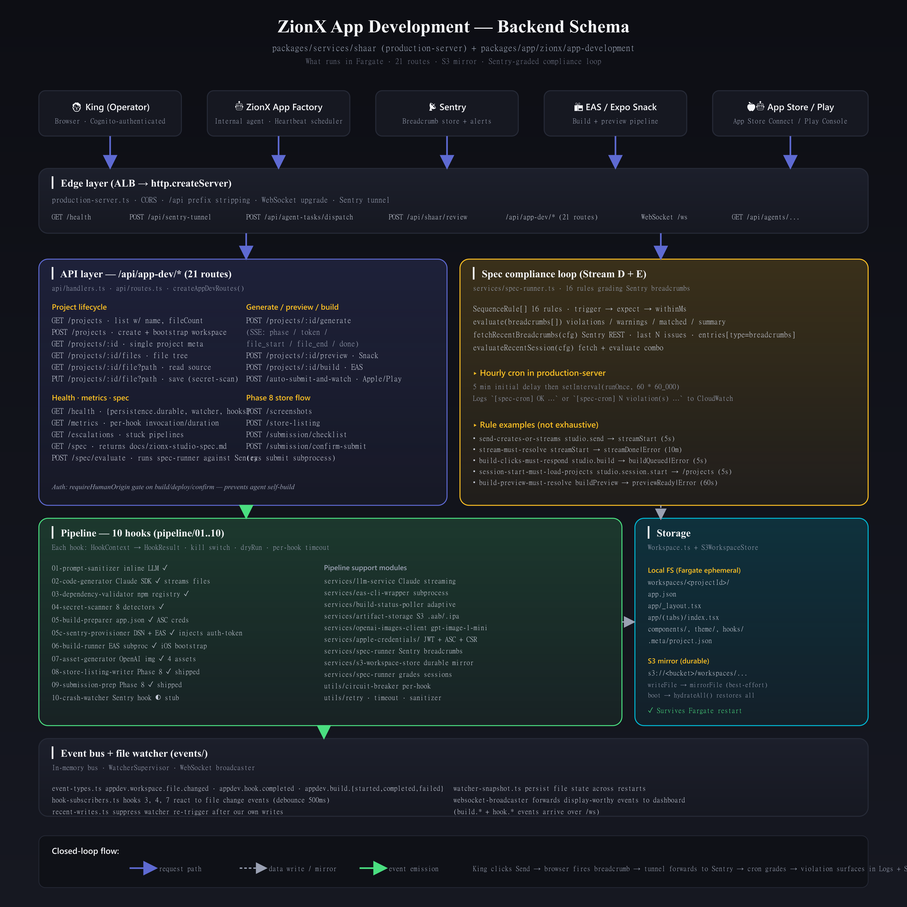
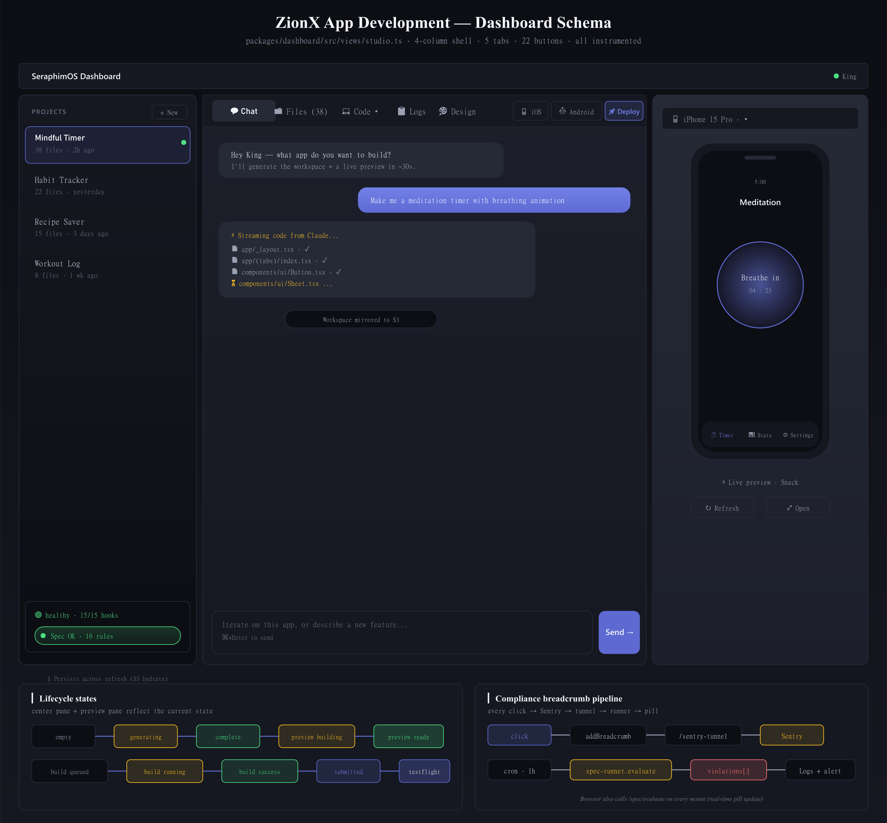

# ZionX App Development — Schema Diagrams

Two pictures: one for what runs on the backend, one for what King sees on the dashboard.
Both auto-render in any Markdown preview, GitHub, VS Code, or Kiro IDE.

---

## Backend schema

What runs in Fargate. Edge → API → spec compliance loop → 10-hook pipeline → workspace storage → event bus.



[View as SVG](./backend-schema.svg) for sharper zoom.

**Key surfaces**:
- **Edge layer** — production-server.ts: ALB ingress, /api prefix stripping, WebSocket upgrade, Sentry tunnel.
- **API layer** — 21 routes under `/api/app-dev/*`. Project CRUD, generate (SSE), preview (Snack), build (EAS), spec evaluation, store-listing, submission.
- **Spec compliance loop** — services/spec-runner.ts. 16 rules evaluating Sentry breadcrumbs. Hourly cron + on-demand.
- **Pipeline** — 10 hooks in `pipeline/01..10`. Each hook: `HookContext → HookResult` with kill switch, dryRun, per-hook timeout.
- **Storage** — Local Fargate FS + S3 mirror via `S3WorkspaceStore`. `hydrateAll()` restores at boot.
- **Event bus** — In-memory bus, debounced subscribers (hooks 3, 4, 7), WebSocket broadcaster.

---

## Dashboard schema

What King sees in the App Development tab. 4-column shell, 5 tabs, 22 buttons, all instrumented.



[View as SVG](./dashboard-schema.svg) for sharper zoom.

**Key surfaces**:
- **Sidebar** — project list (S3-backed, persists across refresh) + health badge + compliance pill (Spec OK / N violations / pending).
- **Center pane** — 5 tabs: 💬 Chat (live narration during generation), 📁 Files (real-time tree as files stream), 💻 Code (Monaco editor, ⌘+S save), 📋 Logs (build/SSE events + spec violations), 🎨 Design (branding picker).
- **Preview** — device frame containing Snack iframe rendering the actual app.
- **Tools rail** — Build iOS, Build Android, Deploy TestFlight (greyed until a successful build).
- **Lifecycle states** — empty → generating → complete → preview building → preview ready → build queued → build running → build success → submitted → testflight.
- **Compliance breadcrumb pipeline** — every click → `Sentry.addBreadcrumb()` → `/sentry-tunnel` (same-origin proxy) → Sentry's ingest → spec runner pulls last N issues → `violations[]` → Logs tab + Sentry alert + sidebar pill turns red.

---

## How these were generated

`scripts/render-schema-pngs.ts` renders the SVG sources to PNGs via `sharp` at 200 DPI. Edit the SVGs directly, re-run the script, commit.

```bash
npx tsx scripts/render-schema-pngs.ts
```
