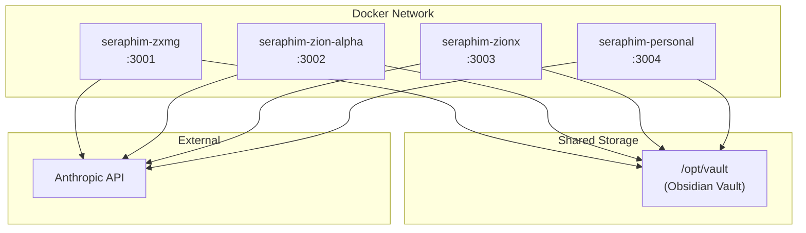

# Docker Agents (Hermes)

> Four Hermes AI agent containers running via Docker Compose, sharing the Obsidian vault.

## Overview

SeraphimOS runs 4 Hermes agent containers using `nousresearch/hermes-agent:latest`. Each agent has its own persistent data volume and shares access to the Obsidian vault. They communicate via the shared vault and the Anthropic API.

Location: `hermes/docker-compose.yml`

---

## Running Containers

| Container | Name | Port | Purpose | Data Volume |
|-----------|------|------|---------|-------------|
| ZXMG | `seraphim-zxmg` | 3001 | Media production agent | `./data/zxmg` |
| Zion Alpha | `seraphim-zion-alpha` | 3002 | Trading intelligence agent | `./data/zion-alpha` |
| ZionX | `seraphim-zionx` | 3003 | App development agent | `./data/zionx` |
| Personal | `seraphim-personal` | 3004 | Personal assistant agent | `./data/personal` |

---

## Configuration

All containers share:
- **Image:** `nousresearch/hermes-agent:latest`
- **Restart policy:** `unless-stopped`
- **Interactive mode:** `stdin_open: true`, `tty: true`
- **Vault mount:** `../vault:/opt/vault` (shared read/write)
- **API Key:** `ANTHROPIC_API_KEY` from `hermes/.env`

---

## Volume Mounts

Each agent has two volume mounts:
1. **Data volume** — persistent agent state, skills, memories, logs
2. **Vault volume** — shared Obsidian vault for cross-agent communication

```
hermes/data/
├── zxmg/          → /opt/data (ZXMG agent state)
├── zion-alpha/    → /opt/data (Zion Alpha state)
├── zionx/         → /opt/data (ZionX agent state)
└── personal/      → /opt/data (Personal agent state)

vault/             → /opt/vault (shared across all 4 containers)
```

---

## Agent Data Structure

Each agent's data directory contains:

| Path | Purpose |
|------|---------|
| `config.yaml` | Agent configuration |
| `SOUL.md` | Agent personality/identity |
| `user.md` | User profile |
| `memory.md` | Agent memory file |
| `state.db` | SQLite state database |
| `skills/` | Installed skill bundles |
| `logs/` | Agent and error logs |
| `sessions/` | Chat session history |
| `audio_cache/` | Voice/audio cache |
| `image_cache/` | Image generation cache |
| `hooks/` | Agent-specific hooks |
| `cron/` | Scheduled tasks |

---

## Operating Commands

```bash
# Start all containers
cd hermes
docker compose up -d

# View logs
docker compose logs -f zxmg
docker compose logs -f zion-alpha

# Stop all
docker compose down

# Restart single agent
docker compose restart zionx

# Access agent shell
docker exec -it seraphim-personal /bin/bash
```

---

## Network Architecture



---

## Integration with SeraphimOS

The Hermes agents serve as an alternative execution layer:
- They read directives from the vault (`00 - Command/Directives/`)
- They write findings to knowledge (`02 - Knowledge/`)
- They submit recommendations (`00 - Command/Recommendations/`)
- The [[Vault Sync Service]] detects these changes and publishes events to EventBridge

This allows the Docker agents to participate in the SeraphimOS [[Chain of Command]] even without direct access to the AWS services.

---

## Skills Installed

Each agent has bundled skills including:
- `autonomous-ai-agents` — agent coordination
- `software-development` — code generation
- `research` — web research
- `social-media` — platform posting
- `creative` — content generation
- `productivity` — task management
- Domain-specific skills per agent

## Related

- [[Hermes Integration Plan]]
- [[Hermes Seraphim Prompt]]
- [[Obsidian Integration]]
- [[Architecture Overview]]
- [[System Status]]
