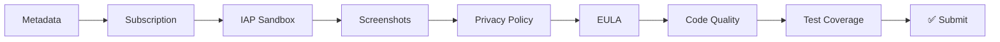

# ZionX Gate Checks

> Pre-submission quality gates that MUST pass before any app can be submitted to Apple or Google.

## Gate Sequence

## Gate Details

### 1. Metadata Validation
- Title: ≤30 chars, includes primary keyword
- Subtitle: ≤30 chars, adds secondary keyword
- Description: 4000 chars max, includes all target keywords
- Keywords: 100 chars max (Apple), complete (Google)
- Category: appropriate for app content
- Age rating: accurate

### 2. Subscription Compliance
- Subscription tiers defined correctly
- Pricing set per region
- Free trial configured (if applicable)
- Auto-renewal disclosed per platform requirements

### 3. IAP Sandbox Testing
- All in-app purchases testable in sandbox
- **Restore purchases button present and functional** ← Apple's #1 rejection
- Purchase flow completes end-to-end
- RevenueCat integration verified

### 4. Screenshot Verification
- All required device sizes (iPhone 6.7", 6.5", 5.5"; iPad 12.9", 11")
- Screenshots show actual app (not mockups)
- Text overlays are legible
- No placeholder content visible

### 5. Privacy Policy
- URL accessible and valid
- Content covers all data collection
- Matches App Store privacy labels
- GDPR/CCPA compliant language

### 6. EULA
- Link present in metadata
- Standard or custom terms appropriate
- Not contradicting platform terms

### 7. Code Quality
- ESLint: 0 errors
- TypeScript: strict mode, 0 errors
- No console.logs in production
- No hardcoded secrets

### 8. Test Coverage
- Unit tests: ≥80% coverage
- Integration tests: critical paths covered
- E2E: onboarding + purchase flow verified
- Crash-free on supported devices

## Learning from Rejections

When a gate fails to catch something that causes a store rejection:
1. Parse the rejection reason
2. Create a NEW gate targeting that specific issue
3. Add to this sequence (gates only grow, never shrink)
4. Store pattern in [[Apple Rejection Patterns]] or Google equivalent

## Related

- [[ZionX]]
- [[Apple Rejection Patterns]]
- [[ZionX Agent Program]]
