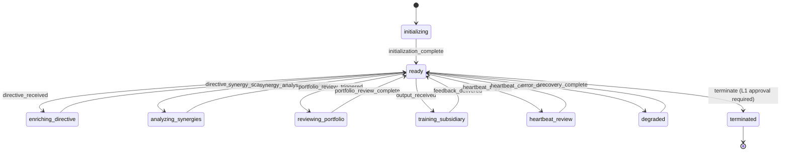

# Eretz Agent Program — Technical Specification

> Source: `packages/app/src/eretz/agent-program.ts`

## State Machine

## Tools

| Tool | Description |
|------|-------------|
| `enrich_directive` | Enrich a directive with portfolio context, patterns, and synergy opportunities |
| `verify_result` | Verify subsidiary result against business quality standards |
| `analyze_synergies` | Analyze cross-business synergy opportunities |
| `review_portfolio` | Generate portfolio intelligence report |
| `intercept_bypass` | Detect and intercept directives bypassing Eretz chain of command |

## Allowed Actions

- enrich_directive, verify_result, analyze_synergies, review_portfolio
- intercept_bypass, train_subsidiary, reallocate_resources, enforce_standing_rules

## Denied Actions

- terminate_subsidiary, modify_king_directives, bypass_governance, access_financial_accounts

## Model Preference

| Task Type | Model |
|-----------|-------|
| Analysis | Claude Sonnet |
| Enrichment | GPT-4o |
| Classification | GPT-4o-mini |
| Default | Claude Sonnet (fallback: GPT-4o) |
| Cost ceiling | $5.00/task |

## Token Budget

- Daily: 300,000 tokens
- Monthly: 6,000,000 tokens

## Completion Contracts

1. **Directive Enrichment Complete** — requires enrichedDirective + target + enrichmentDuration
2. **Result Verification Complete** — requires verifiedResult + approved status + feedback

## Key Components (in source)

- `DirectiveEnrichmentPipeline` — enriches every directive with business intelligence
- `ResultVerificationPipeline` — verifies subsidiary results against quality standards
- `BypassDetector` — intercepts directives that skip the chain of command

## Related

- [[Eretz]]
- [[Architecture Overview]]
- [[Pattern Library]]
- [[Portfolio Overview]]
