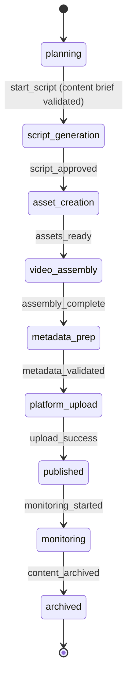

# ZXMG Agent Program — Technical Specification

> Source: `packages/app/src/zxmg/agent-program.ts`

## State Machine

## Gate Checks

| Gate | Stage | What It Validates |
|------|-------|------------------|
| Content Brief | planning → script | Topic, angle, target audience, platform(s) defined |
| Script Quality | script → asset | Hook, structure, CTA, length appropriate for platform |
| Platform Specs | metadata → upload | Format, duration, resolution, thumbnail meet platform requirements |
| Quality Baseline | assembly → metadata | Meets stored production formula thresholds |

## Autonomous Mode

ZXMG operates in **autonomous mode by default**:
- Researches trending topics independently
- Generates content calendars without King input
- Produces videos autonomously
- Publishes to platforms on schedule
- King can override at any point but intervention is NOT required

## Content Pipeline

Maintains a rolling 7-14 day production queue:
- Auto-generated video concepts
- Scripts with hooks, pacing, CTAs
- Thumbnails and titles (A/B variants)
- Scheduling optimized per platform
- Cross-platform content repurposing

## Model Preference

- Default: Claude Sonnet
- Fallback: GPT-4o
- Creative tasks: Claude Sonnet (preferred for writing)
- Cost ceiling: $5.00/task

## Token Budget

- Daily: 400,000 tokens
- Monthly: 8,000,000 tokens

## Timeouts

| Stage | Timeout |
|-------|---------|
| Script generation | 1 hour |
| Asset creation | 2 hours |
| Video assembly | 1 hour |
| Platform upload | 30 minutes |

## Related

- [[ZXMG]]
- [[Production Formulas]]
- [[Portfolio Overview]]
- [[Eretz Agent Program]]
