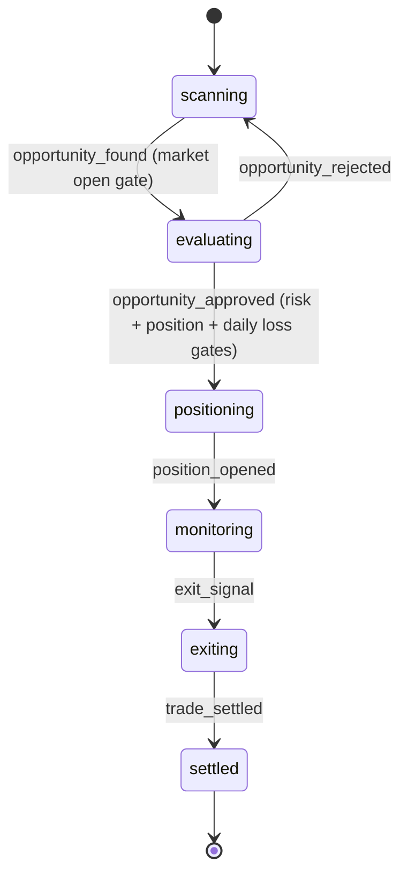

# Zion Alpha Agent Program — Technical Specification

> Source: `packages/app/src/zion-alpha/agent-program.ts`

## State Machine

## Gate Checks

| Gate | Transition | What It Validates |
|------|-----------|------------------|
| Market Open | scanning → evaluating | Market is currently accepting trades |
| Risk Parameters | evaluating → positioning | Trade meets risk criteria |
| Position Size Limit | evaluating → positioning | Size within Otzar-defined limits |
| Daily Loss Limit | evaluating → positioning | Today's losses haven't hit threshold |

## Trading Philosophy

Zion Alpha operates with a **trader mindset**:
- **Spot edge** — find mispriced probabilities
- **Size positions** — Kelly criterion (quarter-Kelly for safety)
- **Execute immediately** — no analysis paralysis
- **Learn from outcomes** — every trade logged with full reasoning

## Risk Controls

- Position size enforced by [[Otzar]] at runtime
- Daily loss limit enforced by [[Otzar]] at runtime
- All trades logged to [[XO Audit]] with decision reasoning
- 5-minute timeout on evaluation (prevents overthinking)
- Mandatory exit signals (don't let winners turn to losers)

## Platforms

- [[Kalshi]] — regulated US prediction market
- [[Polymarket]] — crypto prediction market

## Model Preference

- Default: Claude Sonnet
- Fallback: GPT-4o
- Analysis tasks: Claude Sonnet
- Quick classifications: GPT-4o-mini
- Cost ceiling: $3.00/task

## Token Budget

- Daily: 200,000 tokens
- Monthly: 4,000,000 tokens

## Related

- [[Zion Alpha]]
- [[Trading Patterns]]
- [[Portfolio Overview]]
- [[Eretz Agent Program]]
