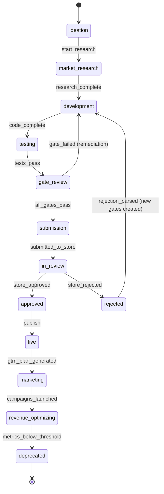

# ZionX Agent Program — Technical Specification

> Source: `packages/app/src/zionx/agent-program.ts`

## State Machine

## Gate Checks (Pre-Submission)

| Gate | What It Validates |
|------|------------------|
| Content Brief | App concept, target market, monetization model defined |
| Market Validation | Niche viable, competition analyzed, keyword opportunity confirmed |
| Code Quality | Lint pass, type check, no critical errors |
| Test Coverage | Unit + integration tests pass, minimum 80% coverage |
| Metadata | Title, subtitle, description, keywords for ASO |
| Subscription Compliance | IAP configured, restore button present, sandbox tested |
| Screenshot Verification | All device sizes, accurate representations |
| Privacy Policy | URL valid, content appropriate |
| EULA | Link present and valid |

## Rejection Learning

When store rejects an app:
1. Parse rejection reason from Apple/Google response
2. Create new gate check targeting that specific rejection pattern
3. Store pattern in [[Zikaron]] procedural memory
4. Apply new gate to ALL future submissions (prevents repeat)

## GTM Engine (Post-Live)

Automatic go-to-market for every live app:
- ASO optimization (keywords, screenshots, A/B testing)
- Social media campaigns via HeyGen + social drivers
- Paid acquisition via Google Ads
- Landing page via Zeely
- Performance monitoring and budget optimization

## Model Preference

- Default: Claude Sonnet (code gen needs Tier 2 minimum)
- Fallback: GPT-4o
- Cost ceiling: $10.00/task

## Token Budget

- Daily: 500,000 tokens
- Monthly: 10,000,000 tokens

## Related

- [[ZionX]]
- [[Apple Rejection Patterns]]
- [[Portfolio Overview]]
- [[Eretz Agent Program]]
