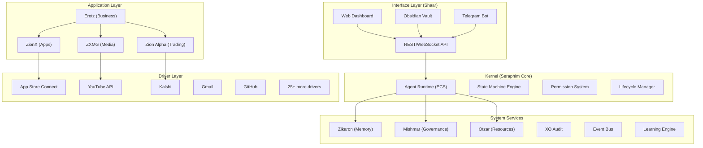

# Architecture Overview

> SeraphimOS is a five-layer AI orchestration platform on AWS.

## Layer Architecture



## Chain of Command

```
King [vision] → Seraphim [strategy] → Eretz [business execution] → Subsidiaries → Agents
```

## Key Design Principles

1. **Enforcement over documentation** — runtime enforcement, not paper rules
2. **Stateful agents with persistent memory** — context maintained across sessions
3. **Declarative state machines** — versioned, gated transitions
4. **Event-driven loose coupling** — async event bus, no single points of failure
5. **Real data only** — no mock data at any layer
6. **Test-first at every layer** — CI/CD gates block untested deployments
7. **Cost-aware execution** — intelligent model routing targeting 50% savings

## Implementation Phases

| Phase | Status | Description |
|-------|--------|-------------|
| Phase 1 | ✅ Complete | Core infrastructure, kernel foundation |
| Phase 2 | ✅ Complete | System services (Mishmar, Zikaron, Otzar, Audit) |
| Phase 3 | ✅ Complete | Application layer, driver layer (24 drivers) |
| Phase 4 | ✅ Complete | Interface layer (Shaar), multi-tenant, security |
| Phase 5 | ✅ Complete | Learning engine, marketplace, federated intelligence |
| Phase 6 | ✅ Complete | Autonomous SME, self-improvement, Eretz |
| Phase 7 | ✅ Complete | Reference ingestion, quality baselines |
| Phase 8 | ✅ Complete | Parallel agents, MCP, unified communication |
| Phase 9 | ✅ Complete | ZionX App Development Studio |
| Phase 10 | ✅ Complete | ZXMG Video Development Studio |
| Phase 11 | ✅ Complete | ZionX Ideation + Eretz Command Center |
| Phase 12 | ✅ Complete | Dashboard UX Enhancements |

See [[Implementation Progress]] for detailed status.

## Key Documentation

- [[Services Index]] — All system services catalog
- [[Drivers Catalog]] — All 24 external service drivers
- [[Dashboard Views]] — All dashboard views and tabs
- [[Hooks and Steering]] — Kiro automation rules
- [[Docker Agents]] — Hermes container setup
- [[Vault Sync Service]] — Obsidian ↔ Seraphim bridge
- [[Capability Map]] — What's available per phase
