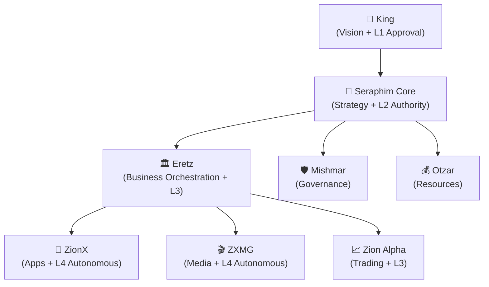

# Chain of Command

> The authority hierarchy of SeraphimOS. No level may be bypassed.

## Hierarchy



## Flow

```
King [provides vision]
  → Seraphim [formulates strategy, enriches with context]
    → Eretz [enriches with business intelligence, patterns, synergies]
      → Subsidiary [executes autonomously within L4 bounds]
        → Result flows back up with verification at each level
```

## Rules

1. **No bypassing**: Directives MUST flow through each level. [[Eretz]] has bypass detection.
2. **Each level adds intelligence**: Not just relay — each level enriches, contextualizes, and guides.
3. **Results flow up with verification**: Eretz verifies subsidiary results before forwarding to Seraphim.
4. **Escalations flow up**: If an agent can't handle something within its authority, it escalates.

## Authority Levels

| Level | Meaning | Who Has It | Can Do |
|-------|---------|-----------|--------|
| L1 | King approval required | King only | Strategic decisions, new pillars, budget >20% |
| L2 | Designated authority | Seraphim, Mishmar | Budget realloc <20%, cross-pillar conflicts |
| L3 | Peer verification | Eretz, Zion Alpha | Major resource decisions, high-value trades |
| L4 | Fully autonomous | ZionX, ZXMG | Within defined bounds, no approval needed |

## Related

- [[Mishmar]]
- [[Eretz]]
- [[Seraphim Core]]
- [[The King's Vision]]
