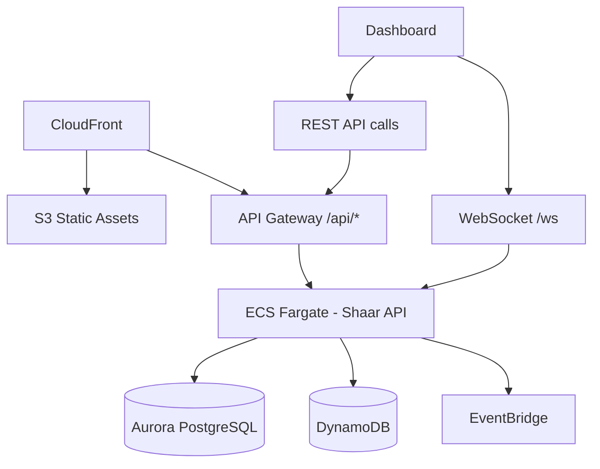

# Dashboard Views

> Complete catalog of all dashboard views and tabs in the Seraphim Dashboard (Shaar).

## Overview

The Seraphim Dashboard is a React + Vite + TypeScript SPA served via CloudFront/S3. It connects to the Shaar API layer (REST + WebSocket) for real-time data. All views display verified live data — no mock or placeholder content.

Package: `packages/dashboard/`

---

## Core System Views (`packages/dashboard/src/views/`)

| View File                | Tab/Page            | Description                                                           |
| ------------------------ | ------------------- | --------------------------------------------------------------------- |
| `agents.ts`              | Agents              | Live agent status cards — state, pillar, resource consumption, health |
| `pillars.ts`             | Pillars             | Pillar metrics (ZionX apps, ZXMG content, Zion Alpha P&L)             |
| `pillar-views.ts`        | Pillar Detail       | Detailed per-pillar drill-down views                                  |
| `costs.ts`               | Costs               | Per-agent/pillar spend, model utilization, daily/monthly projections  |
| `audit.ts`               | Audit               | Searchable audit trail with agent/time/action/pillar/outcome filters  |
| `health.ts`              | System Health       | Operational status of every service, driver, and agent                |
| `recommendations.ts`     | Recommendations     | Pending recommendations grouped by domain with approve/reject         |
| `references.ts`          | References          | Reference ingestion history and quality baselines                     |
| `baselines.ts`           | Baselines           | Quality baseline scores and evolution history                         |
| `quality-gate.ts`        | Quality Gate        | Gate evaluation results and pass/fail history                         |
| `industry-scanner.ts`    | Industry Scanner    | Technology roadmap, discoveries, assessments                          |
| `capability-maturity.ts` | Capability Maturity | Per-domain maturity scores, trends, gap analysis                      |
| `heartbeat-history.ts`   | Heartbeat History   | Review cycle history per agent                                        |
| `world-class.ts`         | World-Class         | Path to world-class dashboard per domain                              |
| `hermes-agents.ts`       | Hermes Agents       | Docker Hermes agent status and management                             |
| `studio.ts`              | ZionX Studio        | App development studio (preview, build, submit)                       |
| `video-studio.ts`        | ZXMG Studio         | Video production studio (pipeline, render, publish)                   |

---

## SeraphimOS Core Views (`packages/dashboard/src/views/seraphim-core/`)

| View File | Purpose |
|-----------|---------|
| `capabilities-view.ts` | System capabilities overview |
| `design-view.ts` | Architecture design documentation |
| `requirements-view.ts` | Requirements tracking |
| `ov1-view.ts` | Operational View 1 |
| `sv1-view.ts` | System View 1 |
| `auto-sync-handler.ts` | Auto-sync between views and specs |
| `diagram-modal.ts` | Diagram display modal |
| `diagram-renderer.ts` | Mermaid/diagram rendering engine |
| `markdown-renderer.ts` | Markdown content rendering |
| `pan-zoom-controller.ts` | Pan/zoom for diagrams |

---

## ZionX App Studio Components

| Component | Location | Purpose |
|-----------|----------|---------|
| `PreviewRuntime.tsx` | `components/studio/` | React Native Web preview in device frames |
| `DeviceFrame.tsx` | `components/studio/` | Accurate device frame rendering (iPhone, iPad, Pixel) |
| `FileTree.tsx` | `components/studio/` | Navigable project file tree |
| `CodeViewer.tsx` | `components/studio/` | Syntax-highlighted file viewer |
| `TestingPanel.tsx` | `components/studio/` | Unit/UI/accessibility test results |
| `BuildPanel.tsx` | `components/studio/` | Dual-platform build status (iOS + Android) |
| `StoreAssetsTab.tsx` | `components/studio/` | Screenshot/icon/feature graphic management |
| `AdStudioTab.tsx` | `components/studio/` | Video ad creative generation |
| `RevenuePanel.tsx` | `components/studio/` | Downloads, revenue, ratings, costs |
| `IdeationPipelineView.tsx` | `components/app-studio/` | Autonomous idea pipeline with Generate buttons |
| `VisualPipelineBoard.tsx` | `components/app-studio/` | Kanban-style app lifecycle stages |
| `RejectionCrisisPanel.tsx` | `components/app-studio/` | App rejection analysis and fix tracking |
| `MarketHeatmap.tsx` | `components/app-studio/` | Market opportunity bubble chart |

---

## ZXMG Video Studio Components

| Component | Location | Purpose |
|-----------|----------|---------|
| `VideoPlayer.tsx` | `components/video-studio/` | Full video player with timeline scrubbing |
| `SceneThumbnailStrip.tsx` | `components/video-studio/` | Scene-by-scene navigation |
| `AudioWaveform.tsx` | `components/video-studio/` | Synchronized audio waveform |
| `PipelineView.tsx` | `components/video-studio/` | Content pipeline with approve/generate/publish |
| `ScriptPanel.tsx` | `components/video-studio/` | Script editor and scene breakdown |
| `ScenesPanel.tsx` | `components/video-studio/` | Scene management with render status |
| `CharactersPanel.tsx` | `components/video-studio/` | Character consistency and avatars |
| `AudioPanel.tsx` | `components/video-studio/` | Music, SFX, voiceover layers |
| `EffectsPanel.tsx` | `components/video-studio/` | Transitions, color grading, VFX |
| `TrendsPanel.tsx` | `components/video-studio/` | Trending topics and algorithm signals |
| `ThumbnailsPanel.tsx` | `components/video-studio/` | Thumbnail generation and A/B testing |
| `CaptionsPanel.tsx` | `components/video-studio/` | Subtitle and caption generation |
| `ExportPanel.tsx` | `components/video-studio/` | Multi-format export (16:9, 9:16, 1:1) |
| `AnalyticsPanel.tsx` | `components/video-studio/` | Performance metrics and optimization |
| `PublishPanel.tsx` | `components/video-studio/` | Platform distribution and scheduling |
| `ResearchPanel.tsx` | `components/video-studio/` | Content research and competitor analysis |
| `ChannelManager.tsx` | `components/video-studio/` | Multi-channel configuration |
| `ContentDiversityDashboard.tsx` | `components/video-studio/` | Avatar/voice/style usage tracking |
| `PreGenerationCheck.tsx` | `components/video-studio/` | Pre-render diversity compliance check |
| `ProductionTracker.tsx` | `components/video-studio/` | End-to-end production journey timeline |

---

## Eretz Command Center Components

| Component | Location | Purpose |
|-----------|----------|---------|
| `PortfolioOverviewHeader.tsx` | `components/command-center/` | Total MRR, revenue, growth, health |
| `SubsidiaryCardGrid.tsx` | `components/command-center/` | Grid of per-subsidiary cards |
| `ZionXCard.tsx` | `components/command-center/` | Apps count, revenue, top 3 apps |
| `ZXMGCard.tsx` | `components/command-center/` | Channels, views, revenue, top channels |
| `ZionAlphaCard.tsx` | `components/command-center/` | Positions, P&L, win rate, risk |
| `SynergyMapVisualization.tsx` | `components/command-center/` | Visual synergy connections with revenue impact |
| `PatternLibraryBrowser.tsx` | `components/command-center/` | Searchable business pattern catalog |
| `TrainingCascadeChart.tsx` | `components/command-center/` | Per-subsidiary quality trends |
| `RecommendationQueuePanel.tsx` | `components/command-center/` | Pending recommendations with approve/reject |
| `DeclineAlertsPanel.tsx` | `components/command-center/` | Real-time metric decline alerts |
| `ResourceAllocationView.tsx` | `components/command-center/` | Budget breakdown with adjustable allocation |
| `StrategicPrioritiesPanel.tsx` | `components/command-center/` | Portfolio thesis and per-subsidiary strategy |

---

## Dashboard Architecture

## Related

- [[Seraphim Dashboard]]
- [[Architecture Overview]]
- [[Shaar API Layer]]
- [[Implementation Progress]]
