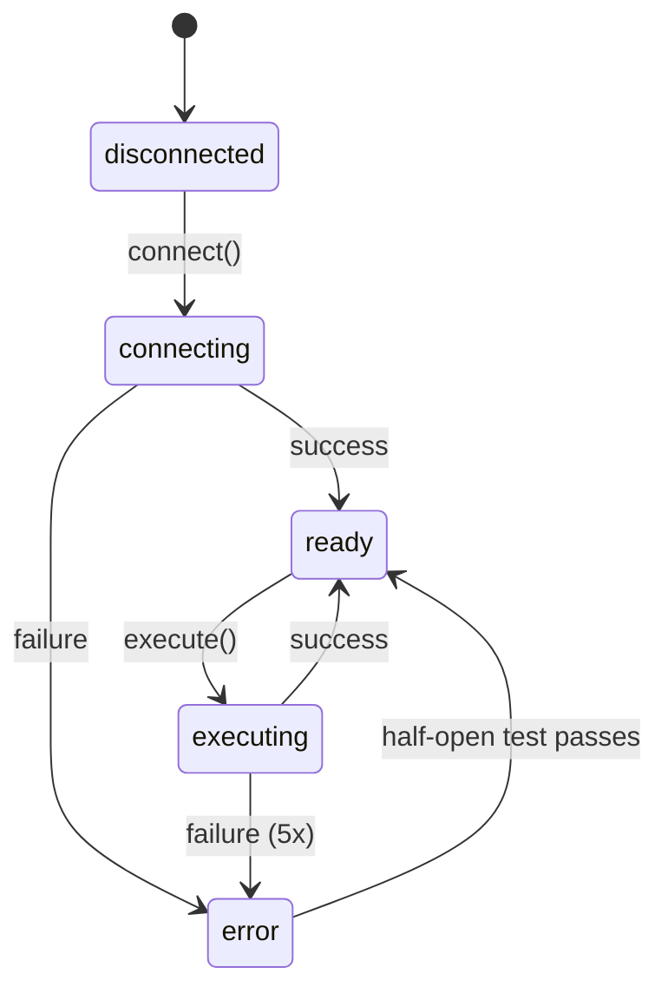

# Drivers Catalog

> Complete catalog of all 24 external service drivers in SeraphimOS.

## Overview

All drivers extend a uniform base class (`packages/drivers/src/base/driver.ts`) providing:
- **Retry with exponential backoff** (1s → 2s → 4s → 8s → 16s, max 5 attempts)
- **Circuit breaker** (closed → open after 5 failures → half-open after 60s → test → closed or open)
- **Session state management** (avoid redundant auth)
- **Health checks** (connection status + last successful operation)
- **Idempotency keys** (safe retries)

The [[Driver Registry]] (`packages/drivers/src/registry.ts`) validates interface compliance, manages lifecycle, and provides access to ready drivers.

---

## Driver Categories

### LLM Providers (2 drivers)

| Driver | File | Capabilities |
|--------|------|-------------|
| Anthropic | `llm/anthropic-driver.ts` | Claude Haiku, Sonnet, Opus — streaming, token counting, cost calc |
| OpenAI | `llm/openai-driver.ts` | GPT-4o-mini, GPT-4o, GPT-4.5 — streaming, token counting, cost calc |

Both report usage to [[Otzar Resource Manager]] after each call. Model-specific rate limiting.

---

### App Stores (2 drivers)

| Driver | File | Capabilities |
|--------|------|-------------|
| App Store Connect | `appstore/appstore-connect-driver.ts` | createApp, uploadBuild, submitForReview, checkReviewStatus, updateMetadata, uploadScreenshots, manageSubscriptions, getAppAnalytics |
| Google Play Console | `googleplay/google-play-driver.ts` | createApp, uploadBundle, submitForReview, checkReviewStatus, updateListing, uploadScreenshots, manageSubscriptions, getAppAnalytics |

Auth: App Store Connect API key (JWT) and Google Play service account from [[Credentials]].

---

### Video & Media (3 drivers)

| Driver | File | Capabilities |
|--------|------|-------------|
| YouTube | `youtube/youtube-driver.ts` | uploadVideo, updateMetadata, setThumbnail, getAnalytics, getComments, replyToComment, createPlaylist, schedulePublish |
| HeyGen | `heygen/heygen-driver.ts` | AI video generation |
| Rumble | `rumble/rumble-driver.ts` | Upload videos, get analytics |

YouTube handles upload resumption for large files. Platform-specific format validation.

---

### Trading Platforms (1 directory, 2 drivers)

| Driver | File | Capabilities |
|--------|------|-------------|
| Kalshi | `trading/kalshi-driver.ts` | getMarkets, getPositions, placeTrade, cancelTrade, getTradeHistory, getBalance |
| Polymarket | `trading/polymarket-driver.ts` | getMarkets, getPositions, placeTrade, cancelTrade, getTradeHistory, getBalance |

Position size validation and daily loss limit checks before trade execution.

---

### Communication (5 drivers)

| Driver | File | Capabilities |
|--------|------|-------------|
| Gmail | `gmail/gmail-driver.ts` | Send, receive, search emails |
| Telegram | `telegram/telegram-driver.ts` | Send/receive messages via Bot API |
| Discord | `discord/discord-driver.ts` | Send/receive messages via Bot API |
| WhatsApp | `whatsapp/whatsapp-driver.ts` | Send/receive via Business API |
| iMessage | `imessage/imessage-driver.ts` | Send/receive for King/Queen communication |

---

### Social Media (3 drivers)

| Driver | File | Capabilities |
|--------|------|-------------|
| X (Twitter) | `x/x-driver.ts` | Post, reply, get analytics via API v2 |
| Reddit | `reddit/reddit-driver.ts` | Post, comment, get analytics |
| GitHub | `github/github-driver.ts` | Create repos, PRs, issues, manage workflows |

---

### Commerce & Payments (3 drivers)

| Driver | File | Capabilities |
|--------|------|-------------|
| Stripe | `stripe/stripe-driver.ts` | Manage payments, subscriptions, invoices |
| RevenueCat | `revenuecat/revenuecat-driver.ts` | In-app subscriptions, revenue data |
| Google Ads | `google-ads/google-ads-driver.ts` | Campaign management, performance data |

---

### Automation & Infrastructure (4 drivers)

| Driver | File | Capabilities |
|--------|------|-------------|
| Zeely | `zeely/zeely-driver.ts` | Landing pages and funnels |
| n8n | `n8n/n8n-driver.ts` | Trigger webhooks, manage workflows |
| Browser | `browser/browser-driver.ts` | Playwright automation for services without APIs |
| Voice | `voice/voice-driver.ts` | Speech-to-text, text-to-speech (AWS Transcribe + Polly) |

---

## Driver Lifecycle



## Circuit Breaker States

| State | Behavior |
|-------|----------|
| Closed | Normal operation, counting consecutive failures |
| Open | All requests fail-fast (after 5 consecutive failures) |
| Half-Open | After 60s cooldown, test one request |

## Registry Interface

```typescript
interface DriverRegistry {
  registerDriver(driver, options?): Promise<void>
  getDriver(name): Driver             // throws if not ready
  listDrivers(): RegisteredDriverInfo[]
  unregisterDriver(name): Promise<void>
  connectAll(configs): Promise<Record<string, boolean>>
  disconnectAll(): Promise<void>
  healthCheckAll(): Promise<Record<string, HealthStatus>>
}
```

## Related

- [[Architecture Overview]]
- [[Technology Stack]]
- [[Credentials]]
- [[Otzar Resource Manager]]
- [[Communication Layer]]
