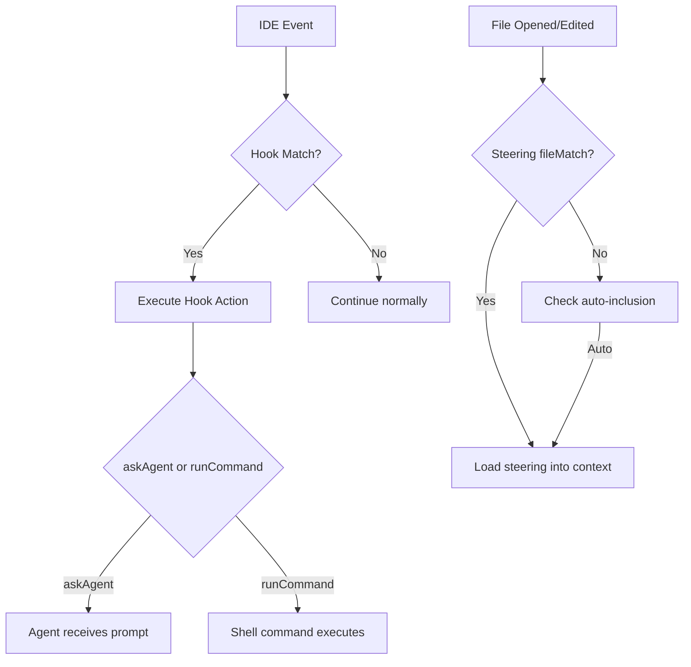

# Hooks and Steering

> Kiro automation rules that govern how the AI coding agent behaves within SeraphimOS.

## Overview

SeraphimOS uses two Kiro mechanisms for autonomous governance:
- **Hooks** — event-driven triggers that fire when specific IDE events occur
- **Steering files** — persistent rules loaded into agent context based on file patterns or always-on inclusion

Location: `.kiro/hooks/` and `.kiro/steering/`

---

## Hooks (6 active)

### 1. Agent Task Executor

| Property | Value |
|----------|-------|
| File | `agent-task-dispatch.kiro.hook` |
| Trigger | File created in `.kiro/agent-tasks/*.md` |
| Action | Read task file, execute, move to `completed/` or `failed/` |

**Purpose:** Closes the loop between strategic agent decisions and IDE-level code execution. When a SeraphimOS agent writes an approved task file, Kiro reads and executes it autonomously.

---

### 2. Check Secrets Before Giving Up

| Property | Value |
|----------|-------|
| File | `check-secrets-before-giving-up.kiro.hook` |
| Trigger | Agent stops execution (gives up) |
| Action | Check AWS Secrets Manager for credentials |

**Purpose:** Prevents premature failure. Before saying "I can't do that," the agent checks if the needed credential exists in Secrets Manager. Available secrets:

| Secret ID | Purpose |
|-----------|---------|
| `seraphim/github-token` | GitHub PAT (zionxai5000) |
| `seraphim/anthropic` | Claude API key |
| `seraphim/openai` | GPT-4o API key |
| `seraphim/stripe` | Stripe API key |
| `seraphim/telegram` | Telegram bot token |
| `seraphim/youtube` | YouTube API credentials |
| `seraphim/kalshi` | Kalshi trading API |
| `seraphim/discord` | Discord bot token |
| `seraphim/x` | X/Twitter API key |
| `seraphim/instagram` | Instagram API |
| `seraphim/heygen` | HeyGen video API |
| `seraphim/zeely` | Zeely landing page API |
| `seraphim/reddit` | Reddit API |
| `seraphim/googleplay` | Google Play credentials |
| `SeraphimAuroraSecret...` | Aurora PostgreSQL |

---

### 3. Deployment Safety Reminder

| Property | Value |
|----------|-------|
| File | `deployment-safety-check.kiro.hook` |
| Trigger | File edited: `scripts/deploy*.ps1`, `scripts/deploy*.sh`, `Dockerfile` |
| Action | Remind to test locally first, verify target group |

**Purpose:** Prevents the May 2026 outage pattern. Reminds the agent of the deployment checklist before any deploy-related changes.

---

### 4. Push to Git After Task

| Property | Value |
|----------|-------|
| File | `push-to-git-after-task.kiro.hook` |
| Trigger | Post task execution |
| Action | Offer to commit and push changes |

**Purpose:** Cross-machine continuity. After a task completes, offers to push so the other Kiro instance has the latest code. Uses `seraphim/github-token` from Secrets Manager with token cleanup.

---

### 5. Session Continuity

| Property | Value |
|----------|-------|
| File | `session-continuity.kiro.hook` |
| Trigger | Post task execution |
| Action | Update `.kiro/context/session-summary.md` |

**Purpose:** Ensures the next Kiro instance (on any machine) has full context of what was done, current state, and pending items.

---

### 6. Post-Deploy Health Check

| Property | Value |
|----------|-------|
| File | `verify-deployment-health.kiro.hook` |
| Trigger | File edited: deploy scripts, Dockerfile, production-server.ts, CDK stacks |
| Action | Verify ALB target health, check task IP matches |

**Purpose:** After deployment-related changes, verifies the backend is healthy. Checks ECS target group, private IP match, and CloudWatch logs. **Critical rule:** never deploy a fix by deploying again immediately — diagnose first.

---

## Steering Files (2 active)

### 1. Credentials Access (`credentials-access.md`)

| Property | Value |
|----------|-------|
| Inclusion | `auto` (always loaded) |
| Rule | NEVER say you can't do something without checking Secrets Manager first |

Provides the git push pattern (token → push → remove token) and all available secret IDs. This steering file ensures the agent always has credentials available.

---

### 2. Deployment Safety (`deployment-safety.md`)

| Property | Value |
|----------|-------|
| Inclusion | `fileMatch` |
| Pattern | `**/deploy*`, `**/Dockerfile`, `**/production-server*` |

Contains the full deployment checklist, post-deployment verification commands, architecture rules (HTTP listener before bootstrap, AWS SDK timeouts), ALB configuration, and recovery procedure. Based on lessons from the May 2026 outage.

**Key Rules:**
- Production server MUST start HTTP listener BEFORE async bootstrap
- ALL AWS SDK calls MUST have timeouts (max 15s)
- `/health` MUST respond even during boot (`{"status":"booting"}`)
- `core` package MUST NOT import from `services` (circular dependency)
- Never rapid successive ECS deployments

---

## Event Flow

## Related

- [[Kiro Integration]]
- [[Credentials]]
- [[Deployment Guide]]
- [[Architecture Overview]]
