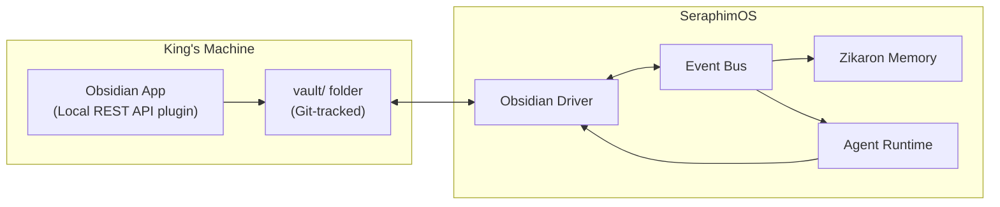

# Obsidian Integration Architecture

> How Obsidian serves as the King's strategic interface to SeraphimOS.

## Role in the Stack

Obsidian is NOT a replacement for the Seraphim dashboard. It's a complementary interface:

| Obsidian | Seraphim Dashboard |
|----------|-------------------|
| Strategic thinking | Real-time monitoring |
| Knowledge browsing | Live agent status |
| Directive writing | Escalation handling |
| Recommendation review | Cost gauges |
| Institutional memory | Workflow progress bars |
| Offline-capable | Requires connectivity |

## Sync Architecture



## Data Flows

### King → System (Directives)
1. King writes note in `00 - Command/Directives/` with `status: active`
2. Git commit triggers → CI webhook → Event Bus
3. Seraphim Core picks up directive from Event Bus
4. Seraphim formulates strategy and begins execution

### System → King (Reports, Recommendations)
1. Agent completes work / generates recommendation
2. Agent publishes to Event Bus
3. Obsidian Driver writes markdown note to vault
4. Git auto-commit (or Hermes cron pushes)
5. King sees new note in Obsidian

### System → Vault (Knowledge)
1. Agent learns something (new procedural memory in Zikaron)
2. Zikaron publishes `memory.stored` event
3. Obsidian Driver formats as linked markdown note
4. Written to `02 - Knowledge/{domain}/`

## Obsidian Driver Specification

Implements standard SeraphimOS Driver interface:

```typescript
interface ObsidianDriver extends Driver {
  // Write operations
  createNote(path: string, content: string, frontmatter: Record<string, unknown>): Promise<void>;
  updateNote(path: string, content: string): Promise<void>;
  
  // Read operations  
  readNote(path: string): Promise<NoteContent>;
  searchNotes(query: string): Promise<NoteResult[]>;
  
  // Watch operations (via Local REST API or file system)
  watchFolder(path: string, callback: (change: FileChange) => void): Promise<void>;
}
```

## Implementation: @seraphim/vault-sync

The sync layer is implemented as a TypeScript package at `packages/vault-sync/`.

### Layer 1: Git Sync (`layer1-git.ts`)
- Auto-commits vault changes every 60 seconds
- Pulls agent output from remote
- Pushes local changes
- Force-syncs on important events (directive activated, recommendation approved)

### Layer 2: File Watcher (`layer2-watcher.ts`)
- Watches all `.md` files in vault (excluding .obsidian/, .git/)
- Parses frontmatter to detect status changes
- Classifies events: `directive.activated`, `recommendation.approved`, etc.
- Emits typed events to registered handlers

### Layer 3: Obsidian API (`layer3-obsidian-api.ts`)
- Connects to Obsidian's Local REST API (port 27124)
- Read/write/search/delete vault notes programmatically
- Health check for graceful degradation when Obsidian isn't running
- Agents call this to push output without touching the filesystem directly

### Event Bridge (`event-bridge.ts`)
- Publishes vault events to AWS EventBridge
- Seraphim agents subscribe to `vault.*` event patterns
- Dry-run mode for local development

### Vault Writer (`vault-writer.ts`)
- Structured methods for writing recommendations, reports, knowledge, escalations
- Handles frontmatter, formatting, directory creation
- Agents call `vaultWriter.writeRecommendation(...)` — note appears in Obsidian

### Running

```bash
cd packages/vault-sync
npm install
npx tsx src/index.ts    # development
# or
npm run build && npm start  # production
```

## Plugin Requirements

- **Local REST API** (required for Layer 3) — enables programmatic vault access
- **Dataview** (recommended) — enables dynamic queries in notes
- **Tasks** (recommended) — enables approval workflows via checkboxes
- **Templater** (recommended) — enables consistent note creation

## Related

- [[Vault Sync Service]]
- [[Hermes Integration Plan]]
- [[Architecture Overview]]
- [[Technology Stack]]
- [[Docker Agents]]
- [[Hooks and Steering]]
- [[Home]]
