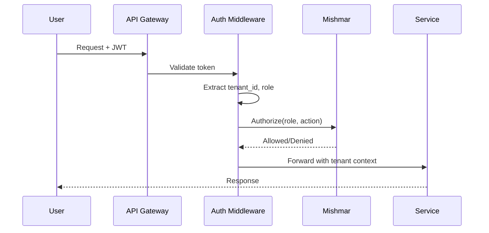

# Auth Service

> Authentication and authorization using AWS Cognito with JWT-based API access.

## Overview

Provides user registration, login, JWT token issuance, and API Gateway authorization. Integrated with [[Mishmar Governance Service|Mishmar]] for per-request authorization and [[XO Audit Service|XO Audit]] for failure logging.

Package: `packages/services/src/auth/`

---

## Components

| File | Purpose |
|------|---------|
| `cognito.ts` | Cognito User Pool integration (registration, login, JWT) |
| `middleware.ts` | API Gateway authorizer (validate JWT, extract tenant/role) |

---

## Authentication Flow

---

## Security Features

| Feature | Implementation |
|---------|---------------|
| Token type | Short-lived JWT with refresh rotation |
| Tenant extraction | From JWT claims |
| Role scoping | King, Queen, Agent (tied to Mishmar levels) |
| Failure logging | All auth failures → XO Audit with source, target, reason |
| Network isolation | VPC security groups per tenant tier |

## Related

- [[Mishmar Governance Service]]
- [[Tenant Service]]
- [[XO Audit Service]]
- [[Shaar Agent Gateway]]
