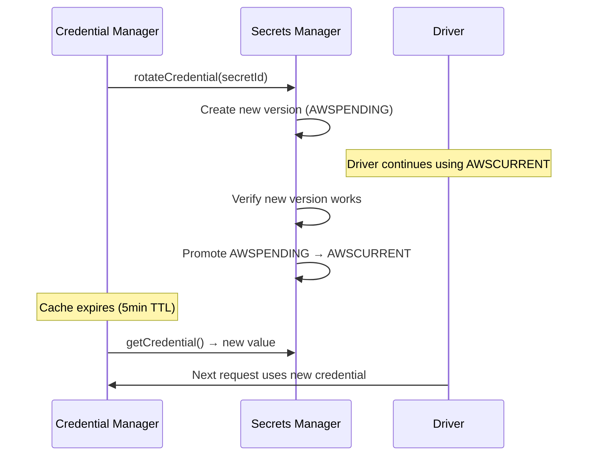

# Credential Manager

> Secure credential lifecycle management using AWS Secrets Manager.

## Overview

The Credential Manager handles all API keys, tokens, and credentials for SeraphimOS. It retrieves from AWS Secrets Manager, caches with short TTL, rotates on schedule, and logs all access to [[XO Audit Service|XO Audit]] (key name only, never values).

Package: `packages/services/src/credentials/manager.ts`

---

## Interface

```typescript
interface CredentialManager {
  getCredential(secretId: string): Promise<string>
  rotateCredential(secretId: string): Promise<void>
  getRotationSchedule(): Promise<RotationSchedule[]>
}
```

## Behavior

| Feature | Implementation |
|---------|---------------|
| Retrieval | AWS Secrets Manager `getSecretValue()` |
| Caching | In-memory, 5-minute TTL |
| Rotation | Zero-downtime dual-version during rotation window |
| Schedule | Default 90 days, configurable per secret |
| Audit | Every access logged to XO Audit (key name only) |
| Security | Never logs credential values |

## Available Secrets

See [[Hooks and Steering]] for the complete secret ID table.

## Rotation Flow



## Related

- [[Credentials]]
- [[Hooks and Steering]]
- [[XO Audit Service]]
- [[Drivers Catalog]]
