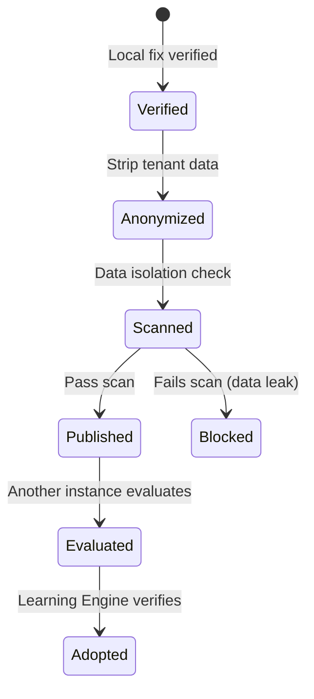

# Federated Intelligence

> Share verified improvement patterns across SeraphimOS instances while enforcing strict data isolation.

## Overview

Federated Intelligence enables multiple SeraphimOS instances to share anonymized improvement patterns. Patterns are stripped of all tenant-specific data before publication, and automated scanning ensures no PII, credentials, or financial data leaks.

Package: `packages/services/src/federated/service.ts`

---

## Interface

```typescript
interface FederatedIntelligenceService {
  publishPattern(pattern: Pattern): Promise<string>
  evaluatePattern(patternId: string): Promise<ApplicabilityScore>
  adoptPattern(patternId: string): Promise<void>
  getPatternMetrics(patternId: string): Promise<PatternMetrics>
}
```

---

## Pattern Lifecycle



---

## Data Isolation Enforcement

Before publication, automated scanning removes:
- ❌ Memory contents
- ❌ Financial data
- ❌ Credentials/tokens
- ❌ Personal information (PII)
- ❌ Tenant-specific identifiers

Only generalized patterns with their effectiveness metrics are shared.

---

## Pattern Metrics

| Metric | Description |
|--------|-------------|
| Provenance | Which instance/domain originated the pattern |
| Adoption rate | How many instances adopted |
| Effectiveness | Success rate across adopters |
| Applicability score | How well it matches local context |

## Related

- [[Learning Engine]]
- [[SME Intelligence System]]
- [[Zikaron Memory Service]]
- [[Architecture Overview]]
