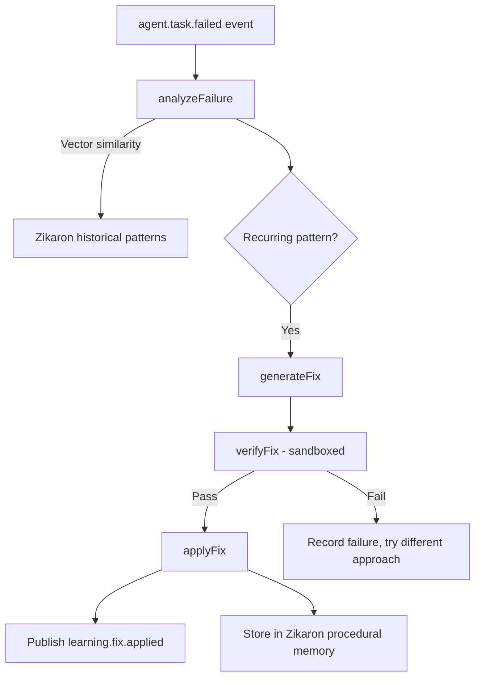

# Learning Engine

> Autonomous failure analysis, pattern detection, fix generation, and continuous improvement.

## Overview

The Learning Engine analyzes failures, detects recurring patterns, generates versioned fixes, verifies them in sandboxed environments, and applies them as Agent_Program updates. It also runs nightly batch jobs for model router performance aggregation.

Package: `packages/services/src/learning/engine.ts`

---

## Interface

```typescript
interface LearningEngine {
  analyzeFailure(event: FailureEvent): Promise<FailureAnalysis>
  detectPatterns(timeRange: TimeRange): Promise<Pattern[]>
  generateFix(pattern: Pattern): Promise<FixProposal>
  verifyFix(fix: FixProposal): Promise<VerificationResult>
  applyFix(fix: FixProposal): Promise<void>
  getImprovementMetrics(): Promise<ImprovementMetrics>
}
```

---

## Learning Loop



---

## Fix Types

Fixes target specific artifacts:
- `agent_program` — behavior modifications
- `workflow` — process changes
- `gate` — quality check adjustments
- `driver_config` — external service configuration

All fixes are **versioned changes** — never unstructured text.

---

## Metrics

| Metric | Description |
|--------|-------------|
| Repeat failure rate | How often the same failure recurs |
| Autonomous resolution rate | % of failures fixed without human intervention |
| Mean time to resolution | Average time from failure to fix applied |
| Fix success rate | % of applied fixes that don't regress |

---

## Nightly Batch Job

Aggregates `ModelPerformanceRecord` data:
- Groups by (taskType, complexity, model)
- Updates routing weights in [[Otzar Resource Manager|Otzar]]
- Identifies underperforming models per task type

---

## Quality Baseline Integration

Extended to monitor Quality Gate pass rates:
- Correlates pass rate improvements with specific baseline updates
- Identifies which reference ingestions improved quality
- Records correlations in [[Zikaron Memory Service|Zikaron]] for continuous improvement

## Related

- [[SME Intelligence System]]
- [[Otzar Resource Manager]]
- [[Zikaron Memory Service]]
- [[XO Audit Service]]
- [[Event Bus Service]]
