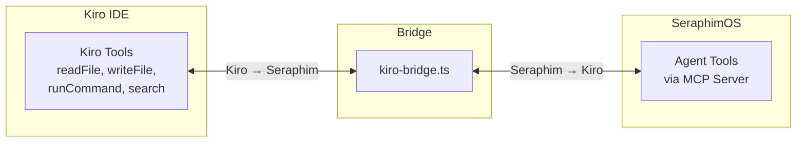

# MCP Integration

> Model Context Protocol server/client infrastructure enabling tool sharing between SeraphimOS agents, external services, and the Kiro IDE.

## Overview

SeraphimOS implements full MCP (Model Context Protocol) support — both as a server (exposing agent tools) and as a client (consuming external tools). The Kiro-Seraphim Bridge enables bidirectional tool invocation between the IDE and the agent runtime.

Package: `packages/services/src/mcp/`

---

## Components

| File | Purpose |
|------|---------|
| `server-host.ts` | MCP server hosting agent tools |
| `client-manager.ts` | Connect to and invoke external MCP servers |
| `tool-registry.ts` | Unified registry for all MCP tools |
| `kiro-bridge.ts` | Bidirectional Kiro ↔ Seraphim bridge |
| `tools/seraphim-tools.ts` | Seraphim Core MCP tools |
| `tools/eretz-tools.ts` | Eretz Business MCP tools |
| `tools/zionx-tools.ts` | ZionX MCP tools |
| `tools/zxmg-tools.ts` | ZXMG MCP tools |
| `tools/zion-alpha-tools.ts` | Zion Alpha MCP tools |

---

## MCP Server Host

Exposes agent tools via JSON-RPC over stdio/SSE/WebSocket:

```typescript
interface MCPServerHost {
  startServer(agentId: string): Promise<MCPServer>
  registerTool(tool: ToolDefinition): void
  unregisterTool(toolName: string): void
}
```

Protocol handlers: `tools/list`, `tools/call`, `initialize`, `ping`

Authentication: validates incoming connections against [[Mishmar Governance Service|Mishmar]] authorization. Rate limiting per connection.

---

## Per-Agent MCP Tools

| Agent | Tools Exposed |
|-------|--------------|
| Seraphim Core | system health, directive submission, recommendation queue, parallel execution status |
| Eretz | portfolio metrics, synergy status, pattern library query, directive enrichment |
| ZionX | app status, pipeline triggers, gate results, design system query |
| ZXMG | content pipeline status, analytics, production queue, baseline query |
| Zion Alpha | positions, strategy status, market scans, trade history |

Each tool includes JSON Schema for inputs/outputs and required authority level.

---

## MCP Client Manager

```typescript
interface MCPClientManager {
  connect(serverUrl: string): Promise<MCPConnection>
  discoverTools(connection: MCPConnection): Promise<ToolDefinition[]>
  invokeTool(connection, toolName, args): Promise<ToolResult>
  findToolByCapability(description: string): Promise<ToolMatch[]>
}
```

Features:
- Retry with circuit breaker on connection failures
- Cost tracking for external tool calls via [[Otzar Resource Manager|Otzar]]
- Semantic search across registered tools (embedding similarity)
- Connection health monitoring with auto-reconnection

---

## MCP Tool Registry

Unified registry combining internal agent tools and external MCP server tools:
- Dynamic registration without restart
- JSON Schema validation on registration
- Semantic `findByCapability()` using embedding similarity
- Stored in `mcp_tool_registry` database table

---

## Kiro-Seraphim Bridge



- **Kiro → Seraphim:** Kiro IDE can discover and invoke all agent MCP tools
- **Seraphim → Kiro:** Agents can invoke Kiro tools (readFile, writeFile, runCommand, search, getDiagnostics)
- Persistent connection with automatic reconnection

## Related

- [[Kiro Integration]]
- [[Architecture Overview]]
- [[Mishmar Governance Service]]
- [[Otzar Resource Manager]]
- [[Parallel Execution Service]]
