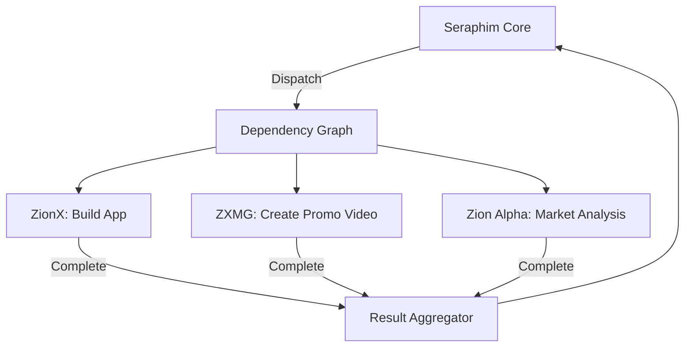

# Parallel Execution Service

> DAG-based parallel task orchestration with dependency management, load balancing, and result aggregation.

## Overview

Enables both intra-agent parallelization (single agent spawns concurrent sub-tasks) and inter-agent parallelization (multiple agents work simultaneously on related tasks). Uses a directed acyclic graph (DAG) for dependency management.

Package: `packages/services/src/parallel/`

---

## Components

| File | Purpose |
|------|---------|
| `dependency-graph.ts` | DAG construction, validation, topological sort |
| `scheduler.ts` | Work distribution and parallelism limits |
| `coordination-bus.ts` | Real-time inter-agent messaging |
| `result-aggregator.ts` | Merge results from parallel streams |

---

## Dependency Graph Engine

```typescript
interface DependencyGraphEngine {
  createGraph(tasks: ParallelTask[]): DAG
  validateGraph(dag: DAG): ValidationResult  // detects circular deps
  schedule(dag: DAG): ExecutionPlan           // topological ordering
  getReadyTasks(dag: DAG): ParallelTask[]     // deps satisfied
  markComplete(dag: DAG, taskId: string): void
  detectDeadlocks(dag: DAG): DeadlockReport
}
```

- Uses Kahn's algorithm for topological sort
- Circular dependency detection with specific cycle path reporting
- Groups independent tasks into parallel batches

---

## Parallel Scheduler

| Feature | Default |
|---------|---------|
| Max concurrent per agent | 5 sub-tasks |
| Distribution strategy | Round-robin, least-loaded, or affinity-based |
| Budget check | Otzar approval before dispatch |
| Failure isolation | Failed sub-tasks don't terminate siblings |

---

## Coordination Bus

Real-time message passing between concurrent agents:
- `sendToAgent()` — point-to-point messaging
- `broadcast()` — all agents in a DAG
- `signalCompletion()` / `waitForDependency()` — dependency signaling with timeout
- `shareIntermediateResult()` / `getIntermediateResult()` — shared state

---

## Result Aggregator

Strategies for merging parallel outputs:
- **Merge** — combine all results into unified output
- **Concatenate** — append results in order
- **Vote** — majority wins for conflicting results
- **Custom** — user-defined aggregation function

Handles partial results (available before all streams complete) and conflict resolution.

---

## Example: Seraphim dispatches to ZionX + ZXMG



## Related

- [[Architecture Overview]]
- [[Otzar Resource Manager]]
- [[MCP Integration]]
- [[Event Bus Service]]
