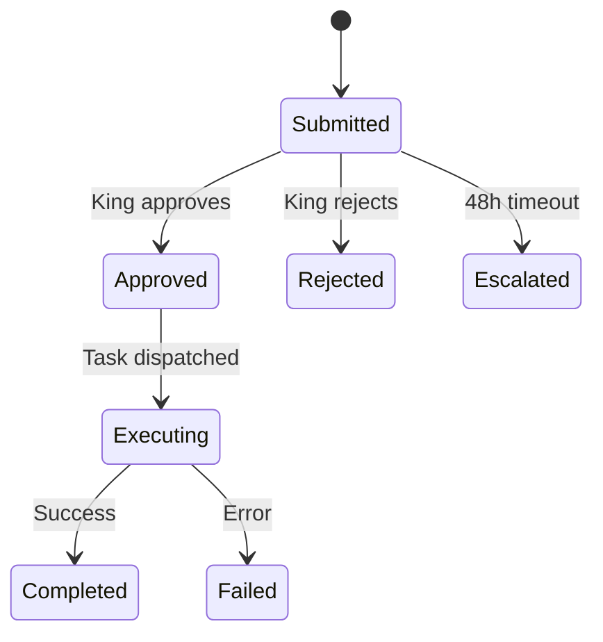

# SME Intelligence System

> Autonomous domain expertise management, heartbeat-driven research, and self-improvement architecture.

## Overview

The SME (Subject Matter Expert) system gives each SeraphimOS agent deep domain expertise that improves over time. It runs on heartbeat cycles, benchmarks against world-class performance, and generates structured recommendations for the King.

Package: `packages/services/src/sme/`

---

## Components

| File | Purpose |
|------|---------|
| `domain-expertise-profile.ts` | Per-agent knowledge storage and management |
| `heartbeat-scheduler.ts` | Scheduled research cycles per domain |
| `recommendation-engine.ts` | Recommendation queue with approval workflow |
| `industry-scanner.ts` | Technology discovery and roadmap |
| `self-improvement-engine.ts` | System self-assessment and proposals |
| `seeds/` | Initial expertise profiles for each agent |

---

## Domain Expertise Profiles

Each agent has a structured expertise profile containing:
- **Knowledge entries** — stored in [[Zikaron Memory Service|Zikaron]] semantic memory (vector-searchable)
- **Decision frameworks** — stored in Zikaron procedural memory
- **Quality benchmarks** — measurable standards per domain
- **Competitive intelligence** — market awareness

Seed profiles exist for: ZionX, ZXMG, Zion Alpha, Seraphim Core, and Eretz.

---

## Heartbeat Review Cycle

| Agent | Default Interval | Focus |
|-------|-----------------|-------|
| Eretz | Daily (24h) | Portfolio metrics, synergies, subsidiary performance |
| ZionX | Daily (24h) | App store rankings, competitor apps |
| ZXMG | Daily (24h) | YouTube analytics, trending content |
| Zion Alpha | Hourly | Market data, prediction market mechanics |
| Seraphim Core | Weekly | AI research, infrastructure optimization |

Heartbeat phases: Research → Benchmark → Gap Analysis → Recommendations

---

## Recommendation Engine

Features:
- Structured format: benchmark → current state → gap → action plan → risk → rollback
- Batch approve/reject
- Impact measurement (actual vs estimated)
- Calibration reports per agent
- Escalation after 48h pending

---

## Industry Scanner

Monitors for technology advances relevant to SeraphimOS:
- arXiv AI/ML papers
- Hugging Face releases
- AWS What's New
- Anthropic/OpenAI blogs
- GitHub trending AI/ML
- App Store algorithm updates
- YouTube Creator Insider
- Prediction market research

High-impact discoveries auto-submit to Recommendation Queue.

---

## Self-Improvement Engine

Weekly assessment cycle:
1. Collect performance metrics (response time, error rate, cost efficiency)
2. Evaluate agent effectiveness (recommendation quality, execution success)
3. Review architecture (bottlenecks, scaling concerns, capability gaps)
4. Compare against industry state-of-the-art
5. Generate improvement proposals with rollback plans
6. Submit to Recommendation Queue for King approval

---

## Capability Maturity Scoring

Per-domain maturity scores (0.0–1.0) tracking:
- Current score
- Trend (improving/stable/declining)
- Time to target vision
- Gap analysis with blocking dependencies

## Related

- [[Mishmar Governance Service]]
- [[Zikaron Memory Service]]
- [[Kiro Integration]]
- [[Recommendation Engine]]
- [[Implementation Progress]]
