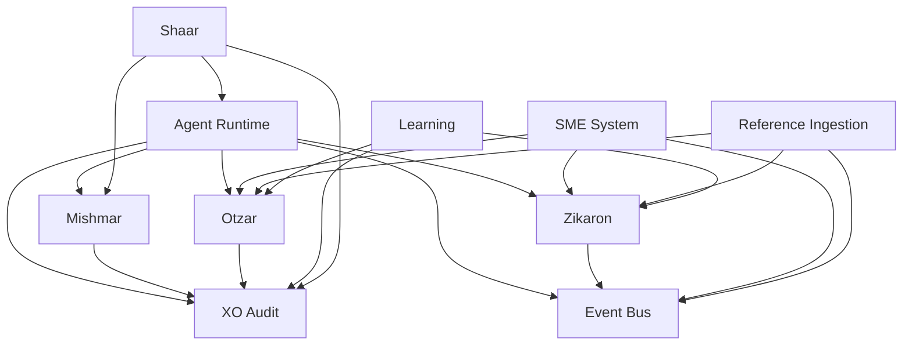

# Services Index

> Complete catalog of all SeraphimOS system services.

## Overview

All services live in `packages/services/src/`. Each implements a defined interface from `packages/core/src/interfaces/`.

---

## Core System Services

| Service | Package | Purpose | Phase |
|---------|---------|---------|-------|
| [[Event Bus Service]] | `event-bus/` | Schema-validated async messaging (EventBridge + SQS) | 1 |
| [[XO Audit Service]] | `xo-audit/` | Immutable audit trail with SHA-256 hash chain | 2 |
| [[Mishmar Governance Service]] | `mishmar/` | L1-L4 authority matrix, role separation, completion contracts | 2 |
| [[Zikaron Memory Service]] | `zikaron/` | 4-layer memory with pgvector similarity search | 2 |
| [[Otzar Resource Manager]] | `otzar/` | Model routing, budget enforcement, task caching | 2 |
| [[Credential Manager]] | `credentials/` | AWS Secrets Manager integration with rotation | 2 |

---

## Interface & Communication Services

| Service | Package | Purpose | Phase |
|---------|---------|---------|-------|
| [[Shaar Agent Gateway]] | `shaar/` | REST API + WebSocket + command routing | 4 |
| [[Communication Layer]] | `communication/` | Multi-user chat, priority queue, context sharing | 8 |
| [[Auth Service]] | `auth/` | Cognito JWT authentication and authorization | 4 |
| [[Tenant Service]] | `tenant/` | Multi-tenant isolation and Queen provisioning | 4 |
| [[Observability Service]] | `observability/` | Metrics, alerts, health checks, X-Ray tracing | 4 |

---

## Intelligence & Learning Services

| Service | Package | Purpose | Phase |
|---------|---------|---------|-------|
| [[Learning Engine]] | `learning/` | Failure analysis, pattern detection, fix generation | 5 |
| [[SME Intelligence System]] | `sme/` | Domain expertise, heartbeat reviews, recommendations | 6 |
| [[Reference Ingestion System]] | `reference-ingestion/` | URL analysis, quality baselines, auto-rework | 7 |
| [[Kiro Integration Service]] | `kiro/` | Steering/skill/hook generation from expertise | 6 |

---

## Platform Services

| Service | Package | Purpose | Phase |
|---------|---------|---------|-------|
| [[Marketplace Service]] | `marketplace/` | Agent program publishing and installation | 5 |
| [[Federated Intelligence]] | `federated/` | Cross-instance pattern sharing | 5 |
| [[Parallel Execution Service]] | `parallel/` | DAG-based parallel orchestration | 8 |
| [[MCP Integration]] | `mcp/` | MCP server/client + Kiro bridge | 8 |

---

## Lambda Event Handlers

| Handler | Package | Events Processed |
|---------|---------|-----------------|
| Audit Handler | `handlers/audit-handler.ts` | Audit events → DynamoDB with hash chain |
| Memory Handler | `handlers/memory-handler.ts` | Memory events → entity extraction → Aurora |
| Alert Handler | `handlers/alert-handler.ts` | Alert events → notification delivery |
| Workflow Handler | `handlers/workflow-handler.ts` | Workflow events → state machine transitions |
| Learning Handler | `handlers/learning-handler.ts` | Failed/completed tasks → Learning Engine |
| SME Handler | `handlers/sme-handler.ts` | Heartbeat events → expertise updates |

All handlers are **idempotent** using event `id` as deduplication key.

---

## Service Dependencies

## Related

- [[Architecture Overview]]
- [[Drivers Catalog]]
- [[Dashboard Views]]
- [[Implementation Progress]]
