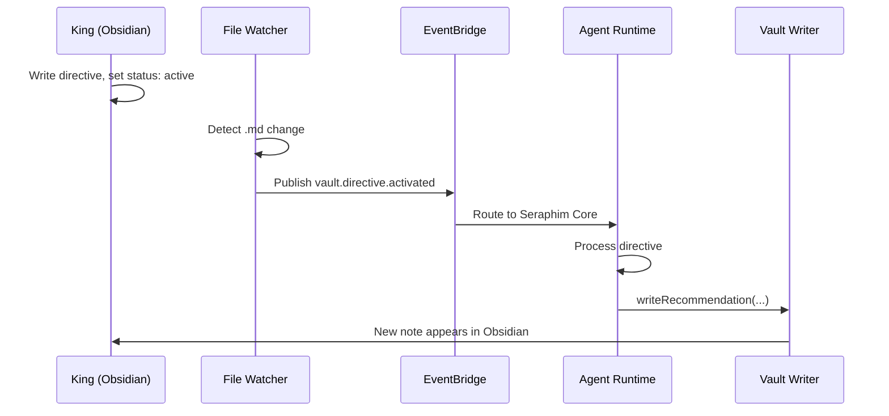

# Vault Sync Service

> Three-layer synchronization between the Obsidian vault and SeraphimOS agent runtime.

## Overview

The Vault Sync service (`packages/vault-sync/`) is a standalone TypeScript package that bridges the Obsidian vault (the King's strategic interface) with the SeraphimOS backend. It runs as a persistent process with three independent layers that can operate independently.

---

## Architecture: Three Layers

### Layer 1: Git Sync (`layer1-git.ts`)

| Feature | Behavior |
|---------|----------|
| Auto-commit | Every 60 seconds (configurable) |
| Auto-push | After commit to configured remote/branch |
| Force-sync | On important events (directive activated, recommendation approved) |
| Pull | Periodic pull of agent output from remote |

Purpose: Durable baseline — ensures vault state is always recoverable and cross-machine synced.

---

### Layer 2: File Watcher (`layer2-watcher.ts`)

| Feature | Behavior |
|---------|----------|
| Watch target | All `.md` files in vault (excluding `.obsidian/`, `.git/`) |
| Debounce | 1 second (configurable) |
| Frontmatter parsing | Detects status changes |
| Event classification | Maps file changes to semantic events |

Classified events:
- `directive.created` — new file in `00 - Command/Directives/`
- `directive.activated` — status changed to `active`
- `recommendation.approved` — status changed to `Approved`
- `recommendation.rejected` — status changed to `Rejected`
- `escalation.resolved` — status changed to `resolved`
- `note.created` / `note.updated` / `note.deleted` — general changes

---

### Layer 3: Obsidian API (`layer3-obsidian-api.ts`)

| Feature | Behavior |
|---------|----------|
| Protocol | HTTPS to localhost:27124 (Local REST API plugin) |
| Operations | Read, write, search, delete vault notes |
| Health check | Graceful degradation when Obsidian isn't running |
| Use case | Agents push output without touching filesystem directly |

---

## Event Bridge (`event-bridge.ts`)

Publishes vault events to AWS EventBridge:

```typescript
// Event envelope
{
  source: "vault-sync",
  type: "vault.directive.activated",
  detail: { path, frontmatter, contentPreview, fullContent },
  metadata: { tenantId: "house-of-zion", correlationId, timestamp }
}
```

- Dry-run mode for local development (logs only)
- Dynamic AWS SDK import (avoids requiring SDK when not needed)
- Maps vault events to human-readable summaries

---

## Vault Writer (`vault-writer.ts`)

Structured methods for agents to write content:

| Method | Output Path |
|--------|-------------|
| `writeRecommendation()` | `00 - Command/Recommendations/` |
| `writeDailyReport()` | `01 - Operations/Daily/` |
| `writeKnowledge()` | `02 - Knowledge/{domain}/` |
| `writeEscalation()` | `00 - Command/Escalations/` |

Each method handles:
- YAML frontmatter generation with tags and metadata
- Directory creation
- Consistent markdown formatting
- Approval instructions in recommendations/escalations

---

## Configuration (Environment Variables)

| Variable | Default | Purpose |
|----------|---------|---------|
| `VAULT_PATH` | `../../vault` | Absolute path to vault folder |
| `GIT_SYNC_ENABLED` | `true` | Enable Layer 1 |
| `GIT_REMOTE` | `origin` | Git remote name |
| `GIT_BRANCH` | `main` | Git branch |
| `GIT_COMMIT_INTERVAL` | `60000` | Auto-commit interval (ms) |
| `WATCHER_ENABLED` | `true` | Enable Layer 2 |
| `WATCH_DEBOUNCE_MS` | `1000` | Debounce delay |
| `OBSIDIAN_API_ENABLED` | `true` | Enable Layer 3 |
| `OBSIDIAN_API_URL` | `https://127.0.0.1:27124` | Obsidian REST API URL |
| `OBSIDIAN_API_TOKEN` | — | API token from Local REST API plugin |
| `EVENT_BUS_ENABLED` | `true` | Publish to EventBridge |
| `AWS_REGION` | `us-east-1` | AWS region |
| `EVENT_BUS_NAME` | `seraphim-event-bus` | EventBridge bus name |
| `VAULT_SYNC_DRY_RUN` | `false` | Log events without publishing |

---

## Running

```bash
cd packages/vault-sync
npm install
npx tsx src/index.ts          # development
# or
npm run build && npm start    # production
# or
VAULT_SYNC_DRY_RUN=true npx tsx src/index.ts  # dry run
```

---

## Data Flow



## Related

- [[Obsidian Integration]]
- [[Event Bus Service]]
- [[Docker Agents]]
- [[Architecture Overview]]
- [[Chain of Command]]
