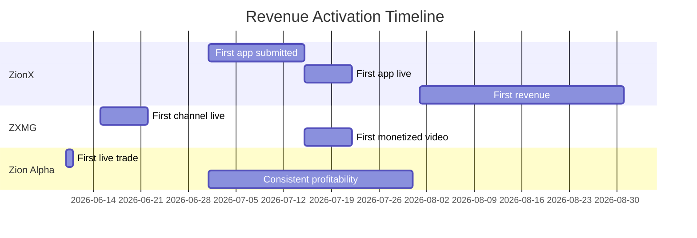

# Business Portfolio Overview

> Managed by [[Eretz]]. Three business subsidiaries operating under unified strategy.

## Active Subsidiaries

| Business | Pillar | Revenue Model | Status |
|----------|--------|---------------|--------|
| [[ZionX]] | Apps | Subscriptions, IAP, Ads | Pipeline built, no live apps yet |
| [[ZXMG]] | Media | Ad revenue, sponsorships, affiliate | Pipeline designed, no active channels yet |
| [[Zion Alpha]] | Trading | Trading P&L | State machine designed, no live trades yet |

## Portfolio Metrics

> *Pending: Otzar Finance pillar + real data connections (Phase 3+)*

| Metric | Target | Current |
|--------|--------|---------|
| Combined MRR | $5,000 | $0 |
| Active Apps (stores) | 10+ | 0 |
| Active YouTube Channels | 3+ | 0 |
| Trading Capital Deployed | $1,000 | $0 |
| Monthly Autonomous Revenue | $10,000 | $0 |

## Cross-Business Synergies (Eretz Standing Rules)

1. **ZXMG ↔ ZionX**: Every ZXMG video includes a ZionX app commercial
2. **Zion Alpha ↔ ZionX**: Market intelligence signals inform app idea generation
3. **ZionX ↔ ZXMG**: App launches trigger content campaigns
4. **All ↔ All**: Patterns proven in one subsidiary are extracted for cross-application

## Path to Revenue

